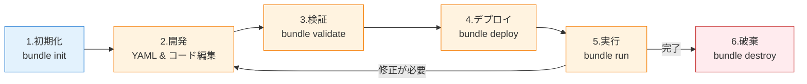

# はじめに

「Databricks アセットバンドル (DAB)」という名前を一度でも聞いたことがある方は、2026年3月の重要なアップデートをチェックしておく必要があります。名前が変わり、内部エンジンも刷新されたからです。

本記事は、2026年春時点での DAB の入門ガイドです。これから DAB を触る方はもちろん、「昔試したけど Terraform 依存が重くて諦めた」という方にも読んでいただきたい内容です。

:::note info
本記事で紹介するコマンドは、実際にローカル環境やワークスペースで動かしながら読むと理解が深まります。「▶ 実行推奨」マークのついたコマンドは、手を動かして確認することを推奨します。
:::

# 名前が変わりました: Databricks Asset Bundles → Declarative Automation Bundles

2026年3月16日付で、**Databricks Asset Bundles** は **Declarative Automation Bundles** に正式改名されました。略称の「DAB」はそのまま使えます (Declarative Automation Bundle の略としても整合するため)。

参考: [Declarative Automation Bundles とは? (公式ドキュメント)](https://docs.databricks.com/aws/ja/dev-tools/bundles/)

## なぜ改名したのか

改名の理由は公式 FAQ に明記されています。

- 「assets」という用語が Databricks 内で複数の意味を持ち、混乱を招いていた
- 「bundle の実用途 (宣言的な自動化ワークフロー) 」をより正確に反映するため

## 後方互換性について

この変更は **non-breaking** (破壊的変更なし) です。以下は一切変更不要です。

- CLIコマンド: 引き続き `databricks bundle ...` を使用
- 既存の `databricks.yml` などの設定ファイル
- 既存のCI/CDパイプライン

つまり、「名前は変わったが、やることは何も変わらない」というユーザーフレンドリーな改名です。

# DABとは何か

Declarative Automation Bundles (DAB) は、**1つのDatabricksプロジェクトを構成するリソースとコード一式を、YAMLとソースファイルで宣言的にまとめ、環境別にデプロイできる仕組み**です。

## そもそも「プロジェクト」とは?

ここで言うプロジェクトは、ある業務目的を達成するためのDatabricksリソースとコードのまとまりです。例えば以下のようなものです。

- **売上分析プロジェクト**: ETLパイプライン + 日次起動ジョブ + KPIダッシュボード + 集計コード
- **レコメンドMLプロジェクト**: 前処理パイプライン + モデル学習ジョブ + 推論ジョブ + MLflow実験 + 登録済みモデル
- **本記事のサンプル (my_project)**: Lakeflow宣言型パイプライン + ジョブ + ノートブック + Pythonホイール

ソフトウェア開発における「1つのXcodeプロジェクト」「1つのnpmパッケージ」のように、**同じチームが所有し、同じリリースサイクルで更新するまとまり**が1バンドルの適切な粒度です。

## バンドルに入るもの

1つのバンドルには以下が同居します。

- **リソース定義 (YAML)**: ジョブ・パイプライン・MLflow実験・ダッシュボード・Apps・Lakebase Postgresプロジェクトなど
- **ソースコード**: ノートブック・Pythonファイル・Pythonホイール・Scala JAR
- **テストコード**: 単体テスト・統合テスト
- **環境設定**: dev / staging / prod などのターゲット別設定

重要なのは、**YAML (インフラ定義) とソースコード (ビジネスロジック) が同じリポジトリに同居する**ことです。これによって「コードは更新されたがジョブ定義が古いまま」といったバージョン不整合が起きません。

## DABが解決する課題

- ノートブックやジョブ定義がワークスペースに散らばっていて、誰が何を作ったか把握できない
- dev環境と本番環境の差分を手動で管理していて、デプロイミスが多い
- コードはGitで管理できるが、ジョブやパイプラインの設定はGUIでしか変更できず履歴が追えない
- CI/CDパイプラインでDatabricksリソースをデプロイしたいが、いい方法がない

## 他のIaCツールとの違い

「それってTerraformでもできるのでは?」と思った方もいるかもしれません。実際、DAB登場前はDatabricks Terraform Providerが推奨されていました。DABの差別化ポイントは以下です。

- **ソースコードも一緒に管理できる**: Terraformはインフラ定義専門で、ノートブックやPythonコードは別リポジトリや別プロセスで管理する必要がある
- **Databricks特化の抽象化**: ジョブやパイプラインがファーストクラスで表現できる (Terraformだと汎用リソース定義を書く必要がある)
- **開発者フレンドリーな `targets` 機構**: `development` モードでリソース名に自動プレフィックスを付けるなど、複数人開発での衝突回避機能が組み込まれている

ひとことで言えば、**「Databricksプロジェクトのための、コードとインフラを一体管理できるIaC」** です。

# DABのライフサイクル

DABでプロジェクトを管理する際の一連の流れを先に掴んでおくと、本記事の各セクションがどこに対応するか見通しが立ちます。基本的なライフサイクルは以下の通りです。

1. **初期化 (init)** - `databricks bundle init` でプロジェクトの雛形を生成
2. **開発 (develop)** - `databricks.yml` とリソース定義YAMLを編集し、ノートブックやコードを書く
3. **検証 (validate)** - `databricks bundle validate` でYAMLの文法や参照の不備をチェック
4. **デプロイ (deploy)** - `databricks bundle deploy` でワークスペースにリソースを展開
5. **実行 (run)** - `databricks bundle run` でジョブやパイプラインを実行
6. **破棄 (destroy)** - `databricks bundle destroy` で展開済みリソースを削除



開発中は **2 → 3 → 4 → 5** のサイクルを何度も繰り返すことになります。CI/CDパイプラインに組み込む場合も、このサイクルをそのまま自動化する形です。

各ターゲット (dev / staging / prod) ごとに独立してこのライフサイクルを回せるのがDABの強みで、例えば「devで何度も試行錯誤してから、prodに一発デプロイ」といった運用が自然にできます。

本記事では、このライフサイクルを `bundle init` から順に追いかけながら、2026年時点で知っておくべきポイントを紹介していきます。

# 2026年の目玉: Direct Deployment Engine

旧 DAB は内部で Databricks Terraform Provider を使ってリソースを管理していました。これが**2026年に廃止予定**で、代わりに Databricks CLI v0.279.0 以降で新しい **Direct Deployment Engine** が利用可能になっています。

参考: [直接デプロイエンジンへの移行 (公式)](https://docs.databricks.com/aws/ja/dev-tools/bundles/direct)

## Direct Deployment Engine のメリット

Databricks Go SDK を使って REST API を直接呼び出す方式に変わったことで、以下のメリットがあります。

- **Terraform バイナリと terraform-provider-databricks のダウンロードが不要**
- ファイアウォール・プロキシ・カスタムプロバイダレジストリの問題を回避
- `databricks bundle plan -o json` で詳細な差分が取得可能
- デプロイが高速化
- 新しいバンドルリソースのリリース速度が向上 (Terraform Provider のリリースサイクルに依存しない)

特にエンタープライズ環境で「Hashicorp のレジストリにアクセスできない」という理由で DAB の導入に躓いていた方には朗報です。

# はじめてのDAB: `bundle init` で雛形を作る

ここから実際に手を動かしていきます。まず Databricks CLI がインストール済みで、認証プロファイルが設定されていることを確認してください。

▶ **実行推奨**: CLIバージョンの確認

```bash
databricks --version
```
```
Databricks CLI v0.295.0
```


v0.279.0 以降を推奨します。古い場合はアップグレードしてください。

## バンドルプロジェクトの作成

▶ **実行推奨**: プロジェクト用ディレクトリに移動して、以下を実行します。

```bash
databricks bundle init
```


対話プロンプトが起動し、テンプレートの選択を求められます。デフォルトの `default-python` を選べば、Pythonホイール・ノートブック・ETLパイプラインのサンプル構成が生成されます。

生成されるディレクトリ構造の例:

```
my_project/
├── databricks.yml          # バンドルのメイン設定ファイル
├── resources/              # ジョブ・パイプラインなどのリソース定義
│   └── my_project.job.yml
├── src/                    # Pythonコード
│   └── notebook.ipynb
├── tests/                  # テストコード
└── README.md
```

# `databricks.yml` の構造

バンドルの中心となるのが `databricks.yml` です。最小構成は以下のようになります。

```yaml
bundle:
  name: my_project

include:
  - resources/*.yml

targets:
  dev:
    mode: development
    default: true
    workspace:
      host: https://<your-workspace>.cloud.databricks.com

  prod:
    mode: production
    workspace:
      host: https://<your-workspace>.cloud.databricks.com
      root_path: /Workspace/Users/prod-service-principal/.bundle/${bundle.name}/${bundle.target}
    run_as:
      service_principal_name: <your-sp-id>
```

ポイントは3つです。

1. **`include`**: 別ファイルに分割したリソース定義を取り込みます。ジョブ・パイプラインなどが増えてきたら、YAML を分割すると保守しやすくなります。
2. **`targets`**: デプロイ先 (環境) を複数定義できます。開発中は `dev` に、本番は `prod` にという使い分けです。
3. **`mode`**: `development` モードでは、各リソース名に自動で `[dev yourname]` プレフィックスが付与され、他の開発者と衝突しません。`production` モードでは厳格なチェックが走ります。

# 主要コマンド4選

DAB のライフサイクルで使う主要コマンドは以下の4つです。

## 1. `validate` - 設定の検証

▶ **実行推奨**: デプロイ前に必ず実行してください。

```bash
databricks bundle validate
```

YAML の文法エラーやリソース定義の不備を事前に検出できます。CIの最初のステップに組み込むのもおすすめです。


## 2. `deploy` - ワークスペースへのデプロイ

▶ **実行推奨**: dev環境へのデプロイ。

```bash
databricks bundle deploy -t dev
```

`-t` オプションでターゲットを指定します。省略すると `default: true` のターゲットが使われます。

```bash
takaaki.yayoi@DRYC7D19F3 my_project % export DATABRICKS_BUNDLE_ENGINE=direct
databricks bundle deploy -t dev
Using profile: xxxxx
Building python_artifact...
Uploading dist/my_project-0.0.1-py3-none-any.whl...
Uploading bundle files to /Workspace/Users/takaaki.yayoi@databricks.com/.bundle/my_project/dev/files...
Deploying resources...
Updating deployment state...
Deployment complete!
```

## [実体験] Terraform依存で実際に遭遇したエラー

「Terraform依存がなくなる」と言われてもピンとこないかもしれませんが、筆者が本記事執筆中にまさにTerraform起因のエラーに遭遇したので共有します。

新規にバンドルを作って `databricks bundle deploy -t dev` を実行したところ、以下のエラーで停止しました。

```
Building python_artifact...
Uploading dist/my_project-0.0.1-py3-none-any.whl...
Uploading bundle files to /Workspace/Users/xxx/.bundle/my_project/dev/files...
Error: error downloading Terraform: unable to verify checksums signature: openpgp: key expired
```

原因は、HashiCorpがTerraformバイナリの署名に使っているPGP鍵が期限切れになっていて、DABが内部でTerraformバイナリを検証する際に失敗しているというものです。自分のコードもワークスペースも何も悪くないのに、外部ツールの鍵管理の都合でデプロイがブロックされてしまうわけです。

**解決策はまさにDirect Deployment Engineへの切り替え**です。環境変数一発で回避できます。

```bash
export DATABRICKS_BUNDLE_ENGINE=direct
databricks bundle deploy -t dev
```

または `databricks.yml` の `bundle` セクションに `engine: direct` を追記すれば、プロジェクト全体で恒久的に有効になります。Terraformバイナリのダウンロード自体が走らなくなるので、このエラーは根本的に発生しなくなります。

Terraform依存を捨てることの価値が、こうしたエラー1つとっても実感できます。

## 3. `run` - ジョブ/パイプラインの実行

▶ **実行推奨**: デプロイしたジョブをCLIから起動。

```bash
databricks bundle run -t dev sample_job
```

ワークスペースUIから実行するのと同じ動作になりますが、ローカル開発サイクルを回すときはCLIから実行するほうが速いです。


```bash
takaaki.yayoi@DRYC7D19F3 my_project % databricks bundle run -t dev sample_job
Using profile: xxxx
Run URL: https://xxxx.cloud.databricks.com/?o=5099015744649857#job/656687037228812/run/34162461391557

2026-04-20 09:25:40 "[dev takaaki_yayoi] sample_job" RUNNING
2026-04-20 09:27:54 "[dev takaaki_yayoi] sample_job" TERMINATED SUCCESS
Output:
=======
Task notebook_task:

=======
Task python_wheel_task:
+--------------------+---------------------+-------------+-----------+----------+-----------+
|tpep_pickup_datetime|tpep_dropoff_datetime|trip_distance|fare_amount|pickup_zip|dropoff_zip|
+--------------------+---------------------+-------------+-----------+----------+-----------+
| 2016-02-13 21:47:53|  2016-02-13 21:57:15|          1.4|        8.0|     10103|      10110|
| 2016-02-13 18:29:09|  2016-02-13 18:37:23|         1.31|        7.5|     10023|      10023|
| 2016-02-06 19:40:58|  2016-02-06 19:52:32|          1.8|        9.5|     10001|      10018|
| 2016-02-12 19:06:43|  2016-02-12 19:20:54|          2.3|       11.5|     10044|      10111|
| 2016-02-23 10:27:56|  2016-02-23 10:58:33|          2.6|       18.5|     10199|      10022|
+--------------------+---------------------+-------------+-----------+----------+-----------+
only showing top 5 rows
```

## 4. `destroy` - リソースの削除

dev環境をクリーンアップするときに使います。

```bash
databricks bundle destroy -t dev
```

本番環境での実行は慎重に。

```bash
takaaki.yayoi@DRYC7D19F3 my_project % databricks bundle destroy -t dev

Using profile: xxxx
The following resources will be deleted:
  delete resources.jobs.sample_job
  delete resources.pipelines.my_project_etl

This action will result in the deletion of the following Lakeflow Spark Declarative Pipelines along with the
Streaming Tables (STs) and Materialized Views (MVs) managed by them:
  delete resources.pipelines.my_project_etl

All files and directories at the following location will be deleted: /Workspace/Users/takaaki.yayoi@databricks.com/.bundle/my_project/dev

Would you like to proceed? [y/n]: y
Deleting files...
Destroy complete!
```

## 追加コマンド: `plan` (Direct Engine限定)

Direct Deployment Engine を使っている場合、Terraform の `plan` に相当する機能が使えます。

```bash
databricks bundle plan -t dev -o json > plan.json
```

JSON形式で差分が出力されるので、CIパイプラインの承認ゲートとして使うのに便利です。

# 開発/本番でのターゲット分け

DAB の強みのひとつが `targets` 機構による環境分離です。典型的なパターンは以下です。

| ターゲット | モード | 用途 | リソース名 |
|---------|------|-----|---------|
| `dev` | development | 個人開発・実験 | `[dev yourname] my_job` |
| `staging` | (none or production) | 統合テスト | `my_job` |
| `prod` | production | 本番運用 | `my_job` |

`development` モードでは以下の挙動が自動適用されます。

- リソース名に `[dev yourname]` プレフィックスが付与される
- ジョブのスケジュールが一時停止される
- ジョブの実行ユーザーがデプロイ実行者に固定される

参考: [宣言型自動化バンドルのデプロイモード](https://docs.databricks.com/aws/ja/dev-tools/bundles/deployment-modes)

# Direct Deployment Engineへの切り替え方

## 新規バンドルの場合

`databricks.yml` に `engine` を追加するだけです。

```yaml
bundle:
  name: my_project

targets:
  dev:
    engine: direct   # ここを追加
    mode: development
    default: true
```

または環境変数で指定することもできます。

```bash
export DATABRICKS_BUNDLE_ENGINE=direct
databricks bundle deploy
```

両方指定した場合、YAMLの設定が優先されます。

## 既存バンドルの移行

Terraform で既にデプロイ済みのバンドルは、専用コマンドでステートファイルを変換します。

▶ **実行推奨**: 移行手順は以下の3ステップ。

```bash
# ステップ1: 現在のTerraformベースでフルデプロイ (最新状態に揃える)
databricks bundle deploy -t my_target

# ステップ2: ステートファイルを変換
databricks bundle deployment migrate -t my_target

# ステップ3: 差分が出ないことを確認
databricks bundle plan -t my_target
```

`plan` で差分が出なければ移行成功です。その後、`databricks.yml` に `engine: direct` を追記してコミットします。

なお、**一度もデプロイしていないバンドルには `migrate` コマンドは使えません**。その場合は新規バンドル扱いで `engine: direct` を設定して最初からデプロイしてください。


# CI/CD連携の例 (GitHub Actions)

DABの真価が発揮されるのがCI/CDパイプラインとの統合です。

## なぜDABはCI/CDと相性が良いのか

DABは**バンドル全体 (ジョブ・パイプライン・ノートブック・Pythonコード) が宣言的なYAMLとソースコードだけで完結する**ように設計されています。つまり、バンドル一式をGitリポジトリで管理すれば、「リポジトリの状態 = Databricksワークスペースにデプロイされるべき状態」という関係が成立します。

あとはGit操作をトリガーに `databricks bundle deploy` を自動実行するだけで、GitOps的な運用が実現できます。

## 典型的な統合パターン

ブランチ戦略とターゲット (`targets`) を以下のように対応付けるのが最もシンプルです。

| イベント | 対応する処理 | ターゲット |
|---------|------------|----------|
| PR作成 / push | `validate` でYAMLをチェック | - |
| `main` ブランチへのマージ | `deploy` + `run` で統合テスト | `staging` |
| タグ (例: `v1.0.0`) の作成 | 本番デプロイ | `prod` |

この対応付けで、「PRレビューで構成ミスを弾く → マージでステージング確認 → タグで本番リリース」という標準的なソフトウェア開発フローがそのまま適用できます。

## 必要な構成要素

GitHub Actions との統合には以下の3つが揃っている必要があります。

1. **サービスプリンシパル**: CI/CD用の認証アイデンティティ。人間のPATを使うとローテーションが面倒&退職時に壊れるので必須
2. **GitHub Secrets**: `DATABRICKS_HOST` と `DATABRICKS_TOKEN` (サービスプリンシパルのOAuthトークン) を登録
3. **ワークフローYAML**: `.github/workflows


## 最小ワークフローの例

上記の構成を踏まえて、`main` ブランチへのpushをトリガーに本番デプロイする最小例が以下です。

```yaml
name: Deploy Bundle

on:
  push:
    branches: [main]

jobs:
  deploy:
    runs-on: ubuntu-latest
    steps:
      - uses: actions/checkout@v4

      - name: Install Databricks CLI
        run: curl -fsSL https://raw.githubusercontent.com/databricks/setup-cli/main/install.sh | sh

      - name: Validate bundle
        env:
          DATABRICKS_HOST: ${{ secrets.DATABRICKS_HOST }}
          DATABRICKS_TOKEN: ${{ secrets.DATABRICKS_TOKEN }}
          DATABRICKS_BUNDLE_ENGINE: direct
        run: databricks bundle validate -t prod

      - name: Deploy to production
        env:
          DATABRICKS_HOST: ${{ secrets.DATABRICKS_HOST }}
          DATABRICKS_TOKEN: ${{ secrets.DATABRICKS_TOKEN }}
          DATABRICKS_BUNDLE_ENGINE: direct
        run: databricks bundle deploy -t prod
```

サービスプリンシパルのトークンを GitHub Secrets に登録しておけば、`main` ブランチへのマージで自動的に本番デプロイが走ります。

# はじめてのデプロイで詰まりがちなポイント

実際に筆者が `bundle init` から `bundle run` までを通しで実行した際に遭遇したハマりどころをまとめます。テンプレートの内容や環境によっては同じ問題に直面する可能性があるので、事前に押さえておくとスムーズです。

## リソースキー名はYAML側の名前

`databricks bundle run` で指定するのは、ワークスペースUI上に表示されるジョブ名ではなく、YAML定義上のリソースキーです。キー名がわからなくなったら以下で確認できます。

```bash
databricks bundle summary -t dev
```

出力の `Resources:` 配下に、ジョブとパイプラインのキー名が一覧表示されます。

## カタログ/スキーマの事前準備

`default-python` テンプレートはデフォルトで `main.<ユーザー名>` というスキーマにテーブルを作ろうとしますが、**このスキーマは自動作成されません**。初回実行時に以下のエラーで止まります。

```
[SCHEMA_NOT_FOUND] The schema `main`.`<username>` cannot be found.
```

対処は2通りです。

**方法A: スキーマを先に作る**

```sql
CREATE SCHEMA IF NOT EXISTS main.<username>;
```

**方法B: 既存のカタログ/スキーマを使うように `databricks.yml` を書き換える**

```yaml
targets:
  dev:
    variables:
      catalog: <your_catalog>
      schema: <your_schema>
```

個人で既にカタログを持っているなら、方法Bのほうが既存環境を汚さず後片付けも楽です。

## スキーマ変更後は再デプロイが必要

`databricks.yml` の `variables` を変更したら、必ず再デプロイしてからジョブを実行します。

```bash
databricks bundle deploy -t dev
databricks bundle run -t dev sample_job
```

`deploy` を挟まないと変更が反映されず、同じエラーが出続けます。

## 実験後のクリーンアップ

dev環境を片付けたいときは `destroy` コマンドが便利です。`[dev <username>]` プレフィックス付きのリソースだけが削除されるので、他の開発者や本番には影響しません。

```bash
databricks bundle destroy -t dev
```

# まとめ

2026年版のDAB入門として、押さえておくべきポイントを整理します。

- **名前の変更**: Databricks Asset Bundles → Declarative Automation Bundles。ただし略称「DAB」とCLIコマンドは従来通り
- **Direct Deployment Engineの登場**: Terraform依存がなくなり、ファイアウォール環境でも使いやすく、高速化
- **`databricks bundle init` で即スタート**: `default-python` テンプレートから始めるのがラク
- **4つの基本コマンド**: `validate` / `deploy` / `run` / `destroy` で一通り回せる
- **ターゲット機構**: dev/staging/prod の環境分離が YAML だけで完結
- **CI/CD親和性**: GitHub Actions などと組み合わせれば、PRベースの本番デプロイが実現可能

Databricksでデータ&AIプロジェクトを継続的に運用していくなら、DABはもはや必須ツールです。これまで Terraform 依存で敬遠していた方も、Direct Deployment Engine の登場で導入障壁が大きく下がったので、ぜひこの機会に触ってみてください。

参考リンク:

- [Declarative Automation Bundles とは? (公式)](https://docs.databricks.com/aws/ja/dev-tools/bundles/)
- [直接デプロイエンジンへの移行 (公式)](https://docs.databricks.com/aws/ja/dev-tools/bundles/direct)
- [宣言型自動化バンドル機能のリリースノート](https://docs.databricks.com/aws/ja/release-notes/dev-tools/bundles)
- [Bundle examples (GitHub)](https://github.com/databricks/bundle-examples)

### はじめてのDatabricks

[はじめてのDatabricks](https://qiita.com/taka_yayoi/items/8dc72d083edb879a5e5d)

### Databricks無料トライアル

[Databricks無料トライアル](https://databricks.com/jp/try-databricks)
