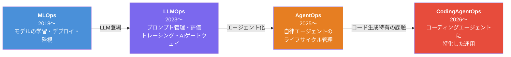
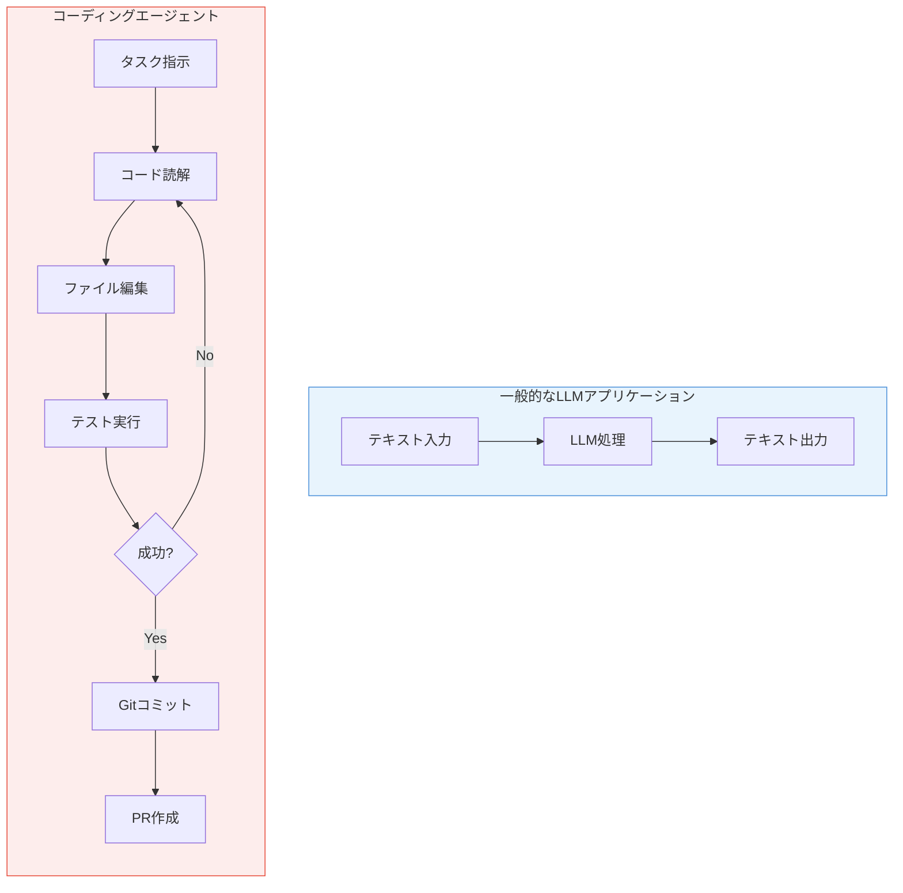
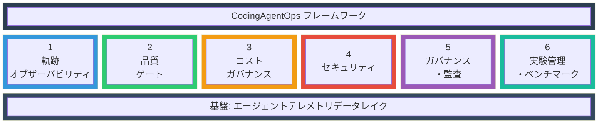
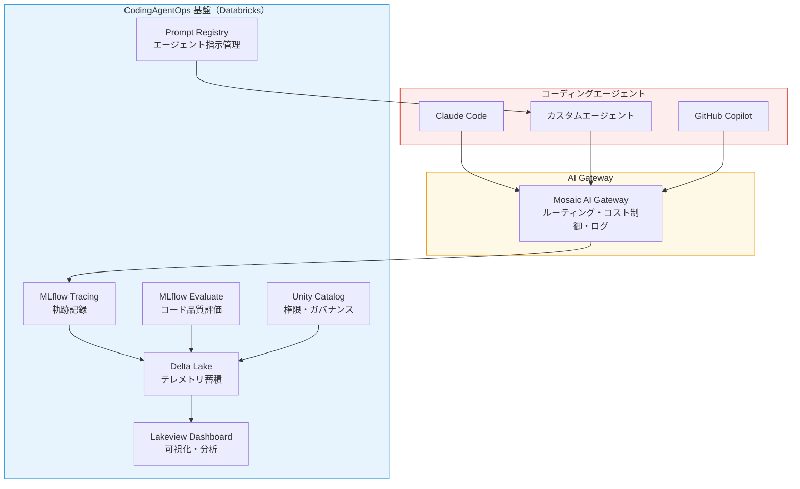

# はじめに：LLMOpsの「次」を考える

2022年末のChatGPT登場から約3年半。LLMアプリケーションの開発・運用を体系化する**LLMOps**は、MLflowのトレーシングや評価機能の充実とともに急速に成熟してきました。

しかし2025年後半から、LLMの活用形態に大きな変化が起きています。**AIコーディングエージェント**の爆発的普及です。

Claude Code、GitHub Copilot、Cursor、Devin——これらのツールは単なる「コード補完」ではなく、**ファイルを読み書きし、テストを実行し、Gitでコミットし、PRを作成する自律的なエージェント**です。2026年1月時点で[GitHub Copilotの企業内利用率は29%](https://blog.jetbrains.com/research/2026/04/which-ai-coding-tools-do-developers-actually-use-at-work/)、[Claude Codeは年間換算25億ドルの売上](https://www.getpanto.ai/blog/ai-coding-assistant-statistics)に到達しています。

この記事では、LLMOpsを「コーディングエージェント」の文脈に拡張した新しい概念、**CodingAgentOps**を提案します。

# Opsの進化：MLOpsからCodingAgentOpsへ

まず、運用方法論の進化の系譜を整理します。



| 段階 | 対象 | 主な課題 |
|---|---|---|
| **MLOps** | 機械学習モデル | 再現性、モデルバージョニング、デプロイ自動化 |
| **LLMOps** | LLMアプリケーション | プロンプト管理、非決定的出力の評価、コスト管理 |
| **AgentOps** | 自律AIエージェント全般 | ツール呼び出しの監視、副作用の管理、ガバナンス |
| **CodingAgentOps** | コーディングエージェント | コード品質保証、セキュリティ脆弱性、生産性の測定 |

AgentOpsは[IBM](https://www.ibm.com/think/topics/agentops)や[Microsoft](https://techcommunity.microsoft.com/blog/azure-ai-foundry-blog/from-zero-to-hero-agentops---end-to-end-lifecycle-management-for-production-ai-a/4484922)が定義し、[HumanLayer](https://www.humanlayer.dev/12-factor-agents)が「12-Factor Agents」として原則を体系化するなど、急速に概念が固まりつつあります。しかし、**コーディングエージェント固有の課題**に特化したフレームワークはまだ存在しません。

# なぜCodingAgentOpsが必要か——数字が語る現実

コーディングエージェントの導入は加速していますが、運用面では深刻な課題が浮上しています。

## AI生成コードの品質問題

| 指標 | 数値 | 出典 |
|---|---|---|
| AI共著PRの問題発生率 | 人間のみの**1.7倍** | [CodeRabbit (2025年12月)](https://www.coderabbit.ai/blog/2025-was-the-year-of-ai-speed-2026-will-be-the-year-of-ai-quality) |
| AI生成コードのセキュリティ脆弱性 | 人間の**2.74倍** | [Qodo調査](https://www.qodo.ai/reports/state-of-ai-code-quality/) |
| PRあたりのインシデント増加率 | **+242.7%** | [Faros.ai調査](https://www.faros.ai/blog/ai-software-engineering) |
| AI起因バグの顕在化時期 | デプロイ後**30〜90日** | [Stack Overflow](https://stackoverflow.blog/2026/01/28/are-bugs-and-incidents-inevitable-with-ai-coding-agents/) |

## 生産性パラドックス

開発者個人は「20%速くなった」と感じているにもかかわらず、チーム全体の成果物は**19%減少**しているという[調査結果](https://www.faros.ai/blog/ai-software-engineering)があります。原因はレビュー負荷の増大、手戻りの増加、インシデント対応の増加です。

## コストの不透明さ

- 単純なタスク: 5,000〜15,000トークン
- 複雑なマルチステップタスク: [**100万〜350万トークン**](https://www.vantage.sh/blog/agentic-coding-costs)（リトライ含む）
- 調査によるとエージェントが消費するトークンの[**70%が浪費**](https://www.morphllm.com/ai-coding-costs)（不要なファイル読み込み、無関係なコード探索の繰り返し）

## ガバナンスの欠如

- 正式なAgentOpsプロセスを持つチーム: わずか[**38%**](https://www.digitalapplied.com/blog/enterprise-coding-agent-deployment-playbook-2026)
- AIプロジェクトの本番到達率: **15%**（Gartner）
- [EU AI Actの施行: **2026年8月2日**](https://www.querypie.com/features/documentation/white-paper/28/ai-agent-guardrails-governance-2026)

これらの数字は、コーディングエージェントを「導入して終わり」にできないことを明確に示しています。

# LLMアプリとコーディングエージェントの本質的な違い

なぜ既存のLLMOpsだけでは不十分なのか。両者の根本的な違いを整理します。



| 比較軸 | LLMアプリケーション | コーディングエージェント |
|---|---|---|
| **入出力** | テキスト → テキスト | タスク → コード変更・コマンド実行 |
| **副作用** | なし〜限定的 | ファイルシステム、シェル、Git、ネットワーク |
| **セッション時間** | 数秒〜数分 | 数分〜**数時間**（[Rakutenの事例: 7時間](https://www.faros.ai/blog/best-ai-coding-agents-2026)） |
| **トークン消費** | リクエスト単位で予測可能 | タスクにより**5〜10倍のばらつき** |
| **エラーの性質** | 不正確な回答（情報的） | バグ混入・脆弱性・データ損失（**実害**） |
| **評価方法** | 単一出力の品質評価 | **軌跡全体**（20ステップの行動系列）の評価 |

この違いから、コーディングエージェントには3つの新しい運用次元が必要になります。

## 新次元1: 副作用の管理

一般的なLLMアプリは「テキストを返すだけ」なので副作用は限定的です。一方、コーディングエージェントはファイルを削除し、設定を変更し、本番環境にプッシュできます。すべてのアクションの記録、ロールバック可能性の確保、破壊的操作の承認ゲートが必須です。

## 新次元2: 複合エラーの伝播

チャットアプリでは各ターンが比較的独立していますが、コーディングエージェントでは20ステップ中のステップ3の小さな誤り（例: 間違ったAPIエンドポイントの選択）が、最終的なPR全体を破壊します。個別出力ではなく**軌跡（Trajectory）全体**の評価が必要です。

## 新次元3: 生産性パラドックスの測定

前述のとおり、個人の体感と組織の成果が乖離します。[DORA指標](https://byteiota.com/dora-metrics-2026-ai-expansion-meets-visibility-crisis/)（デプロイ頻度、変更リードタイム、変更障害率、復旧時間）にAI起因の影響を分離して追跡する仕組みが求められます。

# CodingAgentOpsの6つの柱

以上を踏まえ、CodingAgentOpsのフレームワークを6つの柱として定義します。



## 柱1: 軌跡オブザーバビリティ

LLMOpsのトレーシングを拡張し、LLM呼び出しだけでなく**エージェントの全行動**を記録します。

- **記録対象**: LLM推論、ファイル読み書き、コマンド実行、Git操作、ツール呼び出し
- **セッションリプレイ**: 問題発生時に「何をどの順序で行ったか」を完全に再現
- **ボトルネック分析**: どのステップでトークンを浪費しているかを特定

MLflow Tracingはすでにスパン（Span）の階層的な記録に対応しており、ファイルI/Oやコマンド実行をカスタムスパンとして記録する拡張は自然な延長線上にあります。

## 柱2: 品質ゲート

コード生成特有の品質保証パイプラインです。

- **自動コードレビュー**: LLM-as-Judgeによるコード品質評価（MLflow Evaluateの拡張）
- **セキュリティスキャン**: SAST（静的アプリケーションセキュリティテスト）の自動実行
- **テスト検証**: テスト通過率、カバレッジの追跡
- **PR受入率**: エージェント生成PRがどの程度修正なしでマージされるかを測定

## 柱3: コストガバナンス

トークン消費の5〜10倍のばらつきに対応します。

- **タスク単位の予算設定**: サーキットブレーカーによるトークン上限での自動停止
- **浪費検出**: 不要なファイル読み込みや探索ループの自動検知
- **モデル選択の最適化**: 複雑なタスクにはフロンティアモデル、単純な補完には軽量モデル
- **AI Gatewayによる統一的なコスト追跡**

## 柱4: セキュリティ

コーディングエージェントはファイルシステムとシェルにアクセスするため、攻撃面が広大です。

- **プロンプトインジェクション防御**: [OWASP Top 10 for LLM（2025年版）の第1位リスク](https://www.mintmcp.com/blog/ai-agent-security)
- **シークレットスキャン**: `.env`や認証情報のコミット防止
- **サプライチェーンセキュリティ**: 悪意あるプラグイン/スキルの検出
- **サンドボックス実行**: ワークツリー等による隔離環境での実行

2026年2月には、[Claude Codeユーザーを標的とした30以上の悪意あるスキルを用いたマルウェアキャンペーン](https://snyk.io/blog/toxicskills-malicious-ai-agent-skills-clawhub/)が確認されています。

## 柱5: ガバナンス・監査

EU AI Act（2026年8月施行）をはじめとする規制対応も含みます。

- **全アクションの監査証跡**: ファイル編集、コマンド実行、Git操作すべてをクエリ可能な形で記録
- **権限制御**: ファイルレベル、ディレクトリレベル、コマンドレベルのRBAC/ABAC
- **承認ゲート**: 高リスク操作（本番プッシュ、DB変更等）にはHuman-in-the-Loop
- **キルスイッチ**: エージェント実行の即時停止機能

## 柱6: 実験管理・ベンチマーク

エージェント設定の最適化を科学的に行います。

- **A/Bテスト**: モデル、システムプロンプト（CLAUDE.md等）、コンテキスト戦略の比較
- **ベンチマーク**: SWE-Bench等での定期的な能力評価
- **プロンプトレジストリ**: エージェント指示のバージョン管理とロールバック

# Databricks + MLflowで実現するCodingAgentOps

CodingAgentOpsは、ゼロから構築する必要はありません。LLMOps基盤からの**自然な拡張**として実現できます。

ここでは、筆者が業務で使用しているDatabricks + MLflowを例に、既存機能からの拡張パスを示します。

| CodingAgentOpsの柱 | 既存のLLMOps機能 | 拡張の方向性 |
|---|---|---|
| **軌跡オブザーバビリティ** | MLflow Tracing | ファイルI/O・コマンド実行をカスタムスパンとして記録 |
| **品質ゲート** | MLflow Evaluate（LLM-as-Judge） | コード品質評価用のカスタムジャッジを追加 |
| **コストガバナンス** | AI Gateway | タスク単位のトークン予算とサーキットブレーカーを追加 |
| **セキュリティ** | Unity Catalogのアクセス制御 | エージェントのファイル・コマンドアクセス権限管理 |
| **ガバナンス・監査** | MLflow実験のログ | 全アクション監査証跡をレイクハウスに蓄積 |
| **実験管理** | Prompt Registry | エージェントシステムプロンプトのバージョン管理 |

## 具体的な実装シナリオ

既存のLLMOps機能から、CodingAgentOpsの各柱がどう実現されるかを具体的に見てみましょう。

### シナリオ1: エージェントセッションの軌跡記録

Claude CodeやカスタムコーディングエージェントのセッションをMLflow Tracingで記録します。LLM呼び出しだけでなく、ファイル操作やコマンド実行もカスタムスパンとして階層的に記録することで、「どのステップで何が起きたか」を完全に可視化できます。

```python
import mlflow

# エージェントセッション全体を1つのトレースとして記録
@mlflow.trace(name="coding_agent_session")
def run_agent_task(task_description: str):

    # ステップ1: コード読解
    with mlflow.start_span(name="read_codebase") as span:
        span.set_attributes({"files_read": ["src/main.py", "tests/test_main.py"]})
        code_context = read_files(["src/main.py", "tests/test_main.py"])

    # ステップ2: LLMによるコード生成
    with mlflow.start_span(name="generate_code", span_type="LLM") as span:
        span.set_inputs({"prompt": task_description, "context_tokens": len(code_context)})
        generated_code = call_llm(task_description, code_context)
        span.set_outputs({"generated_lines": len(generated_code.splitlines())})

    # ステップ3: ファイル書き込み
    with mlflow.start_span(name="write_file") as span:
        span.set_attributes({"file": "src/main.py", "action": "edit"})
        write_file("src/main.py", generated_code)

    # ステップ4: テスト実行
    with mlflow.start_span(name="run_tests") as span:
        test_result = run_command("pytest tests/ -v")
        span.set_attributes({"passed": test_result.passed, "failed": test_result.failed})

    return {"success": test_result.passed > 0 and test_result.failed == 0}
```

MLflow UIでは、このセッションの全ステップが階層的なトレースとして表示され、各ステップの所要時間、トークン消費、成否を一目で把握できます。

### シナリオ2: AI生成コードのLLM-as-Judge評価

MLflow Evaluateを使い、エージェントが生成したコードを別のLLMが自動評価します。これにより、人間のコードレビュー前に品質の低いコードをフィルタリングできます。

```python
import mlflow

# コード品質評価用のカスタムジャッジ
code_quality_judge = mlflow.metrics.genai.make_genai_metric(
    name="code_quality",
    definition="""生成されたコードの品質を以下の観点で1-5のスコアで評価してください:
    1. 正確性: 要求された機能を正しく実装しているか
    2. セキュリティ: 脆弱性（インジェクション、ハードコードされた秘密情報等）がないか
    3. 保守性: 命名規則、構造、可読性は適切か
    4. テスト: エッジケースが考慮されているか""",
    grading_prompt="""タスク: {task}
    生成コード: {generated_code}
    既存コードベース: {codebase_context}""",
    model="endpoints:/databricks-claude-sonnet",
    greater_is_better=True,
)

# エージェントが生成したコードをバッチ評価
results = mlflow.evaluate(
    data=agent_outputs_df,  # タスク、生成コード、コンテキストを含むDataFrame
    model_type="text",
    extra_metrics=[code_quality_judge],
)
```

### シナリオ3: コスト分析ダッシュボード

エージェントのテレメトリデータをDeltaテーブルに蓄積し、Lakeviewダッシュボードでコストと品質の傾向を可視化します。AI Gatewayのログと組み合わせることで、「どのタスクタイプにどのモデルを使うのが最もコスト効率が良いか」を分析できます。

```sql
-- タスクタイプ別のトークン消費と成功率
SELECT
  task_type,
  model_name,
  COUNT(*) AS total_tasks,
  AVG(total_tokens) AS avg_tokens,
  AVG(CASE WHEN success THEN 1 ELSE 0 END) AS success_rate,
  AVG(total_tokens * cost_per_token) AS avg_cost_usd
FROM agent_telemetry.sessions
GROUP BY task_type, model_name
ORDER BY avg_cost_usd DESC
```

## アーキテクチャの全体像



重要な点は、LLMOpsの中核概念（トレーシング、評価、プロンプト管理、ゲートウェイ）がそのままCodingAgentOpsの基盤になることです。追加で必要なのは、コーディングエージェント固有の**副作用管理**、**コード品質評価**、**セキュリティスキャン**のレイヤーです。

# まとめと次回予告

**CodingAgentOps**は、MLOps → LLMOps → AgentOpsという運用方法論の進化の先にある、コーディングエージェント時代の運用フレームワークです。

本記事で提案した6つの柱を再掲します:

1. **軌跡オブザーバビリティ** — エージェントの全行動を記録・再現する
2. **品質ゲート** — AI生成コードの品質をパイプラインで保証する
3. **コストガバナンス** — トークン消費のばらつきを制御する
4. **セキュリティ** — 広大な攻撃面を防御する
5. **ガバナンス・監査** — 規制対応と説明責任を果たす
6. **実験管理・ベンチマーク** — エージェント設定を科学的に最適化する

コーディングエージェントの導入を成功させる組織とそうでない組織を分けるのは、エージェント自体の性能ではなく、**その周囲に構築された運用基盤**です。エージェントの自律性を拡大する前にガバナンス基盤を構築した組織が、最も速くスケールしています。

LLMOpsの知見がある組織にとって、CodingAgentOpsへの移行は断絶ではなく**延長**です。今あるMLflowやAI Gatewayの基盤の上に、コーディングエージェント固有のレイヤーを積み重ねていくことが、最も現実的なアプローチでしょう。

## 次回: Databricksで構築するCodingAgentOpsパイプライン

次の記事では、本記事で示したアーキテクチャを実際にDatabricks上で構築します。

- **MLflow Tracingによるエージェントセッションの記録と可視化**
- **LLM-as-Judgeによるコード品質の自動評価パイプライン**
- **テレメトリデータのDelta Lake蓄積とLakeviewダッシュボードでのコスト分析**

概念で終わらせず、手を動かして実践するところまでをカバーします。

実践編を公開しました。

https://qiita.com/taka_yayoi/items/37673e51728c64172755

# 参考資料

- [What is AgentOps? | IBM](https://www.ibm.com/think/topics/agentops)
- [12-Factor Agents | HumanLayer](https://www.humanlayer.dev/12-factor-agents)
- [DevOps vs MLOps vs LLMOps vs AgentOps: Complete 2026 Guide | Intellibytes](https://intellibytes.substack.com/p/devops-vs-mlops-vs-llmops-vs-aiops)
- [From Zero to Hero: AgentOps | Microsoft](https://techcommunity.microsoft.com/blog/azure-ai-foundry-blog/from-zero-to-hero-agentops---end-to-end-lifecycle-management-for-production-ai-a/4484922)
- [The Real Cost of AI Coding in 2026 | MorphLLM](https://www.morphllm.com/ai-coding-costs)
- [State of AI Code Quality in 2025 | Qodo](https://www.qodo.ai/reports/state-of-ai-code-quality/)
- [2025 was the year of AI speed. 2026 will be the year of AI quality | CodeRabbit](https://www.coderabbit.ai/blog/2025-was-the-year-of-ai-speed-2026-will-be-the-year-of-ai-quality)
- [AI Coding Statistics | GetPanto](https://www.getpanto.ai/blog/ai-coding-assistant-statistics)
- [Enterprise Coding Agent Deployment Playbook 2026 | DigitalApplied](https://www.digitalapplied.com/blog/enterprise-coding-agent-deployment-playbook-2026)
- [DORA Metrics 2026: AI Expansion Meets Visibility Crisis | ByteIota](https://byteiota.com/dora-metrics-2026-ai-expansion-meets-visibility-crisis/)
- [A Survey on AgentOps | arXiv](https://arxiv.org/html/2508.02121v1)

### はじめてのDatabricks

[はじめてのDatabricks](https://qiita.com/taka_yayoi/items/8dc72d083edb879a5e5d)

### Databricks無料トライアル

[Databricks無料トライアル](https://databricks.com/jp/try-databricks)
