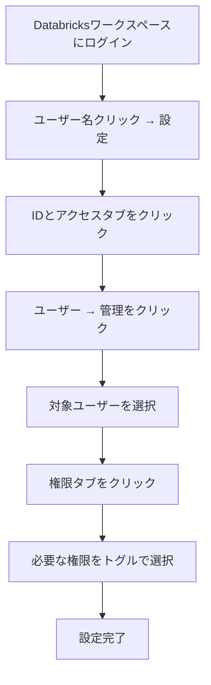

こちらのアップデートで新たなエンタイトルメント(権限)である**コンシューマー**が追加されました。

https://docs.databricks.com/aws/ja/release-notes/product/2025/june#new-consumer-entitlement-is-generally-available

> **新たなコンシューマーエンタイトルメントの正式提供**
> ワークスペース管理者は、ユーザー、サービスプリンシパル、グループにエンタイトルメントとしてコンシューマーアクセスを許可できるようになりました。これによって、Databricksワークスペースでユーザーが行えることに対してきめ細かい制御を行えるようになります。重要な点は:
> - コンシューマーアクセスによって、ワークスペースUIアクセスの制限、BIツールを用いたSQLウェアハウスへのクエリー、埋め込まれた認証情報あるいは参照者の認証情報を用いたダッシュボードの参照を可能とします。
> - 共有コンテンツやダッシュボードへのアクセスを必要とするが、ワークスペースオブジェクトの作成や管理を必要としないビジネスユーザーに有用です。
> - このエンタイトルメントは、ワークスペースアクセスやDatabricks SQLアクセスよりも厳格なものとなっています。これを個別に割り当てるには、`users`グループにある制限の緩いエンタイトルメントを削除し、ユーザーあるいはグループごとにエンタイトルメントを設定します。
>
> [エンタイトルメント](https://docs.databricks.com/gcp/ja/security/auth/entitlements)の管理をご覧ください。

# エンタイトルメントとは

Databricksのエンタイトルメント(権限)機能は、誰がどのような方法でDatabricksにアクセスできるかを制御するセキュリティ機能です。ワークスペースレベルで個別のユーザー、サービスプリンシパル、グループに対して権限を設定できます。

## 主要な権限タイプとアクセス範囲

| 権限タイプ | コンシューマーアクセス | Databricks SQLアクセス | ワークスペースアクセス |
|------------|:-------------------:|:-------------------:|:------------------:|
| **ダッシュボード・Genieの閲覧** | ✅ | ✅ | ✅ |
| **BIツールでのクエリ実行** | ✅ | ✅ | ❌ |
| **SQLオブジェクトの編集** | ❌ | ✅ | ❌ |
| **データサイエンス機能** | ❌ | ❌ | ✅ |
| **Mosaic AI機能** | ❌ | ❌ | ✅ |

## コンシューマーアクセスとアカウントユーザーの詳細比較

コンシューマーアクセスは、限定された機能のみを利用できる特別な権限です。一方、ワークスペースのメンバーシップを持たないユーザーはさらに制限された機能しか利用できません。

| 機能 | ワークスペースのコンシューマーアクセス | ワークスペースメンバーシップを持たないアカウントユーザー |
|------|:----------------------------------:|:------------------------------------------:|
| **埋め込み資格情報でのダッシュボード表示** | ✅ | ✅ |
| **参照者資格情報でのダッシュボード・Genie表示** | ✅ | ❌ |
| **行レベル・列レベルセキュリティでの表示** | ✅ | ❌ |
| **限定的なコンシューマーワークスペースUIアクセス** | ✅ | ❌ |
| **BIツールでのウェアハウスクエリ** | ✅ | ❌ |

## コンシューマーアクセスの特徴

- **制限されたワークスペースUI：** フル機能ではない、限定的なインターフェース
- **セキュリティ機能対応：** 行レベル・列レベルセキュリティが適用されたデータの表示
- **ダッシュボード中心：** 主にダッシュボードやレポートの閲覧に特化
- **BIツール連携：** 外部BIツールからのクエリ実行が可能

# ユーザー権限の設定手順

# ウォークスルー

ワークスペースの設定画面からIDとアクセス、ユーザーにアクセスし、設定を行いたいユーザーを表示します。**資格**に**コンシューマーアクセス**が表示されています。

しかし、冒頭で触れたようにこのユーザーは`users`グループに属しているので、`users`グループに**ワークスペースのアクセス権**や**Databricks SQLへのアクセス**のエンタイトルメントが付与されている場合、それらのエンタイトルメントを継承します。このため、ここでコンシューマーアクセスをオンにしても設定は反映されません。`users`はすべてのユーザーが属しているデフォルトのグループなので、ここからユーザーを削除することはできません。

この場合、コンシューマーエンタイトルメントを使う際には、一度`users`グループから**ワークスペースのアクセス権**や**Databricks SQLへのアクセス**の**エンタイトルメントを削除**し、各ユーザーごとに適切なエンタイトルメントを設定する必要があります。

そのあとで、コンシューマーアクセスのみを許可するユーザーでコンシューマーアクセスをオンにします。

これでこのユーザーはコンシューマーアクセスしかできなくなりました。

ワークスペースにログインします。

ダッシュボードとGenieのみにアクセスできるようになっています。

# まとめ

Databricksのエンタイトルメント機能を適切に活用することで、セキュアで効率的なデータ環境を構築できます。

## 運用上の注意点

| 注意事項 | 対処法 |
|----------|---------|
| **最低権限要件** | ユーザーは少なくとも1つのアクセス権限が必要 |
| **管理者権限** | ワークスペース管理者の権限削除は不可 |
| **API利用** | 複雑な権限設定はAPIの活用を検討 |
| **監査ログ** | 権限変更履歴の定期的な確認 |

## 権限設計のベストプラクティス
1. **役割ベースでのグループ作成**
   - データアナリスト、データエンジニア、ビジネスユーザーなど
2. **段階的な権限付与**
   - 最初は最小権限、必要に応じて追加
3. **定期的な権限レビュー**
   - 不要な権限の削除とアクセス状況の確認

### はじめてのDatabricks

[はじめてのDatabricks](https://qiita.com/taka_yayoi/items/8dc72d083edb879a5e5d)

### Databricks無料トライアル

[Databricks無料トライアル](https://databricks.com/jp/try-databricks)
