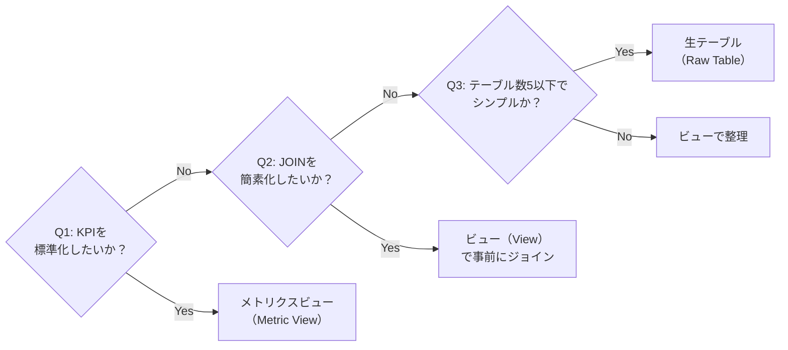
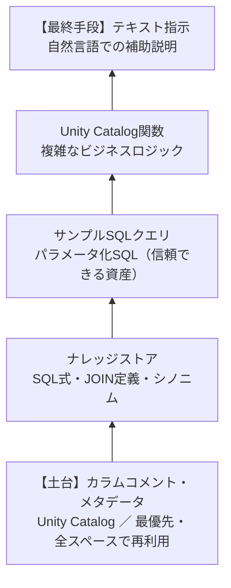
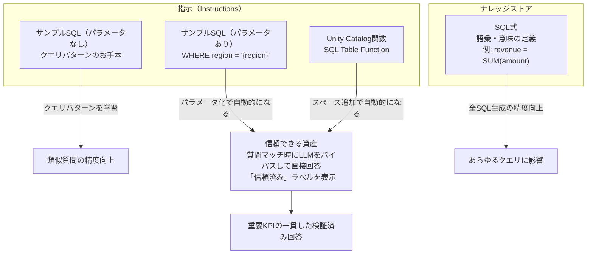
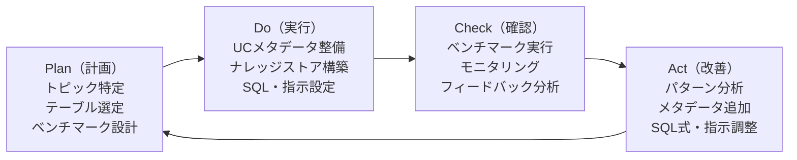

# はじめに

本記事は、Databricks AI/BI Genieスペースの設計・設定に関するベストプラクティスをまとめたものです。以下のソースをもとに構成しています。

- **[Databricks公式ドキュメント（日本語版）](https://docs.databricks.com/ja/genie/index.html)** — ベストプラクティス、ナレッジストア、信頼できる資産、APIリファレンスなど
- **[公式ブログ記事](https://www.databricks.com/blog/how-build-production-ready-genie-spaces)** — 本番運用ガイド、ベンチマーク活用ガイドなど
- **フィールドエンジニアリングでの実導入経験** — 実際のGenieスペース構築・運用支援を通じて蓄積した実践的な知見

**前編**では、データソース設計から指示設定・精度向上のPDCAサイクルまでを解説します。

> [**後編**](https://qiita.com/taka_yayoi/items/cf8ff39db5f3a13a8044)では、権限管理・日本語対応・アンチパターン・チェックリストを扱います。

# Genieスペースとは

自然言語でデータを探索できるDatabricksの対話型AIインターフェースです。複合AIシステム（Compound AI System）として複数のコンポーネントが連携し、ビジネスユーザーの質問をSQLクエリに変換して結果を返します。

**成功の鍵:**

1. フォーカスされたデータモデルの準備
2. 高品質なメタデータの整備
3. SQLベースの指示を優先した階層的な指示設計
4. ベンチマーク駆動の反復的改善サイクル
5. 信頼できる資産による信頼性の確保

## Genieスペースの全体アーキテクチャ

| レイヤー | コンポーネント | 役割 |
|---|---|---|
| データ基盤層 | Unity Catalog | テーブル、ビュー、メトリクスビュー、SQL関数の管理 |
| | テーブル/カラムコメント | ビジネスコンテキストの定義 |
| | PK/FK制約 | テーブル間リレーションの明示 |
| Genieスペース層 | ナレッジストア | シノニム、JOIN定義、SQL式、エンティティマッチング |
| | 指示 | テキスト指示、サンプルSQLクエリ、SQL関数 |
| | 信頼できる資産 | パラメータ化SQL、UDF（検証済み回答） |
| | ベンチマーク | テスト質問と期待結果のペア |
| ユーザー層 | 自然言語質問 | ビジネスユーザーが日本語/英語で質問 |
| | SQL生成・実行 | Genieが質問をSQLに変換しウェアハウスで実行 |
| | 結果・可視化 | テーブル/グラフで回答を表示 |
| | フィードバック | Yes/No/Fix It/Request Reviewで精度改善に貢献 |

**データの流れ:** Unity Catalog（データ基盤）で管理されたテーブルやメタデータが、Genieスペース層のナレッジストア・指示・信頼できる資産を通じてビジネスコンテキストと結合されます。ユーザーが自然言語で質問すると、GenieはこれらのコンテキストとメタデータをもとにSQLを生成し、SQLウェアハウスで実行して結果を返します。ユーザーのフィードバックはキュレーターに届き、改善サイクルが回ります。


# 1. データソース設計

## データソース選択フローチャート

| 判断ステップ | Yes の場合 | No の場合 |
|---|---|---|
| Q1: ビジネス指標（KPI）を標準化したいか？ | → メトリクスビュー（Metric View）を検討 | → Q2へ |
| Q2: 複数テーブルのJOINを簡素化したいか？ | → ビュー（View）で事前のジョインを検討 | → Q3へ |
| Q3: テーブル数が5以下で、構造がシンプルか？ | → 生テーブル（Raw Table）をそのまま使用 | → ビューで整理を推奨 |



**補足ルール:**
- テーブル数が多い場合（10以上）は、ドメイン分割して複数スペース + MASを検討
- どのデータソースを選んでも、Unity Catalogへの登録とメタデータ整備が必須

:::note
**データソース選択の要点:** リアルタイム性やパフォーマンス要件だけでなく、Genieの精度にとって最も重要なのは「**テーブル数を絞ること**」と「**メタデータを充実させること**」です。複雑な生テーブル群よりも、ビューで事前JOINした少数のテーブルの方が高い精度を実現します。
:::

## 1.1 データソースの選び方

Genieスペースには以下の[データソースを利用できます](https://docs.databricks.com/ja/genie/best-practices.html)（すべてUnity Catalog登録が必要）。

**対応データソース一覧:**
- マネージドテーブル・外部テーブル
- ビュー（View）
- マテリアライズドビュー（Materialized View）
- メトリクスビュー（Metric View）
- フォーリンテーブル（Foreign Table）
- CSVファイル・Excelファイル（パブリックプレビュー）

**選択の指針:**

| データソースタイプ | 推奨ユースケース | メリット | 注意点 |
|---|---|---|---|
| 生テーブル（Raw Table） | シンプルなデータ、単一テーブル分析 | 直接的、セットアップ簡単 | 複雑なJOINが必要になりがち |
| ビュー（View） | 複数テーブルの事前のジョイン、不要列の除外 | データモデル簡素化、テーブル数削減 | パフォーマンスに注意 |
| メトリクスビュー（Metric View） | KPI・指標の標準化 | Dimension/Measureの定義が明確、シノニム・単位定義が可能 | 現在パブリックプレビュー |

**推奨アプローチ:** Goldレイヤーのキュレーション済みテーブルをKimballスタイルのスター・スキーマで整理し、必要に応じてビューで事前JOINすることが最も効果的です。メトリクスビューはDimension/Measureの意味定義が組み込まれるため、Genieとの親和性が高いです。

:::note
**マテリアライズドビューについて:** データソースとして利用可能ですが、更新スケジュールの管理やDelta Live Tablesパイプラインの知識が必要です。Genie精度の観点では通常のビューで十分なケースがほとんどです。大量データの集計でクエリ速度が問題になった場合の最適化手段として検討してください。
:::


## 1.2 スキーマ設計・テーブル数の最適化

**テーブル数の上限と推奨:**
- [最大30テーブル/ビュー](https://docs.databricks.com/ja/genie/index.html)（スペースあたり）
- **推奨: 初期は5テーブル以下で開始し、段階的に追加**
- テーブル数が多いほどGenieの精度が低下する傾向がある

**データモデル最適化の原則:**

- **1スペース = 1トピック:** 「特定のトピックと対象者のための質問に答えるべきであり、様々なドメインにわたる一般的な質問には対応すべきではない」
- **関連テーブルをビューで事前にジョイン:** テーブル数制限内に収め、JOIN関係をシンプルに
- **不要列の削除・非表示:** ナレッジストアで列を非表示にし、ノイズを低減
- **PKとFKの定義:** Unity Catalogで主キー・外部キー制約を設定し、テーブル間の関係をGenieに明示

**大規模スキーマへの対応（多数テーブルが存在する場合）:**
- ドメインごとに複数のGenieスペースに分割
- キュレーション済みビューで必要なデータを集約
- Multi-Agent Supervisor（MAS）で複数スペースを統合管理

## 1.3 カラムコメント・メタデータのベストプラクティス

:::note warn
**メタデータの重要性:** 「ドキュメント（ビジネスコンテキスト）がなければ、Genieを含めた全員がただ推測するだけになる」。実際の検証事例では、メタデータありの場合6問中5問が正解、メタデータなしの場合6問中1問のみ正解という結果も報告されています。
:::

**記述すべき内容:**
- **テーブルの説明:** テーブルの目的、含まれるデータの範囲、更新頻度
- **カラムの説明:** ビジネス上の意味、データ型、取りうる値の範囲
- **カテゴリ値のマッピング:** 例: `"H - Misc Receipts, R - Revenue"` のような略語と正式名称の対応
- **日付形式:** 会計年度の開始月など標準と異なる日付ルール
- **シノニム（同義語）:** ビジネス用語の別名（[ナレッジストア](https://docs.databricks.com/ja/genie/knowledge-store.html)で設定）

**メタデータ管理の階層:**

| カテゴリ | 配置場所 | 説明 |
|---|---|---|
| オブジェクトメタデータ | Unity Catalog → Genieスペース | テーブル/カラムコメント、フォーマット支援、シノニム |
| 計算・結合定義 | テーブル/UDF/ビュー/メトリクスビュー | SQL式、JOIN条件 |
| 指示・例示クエリ | Genieスペース固有 | プロンプト調整、スペース特有のガイダンス |

**AI生成メタデータの活用:**
- GenieスペースのUIで「AI生成」ボタンを使い、テーブル/カラムの説明を自動生成できる
- ただし**生成結果は必ず人間がレビューし**、ビジネスコンテキストを補完すること
- プログラマティックに設定する場合は、SQLの`COMMENT`文またはREST APIを使用

# 2. Genieスペース設定（指示・サンプルSQLクエリ・関数）

効果的なGenieスペースを構築するには、適切な設定が不可欠です。

**テーブルのメタデータ**


**生成AIをガイドする指示**


## 指示設計の優先順位ピラミッド

| 優先度 | レイヤー | 配置場所 | 効果・一貫性 |
|---|---|---|---|
| 最優先（土台） | カラムコメント・メタデータ | Unity Catalog | 最も高い（全スペースで再利用可能） |
| 第2優先 | ナレッジストア（SQL式・JOIN・シノニム） | Genieスペース | 高い（SQLベースで一貫性を担保） |
| 第3優先 | サンプルSQLクエリ・パラメータ化SQL | Genieスペース | 高い（信頼できる資産として信頼済み回答を提供） |
| 第4優先 | Unity Catalog関数 | Unity Catalog | 高い（複雑なビジネスロジックをコード化） |
| 最終手段（頂点） | テキスト指示 | Genieスペース | 中程度（自然言語のため解釈にばらつき） |



**ピラミッドの読み方:** 土台（カラムコメント・メタデータ）が最も重要で広範な影響を持ち、頂点に向かうほどスコープが限定されます。テキスト指示は「最後の手段」として使用し、可能な限りSQL式やメタデータで定義してください。土台がしっかりしていないと、上位レイヤーの指示をいくら追加しても精度は向上しません。

## 2.1 指示の書き方

:::note
**最も重要な原則:** 「SQLの式でビジネスセマンティクスを定義し、SQLの例でよくある曖昧なプロンプトの処理方法を教え、テキスト指示は最後の手段として使う」（[Databricks公式ドキュメント](https://docs.databricks.com/ja/genie/best-practices.html)）
:::

**指示の優先順位（効果の高い順）:**

1. **SQL式:** フィルター・メジャー・ディメンションの定義（最も一貫性が高い）
2. **サンプルSQLクエリ:** 複雑なロジックのパターン定義
3. **テキスト指示:** 自然言語での補助説明（最後の手段）

:::note
**この優先順位の意味:** 「SQL式で書けることをテキスト指示に書くな」という選択基準であり、「SQL式だけ書けばいい」という意味ではありません。3つはカバーする領域が異なるため、実際にはすべてを組み合わせて使います。SQL式は意味定義、サンプルSQLは複雑なパターン、テキスト指示はSQL化できないルール（言語・日付解釈・フォーマット等）をそれぞれ担当します。
:::

**テキスト指示に書くべきこと:**
- 日付の解釈ルール（「今年度」の開始月など）
- 文字列比較のルール（大文字小文字の区別、ILIKE使用の指定）
- 結果のフォーマット指示（パーセントの小数点以下桁数、通貨記号）
- 曖昧な質問への明確化質問の方法
- 要約の言語・形式指定
- NULLフィルタリングの方法（「この列ではNULL値を除外すること」）

**テキスト指示に書いてはいけないこと:**
- テーブル構造の詳細説明（それはメタデータやナレッジストアで管理）
- 矛盾する指示（互いに衝突するルール）
- 曖昧な指示（「適切に処理してください」等）
- 過度に冗長な説明（トークン制限に達する可能性）

**指示の上限:**
- 最大100件の指示（テキスト指示 + サンプルSQLクエリ + SQL関数の合計）
- 文字列フィールドは最大25,000文字

**明確化質問の設計:** 条件トリガー、不足する詳細の特定、必要なアクションの記述、例示フレーズの4要素で構成します。一般指示の末尾に配置して、曖昧性の処理を優先してください。

## 2.2 サンプルSQLクエリの設計方法

**サンプルSQLクエリの役割:** Genieにクエリパターンを教え、精度を向上させます。**パラメータの有無**によって動作が大きく異なります。

- **パラメータなし**: クエリパターンのヒント。類似した質問を受けたときの参考にGenieが学習します
- **パラメータあり** (例: `` WHERE region = '{region}' ``): 自動的に[信頼できる資産](https://docs.databricks.com/ja/genie/trusted-assets.html)として認識されます。質問マッチ時はLLMを介さずこのSQLで直接回答し、「信頼済み」ラベルが表示されます

**SQL式・サンプルSQLクエリ・信頼できる資産の関係:**



**設計のポイント:**
- 自然言語のタイトルを付ける（ユーザーの質問とマッチングされる）
- 複雑な多段階ロジックや複数テーブルJOINのパターンを示す
- パラメータ化してバリエーションに対応（例: `WHERE region = '{region_param}'`）
- 検証済みのSQLを「Add as instruction」で保存

**パラメータ化SQLの例:**

```sql
-- タイトル: 特定地域の月次売上を表示
SELECT region, DATE_TRUNC('month', order_date) as month, SUM(amount) as total_sales
FROM sales_data
WHERE region = '{region}'
GROUP BY region, month
ORDER BY month DESC
```

## 2.3 Unity Catalog関数の活用方法

**Unity Catalog関数は信頼できる資産:** Unity Catalogに登録したSQLテーブル関数は、Genieで[信頼できる資産](https://docs.databricks.com/ja/genie/trusted-assets.html)として動作します。

**設計のベストプラクティス:**
- **詳細なコメント:** 関数の目的、使用場面、パラメータの説明を詳細に記述
- **NULLハンドリング:** `isnull(parameter) OR condition` で明示的にNULLチェック
- **デフォルト値:** オプショナルパラメータには`DEFAULT`句を設定
- **専用スキーマ:** Genie用関数は専用スキーマにまとめ、権限管理を簡素化

**権限要件:**
- `CAN USE`: カタログ/スキーマへのアクセス
- `EXECUTE`: 関数の実行権限

## 2.4 複数テーブルのJOIN関係の定義方法

**[ナレッジストア](https://docs.databricks.com/ja/genie/knowledge-store.html)でのJOIN定義:**

1. `Configure > Data > Joins` タブを開く
2. 「Add」をクリックし、結合するテーブルを選択
3. JOIN条件をSQL式で入力
4. 関係タイプを指定: `many-to-one` / `one-to-many` / `one-to-one`

**注意点:**
- Genieスペースに追加されていないテーブルのJOINメタデータは使用されない
- 複雑なJOIN（例: `rn=1`でのフィルタリング）はSQL式で定義
- PKとFKをUnity Catalogで定義しておくと、Genieが自動的に関係を認識


# 3. 精度向上のPDCAサイクル

## PDCAサイクル全体像

| フェーズ | アクション | 主な成果物 | 次のフェーズへの入力 |
|---|---|---|---|
| Plan（計画） | トピック・ユーザー特定、テーブル選定、質問リスト作成 | ベンチマーク質問セット（10-20問） | → Do へ |
| Do（実行） | UCメタデータ整備、ナレッジストア構築、サンプルSQLクエリ追加、テキスト指示記述 | 構成済みGenieスペース | → Check へ |
| Check（確認） | ベンチマーク実行、モニタリング確認、フィードバック分析 | 精度レポート（合格/不合格率） | → Act へ |
| Act（改善） | 不正確パターン分析、メタデータ追加、SQL式・指示調整 | 改善済み設定、新規ベンチマーク質問 | → Plan へ（繰り返し） |



**サイクルの運用ポイント:**
- **初回サイクル:** 5テーブル以下 + 10-20問のベンチマークで小さく始める
- **改善サイクル:** 不合格パターンごとに対策を実施し、再測定で効果を確認
- **安定運用後:** 週次〜月次でモニタリングタブを確認し、新しいパターンの質問を追加
- **目標精度:** ベンチマーク合格率80%以上を最初のマイルストーンに設定し、段階的に向上を目指す

## 3.1 ベンチマークの設定と活用

**[ベンチマーク](https://www.databricks.com/blog/building-confidence-benchmarks)とは:** テスト質問と期待されるSQL結果のペアのコレクションです。Genieの精度を体系的に追跡します。


**設定手順:**

1. Genieスペースの「ベンチマーク」タブを開く
2. 質問と期待結果（ゴールドスタンダードSQL）を追加
3. ベンチマークを実行し、Genieの回答と期待結果を比較
4. 不合格の項目について、指示やメタデータを改善
5. 改善後に再実行し、精度向上を確認

:::note
**ベンチマーク駆動開発の実績:** 0%の精度から開始し、反復的に100%のベンチマーク精度を達成した事例も報告されています。
:::

**ベンチマークの課題と対策:**
- **非決定性:** 同じ質問でも異なるSQLが生成されることがある。列名や列順の微妙な違いで不合格判定になる場合は手動レビューが必要
- **実行時間:** ベンチマーク実行には時間がかかる場合がある
- **現時点ではスケジュール実行不可:** 手動トリガーのみ（将来的にAPIでの実行が期待される）

## 3.2 精度測定・改善のPDCAサイクル詳細

**Plan（計画）:**
- 対象トピックとターゲットユーザーの特定
- 初期テーブル（5テーブル以下）の選定
- ユーザーが聞きそうな質問リストの作成
- ベンチマーク質問の設計

**Do（実行）:**
- Unity Catalogメタデータの整備（テーブル/カラムコメント、PK/FK）
- ナレッジストアの構築（シノニム、JOIN関係、SQL式）
- サンプルSQLクエリとSQL関数の追加
- テキスト指示の記述（最後に）

**Check（確認）:**
- ベンチマーク実行による精度測定
- モニタリングタブでユーザーの質問と回答を確認
- ユーザーフィードバック（Thumbs Up/Down）の分析
- 「Ask for Review」フラグ付き回答の確認

**Act（改善）:**
- 不正確な回答パターンの特定と対策
- メタデータの追加・修正
- SQL式・クエリ例の追加
- テキスト指示の調整
- ベンチマーク質問の追加

**チューニングの推奨順序:**

1. **Unity Catalogテーブル** → まずメタデータを充実させる（不要列削除、リレーション設定、コメント入力）
2. **ナレッジストア** → JOIN関係、SQL式（フィルター・メジャー・ディメンション）を定義
3. **一般テキスト指示** → 最後にチューニング（再利用性が低いため）

## 3.3 信頼できる資産とは何か、どう活用するか


**定義:** 「[信頼できる資産](https://docs.databricks.com/ja/genie/trusted-assets.html)は、ユーザーからの質問に対して検証済みの回答を提供するための、事前定義された関数とクエリ例」

**種類:**
- **パラメータ化SQLクエリ:** ユーザーの質問がマッチすると「信頼済み」ラベル付きで回答
- **Unity Catalog関数（UDF）:** 複雑なビジネスロジックをコード化した関数

**活用のメリット:**
- 回答に「Trusted」ラベルが表示され、ビジネスユーザーの信頼を向上
- 非決定性の問題を回避（常に同じSQLを使用）
- 重要なKPIや定期的に聞かれる質問に対して一貫した結果を保証

**ナレッジストア vs 信頼できる資産 vs ベンチマークの使い分け:**

| 機能 | 目的 | 影響範囲 |
|---|---|---|
| ナレッジストア | Genieのデータ理解力を向上 | SQL生成プロセス全体に影響 |
| 信頼できる資産 | 検証済み回答の直接提供 | マッチした質問のみ |
| ベンチマーク | 精度の測定・追跡 | 回答には直接影響しない |

## 3.4 よくある精度低下パターンと対処法

| パターン | 症状 | 対処法 |
|---|---|---|
| メタデータ不足 | 誤った列の選択、不正確なJOIN | テーブル/カラムコメントの充実 |
| 曖昧な用語 | 同じ単語に複数の解釈 | シノニムの追加、SQL式での明確化 |
| LIKE vs ILIKE | 大文字小文字の不一致で結果が不一致 | テキスト指示で「文字列比較にはILIKEを使用すること」と指示 |
| NULL値の未処理 | 結果が0件になる | テキスト指示でNULLフィルタリングルールを明記 |
| テーブル数過多 | 精度全体の低下 | テーブル数を5-10に絞る、ビューでプリジョイン |
| 矛盾する指示 | Genieが混乱 | 全指示間の整合性確認 |
| 指示テキストの肥大化 | トークン制限到達、重要な指示が埋もれる | SQL式・ナレッジストアに分散、テキストは最小限に |
| カテゴリ値の不認識 | フィルタ値が一致しない | エンティティマッチングの有効化、値ディクショナリの設定 |


# まとめ

前編では、Genieスペースを高精度で運用するための**設計・設定の基本原則**を解説しました。

**重要なポイントの振り返り:**
- **データモデルが精度の土台:** テーブル数を絞り、メタデータを充実させることが最優先
- **指示はピラミッド構造:** メタデータ → ナレッジストア → サンプルSQLクエリ → テキスト指示の順で設定
- **PDCAを回す:** ベンチマーク駆動で反復的に改善し、80%合格率を最初の目標に

**後編**では、権限管理・日本語対応テクニック・アンチパターン・本番運用チェックリストを解説します。

https://qiita.com/taka_yayoi/items/cf8ff39db5f3a13a8044

# 参考資料

**公式ドキュメント（日本語版）**
- [効果的なGenieスペースをキュレーションする](https://docs.databricks.com/ja/genie/best-practices.html) - ベストプラクティスの公式ガイド
- [AI/BI Genieスペースの設定と管理](https://docs.databricks.com/ja/genie/index.html) - セットアップと管理
- [より信頼性の高いGenie spacesのためのナレッジストアを構築する](https://docs.databricks.com/ja/genie/knowledge-store.html) - ナレッジストアの構築
- [AI/BI Genieスペースで信頼できる資産を使用する](https://docs.databricks.com/ja/genie/trusted-assets.html) - 信頼できる資産の活用
- [AI/BI Genieスペースとは](https://docs.databricks.com/ja/genie/index.html) - 日本語公式ドキュメント

**ブログ記事**
- [How to Build Production-Ready Genie Spaces](https://www.databricks.com/blog/how-build-production-ready-genie-spaces) - 本番運用ガイド
- [From Data to Dialogue: Best Practices Guide](https://www.databricks.com/blog/data-dialogue-best-practices) - 高性能スペース構築ガイド
- [Building Confidence with Benchmarks](https://www.databricks.com/blog/building-confidence-benchmarks) - ベンチマーク活用ガイド
- [Best Practices for AI/BI Genie Spaces (Medium)](https://medium.com/databricks/best-practices-for-ai-bi-genie-spaces) - SME Engineeringブログ


### はじめてのDatabricks

[はじめてのDatabricks](https://qiita.com/taka_yayoi/items/8dc72d083edb879a5e5d)

### Databricks無料トライアル

[Databricks無料トライアル](https://databricks.com/jp/try-databricks)
