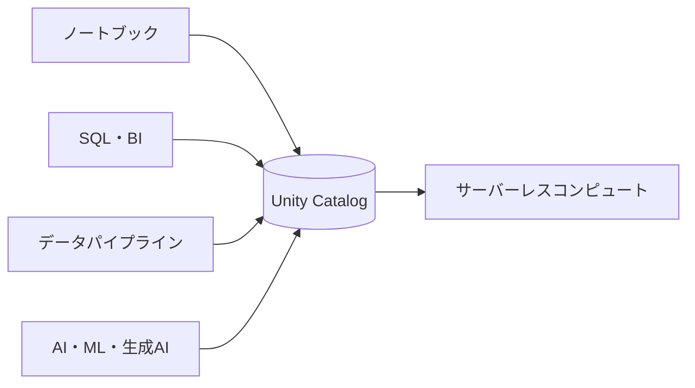
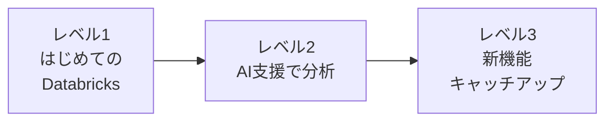
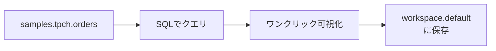
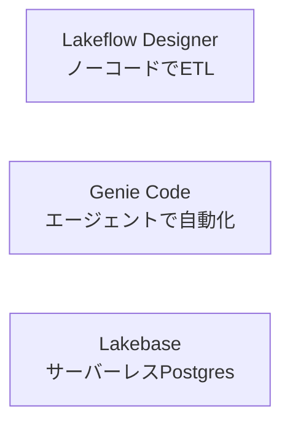

# この記事について

これは、JEDAI(Japan Enduser Group | Databricks Innovation)のもくもく会「はじめてのDatabricks」で使う教材の入口となる記事です。

当日は最初に「Databricksとは何か」を軽く紹介したあと、各自がもくもくと手を動かします。途中から参加した方や、当日のペースに追いつけなかった方でも、この記事とGitHubリポジトリがあれば、自分のペースで最初から進められます。

実際のハンズオン教材(ノートブックや手順書)は、すべてGitHubリポジトリにまとまっています。この記事は、その全体像をつかんで、自分のレベルに合った入口を見つけるための地図です。

当日のイベントページはこちらです。

https://jedai.connpass.com/event/396166/

教材はこのリポジトリにまとまっています。

https://github.com/taka-yayoi/jedai-first-databricks

すべて Databricks Free Edition(無料・クレジットカード不要)で動くようになっています。会社の環境がなくても、その場ですぐ始められます。

# Databricksとは

すごくざっくり言うと、Databricksは **データ分析・機械学習・生成AIを1つで扱えるクラウドプラットフォーム** です。

従来は「データ処理はSpark」「分析はJupyter」「BIはBIツール」「機械学習はMLflow」と別々のツールを使っていましたが、Databricksはこれらを1つに統合しています。イメージとしては **Google Colabの超強化版 + データベース + 本番運用機能** です。

中心にいるのはノートブックで、ここはJupyterやColabを使ったことがある方なら馴染みやすいはずです。その周りにSQL・BI、データパイプライン、AI/MLといった機能がそろっていて、すべてのデータと権限を Unity Catalog が一元管理します。計算資源はサーバーレスなので、クラスターの起動を待たずに数秒で処理を始められます。

公式の概要はこちらです。

- [Databricksとは(公式ドキュメント)](https://docs.databricks.com/ja/introduction/)

## JupyterやGoogle Colabとの違い

| 観点 | Jupyter / Google Colab | Databricks |
| --- | --- | --- |
| 計算資源 | 手元のマシンや単一環境 | サーバーレスでスケール |
| データ管理 | ローカルファイルなど | Unity Catalogで一元管理 |
| コラボレーション | 限定的 | 同時編集・権限管理が前提 |
| 本番運用 | 別途仕組みが必要 | パイプライン・ジョブが標準搭載 |
| AI支援 | Geminiなど | Genie / Genie Code |

ノートブックでコードを書く体験そのものは大きく変わりません。違うのは、その周りの「チームで使う」「大規模データを扱う」「そのまま本番運用する」といった部分です。

# 環境の準備

このもくもく会では Databricks Free Edition を使います。サインアップはクレジットカード不要で、登録後すぐに使えます。

1. [Databricks Free Edition](https://www.databricks.com/jp/learn/free-edition) にアクセスしてサインアップする
2. ワークスペースにログインする
3. 画面が英語の場合は、右上のアカウントアイコンから Settings → Preferences → Language で日本語に切り替える

サインアップやログインで詰まったときは、[はじめてのDatabricks](https://qiita.com/taka_yayoi/items/8dc72d083edb879a5e5d) の「環境の準備」セクションに画面付きの手順があります。

# もくもく会の進め方とレベル構成

当日は、運営が各レベルの実例をデモで見せたあと、みなさんがリポジトリの教材を使ってもくもくと進めます。詰まったところはいつでも質問できます。

教材は3つのレベルに分かれています。自分の経験に合わせて、入口を選んでください。

- レベル1: Databricksを初めて触る方。完走できれば大成功です
- レベル2: 少し触ったことがある方。AI支援(Genie / Genie Code)での分析を体験します
- レベル3: 経験者の方。最近の新機能をキャッチアップします

データは全レベルとも、Free Editionに最初から入っている `samples` カタログのデータを使います。CSVのアップロードは不要です。

# レベル1: はじめてのDatabricks

ゴールは「ノートブックでコードを実行し、データをクエリして可視化し、自分のテーブルに保存できた」という最初の成功体験です。受注データ `samples.tpch.orders` を題材に、次の流れを体験します。

ノートブックを作ってサーバーレスを選び、SQLでデータをクエリし、ボタン操作でグラフを作り、加工した結果を自分のテーブルに保存するところまでをやります。Jupyterと違って、可視化はコードを書かずにワンクリックでできます。

教材ノートブック:

- [level1/01_first_steps.py](https://github.com/taka-yayoi/jedai-first-databricks/blob/main/level1/01_first_steps.py)

このノートブックをワークスペースにインポートし、右上のコンピュートで「Serverless」を選んで、上から順に実行してください。

# レベル2: AI支援で分析する

ゴールは「Genie Code(旧Databricksアシスタント)やGenieを使って、コードを全部自分で書かずに分析を進められた」という体験です。ニューヨークのタクシー乗車データ `samples.nyctaxi.trips` を題材にします。

やることは2つです。ひとつは、Genie Codeに日本語でやりたいことを伝えてコードを生成してもらい、SQLとPySparkを行き来すること。もうひとつは、Genie Spaceを作って、SQLを一切書かずに日本語の質問だけでデータを分析することです。

教材:

- [level2/02_genie_assistant.py](https://github.com/taka-yayoi/jedai-first-databricks/blob/main/level2/02_genie_assistant.py) Genie Codeでのコード生成とPySpark書き換え
- [level2/genie_space_setup.md](https://github.com/taka-yayoi/jedai-first-databricks/blob/main/level2/genie_space_setup.md) Genie Spaceを作って日本語で質問する手順

2026年3月に、従来のDatabricksアシスタントは Genie Code に置き換わり、エージェントモードで動く新しいアシスタントになりました。画面右上のアイコンから開けます。

# レベル3: 新機能キャッチアップ

経験者向けに、最近の新機能を3つ用意しています。いずれもFree Editionで手を動かせます。

## Lakeflow Designer(ノーコード)

このレベルのメインです。ドラッグ&ドロップのキャンバスと自然言語で、コードを書かずにデータ変換を組める新しいETL機能です。`samples.nyctaxi.trips` を入力に、フィルタと集計をビジュアルに組んでUnity Catalogに書き出します。難しい派生列の作成は、Genie Codeに自然言語で任せる流れも試せます。

- [level3/03a_lakeflow_designer.md](https://github.com/taka-yayoi/jedai-first-databricks/blob/main/level3/03a_lakeflow_designer.md)
- 公式: [Lakeflow Designer(ドキュメント)](https://docs.databricks.com/ja/designer/)

コードでパイプラインを書きたい方向けに、同じ処理を宣言型パイプライン(SDP)のコードで書いた発展版も置いてあります。

- [level3/03a_lakeflow_pipeline_code.py](https://github.com/taka-yayoi/jedai-first-databricks/blob/main/level3/03a_lakeflow_pipeline_code.py)

## Genie Code(エージェント)

Genie Codeのエージェント(Agent)モードを試します。コードを書く相棒というより、複数ステップのデータ作業を自分で計画・実行するエージェントです。Free EditionでもAgentモードが使えます。

- [level3/03b_genie_code.py](https://github.com/taka-yayoi/jedai-first-databricks/blob/main/level3/03b_genie_code.py)

## Lakebase(サーバーレスPostgres)

レイクハウスに統合された、フルマネージドのサーバーレスPostgresです。データベースプロジェクトを作り、SQLエディタでPostgresを触り、使わないときにゼロにスケールする挙動を体感します。発展として、作ったテーブルをUnity Catalogに登録し、Databricks SQLからレイクハウスのデータと一緒に扱う流れも試せます。

- [level3/03c_lakebase_handson.md](https://github.com/taka-yayoi/jedai-first-databricks/blob/main/level3/03c_lakebase_handson.md)

# Free Editionで気をつけること

- 計算資源は **サーバーレスのみ** です。R / Scala は使えません
- 1日あたりの **クォータ制限** があります。超えるとその日のコンピュートが止まりますが、データは消えません。翌日にはリセットされます
- Lakebase は公式の制限ページ上は「サポート対象外」と記載されていますが、実機のFree Editionでは作成できます。挙動が不安定な場合は運営のデモで雰囲気をつかんでください
- Genie Code の Agentモードでは「信頼できるコードとデータを使うエージェントを使ってください」という確認が表示されます。当日は安全な `samples` データのみを扱うので問題ありません

# もっと学びたい人へ

もくもく会のあと、さらに学びを深めたい方向けの記事です。

- [はじめてのDatabricks](https://qiita.com/taka_yayoi/items/8dc72d083edb879a5e5d) この記事のレベル1のより詳しい解説
- [Databricks初心者のための完全学習ガイド](https://qiita.com/taka_yayoi/items/1fe076a0f87a7442d39a) 基礎から生成AIまでの学習ロードマップ
- [Databricks Free Edition](https://qiita.com/taka_yayoi/items/33e9cfa7ca9ca9febe72) Free Editionの概要と始め方
- [Databricks Free Editionで学ぶAI/BI Genie](https://qiita.com/taka_yayoi/items/d2d7b74f0806975a8d63) Genieでの自然言語分析
- [Databricks Free Editionで始めるApache Spark](https://qiita.com/taka_yayoi/items/c12a9ab6b6f75f95bc04) Sparkの基礎

当日はもちろん、この記事を見ながらあとから一人で進めるのも大歓迎です。気になっていたけれど触ったことがなかった、という方こそ、ぜひ手を動かしてみてください。
### はじめてのDatabricks

[はじめてのDatabricks](https://qiita.com/taka_yayoi/items/8dc72d083edb879a5e5d)

### Databricks無料トライアル

[Databricks無料トライアル](https://databricks.com/jp/try-databricks)
