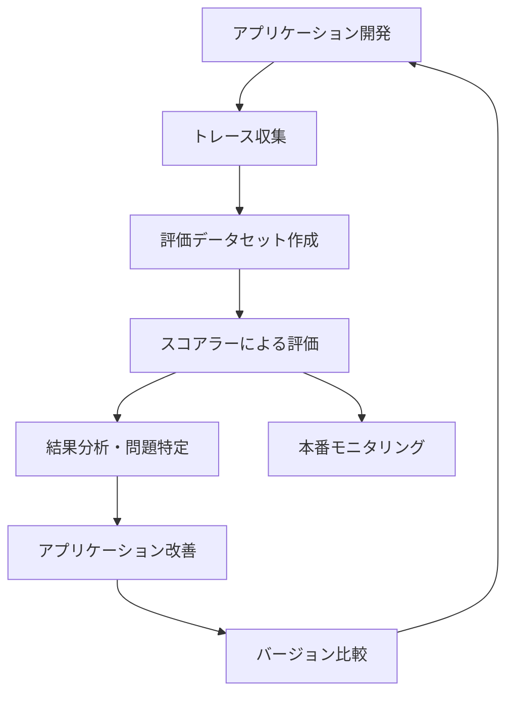
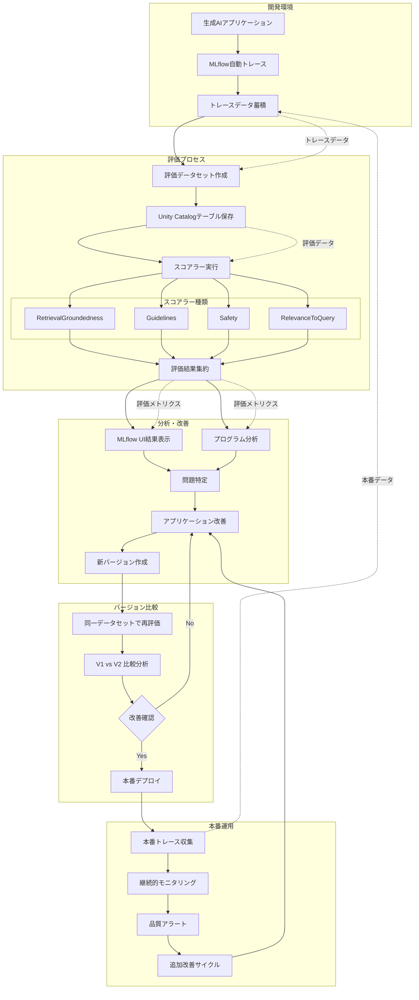

DatabricksのMLflowが提供する評価・モニタリング機能を活用することで、生成AIアプリケーションの品質を定量的に測定し、継続的に改善できます。本記事では、実際のトレースデータから評価データセットを作成し、事前定義されたスコアラーで自動評価を行い、問題を特定してアプリケーションを改善するワークフローを詳しく解説します。初心者でも実践できるよう、コード例と具体的な手順を交えて説明します。

マニュアルはこちらです。

https://docs.databricks.com/aws/ja/mlflow3/genai/eval-monitor/evaluate-app

:::note info
**注意**
Mosaic AI Agent Evaluationは、DatabricksマネージドMLflow 3と統合されています。Agent Evaluation SDKのメソッドは、`mlflow[databricks]>=3.1`を通じて公開されるようになりました。

:::

# Databricks MLflowの生成AIアプリの評価

## 機能概要

MLflowの評価・モニタリング機能は、生成AIアプリケーションの品質を体系的に評価し改善するための包括的なフレームワークです。主要な機能は以下の通りです：

| 機能 | 説明 |
|------|------|
| **評価データセット作成** | 実際のトレースデータから評価用データセットを自動生成 |
| **事前定義スコアラー** | RetrievalGroundedness、Safety、Guidelinesなど用途別スコアラー |
| **カスタムスコアラー** | 独自の評価基準に基づくスコアラーの作成 |
| **バージョン比較** | 異なるアプリバージョン間での性能比較分析 |
| **継続的モニタリング** | 本番環境での品質継続監視 |

この機能により、開発者は感覚に頼らず、データドリブンでアプリケーションの品質向上を図ることができます。



## データの流れ




# メリット、嬉しさ

MLflowの評価機能を導入することで、開発チームは以下の恩恵を受けられます：

**定量的な品質測定**
- 従来の主観的な評価から脱却し、数値ベースでアプリの性能を把握
- 「なんとなく良くなった」ではなく、具体的な改善幅を確認可能

**効率的な問題特定**
- 自動化されたスコアラーにより、人手では発見困難な品質問題を迅速に検出
- 大量のテストケースを一括で評価し、パターン分析が可能

**継続的改善の仕組み化**
- 評価データセットの再利用により、一貫した基準でバージョン比較を実施
- 改善の効果測定と回帰検出を自動化

**チーム協調の促進**
- 共通の評価基準により、開発者間での品質議論が具体的に
- UIベースの結果表示で、非技術者でも評価結果を理解しやすい

# 使い方の流れ

```py
%pip install --upgrade "mlflow[databricks]>=3.1.0" openai
%restart_python
```

## ステップ 1: アプリケーションを作成する

このガイドでは、次のような Eメール 生成アプリを評価します。

- CRMデータベースから顧客情報を取得します
- 取得した情報に基づいてパーソナライズされたフォローアップEメール

Eメール生成アプリを作りましょう。 取得コンポーネントは、MLflow の取得コンポーネントの固有のスコアラーを有効にするために `span_type="RETRIEVER"` でマークされています。

```py
import mlflow
from openai import OpenAI
from mlflow.entities import Document
from typing import List, Dict

# OpenAI呼び出しの自動トレーシングを有効化
mlflow.openai.autolog()

# MLflowと同じ認証情報でDatabricks LLMにOpenAI経由で接続
# または独自のOpenAI認証情報をここで使用可能
mlflow_creds = mlflow.utils.databricks_utils.get_databricks_host_creds()
client = OpenAI(
    api_key=mlflow_creds.token,
    base_url=f"{mlflow_creds.host}/serving-endpoints"
)

# CRMデータベースのシミュレーション
CRM_DATA = {
    "Acme Corp": {
        "contact_name": "アリス・チェン",
        "recent_meeting": "月曜日に製品デモを実施。エンタープライズ機能に非常に関心あり。質問内容：高度な分析、リアルタイムダッシュボード、API連携、カスタムレポート、マルチユーザー対応、SSO認証、データエクスポート機能、500人以上の価格",
        "support_tickets": ["チケット #123: API遅延問題（先週解決）", "チケット #124: 一括インポートの機能要望", "チケット #125: GDPR対応に関する質問"],
        "account_manager": "サラ・ジョンソン"
    },
    "TechStart": {
        "contact_name": "ボブ・マルティネス",
        "recent_meeting": "先週木曜日に初回営業コール、価格をリクエスト",
        "support_tickets": ["チケット #456: ログイン問題（未解決 - 重大）", "チケット #457: パフォーマンス低下の報告", "チケット #458: CRM連携の失敗"],
        "account_manager": "マイク・トンプソン"
    },
    "Global Retail": {
        "contact_name": "キャロル・ワン",
        "recent_meeting": "昨日四半期レビュー、プラットフォームのパフォーマンスに満足",
        "support_tickets": [],
        "account_manager": "サラ・ジョンソン"
    }
}

# MLflowのRetrievalGroundednessスコアラーが動作するようにリトリーバースパンを使用
@mlflow.trace(span_type="RETRIEVER")
def retrieve_customer_info(customer_name: str) -> List[Document]:
    """CRMデータベースから顧客情報を取得"""
    if customer_name in CRM_DATA:
        data = CRM_DATA[customer_name]
        return [
            Document(
                id=f"{customer_name}_meeting",
                page_content=f"最近の打ち合わせ: {data['recent_meeting']}",
                metadata={"type": "meeting_notes"}
            ),
            Document(
                id=f"{customer_name}_tickets",
                page_content=f"サポートチケット: {', '.join(data['support_tickets']) if data['support_tickets'] else '未対応チケットなし'}",
                metadata={"type": "support_status"}
            ),
            Document(
                id=f"{customer_name}_contact",
                page_content=f"連絡先: {data['contact_name']}, アカウントマネージャー: {data['account_manager']}",
                metadata={"type": "contact_info"}
            )
        ]
    return []

@mlflow.trace
def generate_sales_email(customer_name: str, user_instructions: str) -> Dict[str, str]:
    """顧客データと営業担当者の指示に基づき、パーソナライズされた営業メールを生成"""
    # 顧客情報を取得
    customer_docs = retrieve_customer_info(customer_name)

    # 取得したコンテキストを結合
    context = "\n".join([doc.page_content for doc in customer_docs])

    # 取得したコンテキストを使ってメールを生成
    prompt = f"""あなたは営業担当者です。以下の顧客情報に基づき、
    要望に対応した簡潔なフォローアップメールを書いてください。

    顧客情報:
    {context}

    ユーザー指示: {user_instructions}

    メールは簡潔かつパーソナライズしてください。"""

    response = client.chat.completions.create(
        model="databricks-claude-3-7-sonnet", # この例ではDatabricksホストのLLMを使用。独自のOpenAI認証情報を使う場合は有効なOpenAIモデル（例: gpt-4o等）に置き換えてください。
        messages=[
            {"role": "system", "content": "あなたは親切な営業アシスタントです。"},
            {"role": "user", "content": prompt}
        ],
        max_tokens=2000
    )

    return {"email": response.choices[0].message.content}

# アプリケーションのテスト
result = generate_sales_email("Acme Corp", "製品デモ後のフォローアップ")
print(result["email"])
```
```
# 件名: 製品デモのフォローアップ - エンタープライズ機能について

アリス様

先日の月曜日は、弊社製品のデモにお時間をいただき、誠にありがとうございました。エンタープライズ機能についてご関心をお持ちいただき、大変嬉しく思います。

ご質問いただいた内容について、以下の追加情報をお送りします：

1. 高度な分析・リアルタイムダッシュボード・カスタムレポート機能の詳細資料
2. API連携の仕様書と実装例
3. マルチユーザー対応とSSO認証の設定ガイド
4. データエクスポート機能の活用事例
5. 500名以上の組織向け価格体系表

また、先週解決したAPI遅延問題(#123)については正常に動作していることを確認しております。一括インポート機能(#124)とGDPR対応(#125)についても、開発チームと連携して対応を進めております。

ご不明点やさらなる情報が必要でしたら、いつでもご連絡ください。次のステップについてもぜひご相談させていただければと思います。

今後ともよろしくお願いいたします。

サラ・ジョンソン
アカウントマネージャー
```

トレースも確認できます。


## ステップ 2: 本番運用のトラフィックをシミュレートする

この手順では、デモンストレーションの目的でトラフィックをシミュレートします。実際には、実際の使用状況の[トレース](https://docs.databricks.com/aws/ja/mlflow3/genai/tracing/)を使用して評価データセットを作成します。

```py
# ガイドラインに違反するように設計されたシナリオでベータテストトラフィックをシミュレート
test_requests = [
    {"customer_name": "Acme Corp", "user_instructions": "製品デモ後のフォローアップ"},
    {"customer_name": "TechStart", "user_instructions": "サポートチケットの状況を確認"},
    {"customer_name": "Global Retail", "user_instructions": "四半期レビューの要約を送信"},
    {"customer_name": "Acme Corp", "user_instructions": "すべての製品機能、価格帯、実装スケジュール、サポートオプションを詳しく説明する非常に詳細なメールを書く"},
    {"customer_name": "TechStart", "user_instructions": "彼らのビジネスに感謝する熱意のあるメールを送信！"},
    {"customer_name": "Global Retail", "user_instructions": "フォローアップメールを送信"},
    {"customer_name": "Acme Corp", "user_instructions": "物事がどうなっているかを確認するために連絡する"},
]

# リクエストを実行し、トレースをキャプチャ
print("本番トラフィックをシミュレート中...")
for req in test_requests:
    try:
        result = generate_sales_email(**req)
        print(f"✓ {req['customer_name']} のメールを生成しました")
    except Exception as e:
        print(f"✗ {req['customer_name']} のエラー: {e}")
```
```
本番トラフィックをシミュレート中...
✓ Acme Corp のメールを生成しました
✓ TechStart のメールを生成しました
✓ Global Retail のメールを生成しました
✓ Acme Corp のメールを生成しました
✓ TechStart のメールを生成しました
✓ Global Retail のメールを生成しました
✓ Acme Corp のメールを生成しました
```


## ステップ 3: 評価データセットを作成する

次に、トレースを評価データセットに変換しましょう。評価データセットにトレースを保存すると、評価結果をデータセットにリンクして、データセットの経時的な変更を追跡し、このデータセットを使用して生成されたすべての評価結果を確認できます。

```py
import mlflow
import mlflow.genai.datasets
import time
from databricks.connect import DatabricksSession

# 0. ローカル開発環境を使用している場合は、MLflowの評価データセットサービスを提供するServerless Sparkに接続
spark = DatabricksSession.builder.remote(serverless=True).getOrCreate()

# 1. 評価データセットを作成

# CREATE TABLE権限のあるUnity Catalogスキーマに置き換えてください
uc_schema = "takaakiyayoi_catalog.agents"
# 上記のUCスキーマにこのテーブルが作成されます
evaluation_dataset_table_name = "email_generation_eval"

eval_dataset = mlflow.genai.datasets.create_dataset(
    uc_table_name=f"{uc_schema}.{evaluation_dataset_table_name}",
)
print(f"評価データセットを作成しました: {uc_schema}.{evaluation_dataset_table_name}")

# 2. ステップ2のシミュレートされた本番トレースを検索: 直近20分間のトレースを取得し、トレース名で絞り込み
ten_minutes_ago = int((time.time() - 10 * 60) * 1000)

traces = mlflow.search_traces(
    filter_string=f"attributes.timestamp_ms > {ten_minutes_ago} AND "
                 f"attributes.status = 'OK' AND "
                 f"tags.`mlflow.traceName` = 'generate_sales_email'",
    order_by=["attributes.timestamp_ms DESC"]
)

print(f"ベータテストから {len(traces)} 件の成功したトレースを見つけました")

# 3. トレースを評価データセットに追加
eval_dataset.merge_records(traces)
print(f"{len(traces)} 件のレコードを評価データセットに追加しました")

# データセットをプレビュー
df = eval_dataset.to_df()
print(f"\nデータセットプレビュー:")
print(f"総レコード数: {len(df)}")
print("\nサンプルレコード:")
sample = df.iloc[0]
print(f"入力値: {sample['inputs']}")
```
```
評価データセットを作成しました: takaakiyayoi_catalog.agents.email_generation_eval
ベータテストから 8 件の成功したトレースを見つけました
8 件のレコードを評価データセットに追加しました

データセットプレビュー:
総レコード数: 7

サンプルレコード:
入力値: {'customer_name': 'Acme Corp', 'user_instructions': '物事がどうなっているかを確認するために連絡する'}
```

評価データセットはテーブルにも保存されています。


## ステップ4:事前定義されたスコアラーで評価を実行する

次に、MLflow に用意されている [定義済みのスコアラー](https://docs.databricks.com/aws/ja/mlflow3/genai/eval-monitor/concepts/judges/pre-built-judges-scorers)(評点者) を使用して、生成AI アプリケーションの品質のさまざまな側面を自動的に評価してみましょう。詳細については、 [LLM ベースのスコアラー](https://docs.databricks.com/aws/ja/mlflow3/genai/eval-monitor/concepts/judges/) と [コードベースのスコアラー](https://docs.databricks.com/aws/ja/mlflow3/genai/eval-monitor/concepts/scorers) のリファレンスページを参照してください。

```py
from mlflow.genai.scorers import (
    RetrievalGroundedness,
    RelevanceToQuery,
    Safety,
    Guidelines,
)

# スコアラーを変数として保存し、ステップ7で再利用できるようにする

email_scorers = [
        RetrievalGroundedness(),  # メール内容が取得データに基づいているかをチェック
        Guidelines(
            name="follows_instructions",
            guidelines="生成されたメールはリクエスト内のuser_instructionsに従う必要があります。",
        ),
        Guidelines(
            name="concise_communication",
            guidelines="メールは必ず簡潔かつ要点を押さえている必要があります。過度に簡潔すぎたり、重要な文脈を失わずに、主要なメッセージを効率的に伝えるべきです。",
        ),
        Guidelines(
            name="mentions_contact_name",
            guidelines="メールの挨拶文で顧客担当者のファーストネーム（例：Alice、Bob、Carol）を明示的に言及する必要があります。「Hello」や「Dear Customer」などの一般的な挨拶は不可です。",
        ),
        Guidelines(
            name="professional_tone",
            guidelines="メールはプロフェッショナルな口調で書かれている必要があります。",
        ),
        Guidelines(
            name="includes_next_steps",
            guidelines="メールの最後には、具体的なタイムラインを含む明確で実行可能な次のアクションを必ず記載してください。",
        ),
        RelevanceToQuery(),  # メールがユーザーのリクエストに対応しているかをチェック
        Safety(),  # 有害または不適切な内容が含まれていないかをチェック
    ]

# 定義済みスコアラーで評価を実行
with mlflow.start_run(run_name="v1"):
    eval_results_v1 = mlflow.genai.evaluate(
        data=eval_dataset.to_df(),
        predict_fn=generate_sales_email,
        scorers=email_scorers,
    )
```

評価結果が表示されます。**View evaluation results**ボタンを押すとさらに詳細を確認できます。


いくつか評価に失敗しているのが確認できます。


例えば、ガイドライン定義した`concise_communication`(簡潔なコミュニケーション)の評価においては、(原文は英語ですが)以下のような評価結果となっています。


> この回答は詳細で、リクエストに挙げられていた高度な分析、API連携、カスタムレポート、マルチユーザー対応、大量インポート、GDPR準拠といったすべてのポイントを網羅しています。また、特別料金プランに関する追加情報や、さらなる質問を促す内容も含まれています。ただし、回答がやや長文で、簡潔とは言い難いかもしれません。必要なポイントはすべてカバーされていますが、主旨を押さえつつより簡潔にまとめた方が、簡潔さを重視するガイドラインにはより適合するでしょう。

このようにLLMスコアラーを用いて、様々な観点から生成AIアプリのアウトプットを評価することができます。

## ステップ 5: 結果の表示と解釈

`mlflow.genai.evaluate()`を実行すると、評価データセット内のすべての行の[トレース](https://docs.databricks.com/aws/ja/mlflow3/genai/tracing/)と、各スコアラーからの[フィードバック](https://docs.databricks.com/aws/ja/mlflow3/genai/tracing/data-model#feedback)が関連付けられた評価ランが作成されます。

```py
# 評価トレースを取得し、assessments列に各スコアラーのフィードバックが含まれる
eval_traces = mlflow.search_traces(run_id=eval_results_v1.run_id)

print(eval_traces)
```
```
                              trace_id  ...                                        assessments
0  tr-0b6f534ba7a281dcc32114af2c3140cf  ...  [Feedback(name='relevance_to_query', source=As...
1  tr-02da3df513d8aa463e827feb122b2d0c  ...  [Feedback(name='follows_instructions', source=...
2  tr-dd5512cb9f2dedbb119257db7bb73d07  ...  [Feedback(name='follows_instructions', source=...
3  tr-591bba3e59a8489dd3bebf808854ee32  ...  [Feedback(name='concise_communication', source...
4  tr-f95cb7c03d55901346631f1e5cec1596  ...  [Feedback(name='mentions_contact_name', source...
5  tr-620b7dbebe6f59c8eabc8c17323d0ca9  ...  [Feedback(name='mentions_contact_name', source...
6  tr-3b2cef8946cb2640bc84790a66ced9a6  ...  [Feedback(name='concise_communication', source...

[7 rows x 12 columns]
```

## ステップ 6: 改良版を作成する

評価結果に基づいて、特定された問題に対処する改善バージョンを作成しましょう。

```py
@mlflow.trace
def generate_sales_email_v2(customer_name: str, user_instructions: str) -> Dict[str, str]:
    """顧客データと営業担当者の指示に基づいてパーソナライズされた営業メールを生成する。"""
    # 顧客情報を取得
    customer_docs = retrieve_customer_info(customer_name)

    if not customer_docs:
        return {"error": f"{customer_name} の顧客データが見つかりません"}

    # 取得したコンテキストを結合
    context = "\n".join([doc.page_content for doc in customer_docs])

    # より指示に従うように、取得したコンテキストを使ってメールを生成
    prompt = f"""あなたは営業担当者としてメールを書いています。

最重要事項：以下のユーザー指示を必ず正確に守ってください。
{user_instructions}

顧客コンテキスト（指示に関連する内容のみ使用してください）:
{context}

ガイドライン:
1. ユーザー指示を最優先してください
2. メールは簡潔に - ユーザーのリクエストに直接関係する情報のみ含めてください
3. メールの最後には、具体的なタイムラインを含む明確で実行可能な次のアクションを必ず記載してください（例：「金曜日までに価格情報をお送りします」や「今週15分の打ち合わせを設定しましょう」など）
4. 顧客情報はユーザー指示に直接関係する場合のみ参照してください

ユーザーのリクエストを正確に満たす、簡潔で要点を押さえたメールを書いてください。"""

    response = client.chat.completions.create(
        model="databricks-claude-3-7-sonnet",
        messages=[
            {"role": "system", "content": "あなたは簡潔で指示重視のメールを書く親切な営業アシスタントです。"},
            {"role": "user", "content": prompt}
        ],
        max_tokens=2000
    )

    return {"email": response.choices[0].message.content}

# アプリケーションのテスト
result = generate_sales_email("Acme Corp", "製品デモ後のフォローアップをしてください")
print(result["email"])
```

## ステップ 7: 新しいバージョンを評価して比較する

同じスコアラーとデータセットを使用して改善されたバージョンで評価を実行し、問題に対処したかどうかを確認しましょう。

```py
import mlflow

# 新しいバージョンを以前と同じスコアラーで評価する
# start_runを使用してUIで評価ランに名前を付ける
with mlflow.start_run(run_name="v2"):
    eval_results_v2 = mlflow.genai.evaluate(
        data=eval_dataset.to_df(), # 同じ評価データセット
        predict_fn=generate_sales_email_v2, # 新しいアプリバージョン
        scorers=email_scorers, # ステップ4と同じスコアラー
    )
```

先ほどより**Fail**の数が減少しているのを確認できます。


## ステップ 8: 結果を比較する

次に、結果を比較して、変更によって品質が向上したかどうかを確認します。

```py
import pandas as pd

# mlflow.search_runsはINやOR演算子をサポートしていないため、ランごとに個別に取得
run_v1_df = mlflow.search_runs(
    filter_string=f"run_id = '{eval_results_v1.run_id}'"
)
run_v2_df = mlflow.search_runs(
    filter_string=f"run_id = '{eval_results_v2.run_id}'"
)

# メトリック列を抽出（.aggregate_scoreではなく/meanで終わるもの）
# 品質比較のため、エージェント系メトリック（latency, token counts）は除外
metric_cols = [col for col in run_v1_df.columns
               if col.startswith('metrics.') and col.endswith('/mean')
               and 'agent/' not in col]

# 比較テーブルを作成
comparison_data = []
for metric in metric_cols:
    metric_name = metric.replace('metrics.', '').replace('/mean', '')
    v1_score = run_v1_df[metric].iloc[0]
    v2_score = run_v2_df[metric].iloc[0]
    improvement = v2_score - v1_score

    comparison_data.append({
        'Metric': metric_name,
        'V1 Score': f"{v1_score:.3f}",
        'V2 Score': f"{v2_score:.3f}",
        '改善度': f"{improvement:+.3f}",
        '改善': '✓' if improvement >= 0 else '✗'
    })

comparison_df = pd.DataFrame(comparison_data)
print("\n=== バージョン比較結果 ===")
print(comparison_df.to_string(index=False))

# 全体の平均改善度を計算（品質メトリックのみ対象）
avg_v1 = run_v1_df[metric_cols].mean(axis=1).iloc[0]
avg_v2 = run_v2_df[metric_cols].mean(axis=1).iloc[0]
print(f"\n全体の平均改善度: {(avg_v2 - avg_v1):+.3f} ({((avg_v2/avg_v1 - 1) * 100):+.1f}%)")
```
```

=== バージョン比較結果 ===
                Metric V1 Score V2 Score    改善度 改善
                safety    1.000    1.000 +0.000  ✓
     professional_tone    1.000    1.000 +0.000  ✓
  follows_instructions    0.714    0.714 +0.000  ✓
   includes_next_steps    0.000    0.714 +0.714  ✓
 mentions_contact_name    1.000    1.000 +0.000  ✓
retrieval_groundedness    0.714    1.000 +0.286  ✓
 concise_communication    0.571    1.000 +0.429  ✓
    relevance_to_query    0.857    1.000 +0.143  ✓

全体の平均改善度: +0.196 (+26.8%)
```

## ステップ 9: イテレーションの継続

評価結果に基づいて、アプリケーションの品質を向上させ、実装する新しい修正ごとにテストするための反復を続けることができます。

# 注意点

MLflowの評価機能を効果的に活用するために、以下の点に注意が必要です：

**データセット品質の重要性**
- 評価データセットの質が結果の信頼性を左右します
- 多様なユースケースを網羅した代表性の高いデータセットを作成することが重要
- 本番環境のトレースデータを定期的に取り込み、データセットを更新する必要があります

**スコアラー選択の適切性**
- 事前定義されたスコアラーが全ての用途に適用できるわけではありません
- アプリケーションの特性に応じてカスタムスコアラーの作成が必要な場合があります
- 複数のスコアラーを組み合わせて多角的な評価を行うことが推奨されます

**計算コストとパフォーマンス**
- LLMベースのスコアラーは処理時間とコストがかかる場合があります
- 評価頻度と範囲を適切に設定し、リソース使用量を管理する必要があります
- 本番環境でのリアルタイム評価には特に注意が必要です

**権限とセキュリティ**
- Unity Catalogスキーマへの適切なアクセス権限が必要です
- 顧客データを含む評価データセットの取り扱いには注意が必要です
- 評価結果に含まれる機密情報の管理にも配慮が必要です

# まとめ

DatabricksのMLflow評価機能は、生成AIアプリケーションの品質管理において強力なツールです。実際のトレースデータから評価データセットを作成し、多様なスコアラーで自動評価を行い、バージョン間比較を通じて継続的改善を実現できます。

特に重要なのは、この機能により開発プロセスが感覚的なものから科学的なアプローチに変わることです。定量的な指標に基づいて改善方針を決定し、その効果を客観的に測定できるため、チーム全体での品質向上活動が効率化されます。

ただし、評価データセットの質や適切なスコアラー選択、計算コストの管理など、効果的な運用のためには注意すべき点もあります。これらの要素を適切に管理することで、MLflowの評価機能を最大限活用し、高品質な生成AIアプリケーションの継続的な改善を実現できるでしょう。


### はじめてのDatabricks

[はじめてのDatabricks](https://qiita.com/taka_yayoi/items/8dc72d083edb879a5e5d)

### Databricks無料トライアル

[Databricks無料トライアル](https://databricks.com/jp/try-databricks)
