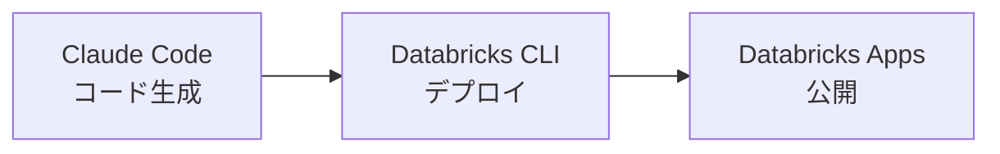
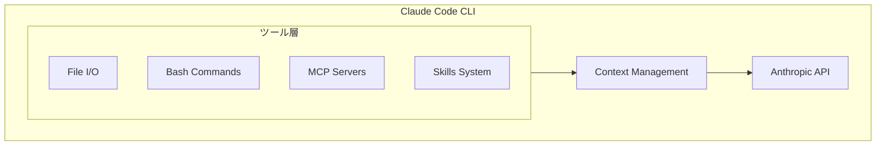
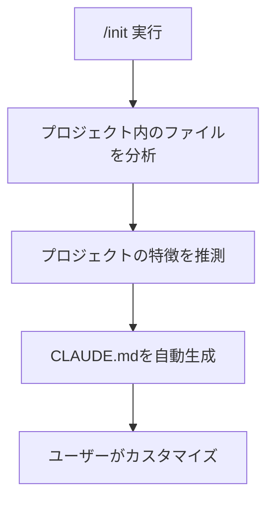

# はじめに

この記事では、Anthropicのターミナルベースエージェント「[Claude Code](https://docs.anthropic.com/ja/docs/claude-code/overview)」を使って[Databricks Apps](https://docs.databricks.com/ja/dev-tools/databricks-apps/index.html)を開発する方法を解説します。

AIコーディングアシスタントは数多くありますが、Claude Codeは「チャットボット」ではなく「エージェント」として動作する点が特徴です。ファイルの読み書き、コマンド実行、複数ファイルにまたがる変更を自律的に行います。

## 開発フローの全体像



| ツール | 役割 |
|--------|------|
| **[Claude Code](https://docs.anthropic.com/ja/docs/claude-code/overview)** | 自然言語でコード生成・修正。app.py、app.yaml、requirements.txtなどを作成 |
| **[Databricks CLI](https://docs.databricks.com/ja/dev-tools/cli/index.html)** | ローカルテスト(`apps run-local`)とデプロイ(`bundle deploy`) |
| **[Databricks Apps](https://docs.databricks.com/ja/dev-tools/databricks-apps/index.html)** | 生成したアプリをホスティング・公開 |

Claude CodeはDatabricks CLIを直接実行できるため、「このアプリをデプロイして」と指示するだけでデプロイまで完了します。

**この記事で学べること**:
- 環境セットアップ(Claude Code、Databricks CLI)
- Claude Codeの基本操作とベストプラクティス
- CLAUDE.mdによるプロジェクト固有知識の管理
- Databricks Appsとの連携パターン
- app.yaml作成時の注意点

**対象読者**:
- Databricks開発経験者
- AIコーディングツールに興味のあるエンジニア

# 環境セットアップ

## 前提条件

- Node.js 18以上
- Python 3.10以上
- Git
- Databricksワークスペースへのアクセス

## Claude Codeのインストール

```bash
# Claude Code CLIのインストール
npm install -g @anthropic-ai/claude-code

# バージョン確認
claude --version
```

:::note info
Windowsでのインストール手順は[こちら](https://qiita.com/taka_yayoi/items/30e1a72cd3d16622e89f)をご覧ください。
:::


## [Databricks CLI](https://docs.databricks.com/ja/dev-tools/cli/index.html)のインストール

```bash
# pipでインストール
pip install databricks-cli

# または brew(Mac)
brew tap databricks/tap
brew install databricks

# バージョン確認(0.250.0以上が必要)
databricks --version
```

:::note warn
Databricks Apps対応には**CLIバージョン0.250.0以上**が必要です。
:::

:::note info
Windowsでのインストール手順は[こちら](https://qiita.com/taka_yayoi/items/3992c0a491021f0a4369)をご覧ください。
:::

## Databricks CLI認証設定

**方法1: OAuth認証(推奨)**

```bash
databricks auth login --host https://<workspace>.cloud.databricks.com
```

**方法2: 設定ファイル**

`~/.databrickscfg`に設定:

```ini
[DEFAULT]
host = https://<workspace>.cloud.databricks.com
token = <your-token>
```

複数のワークスペースを使い分ける場合は、[プロファイル](https://docs.databricks.com/ja/dev-tools/cli/profiles.html)を定義:

```ini
[DEFAULT]
host = https://workspace1.cloud.databricks.com
token = <token1>

[dev]
host = https://workspace2.cloud.databricks.com
token = <token2>
```

プロファイルを指定してコマンドを実行:

```bash
databricks --profile dev clusters list
```

**動作確認**:

```bash
databricks clusters list
```

## Claude CodeをDatabricks経由で利用する

ワークショップではDatabricks Model Serving経由でClaudeを利用します。これにより、Anthropicアカウント不要でClaude Codeを利用できます。

**設定手順**:

1. Databricksワークスペースで「サービングエンドポイント」を開く
2. 「Integrate coding agents」をクリック
3. 「Other Integrations」タブで「Claude Code」を選択
4. 使用するモデルを選択(Opus/Sonnet)
5. 「APIキーを生成」をクリック
6. 生成されたsettings.jsonを `~/.claude/settings.json` に保存


**生成されるsettings.json**:

```json
{
  "env": {
    "ANTHROPIC_MODEL": "databricks-claude-opus-4-5",
    "ANTHROPIC_BASE_URL": "https://<workspace>.cloud.databricks.com/serving-endpoints/anthropic",
    "ANTHROPIC_AUTH_TOKEN": "dapi...",
    "ANTHROPIC_DEFAULT_OPUS_MODEL": "databricks-claude-opus-4-5",
    "ANTHROPIC_DEFAULT_SONNET_MODEL": "databricks-claude-sonnet-4-5",
    "ANTHROPIC_CUSTOM_HEADERS": "x-databricks-use-coding-agent-mode: true"
  }
}
```

**メリット**:
- Anthropicアカウント不要(Databricksワークスペースで完結)
- 企業のセキュリティポリシーに準拠
- コスト管理とガバナンスの統合

## 起動確認

```bash
# プロジェクトディレクトリで起動
cd your-project
claude
```

`/status`で接続状態を確認:

```
/status
```

`databricks-claude-xxx`と表示されれば設定完了です。


# Claude Codeとは

## 概要

Claude Codeは、Anthropicが開発したターミナルベースのエージェント型コーディングツールです。

**主な特徴**:

| 特徴 | 説明 |
|------|------|
| ターミナル統合 | プロジェクトディレクトリ内で直接動作し、ファイルの読み書き、コマンド実行が可能 |
| マルチファイル編集 | コードベース全体を理解し、複数ファイルにまたがる変更を実行 |
| 自律的な問題解決 | ユーザーの指示に基づき、探索・計画・実装を自律的に遂行 |
| MCP対応 | [Model Context Protocol](https://modelcontextprotocol.io/)で外部ツールやデータソースと連携 |

**利用可能なモデル**:
- Claude Sonnet 4.5: 高速かつ効率的な日常的タスク向け
- Claude Opus 4.5: 複雑な推論や大規模プロジェクト向け

## アーキテクチャ



# 基本操作

## CLIオプション

Claude Codeの起動時オプションを理解することは、効率的な開発の基盤です。

| オプション | 説明 | 使用例 |
|-----------|------|--------|
| `-c`, `--continue` | 直前のセッションを継続 | `claude -c` |
| `-r`, `--resume` | 特定のセッションを再開(ID指定) | `claude -r abc123` |
| `-p`, `--print` | ヘッドレスモード(応答のみ出力) | `claude -p "ファイル数を数えて"` |
| `--model` | 使用モデルを指定 | `claude --model sonnet` |
| `--add-dir` | 追加ディレクトリを参照可能にする | `claude --add-dir ../shared-lib` |

**使い分けのポイント**:

| シナリオ | 推奨オプション |
|---------|---------------|
| `/exit`後に同じ作業を継続したい | `claude -c` |
| 昨日の会話を再開したい | `claude -r` または `/resume` |
| スクリプトからClaude Codeを呼び出したい | `claude -p "プロンプト"` |
| 複数プロジェクトをまたいで作業したい | `claude --add-dir ../other-project` |

```bash
# 基本的な起動
claude

# 前の会話を継続して起動
claude -c

# 直接プロンプトを渡して起動
claude "このプロジェクトの構造を説明して"

# パイプ入力
cat error.log | claude "このエラーを分析して"
```

:::note info
`/exit`でClaude Codeを終了した後、`claude -c`で直前のセッションを継続できます。コンテキストが引き継がれるため、再度説明する必要がありません。
:::

## スラッシュコマンド

セッション中に使用するコマンドです。

| コマンド | 説明 |
|---------|------|
| `/init` | CLAUDE.mdファイルを生成 |
| `/context` | コンテキスト使用量を表示 |
| `/clear` | コンテキストをクリアして新規セッション開始 |
| `/compact` | 会話履歴を要約して圧縮 |
| `/status` | 接続状態とモデル情報を表示 |
| `/permissions` | 許可設定の管理 |
| `/mcp` | MCPサーバーの管理 |
| `/resume` | 過去の会話を再開 |
| `/model` | 使用するモデルを切り替え |


# CLAUDE.mdの活用

## なぜCLAUDE.mdが必要か

CLAUDE.mdは、Claude Codeがセッション開始時に自動的に読み込む特別なファイルです。「プロジェクトの取扱説明書」として機能します。

| 目的 | 説明 |
|------|------|
| **繰り返しの説明を避ける** | 毎回「これはDatabricks Appsプロジェクトで...」と説明する必要がなくなる |
| **一貫した出力品質** | コーディング規約やフレームワーク選択が統一される |
| **コンテキストの節約** | 会話中に長々と説明する代わりに、事前に定義しておける |
| **チーム共有** | 全員が同じ前提知識でClaude Codeを使える |

CLAUDE.mdがないと、Claude Codeは毎回「白紙の状態」からプロジェクトを理解しようとします。

## 作成方法

**新規プロジェクトの場合**:

```bash
# 1. プロジェクトディレクトリを作成
mkdir my-databricks-app && cd my-databricks-app

# 2. Claude Codeを起動
claude

# 3. /initでCLAUDE.mdを自動生成
/init
```

`/init`を実行すると、Claude Codeは以下の処理を行います:



:::note warn
`/init`が生成するCLAUDE.mdは「出発点」です。自動生成された内容をそのまま使うのではなく、プロジェクト固有の知識や規約を追記してカスタマイズしましょう。
:::

**既存プロジェクトの場合**:

```
このプロジェクトの構造を分析して、CLAUDE.mdを作成して。
以下の点を含めて:
- 技術スタック
- ディレクトリ構造
- 開発コマンド
- コーディング規約(既存コードから推測)
```

## 配置場所

CLAUDE.mdは複数の場所に配置でき、それぞれ異なる用途があります。

| 配置場所 | 用途 | 読み込みタイミング |
|---------|------|------------------|
| **プロジェクトルート** (`./CLAUDE.md`) | プロジェクト固有の設定 | 常に読み込まれる |
| **親ディレクトリ** | モノレポでの共通設定 | `claude`実行時に自動で読み込まれる |
| **ホームディレクトリ** (`~/.claude/CLAUDE.md`) | 全プロジェクト共通の個人設定 | 常に読み込まれる |

**モノレポでの例**:

```
my-monorepo/
├── CLAUDE.md                    # 全サブプロジェクト共通の設定
├── frontend/
│   ├── CLAUDE.md                # フロントエンド固有の設定
│   └── src/
└── backend/
    ├── CLAUDE.md                # バックエンド固有の設定
    └── src/
```

## 推奨する記載内容

```markdown
# プロジェクト概要
Databricks Apps上で動作するデータ分析ダッシュボード

# 技術スタック
- Python 3.11
- Streamlit
- Databricks SDK
- Unity Catalog

# 開発コマンド
- `databricks apps run-local --prepare-environment`: ローカル実行
- `databricks bundle deploy`: デプロイ

# コーディング規約
- 型ヒントを必ず使用
- docstringはGoogle形式

# Databricks固有の注意事項
- Unity Catalogのカタログ名: `samples`
- 認証: Databricks SDKの自動認証を使用

# よくあるエラーと対処法
- app.yamlのcommandは文字列ではなくリスト形式で記述
- envはname/valueペアのリストで記述
```

## メンテナンスとチューニング

CLAUDE.mdはプロンプトの一部です。プロンプトエンジニアリングと同様に、反復的に改善します。

| チューニング手法 | 説明 |
|-----------------|------|
| **強調の追加** | 重要な指示には「IMPORTANT」「YOU MUST」を付ける |
| **具体例の追加** | 抽象的な指示より具体的なコード例が効果的 |
| **不要な情報の削除** | 長すぎるCLAUDE.mdはノイズになる(目安: 200行以内) |

# 効果的なプロンプティング

## Explore → Plan → Code → Commit ワークフロー

[Anthropic公式のベストプラクティス](https://www.anthropic.com/engineering/claude-code-best-practices)に基づく推奨ワークフローです。

**Step 1: Explore(探索)**

```
@src/auth.py と @tests/test_auth.py を読んで、現在の認証処理の仕組みを理解して。
まだコードは書かないで。
```

**ポイント**: 
- 最初にコードを書かせない(「まだコードは書かないで」と明示)
- 複雑な問題では特に重要

**Step 2: Plan(計画)**

```
OAuth認証を追加したい。think hardして、
どのファイルを変更する必要があるか詳細な実装計画を作成して。
コードはまだ書かないで。
```

**Step 3: Code(実装)**

```
計画に従って実装して。変更ごとに差分を見せて。
```

**Step 4: Commit(コミット)**

```
変更内容を確認して、適切なコミットメッセージを提案して。
```

## Extended Thinking

複雑な問題に取り組む際は、Extended Thinkingを有効にします。

| バージョン | トグル方法 |
|-----------|-----------|
| v2.0.x | `Tab` |
| v2.1.x以降 | `meta+t`(macOS: `Option+T`、Windows/Linux: `Alt+T`) |

**強調フレーズの効果**:

| フレーズ | 効果 |
|---------|------|
| `think` | 基本的な思考を促す |
| `think hard` | より深い分析を促す |
| `think harder` / `ultrathink` | 最も深い思考を促す |

## 具体的なプロンプトの重要性

曖昧な指示は曖昧な結果を生みます。

| ❌ 悪い例 | ✅ 良い例 |
|----------|----------|
| `テストを追加して` | `app.pyのテストを追加して。Warehouse接続エラーのケースをカバー。モックは使わないで` |
| `エラーを直して` | `このエラーを見て。@app.py の42行目が原因だと思う。CLAUDE.mdのセキュリティルールに従って修正して` |
| `UIを改善して` | `@app.py のサイドバーにテーブル検索機能を追加して。既存のst.selectboxパターンに合わせて実装して` |

# Databricks連携

## Databricks CLIコマンド

Databricks Apps開発で頻繁に使うCLIコマンドです。

| コマンド | 説明 | 用途 |
|---------|------|------|
| [`apps run-local`](https://docs.databricks.com/ja/dev-tools/databricks-apps/app-development.html#run-your-app-locally) | ローカル環境でアプリを実行 | 開発・テスト |
| `bundle deploy` | [Bundles](https://docs.databricks.com/ja/dev-tools/bundles/index.html)を使ってアプリをデプロイ | 本番デプロイ |
| `apps describe` | アプリの状態を確認 | デプロイ後の確認 |
| `apps logs` | アプリのログを表示 | デバッグ時 |

**`run-local`の主要オプション**:

| オプション | 説明 |
|-----------|------|
| `--prepare-environment` | requirements.txtから依存関係を自動インストール(初回推奨) |
| `--env KEY=VALUE` | 環境変数を渡す(valueFromの代替) |
| `--debug` | デバッグモードで詳細ログを表示 |

# [app.yaml](https://docs.databricks.com/ja/dev-tools/databricks-apps/configuration.html)の正しい記述方法

app.yamlはDatabricks Appsの実行設定を定義する重要なファイルです。記述ミスはアプリケーションの起動失敗に直結します。

## 基本構造

```yaml
command: ['streamlit', 'run', 'app.py']
env:
  - name: 'DATABRICKS_WAREHOUSE_ID'
    valueFrom: sql-warehouse
```

## よくある間違いと対策

### ❌ 間違い1: commandの形式エラー

```yaml
# 間違い: 文字列として記述
command: "streamlit run app.py"

# 正解: リスト形式で記述
command: ['streamlit', 'run', 'app.py']
```

### ❌ 間違い2: 環境変数の形式エラー

```yaml
# 間違い: 辞書形式
env:
  DATABRICKS_WAREHOUSE_ID: 'value'

# 正解: name/valueペアのリスト
env:
  - name: 'DATABRICKS_WAREHOUSE_ID'
    value: 'value'
```

### ❌ 間違い3: ポート/アドレス指定

```yaml
# 間違い: ポート/アドレスを指定
command: ['streamlit', 'run', 'app.py', '--server.port=8000']

# 正解: ポート/アドレス指定なし(自動設定される)
command: ['streamlit', 'run', 'app.py']
```

:::note alert
Databricks Apps環境では`STREAMLIT_SERVER_PORT`と`STREAMLIT_SERVER_ADDRESS`が自動設定されます。app.yamlでのオーバーライドは禁止です。
:::

## フレームワーク別の設定例

**Streamlit**:

```yaml
command: ['streamlit', 'run', 'app.py']
env:
  - name: 'DATABRICKS_WAREHOUSE_ID'
    valueFrom: sql-warehouse
```

**Gradio**:

```yaml
command: ['python', 'app.py']
```

## 認証とセキュリティ

**避けるべきパターン**:

```python
# ❌ ハードコードされた認証情報
token = "dapi_xxxxxxxxxxxxx"
```

**推奨パターン**:

```python
# ✅ [Databricks SDK](https://docs.databricks.com/ja/dev-tools/sdk-python.html)の自動認証を使用
from databricks.sdk import WorkspaceClient
w = WorkspaceClient()  # 環境から自動的に認証情報を取得
```

## よくあるエラーと対処法

| エラー | 原因 | 対処法 |
|-------|------|--------|
| `ModuleNotFoundError` | 依存関係の不足 | requirements.txtを確認 |
| `valueFrom property and can't be resolved locally` | valueFromはローカルで解決不可 | `--env KEY=VALUE`で渡す |
| `YAML parse error` | YAML構文エラー | インデントと形式を確認 |
| アプリが起動しない(デプロイ後) | ポート/アドレス指定 | `--server.port`等を削除 |

# [Skills](https://github.com/anthropics/skills)システムの紹介

Skillsは、Claude Codeの機能を拡張するモジュラーな知識パッケージです。

## CLAUDE.mdとの違い

| 項目 | CLAUDE.md | Skills |
|------|-----------|--------|
| 読み込み | セッション開始時に常に読み込み | 必要なときだけ動的に読み込み |
| 用途 | プロジェクト全体の情報 | 特定タスクの専門知識 |
| サイズ | 軽量(200行以内推奨) | より詳細な情報も可 |
| 例 | コーディング規約、構造説明 | PDF生成手順、API仕様書 |

**使い分けの目安**:
- プロジェクト全体で常に必要な情報 → CLAUDE.md
- 特定のタスク時だけ必要な詳細情報 → Skills

## 活用例

- **検証スクリプトの自動実行**: app.yamlの構文チェックを自動化
- **APIドキュメントの参照**: Databricks REST APIの仕様を必要時に読み込み
- **テンプレート生成**: プロジェクトの雛形を標準化

# ハンズオン概要

実際にClaude Codeを使ってDatabricks Appsを開発するハンズオンの概要です。

**リポジトリ**: https://github.com/taka-yayoi/databricks-apps-workshop

## 全体像

| Phase | 時間 | 内容 | 習得スキル |
|-------|------|------|-----------|
| 1 | 15分 | セットアップ + 基本生成 | `/context`, `/status`, `@ファイル参照` |
| 2 | 15分 | 意図的エラー → 対話デバッグ | エラーを貼り付けて相談するフロー |
| 3 | 20分 | 反復的な機能追加(3回) | 差分確認、`/clear`、複数ファイル変更 |
| 4 | 5分 | CLAUDE.md更新 | 学んだことを蓄積する習慣 |
| 5 | 5分 | デプロイ | [Databricks Asset Bundles](https://docs.databricks.com/ja/dev-tools/bundles/index.html) |

## 作成するアプリ

[Unity Catalog](https://docs.databricks.com/ja/data-governance/unity-catalog/index.html)の`samples`カタログブラウザーを作成します。

- スキーマ/テーブルをサイドバーで選択
- テーブルデータをプレビュー
- [Streamlit](https://streamlit.io/) + [Databricks SQL Connector](https://docs.databricks.com/ja/dev-tools/python-sql-connector.html)


## 習得スキルまとめ

| スキル | コマンド/方法 |
|--------|--------------|
| セッション継続 | `claude -c` |
| コンテキスト確認 | `/context` |
| ファイル参照 | `@ファイル名` |
| コンテキストクリア | `/clear` |
| 中断・巻き戻し | `Esc`、`/rewind` |
| 対話的デバッグ | エラーを貼り付けて相談 |

:::note info
ハンズオンの詳細手順は[GitHubリポジトリ](https://github.com/taka-yayoi/databricks-apps-workshop/blob/main/handson_guide.md)を参照してください。
:::

# まとめ

Claude CodeとDatabricks Appsの組み合わせにより、以下のことが実現できます:

1. **CLAUDE.mdによる知識の蓄積**: プロジェクト固有のルールを一度定義すれば、チーム全員が一貫した品質でコードを生成できる

2. **対話的なデバッグ**: エラーメッセージを貼り付けて相談することで、効率的に問題を解決できる

3. **反復的な開発**: 小さな機能追加を繰り返すことで、着実にアプリを完成させられる

**次のステップ**:
- Skills作成: 自社プロジェクト用のカスタムSkillを作成
- MCP活用: チームで共有するMCPサーバー設定を標準化
- CI/CD統合: GitHub ActionsやAzure DevOpsとの連携

# 参考リンク

- [ハンズオンリポジトリ](https://github.com/taka-yayoi/databricks-apps-workshop)
- [Claude Code ドキュメント](https://docs.anthropic.com/ja/docs/claude-code/overview)
- [Claude Code ベストプラクティス](https://www.anthropic.com/engineering/claude-code-best-practices)
- [Databricks Apps ドキュメント](https://docs.databricks.com/ja/dev-tools/databricks-apps/index.html)
- [Databricks CLI ドキュメント](https://docs.databricks.com/ja/dev-tools/cli/index.html)
- [Databricks Asset Bundles](https://docs.databricks.com/ja/dev-tools/bundles/index.html)
- [Databricks MCP サーバー](https://docs.databricks.com/ja/generative-ai/mcp/index.html)

### はじめてのDatabricks

[はじめてのDatabricks](https://qiita.com/taka_yayoi/items/8dc72d083edb879a5e5d)

### Databricks無料トライアル

[Databricks無料トライアル](https://databricks.com/jp/try-databricks)
