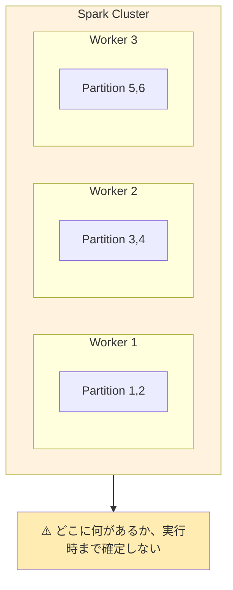
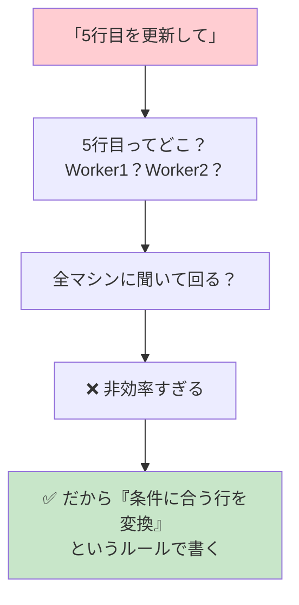
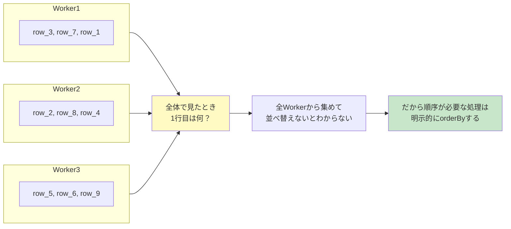
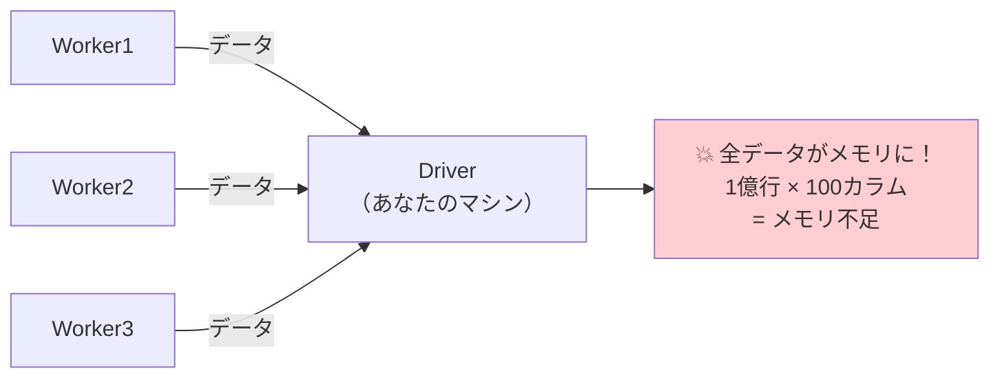
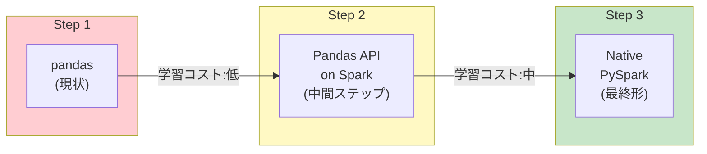

# はじめに

pandasでデータ分析をしてきた方がSparkに移行しようとすると、「なんか違う」という違和感を覚えることが多いと思います。同じPythonなのに、同じDataFrameという名前なのに、なぜかうまくいかない。

この記事では、API対応表ではなく「**なぜそうなっているか**」という設計思想の違いにフォーカスして、pandasユーザーがPySparkを使いこなすための思考法シフトを解説します。

## この記事で学べること

- pandasとPySparkの根本的な設計思想の違い
- pandas脳でやりがちなアンチパターンと正しいアプローチ
- pandasからPySparkへの段階的移行方法

## 対象読者

- pandasでデータ分析の経験がある
- Sparkを触り始めたが「コードが思うように動かない」と感じている
- 分散処理の概念をこれから学びたい

## 動作確認環境

この記事のコードはDatabricksで動作確認しています。記事末尾にダミーデータ生成用のセットアップコードがありますので、ご自身の環境で試す際にご活用ください。

---

# 1. 根本的な違い：シングルノード vs 分散処理

まず、pandasとSparkの根本的な違いを理解しましょう。

## pandasの世界観

pandasは1台のマシンのメモリに全データが載る前提で設計されています。


## Sparkの世界観

Sparkはデータが複数マシンに分散している前提で設計されています。



**この構造の違いが、すべてのAPI設計の違いの根源です。**

---

# 2. 思考法シフト①：「行」ではなく「変換」で考える

## pandasの思考：行単位でデータを操作する

```python
# pandas: 「この行を」「こう変える」
df.loc[0, 'status'] = 'processed'
df.at[5, 'score'] = df.at[5, 'score'] * 1.1

# 特定の行を取り出して処理
row = df.iloc[100]
result = complex_calculation(row)
```

## PySparkの思考：全体に適用する変換ルールを定義する

```python
from pyspark.sql.functions import col, when

# Spark: 「すべての行に対して」「このルールを適用」
sdf = sdf.withColumn('status', 
    when(col('id') == 0, 'processed').otherwise(col('status')))

sdf = sdf.withColumn('score',
    when(col('id') == 5, col('score') * 1.1).otherwise(col('score')))
```

## なぜこうなる？

特定の行がどのマシンにあるかわからないからです。



## 実践的な変換パターン

```python
# pandas: 条件に合う行を更新
df.loc[df['age'] > 60, 'category'] = 'senior'

# Spark: 同じことを変換ルールで表現
sdf = sdf.withColumn('category',
    when(col('age') > 60, 'senior').otherwise(col('category')))

# より複雑な条件分岐
sdf = sdf.withColumn('tier',
    when(col('score') >= 90, 'gold')
    .when(col('score') >= 70, 'silver')
    .when(col('score') >= 50, 'bronze')
    .otherwise('none'))
```

---

# 3. 思考法シフト②：「順序」への依存を捨てる

## pandasの思考：行には順序がある

```python
# pandas: インデックスと順序は信頼できる
first_row = df.iloc[0]
last_row = df.iloc[-1]
df['prev_value'] = df['value'].shift(1)  # 1行前の値
df['cumsum'] = df['value'].cumsum()       # 累積和
```

## PySparkの思考：順序は明示的に指定しないと存在しない

```python
from pyspark.sql.functions import lag, desc
from pyspark.sql.window import Window
from pyspark.sql import functions as F

# Spark: これはエラーまたは非推奨
# sdf.iloc[0]  ← そんなメソッドはない

# 「最初の行」が欲しいなら、何をもって「最初」かを定義する
first_row = sdf.orderBy('timestamp').limit(1)
last_row = sdf.orderBy(desc('timestamp')).limit(1)

# 「1行前の値」にはWindow関数が必要
window_spec = Window.orderBy('timestamp')
sdf = sdf.withColumn('prev_value', lag('value', 1).over(window_spec))
sdf = sdf.withColumn('cumsum', F.sum('value').over(
    window_spec.rowsBetween(Window.unboundedPreceding, 0)))
```

## なぜこうなる？

分散環境では「順序」が自明ではないからです。



## Window関数への変換早見表

pandasで何気なく使っていた操作の多くは、SparkではWindow関数が必要です。

| pandas | Spark |
|--------|-------|
| `df['col'].shift(1)` | `lag('col', 1).over(window)` |
| `df['col'].shift(-1)` | `lead('col', 1).over(window)` |
| `df['col'].cumsum()` | `sum('col').over(window.rowsBetween(...))` |
| `df.groupby('g')['v'].rank()` | `rank().over(Window.partitionBy('g').orderBy('v'))` |
| `df['col'].rolling(3).mean()` | `avg('col').over(window.rowsBetween(-2, 0))` |

---

# 4. 思考法シフト③：「ループ」を「カラム操作」に変換する

## pandasの思考：iterrowsで1行ずつ処理

```python
# pandas: ループで処理（実は非推奨だが多くの人がやる）
results = []
for idx, row in df.iterrows():
    if row['type'] == 'A':
        result = row['value'] * 2
    else:
        result = row['value'] + 10
    results.append(result)
df['result'] = results
```

## PySparkの思考：カラム単位の演算で表現

```python
# Spark: ループ禁止！カラム演算で書く
sdf = sdf.withColumn('result',
    when(col('type') == 'A', col('value') * 2)
    .otherwise(col('value') + 10))
```

## なぜループがダメなのか？

ループで`collect()`してDriverに全データを集めると、100万回のネットワーク往復が発生します。一方、カラム演算なら「このルールで変換して」という指示を1回送るだけで、各Workerが並列で一括処理します。

また、`withColumn()`をループで何度も呼び出すこと自体にも問題があります。[Apache Sparkパフォーマンスの改善方法](https://qiita.com/taka_yayoi/items/922441869c673f448164)で詳しく解説していますが、`withColumn()`のループで70カラムを追加すると3分かかった処理が、`select()`で一括処理すると41秒で完了し、179%のパフォーマンス改善が得られました。

## 複雑なロジックはUDFで（ただし最終手段）

```python
from pyspark.sql.functions import udf
from pyspark.sql.types import StringType

# どうしてもカラム演算で書けない複雑なロジック
def complex_logic(value, type_val):
    # 複雑な処理...
    return result

complex_udf = udf(complex_logic, StringType())
sdf = sdf.withColumn('result', complex_udf(col('value'), col('type')))
```

**UDFの注意点**:
- Catalystの最適化が効かない
- シリアライズ/デシリアライズのオーバーヘッド
- 可能な限りビルトイン関数で書く

---

# 5. 思考法シフト④：「結果の確認」コストを意識する

## pandasの思考：気軽にデータを見る

```python
# pandas: 実行は一瞬
print(df.head())
print(df.shape)
print(df.describe())
df  # Jupyter で表示
```

## PySparkの思考：表示するたびにジョブが走る

```python
# Spark: 毎回計算が走る可能性がある
sdf.show()      # ← ジョブ実行
sdf.count()     # ← またジョブ実行
sdf.describe().show()  # ← またジョブ実行
```

## 開発時のベストプラクティス

```python
# ❌ 悪い例: 確認のたびにフルスキャン
sdf = spark.read.parquet("/huge/data")  # 10億行
sdf.show()  # 全データスキャンの可能性
sdf.count()  # また全データスキャン

# ✅ 良い例: サンプルを作って開発
sdf_full = spark.read.parquet("/huge/data")
sdf_sample = sdf_full.sample(0.001).cache()  # 0.1%をキャッシュ
print(f"Sample size: {sdf_sample.count()}")

# 開発中はサンプルで動作確認
sdf_sample.show()
sdf_sample.groupBy('category').count().show()

# 本番はフルデータで実行
result = sdf_full.groupBy('category').count()
result.write.parquet("/output")
```

---

# 6. 思考法シフト⑤：「イミュータブル」を受け入れる

## pandasの思考：DataFrameを直接変更

```python
# pandas: 元のdfが変わる（inplace）
df.drop('col', axis=1, inplace=True)
df.fillna(0, inplace=True)
df['new'] = df['old'] * 2  # 元のdfに列追加
```

## PySparkの思考：常に新しいDataFrameが返る

```python
# Spark: 元のsdfは変わらない、新しいsdfが返る
sdf2 = sdf.drop('col')           # sdfはそのまま
sdf3 = sdf2.fillna(0)            # sdf2もそのまま
sdf4 = sdf3.withColumn('new', col('old') * 2)

# 同じ変数名で受けることが多い
sdf = sdf.drop('col')
sdf = sdf.fillna(0)
sdf = sdf.withColumn('new', col('old') * 2)

# メソッドチェーンで書くのが一般的
sdf_result = (
    sdf
    .drop('col')
    .fillna(0)
    .withColumn('new', col('old') * 2)
)
```

## なぜイミュータブル？

遅延評価と最適化のためです。Sparkは変換処理をその場で実行せず、`show()`や`write()`などのアクションが呼ばれた時点で、それまでの変換計画全体を最適化してから実行します。イミュータブルな設計により、この最適化が可能になっています。

---

# 7. 思考法シフト⑥：「collect」の危険性を理解する

## pandasの思考：リストや配列に変換して処理

```python
# pandas: 普通にやる
values = df['col'].tolist()
unique_values = df['col'].unique()
result = [process(v) for v in values]
```

## PySparkの思考：collectは最終手段

```python
# Spark: これが危険な理由を理解する
values = sdf.select('col').collect()  # ← 全データがDriverに集まる！

# 1億行のデータでcollectすると...
# Driver のメモリが溢れてクラッシュ
```



## 安全な代替手段

```python
# ユニーク値を取得したい
# ❌ 危険
unique = sdf.select('category').distinct().collect()

# ✅ 安全: 件数が少ないことを確認してから
distinct_count = sdf.select('category').distinct().count()
print(f"Distinct values: {distinct_count}")
if distinct_count < 1000:  # 安全な件数なら
    unique = sdf.select('category').distinct().collect()

# ✅ より安全: toPandas()でサイズ制限付き
sdf_small = sdf.select('category').distinct().limit(1000)
pdf = sdf_small.toPandas()  # pandasに変換
```

---

# 8. 思考法シフト早見表

| pandas的発想 | PySpark的発想 |
|-------------|---------------|
| 行をループで処理 | カラム演算で一括変換 |
| インデックスで行アクセス | 条件フィルタで行を特定 |
| 順序は自明 | orderByで明示的に指定 |
| shift/cumsum | Window関数を使う |
| inplaceで変更 | 新しいDFを作成（イミュータブル） |
| 気軽にhead/shape | show/countもジョブ実行 |
| tolist/collectで変換 | 可能な限りSpark内で完結 |
| 1台で完結 | 分散を意識した設計 |

---

# 9. pandas脳でやりがちなアンチパターン集

## アンチパターン①：ループで行を処理する

**やりがちなコード**:
```python
# ❌ pandas脳: collectしてループ
rows = sdf.collect()
results = []
for row in rows:
    if row['status'] == 'active':
        results.append(row['id'])
```

**なぜダメか**:
- `collect()`で全データがDriverに集中 → メモリ溢れ
- ループ処理は並列性ゼロ → 分散の意味がない

**正しいアプローチ**:
```python
# ✅ カラム演算で完結させる
result = sdf.filter(col('status') == 'active').select('id')
```

## アンチパターン②：中間結果を何度も再計算

**やりがちなコード**:
```python
# ❌ pandas脳: 変数に入れたら保持されると思っている
sdf_filtered = sdf.filter(col('date') >= '2024-01-01')
sdf_aggregated = sdf_filtered.groupBy('category').agg(F.sum('amount'))

# 複数回使う
print(sdf_aggregated.count())          # ← 計算実行
sdf_aggregated.show()                   # ← また最初から計算！
sdf_aggregated.write.parquet('/output') # ← さらにまた計算！
```

**なぜダメか**:
- Sparkは遅延評価 → 変数に入れても計算結果は保持されない
- Actionのたびに最初から再計算 → 3倍の時間がかかる

**正しいアプローチ**:
```python
# ✅ 再利用するならcache/persist
sdf_aggregated = (
    sdf.filter(col('date') >= '2024-01-01')
    .groupBy('category').agg(F.sum('amount'))
)
sdf_aggregated.cache()  # メモリにキャッシュ

# 1回目で計算してキャッシュ
print(sdf_aggregated.count())

# 2回目以降はキャッシュから読む
sdf_aggregated.show()
sdf_aggregated.write.parquet('/output')

# 使い終わったら解放
sdf_aggregated.unpersist()
```

## アンチパターン③：小さなDataFrameを何度もjoin

**やりがちなコード**:
```python
# ❌ pandas脳: マスタをループで結合
master_list = ['A', 'B', 'C', 'D', 'E']

for code in master_list:
    master_sdf = spark.read.parquet(f'/master/{code}')
    sdf = sdf.join(master_sdf, 'key')  # 5回joinが走る
```

**なぜダメか**:
- joinのたびにシャッフルが発生 → ネットワーク負荷大
- 小さいDFでもブロードキャストされない可能性

**正しいアプローチ**:
```python
from functools import reduce
from pyspark.sql.functions import broadcast

# ✅ マスタを一括で読んでからjoin
master_sdf = reduce(
    lambda a, b: a.union(b),
    [spark.read.parquet(f'/master/{code}') for code in master_list]
)

# 小さいDFはブロードキャストヒントを付ける
sdf = sdf.join(broadcast(master_sdf), 'key')
```

## アンチパターン④：UDFの乱用

**やりがちなコード**:
```python
# ❌ pandas脳: 慣れた関数をそのままUDF化
import pandas as pd
from pyspark.sql.functions import udf
from pyspark.sql.types import IntegerType

def calculate_age(birth_date):
    today = pd.Timestamp.today()
    return (today - birth_date).days // 365

age_udf = udf(calculate_age, IntegerType())
sdf = sdf.withColumn('age', age_udf(col('birth_date')))
```

**なぜダメか**:
- Python UDFはJVM-Python間のシリアライズが発生 → 遅い
- Catalystの最適化が効かない

**正しいアプローチ**:
```python
from pyspark.sql.functions import datediff, current_date, floor

# ✅ ビルトイン関数で書く（10倍以上速い）
sdf = sdf.withColumn('age', 
    floor(datediff(current_date(), col('birth_date')) / 365))

# どうしてもUDFが必要なら Pandas UDF（vectorized）を使う
from pyspark.sql.functions import pandas_udf
import pandas as pd

@pandas_udf(IntegerType())
def calculate_age_vectorized(birth_date: pd.Series) -> pd.Series:
    today = pd.Timestamp.today()
    return ((today - birth_date).dt.days // 365).astype(int)

sdf = sdf.withColumn('age', calculate_age_vectorized(col('birth_date')))
```

## アンチパターン⑤：不要なカラムを引きずる

**やりがちなコード**:
```python
# ❌ pandas脳: 最後に必要なカラムだけ選べばいいと思っている
sdf = spark.read.parquet('/data')  # 100カラム
sdf = sdf.filter(col('status') == 'active')
sdf = sdf.join(other_sdf, 'key')  # 100カラム × 2 のjoin
sdf = sdf.groupBy('category').agg(F.sum('amount'))
sdf = sdf.select('category', 'sum(amount)')  # 最後に2カラムだけ
```

**なぜダメか**:
- joinで不要なカラムもシャッフル → ネットワーク帯域の無駄
- メモリ使用量が増大

:::note info
**補足**: Spark 3.x以降、CatalystオプティマイザーのColumn Pruningにより、最終的に必要なカラムだけを読み込むよう自動最適化されます。特にParquetなどカラムナーフォーマットでは効果的です。ただし、join/groupByなどのシャッフル時のネットワーク転送量や、`cache()`時のメモリ使用量には依然として影響するため、大規模データでは早めの`select()`が有効です。
:::


**正しいアプローチ**:
```python
# ✅ 早い段階で必要なカラムだけに絞る
sdf = (
    spark.read.parquet('/data')
    .select('key', 'status', 'category', 'amount')  # 最初に絞る
)
sdf = sdf.filter(col('status') == 'active')

other_sdf_slim = other_sdf.select('key', 'other_needed_col')  # joinする方も絞る
sdf = sdf.join(other_sdf_slim, 'key')

sdf = sdf.groupBy('category').agg(F.sum('amount'))
```

## アンチパターン⑥：groupByの後にcollectしてpandas処理

**やりがちなコード**:
```python
# ❌ pandas脳: 集計結果をpandasで後処理
grouped = sdf.groupBy('category').agg(
    F.sum('amount').alias('total'),
    F.count('*').alias('cnt')
).collect()

# pandasに変換して後処理
pdf = pd.DataFrame(grouped)
pdf['avg'] = pdf['total'] / pdf['cnt']
pdf['rank'] = pdf['total'].rank(ascending=False)
```

**なぜダメか**:
- せっかくSparkで並列処理したのにDriverに集めている
- groupByの結果が大きいとメモリ溢れ

**正しいアプローチ**:
```python
from pyspark.sql.functions import rank
from pyspark.sql.window import Window

# ✅ Spark内で完結させる
window_spec = Window.orderBy(F.desc('total'))

sdf_result = (
    sdf.groupBy('category')
    .agg(
        F.sum('amount').alias('total'),
        F.count('*').alias('cnt')
    )
    .withColumn('avg', col('total') / col('cnt'))
    .withColumn('rank', rank().over(window_spec))
)
```

## アンチパターン⑦：スキーマ推論に頼りすぎる

**やりがちなコード**:
```python
# ❌ pandas脳: 型は自動で判定されると思っている
sdf = spark.read.option('inferSchema', True).csv('/data.csv')

# 問題: 
# - 推論のために全データスキャンが必要 → 遅い
# - 推論結果が期待と違うことがある
# - ファイルによって型が変わる可能性
```

**正しいアプローチ**:
```python
from pyspark.sql.types import StructType, StructField, StringType, IntegerType, DoubleType

# ✅ スキーマを明示的に定義
schema = StructType([
    StructField('id', IntegerType(), False),
    StructField('name', StringType(), True),
    StructField('amount', DoubleType(), True),
    StructField('date', StringType(), True)
])

sdf = spark.read.schema(schema).csv('/data.csv')

# または DDL形式で簡潔に
sdf = spark.read.schema('id INT, name STRING, amount DOUBLE, date STRING').csv('/data.csv')
```

## アンチパターン早見表

| アンチパターン | 症状 | 解決策 |
|--------------|------|--------|
| collectしてループ | OOM、処理が遅い | カラム演算で完結 |
| キャッシュ忘れ | 同じ処理が何度も実行 | cache()で保持 |
| 小さなDFを何度もjoin | シャッフル多発 | broadcast、union後に一括join |
| Python UDF乱用 | 処理が10倍遅い | ビルトイン関数、Pandas UDF |
| カラム削減が遅い | join/シャッフルが重い | 早めにselectで絞る |
| Spark外に持ち出す | Driverがボトルネック | Spark内で処理完結 |
| スキーマ推論 | 読み込みが遅い、型エラー | スキーマ明示定義 |

---

# 10. 段階的移行ガイド：pandas → PySpark

## 移行戦略の全体像



## Step 1：現状把握 - pandas コードの分析

移行前に現状のpandasコードを分析します。

```python
# 移行対象のpandasコード例
import pandas as pd

def process_sales_data():
    # データ読み込み
    df = pd.read_csv('sales.csv')
    
    # 前処理
    df['date'] = pd.to_datetime(df['date'])
    df = df.dropna(subset=['amount'])
    df['year_month'] = df['date'].dt.to_period('M')
    
    # 集計
    monthly = df.groupby(['year_month', 'category']).agg({
        'amount': 'sum',
        'quantity': 'sum',
        'order_id': 'nunique'
    }).reset_index()
    
    # ランキング
    monthly['rank'] = monthly.groupby('year_month')['amount'].rank(ascending=False)
    
    # フィルタ
    top_categories = monthly[monthly['rank'] <= 5]
    
    return top_categories
```

**移行前チェックリスト**:

| 確認項目 | チェック内容 |
|---------|-------------|
| データサイズ | 数GB以上ならSpark向き |
| ループ処理 | あればカラム演算に変換が必要 |
| インデックス依存 | あれば代替手段を検討 |
| 時系列処理 | Window関数への変換が必要 |
| 外部ライブラリ | UDF化の検討が必要 |

## Step 2：Pandas API on Spark で移行開始

Pandas API on Sparkを使えば、pandasのAPIをそのまま使いながら裏側でSparkが分散処理を行います。

**環境セットアップ**:
```python
# Databricks / Spark 3.2+ では標準搭載
import pyspark.pandas as ps

# 設定
ps.set_option('compute.default_index_type', 'distributed')
```

**移行コード（最小限の変更）**:
```python
import pyspark.pandas as ps

def process_sales_data_ps():
    # 変更点: pd → ps
    df = ps.read_csv('sales.csv')
    
    # ほぼそのまま動く
    df['date'] = ps.to_datetime(df['date'])
    df = df.dropna(subset=['amount'])
    
    # 注意: to_period は未サポート → 代替手段
    df['year_month'] = df['date'].dt.strftime('%Y-%m')
    
    # 集計（ほぼ同じ）
    monthly = df.groupby(['year_month', 'category']).agg({
        'amount': 'sum',
        'quantity': 'sum',
        'order_id': 'nunique'
    }).reset_index()
    
    # ランキング（動くが内部でSpark処理）
    monthly['rank'] = monthly.groupby('year_month')['amount'].rank(ascending=False)
    
    # フィルタ
    top_categories = monthly[monthly['rank'] <= 5]
    
    return top_categories
```

**Pandas API on Sparkの制約と対処**:

| pandas機能 | Pandas API on Spark | 対処法 |
|-----------|---------------------|--------|
| `to_period()` | 未サポート | `strftime`で代替 |
| `iloc[n]` | 非効率 | `head(n)`で代替 |
| `iterrows()` | 未サポート | `apply`で代替 |
| `inplace=True` | 部分サポート | 戻り値を受ける |
| MultiIndex | 制限あり | `reset_index()`推奨 |

**相互変換**:
```python
# Pandas API on Spark ↔ Native PySpark の変換
ps_df = ps.DataFrame(...)

# Pandas API on Spark → Native PySpark
spark_df = ps_df.to_spark()

# Native PySpark → Pandas API on Spark
ps_df = spark_df.pandas_api()

# Pandas API on Spark → pandas（小さいデータのみ）
pd_df = ps_df.to_pandas()
```

## Step 3：Native PySparkへの段階的変換

パフォーマンスが重要な部分からNative PySparkに変換していきます。

**変換の優先順位**:

| 優先度 | 対象処理 |
|-------|---------|
| 高（効果大） | 大量データの読み込み、join処理、複雑な集計、繰り返し実行される処理 |
| 低（後回しでOK） | 単純なフィルタ、カラム追加、最終出力前の整形 |

**完全移行版コード**:
```python
from pyspark.sql import SparkSession
from pyspark.sql.functions import (
    col, to_date, date_format, desc
)
from pyspark.sql import functions as F
from pyspark.sql.window import Window

def process_sales_data_native(spark: SparkSession):
    # スキーマ定義付きで読み込み
    schema = 'order_id STRING, date STRING, category STRING, amount DOUBLE, quantity INT'
    sdf = spark.read.schema(schema).csv('sales.csv', header=True)
    
    # 前処理
    sdf = (
        sdf
        .withColumn('date', to_date(col('date')))
        .filter(col('amount').isNotNull())
        .withColumn('year_month', date_format(col('date'), 'yyyy-MM'))
    )
    
    # 集計
    monthly = (
        sdf
        .groupBy('year_month', 'category')
        .agg(
            F.sum('amount').alias('total_amount'),
            F.sum('quantity').alias('total_quantity'),
            F.countDistinct('order_id').alias('unique_orders')
        )
    )
    
    # ランキング（Window関数）
    window_spec = Window.partitionBy('year_month').orderBy(desc('total_amount'))
    monthly = monthly.withColumn('rank', F.rank().over(window_spec))
    
    # フィルタ
    top_categories = monthly.filter(col('rank') <= 5)
    
    return top_categories
```

## 移行パターン別早見表

| パターン | pandas | PySpark |
|---------|--------|---------|
| 複数ファイル結合 | `pd.concat([pd.read_csv(f) for f in files])` | `spark.read.csv('data/*.csv')` |
| 条件分岐更新 | `df.loc[df['score']>=80, 'tier']='gold'` | `sdf.withColumn('tier', when(...))` |
| 時系列シフト | `df.groupby('id')['v'].shift(1)` | `lag('v',1).over(Window.partitionBy('id').orderBy('date'))` |
| ピボット | `df.pivot_table(...)` | `sdf.groupBy(...).pivot(...).agg(...)` |

## 移行チェックリスト

- [ ] **Step 1: 現状分析**
  - [ ] データサイズの確認
  - [ ] pandas固有機能の洗い出し
  - [ ] パフォーマンス要件の確認
- [ ] **Step 2: Pandas API on Sparkで動作確認**
  - [ ] 基本的な読み込み・書き込み
  - [ ] 主要な変換処理
  - [ ] 集計処理
  - [ ] 未サポート機能の代替実装
- [ ] **Step 3: Native PySparkへの移行**
  - [ ] パフォーマンスクリティカルな処理から変換
  - [ ] スキーマの明示的定義
  - [ ] Window関数への置き換え
  - [ ] UDFの最小化
- [ ] **検証**
  - [ ] サンプルデータでの結果比較
  - [ ] 本番データでのパフォーマンス計測
  - [ ] エラーハンドリングの確認

---

# 11. まとめ：新しいメンタルモデル

pandasとPySparkでは、根本的なメンタルモデルが異なります。

**pandasのメンタルモデル**: 「手元にあるExcelシートを操作している」
- 全部見える
- 全部触れる
- 順番も明確

**PySparkのメンタルモデル**: 「100人のアシスタントにルールを伝えて作業を任せる」
- 個別の行は見えない
- 条件で行を指定して指示を出す
- 結果だけ受け取る

**この発想の転換ができれば、PySparkは怖くない。**

---

# 付録：動作確認用ダミーデータ生成

この記事のコードを実際に試すためのダミーデータ生成スクリプトです。以下の内容をpyファイルとして保存してDatabricksにインポートし、Databricksノートブックで実行してください。

```python
# Databricks notebook source

# COMMAND ----------
# MAGIC %md
# MAGIC # セットアップ：ダミーデータ生成
# MAGIC この記事のコードを試すためのダミーデータを生成します。

# COMMAND ----------

from pyspark.sql import SparkSession
from pyspark.sql.functions import (
    col, lit, rand, floor, concat, date_add, expr,
    to_date, when, array, element_at
)
from pyspark.sql.types import *
import random

# カタログとスキーマの設定（ご自身の環境に合わせて変更してください）
CATALOG = "main"
SCHEMA = "default"
BASE_PATH = f"/Volumes/{CATALOG}/{SCHEMA}/sample_data"

spark.sql(f"USE CATALOG {CATALOG}")
spark.sql(f"USE SCHEMA {SCHEMA}")

# COMMAND ----------
# MAGIC %md
# MAGIC ## 1. 売上データ（sales）の生成

# COMMAND ----------

# 売上データ生成
NUM_SALES_RECORDS = 1000000  # 100万件

categories = ['Electronics', 'Clothing', 'Food', 'Books', 'Sports', 'Home', 'Beauty', 'Toys']
statuses = ['active', 'inactive', 'pending']

sales_df = (
    spark.range(0, NUM_SALES_RECORDS)
    .withColumn('order_id', concat(lit('ORD-'), col('id').cast('string')))
    .withColumn('customer_id', (floor(rand() * 10000) + 1).cast('int'))
    .withColumn('category', element_at(
        array([lit(c) for c in categories]), 
        (floor(rand() * len(categories)) + 1).cast('int')
    ))
    .withColumn('amount', (rand() * 1000 + 10).cast('decimal(10,2)'))
    .withColumn('quantity', (floor(rand() * 10) + 1).cast('int'))
    .withColumn('date', date_add(lit('2023-01-01'), (rand() * 730).cast('int')))
    .withColumn('status', element_at(
        array([lit(s) for s in statuses]),
        (floor(rand() * len(statuses)) + 1).cast('int')
    ))
    .withColumn('score', (rand() * 100).cast('int'))
    .drop('id')
)

# Parquetとして保存
sales_df.write.mode('overwrite').parquet(f'{BASE_PATH}/sales')

# CSVとしても保存（記事のサンプルコード用）
sales_df.limit(100000).write.mode('overwrite').option('header', 'true').csv(f'{BASE_PATH}/sales_csv')

print(f"Sales data created: {sales_df.count()} records")
sales_df.show(5)

# COMMAND ----------
# MAGIC %md
# MAGIC ## 2. 顧客データ（customers）の生成

# COMMAND ----------

# 顧客データ生成
NUM_CUSTOMERS = 10000

countries = ['Japan', 'USA', 'UK', 'Germany', 'France', 'China', 'Korea', 'Australia']
tiers = ['gold', 'silver', 'bronze', 'none']

customers_df = (
    spark.range(1, NUM_CUSTOMERS + 1)
    .withColumn('customer_id', col('id').cast('int'))
    .withColumn('customer_name', concat(lit('Customer_'), col('id').cast('string')))
    .withColumn('country', element_at(
        array([lit(c) for c in countries]),
        (floor(rand() * len(countries)) + 1).cast('int')
    ))
    .withColumn('tier', element_at(
        array([lit(t) for t in tiers]),
        (floor(rand() * len(tiers)) + 1).cast('int')
    ))
    .withColumn('birth_date', date_add(lit('1960-01-01'), (rand() * 20000).cast('int')))
    .withColumn('registration_date', date_add(lit('2020-01-01'), (rand() * 1000).cast('int')))
    .drop('id')
)

customers_df.write.mode('overwrite').parquet(f'{BASE_PATH}/customers')
print(f"Customers data created: {customers_df.count()} records")
customers_df.show(5)

# COMMAND ----------
# MAGIC %md
# MAGIC ## 3. 時系列データ（timeseries）の生成

# COMMAND ----------

# 時系列データ生成（Window関数の練習用）
NUM_TIMESERIES = 100000

timeseries_df = (
    spark.range(0, NUM_TIMESERIES)
    .withColumn('sensor_id', (floor(col('id') / 1000) + 1).cast('int'))
    .withColumn('timestamp', expr("timestamp '2024-01-01 00:00:00' + make_interval(0, 0, 0, 0, 0, id)"))
    .withColumn('value', (rand() * 100 + 50 + (col('id') % 100) * 0.1).cast('decimal(10,2)'))
    .withColumn('type', when(col('id') % 2 == 0, 'A').otherwise('B'))
    .drop('id')
)

timeseries_df.write.mode('overwrite').parquet(f'{BASE_PATH}/timeseries')
print(f"Timeseries data created: {timeseries_df.count()} records")
timeseries_df.show(5)

# COMMAND ----------
# MAGIC %md
# MAGIC ## 4. ワイドテーブル（wide_table）の生成

# COMMAND ----------

# ワイドテーブル生成（Column Pruningの練習用）
NUM_WIDE_RECORDS = 100000
NUM_COLUMNS = 100

wide_df = spark.range(0, NUM_WIDE_RECORDS).withColumn('id', col('id').cast('int'))

for i in range(NUM_COLUMNS):
    wide_df = wide_df.withColumn(f'col_{i}', concat(lit(f'value_{i}_'), (rand() * 1000).cast('int').cast('string')))

wide_df.write.mode('overwrite').parquet(f'{BASE_PATH}/wide_table')
print(f"Wide table created: {wide_df.count()} records, {len(wide_df.columns)} columns")

# COMMAND ----------
# MAGIC %md
# MAGIC ## 5. マスタデータ（master）の生成

# COMMAND ----------

# マスタデータ生成（join練習用）
master_codes = ['A', 'B', 'C', 'D', 'E']

for code in master_codes:
    master_df = (
        spark.range(1, 101)
        .withColumn('key', col('id').cast('int'))
        .withColumn('master_code', lit(code))
        .withColumn('description', concat(lit(f'Description for {code}_'), col('id').cast('string')))
        .drop('id')
    )
    master_df.write.mode('overwrite').parquet(f'{BASE_PATH}/master/{code}')

print(f"Master data created for codes: {master_codes}")

# COMMAND ----------
# MAGIC %md
# MAGIC ## データ確認

# COMMAND ----------

# 生成されたデータの確認
print("=== Generated Data Summary ===\n")

datasets = [
    ('sales', f'{BASE_PATH}/sales'),
    ('customers', f'{BASE_PATH}/customers'),
    ('timeseries', f'{BASE_PATH}/timeseries'),
    ('wide_table', f'{BASE_PATH}/wide_table'),
]

for name, path in datasets:
    df = spark.read.parquet(path)
    print(f"{name}: {df.count():,} records, {len(df.columns)} columns")

print(f"\nMaster data: {len(master_codes)} code tables")
print(f"\nBase path: {BASE_PATH}")

# COMMAND ----------
# MAGIC %md
# MAGIC ## 使用例

# COMMAND ----------

# データの読み込み例
sales_sdf = spark.read.parquet(f'{BASE_PATH}/sales')
customers_sdf = spark.read.parquet(f'{BASE_PATH}/customers')
timeseries_sdf = spark.read.parquet(f'{BASE_PATH}/timeseries')

# 記事のコードを試す
print("=== Sales Data Sample ===")
sales_sdf.show(5)

print("\n=== Customers Data Sample ===")
customers_sdf.show(5)

print("\n=== Timeseries Data Sample ===")
timeseries_sdf.show(5)
```

---

# 参考リンク

- [Apache Sparkとは何か](https://qiita.com/taka_yayoi/items/31190da754106b2d284e)
- [DatabricksとSpark UIで学ぶSparkのパーティション](https://qiita.com/taka_yayoi/items/68ee7ba3d555f27c6978)
- [Apache Sparkパフォーマンスの改善方法: 避けるべき10の間違い](https://qiita.com/taka_yayoi/items/922441869c673f448164) - withColumnのループ問題など
- [Pandas API on Spark 公式ドキュメント](https://spark.apache.org/docs/latest/api/python/user_guide/pandas_on_spark/index.html)

---

最後までお読みいただきありがとうございました。この記事が皆さんのSpark学習の助けになれば幸いです。質問やフィードバックがあればコメントでお知らせください！

### はじめてのDatabricks

[はじめてのDatabricks](https://qiita.com/taka_yayoi/items/8dc72d083edb879a5e5d)

### Databricks無料トライアル

[Databricks無料トライアル](https://databricks.com/jp/try-databricks)
