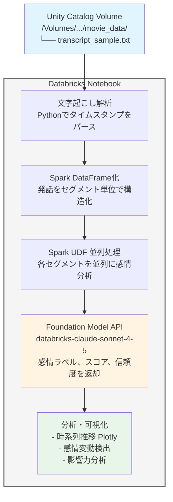

Zoomの文字起こしを分析するサンプルパイプラインを作ってみました。コードはこちら。

https://github.com/taka-yayoi/transcript_analysis

# はじめに

会議やインタビューの文字起こしデータから、「誰の発言が誰の感情にどう影響したか」を知りたいと思ったことはありませんか？

この記事では、DatabricksとClaude Sonnet 4.5を使って、文字起こしデータから感情分析を行い、発話者間の影響関係を可視化するパイプラインを構築します。

**Databricks固有の機能をフル活用することで、以下を実現しています：**

- **Spark UDFによる並列処理** で大量の発話を高速分析
- **Foundation Model API** でClaude Sonnet 4.5に簡単アクセス
- **Unity Catalog Volumes** でファイル管理を一元化
- **Notebookのインタラクティブ性** で試行錯誤しながら開発
- **Plotlyによる可視化** がそのままNotebook上で動作

# 完成イメージ

このパイプラインでは、以下のような分析が可能です：

## 1. 感情スコアの時系列推移
発話者ごとに色分けされた感情スコアの推移を可視化します。


## 2. 発話者別の感情分布
各発話者の感情がポジティブ/ネガティブ/中立にどう分布しているかを円グラフで表示します。


## 3. 感情変動の原因分析
急激な感情変化を検出し、その原因となった発話を特定します。


# システム構成



# なぜDatabricksなのか？

## 1. Spark UDFによる高速並列処理

文字起こしデータは発話数が多くなると処理時間がボトルネックになります。Databricksでは、Spark UDFを使うことで、複数の発話を並列に処理できます。

```python
# 従来の逐次処理（遅い）
for segment in segments:
    emotion = analyze_emotion(segment['text'], segment['start'])
    results.append(emotion)

# Spark UDFによる並列処理（速い！）
emotion_udf = udf(analyze_emotion_udf, emotion_schema)
result_df = segments_df.withColumn("emotion_result",
                                   emotion_udf(segments_df.text, segments_df.start))
```

**クラスターのリソースを最大限活用し、数百〜数千の発話も高速に分析できます。**

## 2. Foundation Model APIの簡単な利用

Databricks Foundation Model APIを使うと、わずか数行でClaude Sonnet 4.5にアクセスできます。認証やエンドポイント管理はDatabricksが自動で行ってくれます。

```python
from mlflow.deployments import get_deploy_client

fm_client = get_deploy_client("databricks")

response = fm_client.predict(
    endpoint="databricks-claude-sonnet-4-5",
    inputs={
        "messages": [
            {"role": "system", "content": "あなたは感情分析の専門家です。"},
            {"role": "user", "content": prompt}
        ],
        "temperature": 0.1,
        "max_tokens": 300
    }
)
```

**API keyの管理不要で、セキュアにLLMを利用できます。**

## 3. Unity Catalog Volumesによる一元管理

文字起こしファイルはUnity Catalog Volumesに保存することで、権限管理やバージョン管理が容易になります。

```python
OUTPUT_VOLUME = "/Volumes/takaakiyayoi_catalog/movie_analysis/movie_data"
dbutils.fs.mkdirs(OUTPUT_VOLUME)
```
## 4. Notebookの対話的な開発体験

Databricks Notebookでは：
- セル単位で実行できるため、試行錯誤が容易
- ウィジェットでパラメータを動的に変更可能
- Plotlyの可視化がそのまま表示される
- `display()`関数でDataFrameを見やすく表示

**開発からデバッグ、可視化までが一つの環境で完結します。**

# 実装詳細

## 1. セットアップ

まず、必要なパッケージをインストールします。

```python
%pip install mlflow pandas plotly
dbutils.library.restartPython()
```

次に、必要なライブラリをインポートし、Foundation Model APIクライアントを初期化します。

```python
import os
import json
import re
from datetime import datetime
from typing import List, Dict, Optional

from mlflow.deployments import get_deploy_client
import mlflow

import pandas as pd
import plotly.express as px
import plotly.graph_objects as go

# クライアント初期化
fm_client = get_deploy_client("databricks")

# 出力先
OUTPUT_VOLUME = "/Volumes/takaakiyayoi_catalog/movie_analysis/movie_data"
dbutils.fs.mkdirs(OUTPUT_VOLUME)

print("✅ セットアップ完了")
```

## 2. 文字起こしファイルの指定

Databricks Notebookのウィジェット機能を使って、ファイル名を動的に指定できるようにします。

```python
dbutils.widgets.text("transcript_filename", "transcript_sample.txt", "文字起こしファイル名")
```

```python
transcript_filename = dbutils.widgets.get("transcript_filename")
transcript_path = f"{OUTPUT_VOLUME}/{transcript_filename}"

print(f"🎯 分析対象: {transcript_path}")

# ファイルの存在確認
try:
    dbutils.fs.ls(transcript_path)
    print(f"✅ ファイル確認完了")
except Exception as e:
    print(f"❌ ファイルが見つかりません: {transcript_path}")
    print(f"   エラー: {e}")
    print(f"\n📁 {OUTPUT_VOLUME} の内容:")
    display(dbutils.fs.ls(OUTPUT_VOLUME))
    raise Exception(f"文字起こしファイルが見つかりません: {transcript_path}")
```

**ウィジェットのおかげで、コードを変更せずに異なるファイルを分析できます。**


## 3. 文字起こしファイルの読み込み

文字起こしファイルは以下のフォーマットを想定しています：

```
[発話者名] HH:MM:SS
発話内容テキスト

[発話者名] HH:MM:SS
発話内容テキスト
```

このフォーマットをパースする関数を実装します。

```python
def load_transcript_from_file(transcript_path: str) -> List[Dict]:
    """
    文字起こしファイルを読み込んでセグメントに分割

    フォーマット想定:
    [名前] HH:MM:SS
    テキスト内容
    """
    print(f"📄 文字起こしファイル読み込み: {transcript_path}")

    try:
        with open(transcript_path, 'r', encoding='utf-8') as f:
            lines = f.readlines()

        segments = []
        i = 0
        while i < len(lines):
            line = lines[i].strip()

            # [名前] HH:MM:SS 形式をパース
            timestamp_match = re.match(r'\[([^\]]+)\]\s+(\d{2}):(\d{2}):(\d{2})', line)

            if timestamp_match:
                speaker = timestamp_match.group(1)
                hours = int(timestamp_match.group(2))
                minutes = int(timestamp_match.group(3))
                seconds = int(timestamp_match.group(4))
                start_time = hours * 3600 + minutes * 60 + seconds

                # 次の行がテキスト内容
                i += 1
                if i < len(lines):
                    text = lines[i].strip()

                    if text:
                        # 次のタイムスタンプを探して終了時間を設定
                        end_time = start_time + 30  # デフォルト30秒
                        for j in range(i + 1, len(lines)):
                            next_line = lines[j].strip()
                            next_match = re.match(r'\[([^\]]+)\]\s+(\d{2}):(\d{2}):(\d{2})', next_line)
                            if next_match:
                                next_hours = int(next_match.group(2))
                                next_minutes = int(next_match.group(3))
                                next_seconds = int(next_match.group(4))
                                end_time = next_hours * 3600 + next_minutes * 60 + next_seconds
                                break

                        segments.append({
                            "start": start_time,
                            "end": end_time,
                            "speaker": speaker,
                            "text": text
                        })

            i += 1

        print(f"✅ 読み込み完了: {len(segments)}セグメント")
        return segments

    except Exception as e:
        print(f"❌ エラー: {e}")
        import traceback
        traceback.print_exc()
        return []
```

実際にファイルを読み込んでみます。

```python
segments = load_transcript_from_file(transcript_path)
display(pd.DataFrame(segments).head(20))
```


なお、サンプルテキストは通常のパターン、

https://github.com/taka-yayoi/transcript_analysis/blob/main/transcript_sample.txt

お客様を怒らせてしまったパターン、

https://github.com/taka-yayoi/transcript_analysis/blob/main/transcript_anger.txt

お客様に感銘を与えたパターンがあります。以降のスクリーンショットは怒らせてしまったパターンです。

https://github.com/taka-yayoi/transcript_analysis/blob/main/transcript_impressed.txt


## 4. 感情分析（Spark UDFによる並列処理）

ここがDatabricksの真骨頂です。Spark UDFを使って、各発話を並列に感情分析します。

### 4.1 感情分析関数

まず、1つの発話を分析する関数を定義します。

```python
def analyze_emotion(text: str, timestamp: float) -> Dict:
    """感情分析"""
    prompt = f"""発言（{timestamp//60:.0f}分{timestamp%60:.0f}秒）の感情を分析:

{text}

JSON形式で回答してください:
{{
    "emotion": "ポジティブ/ネガティブ/中立",
    "sentiment_score": -1.0〜1.0,
    "confidence": 0.0〜1.0
}}"""

    try:
        response = fm_client.predict(
            endpoint="databricks-claude-sonnet-4-5",
            inputs={
                "messages": [
                    {"role": "system", "content": "あなたは感情分析の専門家です。テキストの感情を正確に分析してJSON形式で返してください。"},
                    {"role": "user", "content": prompt}
                ],
                "temperature": 0.1,
                "max_tokens": 300
            }
        )

        result_text = response['choices'][0]['message']['content']
        json_match = re.search(r'\{.*\}', result_text, re.DOTALL)

        if json_match:
            return json.loads(json_match.group())
        else:
            return {"emotion": "中立", "sentiment_score": 0.0, "confidence": 0.5}
    except Exception as e:
        print(f"   分析エラー: {e}")
        return {"emotion": "中立", "sentiment_score": 0.0, "confidence": 0.0}
```

### 4.2 Spark UDFの定義と実行

次に、この関数をSpark UDFとして登録し、並列処理で実行します。

```python
def analyze_all_segments(segments: List[Dict]) -> pd.DataFrame:
    """全セグメント分析（Spark UDFで並列化）"""
    print(f"🧠 感情分析: {len(segments)}セグメント（並列処理）")

    # PandasデータフレームをSparkデータフレームに変換
    segments_df = spark.createDataFrame(pd.DataFrame(segments))

    # UDF定義（感情分析）
    from pyspark.sql.functions import udf, struct
    from pyspark.sql.types import StructType, StructField, StringType, DoubleType

    # 戻り値のスキーマ定義
    emotion_schema = StructType([
        StructField("emotion", StringType(), True),
        StructField("sentiment_score", DoubleType(), True)
    ])

    def analyze_emotion_udf(text: str, timestamp: float) -> dict:
        """UDF用の感情分析関数"""
        try:
            emotion = analyze_emotion(text, timestamp)
            return {
                "emotion": emotion.get('emotion', '中立'),
                "sentiment_score": float(emotion.get('sentiment_score', 0.0))
            }
        except Exception as e:
            print(f"分析エラー: {e}")
            return {"emotion": "中立", "sentiment_score": 0.0}

    # UDF登録
    emotion_udf = udf(analyze_emotion_udf, emotion_schema)

    # UDFを適用（ここで並列処理が実行される！）
    result_df = segments_df.withColumn(
        "emotion_result",
        emotion_udf(segments_df.text, segments_df.start)
    )

    # 結果を展開
    result_df = result_df.select(
        "start",
        "end",
        "speaker",
        "text",
        result_df.emotion_result.emotion.alias("emotion"),
        result_df.emotion_result.sentiment_score.alias("sentiment_score")
    )

    # Pandasデータフレームに変換して返す
    result_pdf = result_df.toPandas()
    result_pdf = result_pdf.rename(columns={"start": "start_time", "end": "end_time"})

    print("✅ 完了")
    return result_pdf
```

実際に実行してみます。

```python
emotion_df = analyze_all_segments(segments)
display(emotion_df)
```

**Sparkが自動的にタスクを分散し、クラスターの全リソースを使って並列処理を行います。**


## 5. 可視化

Databricks Notebookでは、Plotlyのグラフがそのまま表示されます。

### 5.1 時系列推移グラフ

```python
fig = go.Figure()

# 発話者ごとに色分けしてプロット
speakers = emotion_df['speaker'].unique()
colors = px.colors.qualitative.Plotly

for i, speaker in enumerate(speakers):
    speaker_data = emotion_df[emotion_df['speaker'] == speaker]

    fig.add_trace(go.Scatter(
        x=speaker_data['start_time'],
        y=speaker_data['sentiment_score'],
        mode='lines+markers',
        name=speaker,
        line=dict(color=colors[i % len(colors)], width=2),
        marker=dict(size=8),
        hovertemplate='<b>発話者</b>: ' + speaker + '<br><b>時間</b>: %{x}秒<br><b>スコア</b>: %{text}<br><b>テキスト</b>: %{customdata}<extra></extra>',
        text=[f"{score:.2f}" for score in speaker_data['sentiment_score']],
        customdata=speaker_data['text']
    ))

# ゼロラインを追加
fig.add_hline(y=0, line_dash="dash", line_color="gray", opacity=0.5)

fig.update_layout(
    title='感情分析の時系列推移（発話者別）',
    xaxis_title='時間（秒）',
    yaxis_title='感情スコア',
    hovermode='closest',
    template='plotly_white',
    height=500
)

fig.show()
```


### 5.2 感情分布（円グラフ）

```python
# Step 4-2: 感情分布の可視化（発話者別）
from plotly.subplots import make_subplots

speakers = emotion_df['speaker'].unique()
n_speakers = len(speakers)

# 感情ラベルと色の直接マッピング
emotion_color_map = {
    'ポジティブ': '#00CC96',  # 緑
    '中立': '#636EFA',         # 青
    'ネガティブ': '#EF553B'    # 赤
}

# 順序を固定（ポジティブ、中立、ネガティブ）
emotion_order = ['ポジティブ', '中立', 'ネガティブ']

# サブプロットの行列数を計算
cols = min(3, n_speakers)
rows = (n_speakers + cols - 1) // cols

fig2_speaker = make_subplots(
    rows=rows,
    cols=cols,
    subplot_titles=[f"{speaker}" for speaker in speakers],
    specs=[[{"type": "pie"}] * cols for _ in range(rows)]
)

for i, speaker in enumerate(speakers):
    speaker_data = emotion_df[emotion_df['speaker'] == speaker]
    emotion_counts_speaker = speaker_data['emotion'].value_counts()

    row = i // cols + 1
    col = i % cols + 1

    # 順序に従ってデータを整理
    labels = []
    values = []
    colors = []

    for emotion in emotion_order:
        if emotion in emotion_counts_speaker.index:
            labels.append(emotion)
            values.append(emotion_counts_speaker[emotion])
            colors.append(emotion_color_map[emotion])

    fig2_speaker.add_trace(
        go.Pie(
            labels=labels,
            values=values,
            hole=0.3,
            sort=False,  # ソートを無効化
            marker=dict(colors=colors),
            textposition='inside',
            textinfo='label+percent',
            showlegend=False  # 凡例を無効化
        ),
        row=row,
        col=col
    )

fig2_speaker.update_layout(
    title_text='感情分布（発話者別）',
    template='plotly_white',
    height=400 * rows,
    showlegend=False  # 全体の凡例も無効化
)

fig2_speaker.show()
```


### 5.3 箱ひげ図

```python
fig5 = px.box(
    emotion_df,
    x='speaker',
    y='sentiment_score',
    title='発話者別の感情スコア分布（箱ひげ図）',
    labels={'speaker': '発話者', 'sentiment_score': '感情スコア'},
    template='plotly_white',
    color='speaker'
)

fig5.update_layout(height=400)
fig5.show()
```


## 6. 感情変動分析 - 影響力の可視化

このパイプラインの最大の特徴は、**誰の発言が誰の感情にどう影響したか**を特定できることです。

```python
def analyze_emotion_changes(emotion_df: pd.DataFrame, threshold: float = 0.3) -> pd.DataFrame:
    """
    感情の急激な変動を検出し、その原因となった可能性のある発話を特定

    Args:
        emotion_df: 感情分析結果のデータフレーム
        threshold: 感情変動とみなす閾値（デフォルト: 0.3）

    Returns:
        感情変動の分析結果
    """
    changes = []

    # 発話者ごとに分析
    for speaker in emotion_df['speaker'].unique():
        speaker_data = emotion_df[emotion_df['speaker'] == speaker].sort_values('start_time').reset_index(drop=True)

        for i in range(1, len(speaker_data)):
            current = speaker_data.iloc[i]
            previous = speaker_data.iloc[i-1]

            # 感情スコアの変化量を計算
            score_change = current['sentiment_score'] - previous['sentiment_score']

            # 閾値を超える変動があった場合
            if abs(score_change) >= threshold:
                # その間に他の発話者の発言を探す
                between_time_start = previous['start_time']
                between_time_end = current['start_time']

                # 他の発話者の発言を取得
                other_speakers = emotion_df[
                    (emotion_df['speaker'] != speaker) &
                    (emotion_df['start_time'] > between_time_start) &
                    (emotion_df['start_time'] < between_time_end)
                ].sort_values('start_time')

                if len(other_speakers) > 0:
                    # 最も近い発言を特定
                    trigger_utterance = other_speakers.iloc[-1]  # 直前の発言

                    change_type = "改善" if score_change > 0 else "悪化"

                    changes.append({
                        "affected_speaker": speaker,
                        "change_type": change_type,
                        "score_change": score_change,
                        "before_score": previous['sentiment_score'],
                        "after_score": current['sentiment_score'],
                        "before_time": previous['start_time'],
                        "after_time": current['start_time'],
                        "before_text": previous['text'],
                        "after_text": current['text'],
                        "trigger_speaker": trigger_utterance['speaker'],
                        "trigger_time": trigger_utterance['start_time'],
                        "trigger_text": trigger_utterance['text'],
                        "trigger_emotion": trigger_utterance['emotion'],
                        "trigger_score": trigger_utterance['sentiment_score']
                    })

    return pd.DataFrame(changes)
```

```python
# 感情変動を分析
emotion_changes_df = analyze_emotion_changes(emotion_df, threshold=0.3)

if len(emotion_changes_df) > 0:
    print(f"✅ {len(emotion_changes_df)}件の感情変動を検出")
    display(emotion_changes_df)
else:
    print("感情の急激な変動は検出されませんでした")
```


### 影響力分析グラフ

どの発話者が他者の感情に最も影響を与えているかを可視化します。

```python
if len(emotion_changes_df) > 0:
    # トリガー発話者の影響力分析
    trigger_impact = emotion_changes_df.groupby('trigger_speaker').agg({
        'score_change': ['count', 'mean', 'sum']
    }).reset_index()

    trigger_impact.columns = ['trigger_speaker', 'count', 'avg_impact', 'total_impact']
    trigger_impact = trigger_impact.sort_values('total_impact', ascending=False)

    fig8 = go.Figure()

    fig8.add_trace(go.Bar(
        x=trigger_impact['trigger_speaker'],
        y=trigger_impact['total_impact'],
        marker_color=trigger_impact['total_impact'],
        marker_colorscale='RdYlGn',
        marker_cmid=0,
        text=trigger_impact['count'],
        texttemplate='%{text}回',
        textposition='outside',
        hovertemplate='<b>発話者</b>: %{x}<br><b>影響力合計</b>: %{y:.2f}<br><b>影響回数</b>: %{text}<extra></extra>'
    ))

    fig8.update_layout(
        title='発話者別の影響力（他者の感情変動への寄与度）',
        xaxis_title='トリガー発話者',
        yaxis_title='感情変動の合計影響',
        template='plotly_white',
        height=400
    )

    fig8.add_hline(y=0, line_dash="dash", line_color="gray", opacity=0.5)
    fig8.show()
```

この例ですと、めちゃくちゃネガティブに振れています。一方が怒り始めたら通常は相手もネガティブになります。


### 重要イベントの詳細表示

```python
if len(emotion_changes_df) > 0:
    print("📊 重要な感情変動イベント")
    print("="*80)

    # 改善イベント（スコア上昇が大きい順）
    improvements_top = emotion_changes_df[emotion_changes_df['change_type'] == '改善'].nlargest(5, 'score_change', keep='all')

    if len(improvements_top) > 0:
        print("\n✅ 【感情改善イベント】（変化量上位5件）")
        print("-"*80)

        for idx, row in improvements_top.iterrows():
            print(f"\n影響を受けた人: {row['affected_speaker']}")
            print(f"  変化: {row['before_score']:.2f} → {row['after_score']:.2f} (差分: {row['score_change']:+.2f})")
            print(f"  時間: {int(row['before_time']//60)}:{int(row['before_time']%60):02d} → {int(row['after_time']//60)}:{int(row['after_time']%60):02d}")
            print(f"\n  🔹 変化前の発言:")
            print(f"    {row['before_text'][:100]}...")
            print(f"\n  ⚡ トリガーとなった発言 ({row['trigger_speaker']}):")
            print(f"    [{int(row['trigger_time']//60)}:{int(row['trigger_time']%60):02d}] {row['trigger_text'][:100]}...")
            print(f"    感情: {row['trigger_emotion']} (スコア: {row['trigger_score']:.2f})")
            print(f"\n  🔹 変化後の発言:")
            print(f"    {row['after_text'][:100]}...")
            print("-"*80)
```


### 7. サマリー統計

最後に、全体的な統計情報を表示します。

```python
print("📊 感情分析サマリー")
print("="*60)
print(f"総セグメント数: {len(emotion_df)}")
print(f"発話者数: {emotion_df['speaker'].nunique()}")

print(f"\n感情分布:")
print(emotion_df['emotion'].value_counts())

print(f"\n平均感情スコア: {emotion_df['sentiment_score'].mean():.3f}")
print(f"最高スコア: {emotion_df['sentiment_score'].max():.3f}")
print(f"最低スコア: {emotion_df['sentiment_score'].min():.3f}")

# ポジティブ/ネガティブの割合
positive_pct = (emotion_df['sentiment_score'] > 0).sum() / len(emotion_df) * 100
negative_pct = (emotion_df['sentiment_score'] < 0).sum() / len(emotion_df) * 100
neutral_pct = (emotion_df['sentiment_score'] == 0).sum() / len(emotion_df) * 100

print(f"\nポジティブ: {positive_pct:.1f}%")
print(f"ネガティブ: {negative_pct:.1f}%")
print(f"中立: {neutral_pct:.1f}%")

# 発話者別サマリー
print("\n" + "="*60)
print("📊 発話者別サマリー")
print("="*60)

for speaker in emotion_df['speaker'].unique():
    speaker_data = emotion_df[emotion_df['speaker'] == speaker]
    print(f"\n【{speaker}】")
    print(f"  発話回数: {len(speaker_data)}")
    print(f"  平均感情スコア: {speaker_data['sentiment_score'].mean():.3f}")
    print(f"  感情分布: {dict(speaker_data['emotion'].value_counts())}")
```

```
📊 感情分析サマリー
============================================================
総セグメント数: 85
発話者数: 2

感情分布:
ネガティブ    34
ポジティブ    30
中立       21
Name: emotion, dtype: int64

平均感情スコア: -0.012
最高スコア: 0.750
最低スコア: -0.850

ポジティブ: 51.8%
ネガティブ: 45.9%
中立: 2.4%

============================================================
📊 発話者別サマリー
============================================================

【田中健太】
  発話回数: 43
  平均感情スコア: 0.144
  感情分布: {'ポジティブ': 17, '中立': 15, 'ネガティブ': 11}

【佐藤美咲】
  発話回数: 42
  平均感情スコア: -0.171
  感情分布: {'ネガティブ': 23, 'ポジティブ': 13, '中立': 6}
```

# Databricksを使うメリットまとめ

このプロジェクトを通じて、Databricksの以下の強みを実感できました：

1. **並列処理が簡単**
Spark UDFを使うことで、コードをほとんど変更せずに並列処理に対応できました。従来の逐次処理と比べて、処理時間を大幅に短縮できます。

2. **LLMへのアクセスが容易**
Foundation Model APIのおかげで、APIキーの管理やエンドポイントの設定を気にせずに、Claude Sonnet 4.5を利用できました。

3. **データガバナンス**
Unity Catalog Volumesを使うことで、ファイルの権限管理やバージョン管理が一元化されます。

4. **開発体験の良さ**
Notebookのセル単位実行、ウィジェット、`display()`関数、Plotly可視化など、対話的な開発体験が優れています。

5. **スケーラビリティ**
クラスターサイズを変更するだけで、より大規模なデータにも対応できます。数千〜数万の発話を分析する場合も、追加のコード変更は不要です。

# 活用シーン

このパイプラインは、以下のようなシーンで活用できます：

- 会議分析
    - 会議の雰囲気が変わったポイントを特定
    - どの発言が議論を建設的にしたか/停滞させたかを分析

- カスタマーサポート
    - 顧客満足度が変化した瞬間を特定
    - 効果的な対応パターンを発見

- インタビュー調査
    - インタビュアーと被験者の感情的相互作用を可視化
    - 効果的な質問技法の分析

- チームコミュニケーション
    - メンバー間の影響関係を理解
    - 心理的安全性の評価

# カスタマイズ例

1. 感情変動の閾値を調整

    ```python
    # より微細な変化を検出
    emotion_changes_df = analyze_emotion_changes(emotion_df, threshold=0.2)

    # 大きな変化のみ検出
    emotion_changes_df = analyze_emotion_changes(emotion_df, threshold=0.5)
    ```

2. 出力先Volumeの変更

    ```python
    OUTPUT_VOLUME = "/Volumes/your_catalog/your_schema/your_volume"
    ```

# まとめ

Databricksを使うことで、以下を実現できました：

- ✅ Claude Sonnet 4.5による高精度な感情分析
- ✅ Spark UDFによる並列処理で高速化
- ✅ 発話者間の影響関係の可視化
- ✅ インタラクティブな開発体験
- ✅ スケーラブルなアーキテクチャ

特に、**Spark UDFによる並列処理**と**Foundation Model APIの簡単なアクセス**は、Databricksならではの強みです。

文字起こしデータを持っている方は、ぜひこのパイプラインを試してみてください！

## 参考リンク

- [Databricks基盤モデルAPI](https://docs.databricks.com/ja/machine-learning/foundation-models/index.html)
- [Unity Catalog Volumes](https://docs.databricks.com/ja/catalog/volumes.html)
- [Apache Spark UDF](https://spark.apache.org/docs/latest/api/python/reference/pyspark.sql/api/pyspark.sql.functions.udf.html)
- [Claude Sonnet 4.5](https://www.anthropic.com/claude)

## ソースコード

完全なソースコードは以下のリポジトリで公開しています：

https://github.com/taka-yayoi/transcript_analysis

この記事が参考になったら、いいねやコメントをいただけると嬉しいです！

### はじめてのDatabricks

[はじめてのDatabricks](https://qiita.com/taka_yayoi/items/8dc72d083edb879a5e5d)

### Databricks無料トライアル

[Databricks無料トライアル](https://databricks.com/jp/try-databricks)
