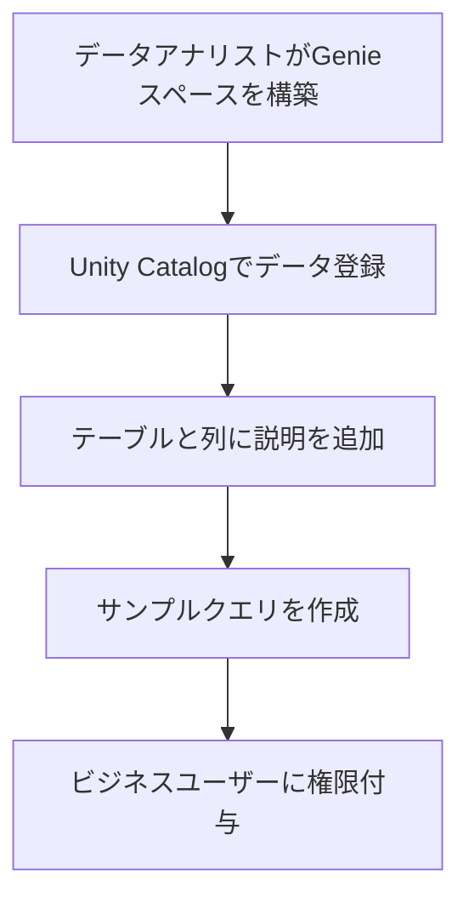

先日のDatabricks Free Editionの発表は個人的には衝撃的でした。以下の記事でも書いた通り、従来存在した無料版のCommunity Editionは機能の制限が多かったのですが、今回新たに生まれ変わったFree EditionではほとんどのDatabricksの機能が**無料**で利用できるようになったのです。

https://qiita.com/taka_yayoi/items/33e9cfa7ca9ca9febe72

今回は、Free Editionにサインアップすると表示されるチュートリアルをウォークスルーしていきたいと思います。


英語表記で恐縮ですが、サインアップを完了するとホームページに3つのチュートリアルが表示されます。左から、

- **自然言語を用いてあなたのデータと会話する** 新たな洞察を発見、可視化するために架空のパン屋の売上、在庫データに関して自然言語でAI/BI Genieに質問しましょう
- **AIを活用したノートブックでデータを探索** クエリーを生成し、結果を可視化するためにどのようにサンプルデータを分析し、人工知能(AI)を活用するのかを学びましょう
- **はじめてのAIエージェントの構築** 統制された洞察のために関数を作成し、Unity Catalogに登録して、アクション可能な洞察を生成するためにチャットベースのAIを構築しましょう

となっています。今回は最初にある自然言語を用いたデータの会話をウォークスルーします。ここで活用するのが[AI/BI Genie](https://www.databricks.com/jp/product/ai-bi/genie)です。AI/BIという製品カテゴリは最近のものですが、AIを活用したBIだと私は理解しています。そしてGenie(精霊)という特異な命名。でも、実際に使ってみれば、本当にジーニーのようにあなたの願いを叶えてくれることを体験できると思います。

https://docs.databricks.com/aws/ja/genie/

これまでのDatabricks Free Editionチュートリアルの記事はこちら:

- [Databricks Free Editionで学ぶAI/BI Genie](https://qiita.com/taka_yayoi/items/d2d7b74f0806975a8d63)
- [Databricks Free Editionで学ぶDatabricksノートブック](https://qiita.com/taka_yayoi/items/3d7c642cbdda4669b8c4)
- [Databricks Free Editionで学ぶAIエージェント](https://qiita.com/taka_yayoi/items/a0f5eafb23d736039512)

# Genieとは

Databricks AI/BI Genieは、SQLを書けないビジネスユーザーでも自然言語で高度なデータ分析が可能になる画期的なツールです。「今月の売上状況を教えて」といった日常的な質問を投げかけるだけで、自動的にSQLクエリを生成し、結果をビジュアル化してくれます。複合AIシステムを活用した組織専用の知識ベースにより、従来のBIツールでは実現困難だった直感的なデータ操作を実現します。

## 特徴

| 機能 | 説明 |
|------|------|
| **自然言語処理** | 日常的な言葉での質問をSQLクエリに自動変換 |
| **複合AIシステム** | 単一のAIモデルではなく、複数のコンポーネントが連携して動作 |
| **組織専用カスタマイズ** | 企業固有の用語やデータ構造に合わせて調整可能 |
| **リアルタイム学習** | ユーザーフィードバックを通じて継続的に改善 |

## データ処理の仕組み

```
ユーザーの質問 → AI解析 → SQLクエリ生成 → データ実行 → 結果表示・視覚化
```

Genieは以下の要素を組み合わせて回答を生成します：

- **テーブルメタデータ**: テーブル名、説明、主キー・外部キーの関係
- **列の情報**: 列名と詳細な説明
- **サンプルクエリ**: 事前に用意されたSQL例文
- **カスタム関数**: 組織固有のSQL関数
- **履歴情報**: 過去の会話コンテキスト

## メリット、嬉しさ

### ビジネスユーザーにとってのメリット

**1. 技術的ハードルの完全撤廃**
- SQLやプログラミング知識不要
- 「先月の営業成績はどうだった？」のような自然な質問でデータ分析が可能
- 複雑なBIツールの操作方法を覚える必要がない

**2. 意思決定スピードの劇的向上**
- データ分析の結果を即座に取得
- IT部門への依頼や待ち時間が不要
- リアルタイムでのビジネス判断が可能

**3. 民主化されたデータアクセス**
- 部門を問わず誰でもデータ分析が可能
- 営業、マーケティング、財務など、あらゆる職種でデータ活用が促進
- データドリブンな企業文化の構築に貢献

## 具体的な活用シーン

**営業部門の例**
```
質問: 「今四半期のパイプライン状況を段階別に見せて」
→ Genieが自動で営業データを分析し、視覚的なグラフを生成
```

**物流部門の例**
```
質問: 「配送遅延が多い地域はどこ？」
→ 地域別の配送パフォーマンスを自動分析・レポート化
```

## 使い方の流れ

### 1. 初期セットアップ段階



**データ準備のベストプラクティス**
- 分析対象のデータをキュレーション（不要な列の削除、関連データの統合）
- 主キー・外部キーの関係を明確に定義
- ビジネス用語に合わせたテーブル・列名の設定
- 想定される質問に対するサンプルSQLクエリの作成

### 2. 日常的な利用フロー

| ステップ | 操作内容 | 例 |
|----------|----------|-----|
| **1. 質問入力** | チャット画面に自然言語で質問を入力 | 「今月の売上トップ10の商品は？」 |
| **2. AI処理** | Genieが質問を解析してSQLを生成 | 自動でSELECT文を作成 |
| **3. データ実行** | SQLウェアハウスでクエリを実行 | 読み取り専用で安全に実行 |
| **4. 結果表示** | テーブルやグラフで結果を表示 | 売上ランキングを棒グラフで表示 |
| **5. フォローアップ** | 追加質問で詳細分析 | 「その中で利益率が高いのは？」 |

### 3. 継続的改善サイクル

```
ユーザーフィードバック → モニタリング画面で確認 → 指示やサンプルクエリの調整 → 精度向上
```

## 注意点

### 技術的制約と対策

**1. データ品質への依存**
- **課題**: 不正確なメタデータや説明不足により、誤った回答が生成される可能性
- **対策**: 定期的なメタデータの見直しと更新、サンプルクエリの充実化

**2. 複雑な分析の限界**
- **課題**: 高度な統計分析や機械学習的な分析は対応困難
- **対策**: 段階的な質問分解、専門分析は従来ツールとの併用

**3. セキュリティとプライバシー**

| 項目 | 対策内容 |
|------|----------|
| **データアクセス制御** | Unity Catalogの権限設定により、行レベル・列レベルでアクセス制限 |
| **データ保護** | Azure OpenAIではプロンプトや応答を一切保存しない設定 |
| **地域データ規制** | 地域間処理の設定により、データ処理場所を制御可能 |

## 運用上の注意事項

**導入初期の課題**
- ユーザーの期待値調整（完璧な回答を期待しすぎない）
- 段階的な機能展開（一度にすべての部門で導入せず、パイロット運用から開始）
- 継続的なトレーニングとサポート体制の構築

**データガバナンス**
- 誤った分析結果に基づく意思決定リスクの回避
- 定期的なベンチマークテストによる精度確認
- フィードバック機能を活用した継続的改善

# 使ってみる

ホームページに表示されている**Start conversing**(会話をスタートする)をクリックします。


そうすると、Genieスペースの一覧画面に移動します。


Genieの作業空間は**スペース**という単位で構成されています。スペースごとに分析目的に適したテーブルを登録することになります。今回はスペースを一から作るのではなく、作成済みのスペースを使います。一覧には**Bakehouse Sales Starter Space**というスペースがすでに表示されいるのでこちらをクリックします。

そうすると以下の画面が表示されます。


まず、Genieを使う際には計算資源が必要となります。中央上に表示されている**SQLウェアハウスServerless Starter Warehouseが停止しています。このGenie spaceを使用するには、ウェアハウスを起動してください。**がその点に関して指摘していますので、メッセージの右にある**ウェアハウスを開始**をクリックします。これで、Genieを操作するために計算資源を起動することができます。

少し待つと以下のように実行中のメッセージが表示されます。


ここで、画面の説明をさせてください。下に表示されているのが質問を入力するためのボックスです。そして、右側に表示されているのがGenieの設定です。今は**データ**タブが表示されており、Genieへの質問に答えるために使用するテーブルが表示されています。


**指示**タブに切り替えると、Genieに対するシステムプロンプトが表示されます。


デフォルトですと、英語で回答するので`日本語で回答してください`を追加して、**Save**をクリックします。


では、中央に表示されているサンプルの質問**データセットを説明してください**をクリックしてみましょう。


そうすると、このGenieスペースに登録されているデータを説明してくれます。


さらに、質問の入力ボックスには追加の質問の例が表示されています。ここでは、`各フランチャイズの売上はどうなっていますか？`をクリックしてみます。


そうすると、質問に応じてデータへの問い合わせを行うとともに、その結果を可視化してくれます。


このように、Genieを活用するだけでデータの問い合わせ言語(SQL)を用いることなしに、日本語だけでデータ分析を行えます。


# まとめ

今回は作成済みのGenieスペースを使用しましたが、このGenieスペースがご自身で作成することができます。つまり、あなたの会社のデータをGenieスペースに登録し、会社固有の用語の説明を指示に追加することで、あなたの企業のデータの分析を、SQLに依存することなしに**日本語だけで**行うことができるということです。

Databricks AI/BI Genieは、従来のBIツールでは実現できなかった「誰でも簡単にデータ分析」という理想を現実のものにする革新的なソリューションです。是非、ご活用ください！

### はじめてのDatabricks

[はじめてのDatabricks](https://qiita.com/taka_yayoi/items/8dc72d083edb879a5e5d)

### Databricks無料トライアル

[Databricks無料トライアル](https://databricks.com/jp/try-databricks)
