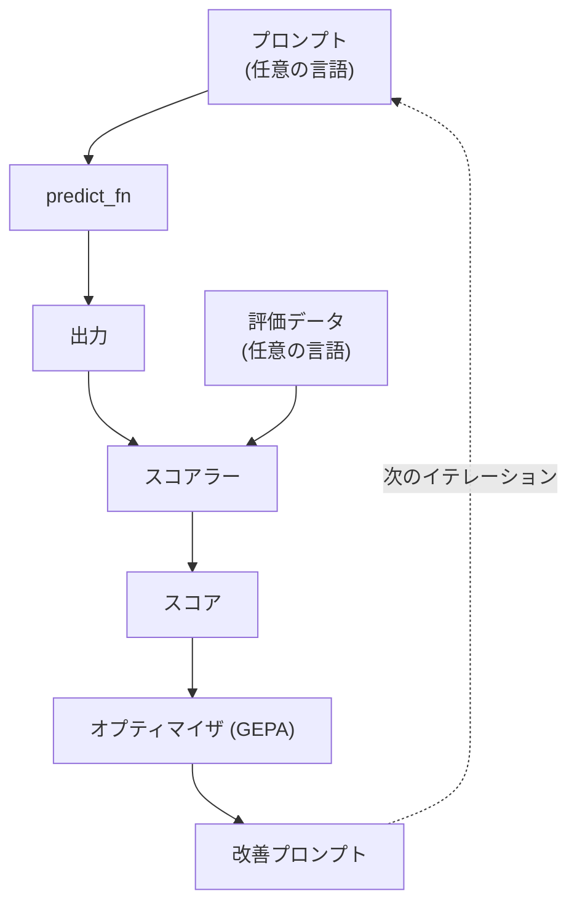
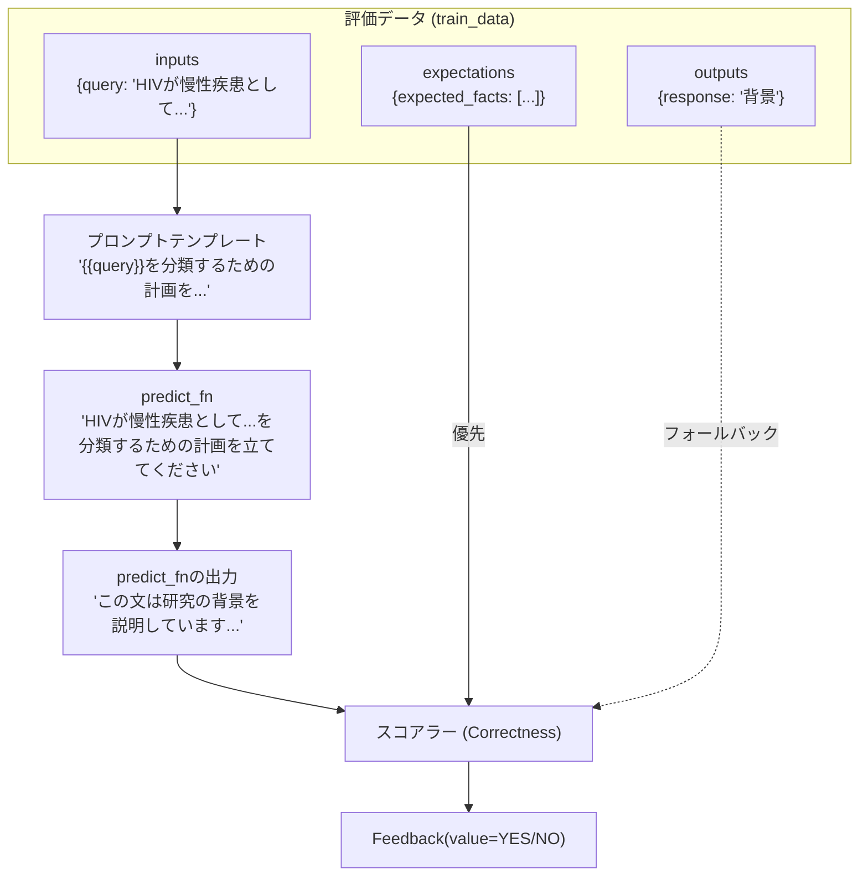
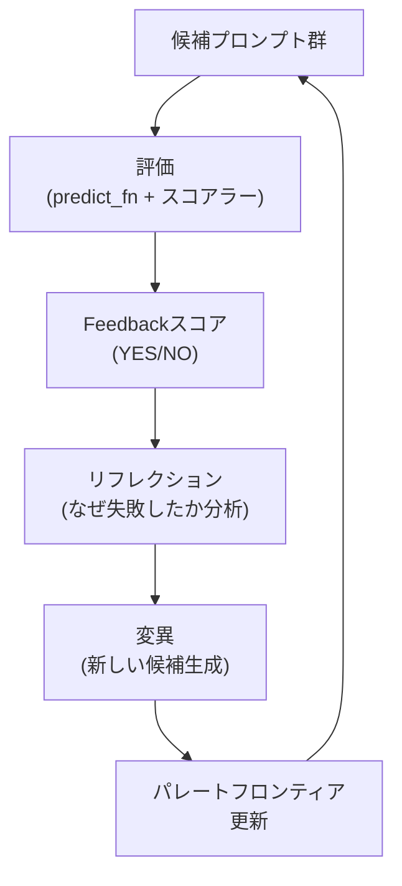
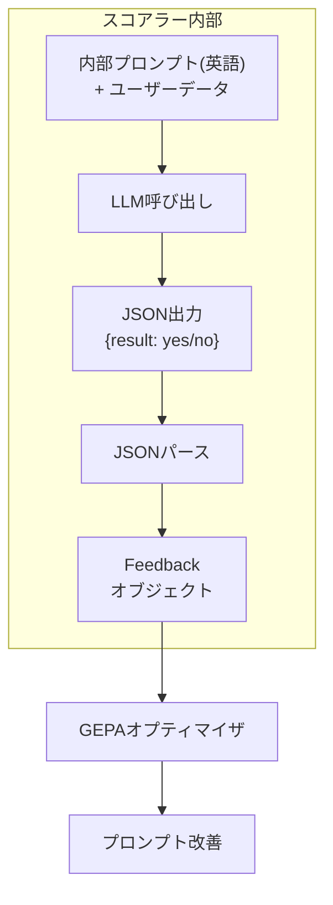

# はじめに

MLflow 3.5.0で導入されたGEPA(Genetic-Pareto)によるプロンプト最適化機能を日本語データで使用した際、いくつかの問題に遭遇しました。本記事では、各コンポーネントの動作原理と、言語(特に日本語)を使用する際の影響について解説します。

:::note info
**ソース情報**
- GEPA(Genetic-Pareto)の名称と概要: [GEPA論文 (arxiv:2507.19457)](https://arxiv.org/abs/2507.19457)
- MLflow 3.5.0での導入: [GepaPromptOptimizerソースコード](https://mlflow.org/docs/3.5.1/api_reference/_modules/mlflow/genai/optimize/optimizers/gepa_optimizer.html) (`@experimental(version="3.5.0")`)
:::


# MLflow + GEPA プロンプト最適化のアーキテクチャ

まず、`optimize_prompts()`の全体像を理解しましょう。



:::note info
**ソース情報**
`optimize_prompts()` API: [MLflow Prompt Optimization ドキュメント](https://docs.databricks.com/aws/en/mlflow3/genai/prompt-version-mgmt/prompt-registry/automatically-optimize-prompts)
:::


# 各コンポーネントの役割と組み合わせ

## プロンプトテンプレートと評価データの関係

まず、プロンプトテンプレートと評価データがどのように組み合わされるかを理解しましょう。



**重要なポイント:**
- `inputs`: プロンプトテンプレートに埋め込まれ、`predict_fn`に渡される
- `outputs`: `expectations`が未指定の場合、`expected_response`としてスコアラーに渡される([ソース: optimize.py 行274-276](https://github.com/mlflow/mlflow/blob/master/mlflow/genai/optimize/optimize.py#L274))
- `expectations`: スコアラーが`predict_fn`の出力を評価する際の基準(優先使用)

:::note info
**ソース情報**
データ構造の例: [Optimize prompts tutorial](https://docs.databricks.com/aws/en/mlflow3/genai/tutorials/examples/prompt-optimization-quickstart)のdataset定義
:::

## 1. プロンプトテンプレート (prompt_uris)

最適化対象となるプロンプトテンプレートです。`{{変数名}}`の部分に評価データの`inputs`が埋め込まれます。

```python
plan_prompt = mlflow.genai.register_prompt(
    name="plan",
    template="{{query}}を分類するための計画を立ててください。",
)
```

**組み合わせ例:**
```
テンプレート: "{{query}}を分類するための計画を立ててください。"
      +
inputs: {"query": "HIVが慢性疾患として..."}
      ↓
実際のプロンプト: "HIVが慢性疾患として...を分類するための計画を立ててください。"
```

| 項目 | 内容 |
|------|------|
| 役割 | 最適化対象のテンプレート |
| 言語 | 任意(日本語OK) |
| 組み合わせ先 | `inputs`の値が埋め込まれる |


:::note info
**ソース情報**
プロンプト登録: [Optimize multiple prompts together](https://docs.databricks.com/aws/en/mlflow3/genai/tutorials/examples/multi-prompt-optimization)
:::


## 2. 評価データ (train_data)

評価データは3つの要素で構成され、それぞれ異なる場所で使用されます。

```python
dataset = [
    {
        "inputs": {"query": "HIVが慢性疾患として..."},           
        "outputs": {"response": "背景"},                         
        "expectations": {"expected_facts": ["分類ラベルは..."]}  
    },
]
```

### 各要素の使用先

| 要素 | 使用先 | 役割 |
|------|--------|------|
| `inputs` | `predict_fn` | プロンプトテンプレートに埋め込まれる |
| `outputs` | スコアラー(フォールバック) | `expectations`未指定時に`expected_response`として使用 |
| `expectations` | スコアラー(優先) | 評価基準として使用(`expected_facts`または`expected_response`) |

:::note info
**ソース情報**
[optimize.py 行274-276](https://github.com/mlflow/mlflow/blob/master/mlflow/genai/optimize/optimize.py#L274): `expectations = record.get("expectations") or {"expected_response": record.get("outputs")}`
:::


### `outputs`と`expectations`の違い

`optimize_prompts`では`predict_fn`が必須のため、**スコアラーが評価するのは`predict_fn`の出力**です。

- `expectations`が指定されている場合: `expectations`の値(`expected_facts`や`expected_response`)が評価基準
- `expectations`が未指定の場合: `outputs`の値が`expected_response`として使用される

```python
# optimize.py での処理 (行274-276)
expectations = record.get("expectations") or {
    "expected_response": record.get("outputs")
}
```

つまり、シンプルなユースケースでは`outputs`だけ指定すれば動作し、より詳細な評価基準が必要な場合は`expectations`を使用します。

### `expected_facts`の目的

[Databricksの公式ドキュメント](https://docs.databricks.com/aws/en/mlflow3/genai/tutorials/examples/prompt-optimization-quickstart)では、以下のような書き方が示されています：

```python
"expectations": {"expected_facts": ["Classification label must be 'CONCLUSIONS', 'RESULTS', 'METHODS', 'OBJECTIVE', 'BACKGROUND'"]}
```

これは **「正解ラベルとの一致」ではなく「出力形式の制約」** を定義しています。

| 評価内容 | `predict_fn`の出力 | 結果 |
|----------|-------------------|------|
| 形式が正しい | "BACKGROUND" | ✅ YES |
| 形式が正しい | "METHODS" | ✅ YES |
| 形式が間違い | "この文は背景です" | ❌ NO |

つまり、この設定では「5つのラベルのいずれかを出力するか」を評価しており、「正解ラベルと一致するか」は評価していません。

### 正解ラベルとの一致を評価したい場合

正解ラベルとの厳密な一致を評価したい場合は、`expected_facts`または`expected_response`に具体的な正解を記述します：

```python
# 方法1: expected_factsに具体的な正解を記述
{
    "inputs": {"query": "HIVが慢性疾患として..."},
    "expectations": {
        "expected_facts": ["分類結果は「背景」である"]
    }
}

# 方法2: expected_responseを使用
{
    "inputs": {"query": "HIVが慢性疾患として..."},
    "expectations": {
        "expected_response": "背景"
    }
}
```

:::note info
**ソース情報**
- `expected_facts`の定義: [Agent Evaluation input schema](https://docs.databricks.com/aws/en/generative-ai/agent-evaluation/evaluation-schema) - 「The expected_facts field specifies the list of facts that is expected to appear in any correct model response」「a model response is deemed correct if it contains these facts, regardless of how the response is phrased」
- `expected_facts`と`expected_response`の違い: [Correctness judge & scorer](https://docs.databricks.com/aws/en/mlflow3/genai/eval-monitor/concepts/judges/is_correct) - 「Using expected_facts is recommended over expected_response as it allows for more flexible evaluation」
:::


## 3. スコアラー (scorers)

出力の品質を評価するコンポーネントです。MLflowは`Correctness`、`Safety`などの組み込みスコアラーを提供しています。

```python
from mlflow.genai.scorers import Correctness

scorers=[Correctness(model="databricks:/databricks-gpt-5")]
```

| 項目 | 内容 |
|------|------|
| 役割 | 出力の品質を評価 |
| 戻り値 | `Feedback(value=CategoricalRating.YES/NO)` |

### スコアラーの内部動作

`Correctness`スコアラーは内部で以下のような処理を行います：

```
Correctness.__call__()
    ↓
judges.is_correct()  # LLMを呼び出し
    ↓
LLMがJSON形式で結果を返す
    ↓
JSONをパースしてFeedbackオブジェクトを生成
```

### Correctnessスコアラーの内部プロンプト

GitHubのソースコード([mlflow/genai/judges/prompts/correctness.py](https://github.com/mlflow/mlflow/blob/master/mlflow/genai/judges/prompts/correctness.py))を確認すると、内部プロンプトは**英語**で記述されています：

```python
CORRECTNESS_PROMPT_INSTRUCTIONS = """\
Consider the following question, claim and document. You must determine whether the claim is \
supported by the document in the context of the question. Do not focus on the correctness or \
completeness of the claim. Do not make assumptions, approximations, or bring in external knowledge.

<question>{{input}}</question>
<claim>{{ground_truth}}</claim>
<document>{{input}} - {{output}}</document>
"""
```

:::note info
**ソース情報**
- Correctnessスコアラー: [Correctness judge & scorer](https://docs.databricks.com/aws/en/mlflow3/genai/eval-monitor/concepts/judges/is_correct)
- 内部プロンプト(英語): [GitHub - correctness.py](https://github.com/mlflow/mlflow/blob/master/mlflow/genai/judges/prompts/correctness.py)
:::

## 4. オプティマイザ (GepaPromptOptimizer)

スコアに基づきプロンプトを改善します。

```python
optimizer=GepaPromptOptimizer(
    reflection_model="databricks:/databricks-gemini-2-5-pro"
)
```

| 項目 | 内容 |
|------|------|
| 役割 | スコアに基づきプロンプトを改善 |

### GEPAの最適化ループ

GEPAは以下のサイクルを繰り返してプロンプトを改善します:



1. **評価**: 各候補プロンプトを`predict_fn`で実行し、スコアラーで評価
2. **リフレクション**: 低スコアの原因をLLM(`reflection_model`)で分析
3. **変異**: 分析結果を基に新しい候補プロンプトを生成
4. **パレートフロンティア更新**: 最良の候補群を維持

:::note warn
**重要**: スコアラーが正しく`Feedback`を返せないと、このループ全体が停止します。
:::

:::note info
**ソース情報**
- GEPAアルゴリズムの詳細: [GEPA論文](https://arxiv.org/abs/2507.19457) - 「GEPA (Genetic-Pareto), a prompt optimizer that thoroughly incorporates natural language reflection to learn high-level rules from trial and error」
- DSPyでの実装: [dspy.GEPA: Reflective Prompt Optimizer](https://dspy.ai/api/optimizers/GEPA/overview/)
- MLflow統合: [GitHub PR #18031](https://github.com/mlflow/mlflow/pull/18031)
:::


# 日本語データで発生した問題

## 最適化ループにおけるスコアラーの役割

まず、スコアラーが最適化ループでどのように機能するかを理解しましょう。



:::note warn
**重要**: スコアラーはLLMの出力をJSON形式でパースし、`Feedback`オブジェクトに変換します。このパースが失敗すると、最適化ループ全体が停止します。
:::


## 問題: JSONパースエラー

日本語データと特定のモデル(Claude)の組み合わせで以下のエラーが発生しました。

```
MlflowException: Failed to parse the response from the judge
```

## なぜ内部プロンプトが英語なのに日本語データが影響するのか

スコアラーがLLMを呼び出す際、以下のようなプロンプトが構築されます:

```
[内部プロンプト(英語)]
Consider the following question, claim and document...

<question>フランスの首都はどこですか？</question>    ← ユーザーデータ(日本語)
<claim>パリはフランスの首都</claim>                  ← ユーザーデータ(日本語)
<document>フランスの首都はどこですか？ - パリです</document>

[出力指示(英語)]
Please provide your assessment using only the following json format...
```

LLMは**コンテキスト全体**(内部プロンプト + ユーザーデータ)を見て応答を生成します。筆者の環境では、ユーザーデータに日本語が含まれる場合、ClaudeがマークダウンのコードブロックでJSON出力を装飾する現象が観察されました。

### 観察された出力形式の違い(筆者環境)

| 組み合わせ | LLMの出力形式 | パース結果 |
|------------|--------------|------------|
| GPT系 + 英語 | `{"result": "yes"}` | ✅ 成功 |
| GPT系 + 日本語 | `{"result": "yes"}` | ✅ 成功 |
| Claude + 英語 | `{"result": "yes"}` | ✅ 成功 |
| Claude + 日本語 | ` ```json {"result": "yes"} ``` ` | ❌ **失敗** |

**Claudeモデルでのエラー**


**GPTモデルに切り替え**


:::note info
**注記**: この現象は筆者の検証環境(Databricks on AWS)で観察されたものです。環境やモデルバージョンによって異なる可能性があります。
:::

# 解決策

## 最小限の変更: スコアラーのモデルをGPT系に変更

日本語データで動作させるための最小限の変更は、スコアラーのモデルをGPT系に変更することです。

```python
# Before (Claude)
scorers=[Correctness(model="databricks:/databricks-claude-sonnet-4-5")]

# After (GPT系)
scorers=[Correctness(model="databricks:/databricks-gpt-5")]
```

これだけで動作します。

# 言語の影響まとめ

| コンポーネント | 日本語使用 | 注意点 |
|----------------|------------|--------|
| プロンプト | ✅ 可能 | - |
| 評価データ | ✅ 可能 | - |
| スコアラー | ⚠️ モデル依存 | **Claude + 日本語でJSONパースエラー発生(筆者環境)、GPT系推奨** |
| オプティマイザ | ✅ 言語無関係 | 日本語プロンプトも処理可能 |

# おわりに

MLflow + GEPAによるプロンプト最適化は強力な機能ですが、日本語データを使用する際には**スコアラーのモデル選択**に注意が必要です。現時点では、スコアラーにはGPT系モデルを使用することを推奨します。

なお、この問題はMLflow/Databricks側で改善される可能性があります。実際、MLflowのGitHubリポジトリでは、マークダウンコードブロックへの対応が議論されています([PR #17943](https://github.com/mlflow/mlflow/pull/17943))。

## 参考リンク

### Databricks公式ドキュメント
- [プロンプト最適化チュートリアル](https://docs.databricks.com/aws/ja/mlflow3/genai/tutorials/examples/prompt-optimization-quickstart) - 本記事で参照したチュートリアル
- [複数プロンプトの最適化](https://docs.databricks.com/aws/en/mlflow3/genai/tutorials/examples/multi-prompt-optimization) - 複数プロンプトを同時に最適化する例
- [Correctnessスコアラー](https://docs.databricks.com/aws/en/mlflow3/genai/eval-monitor/concepts/judges/is_correct) - `expected_facts`と`expected_response`の使い方
- [組み込みLLMジャッジの使用](https://docs.databricks.com/aws/en/mlflow3/genai/eval-monitor/predefined-judge-scorers) - スコアラーの概要
- [Agent Evaluation input schema](https://docs.databricks.com/aws/en/generative-ai/agent-evaluation/evaluation-schema) - `expected_facts`の定義

### MLflow公式ドキュメント
- [Predefined LLM Scorers](https://mlflow.org/docs/latest/genai/eval-monitor/scorers/llm-judge/predefined) - 組み込みスコアラーの詳細
- [GepaPromptOptimizer ソースコード](https://mlflow.org/docs/3.5.1/api_reference/_modules/mlflow/genai/optimize/optimizers/gepa_optimizer.html) - 実装の詳細

### GitHub
- [MLflow リポジトリ](https://github.com/mlflow/mlflow) - MLflow本体
- [mlflow/genai/judges/prompts/correctness.py](https://github.com/mlflow/mlflow/blob/master/mlflow/genai/judges/prompts/correctness.py) - Correctnessスコアラーの内部プロンプト(英語)
- [mlflow/genai/judges/prompts/guidelines.py](https://github.com/mlflow/mlflow/blob/master/mlflow/genai/judges/prompts/guidelines.py) - Guidelinesスコアラーの内部プロンプト(英語)
- [GEPA PR #18031](https://github.com/mlflow/mlflow/pull/18031) - MLflowへのGEPA統合PR

### GEPAアルゴリズム
- [GEPA論文 (arxiv:2507.19457)](https://arxiv.org/abs/2507.19457) - 「GEPA: Reflective Prompt Evolution Can Outperform Reinforcement Learning」
- [gepa-ai/gepa GitHub](https://github.com/gepa-ai/gepa) - GEPAの公式実装
- [DSPy GEPA ドキュメント](https://dspy.ai/api/optimizers/GEPA/overview/) - DSPyでのGEPA使用方法


### はじめてのDatabricks

[はじめてのDatabricks](https://qiita.com/taka_yayoi/items/8dc72d083edb879a5e5d)

### Databricks無料トライアル

[Databricks無料トライアル](https://databricks.com/jp/try-databricks)
