Databricksを初めて学ぶ方のために、**公式ドキュメントとQiita記事を組み合わせた体系的な学習ガイド**を作成しました。**生成AI時代に必要なデータ分析・アプリ開発・LLM活用のスキル**を、**Databricks AssistantやGenieといったAI支援ツール**を活用しながら効率的に学べる構成になっています。

# この記事の特徴

## 生成AI時代の学習アプローチ

- **公式ドキュメント + Qiita記事**: 最新の正確な情報と実践的な知見を両方活用
- **AI支援で学ぶ**: Databricks AssistantとGenieを活用した効率的な学習
- **実践重視**: データ分析からアプリ開発、LLM活用まで実践的なスキル習得
- **段階的成長**: 基礎から高度なトピックまで、無理なくステップアップ
- **2025年最新**: 2024-2025年の最新機能・記事を厳選

## 対象読者

- Databricksを初めて使う方
- 生成AIを活用したデータ分析・アプリ開発を学びたい方
- AI支援ツールで効率的に学習したい方
- 実務で使えるスキルを身につけたい方
- **pandas経験者**: Jupyter NotebookやGoogle Colabでデータ分析をしてきた方

## pandas経験者のためのDatabricks入門

**pandasとDatabricksの違いは？**

| 観点 | pandas | Databricks |
|------|--------|------------|
| データサイズ | 数GB程度まで | TB〜PB級の大規模データ |
| 実行環境 | 単一マシン | 分散クラスター（複数マシン） |
| データ処理 | メモリ上で処理 | 分散処理（Apache Spark） |
| 本番運用 | 手動実行が多い | 自動化・スケジュール実行 |
| チーム開発 | 個人作業が多い | データガバナンス・権限管理 |
| AI/ML | scikit-learn等 | MLflow、生成AI統合 |

**Databricksで何ができるようになる？**
- 💾 大規模データ（数百GB〜TB）の処理
- 🔄 データパイプラインの自動化
- 👥 チームでのデータ共有・権限管理
- 🤖 生成AIを活用したデータ分析・アプリ開発
- 📊 本番環境での安定運用

## 全体の学習フロー

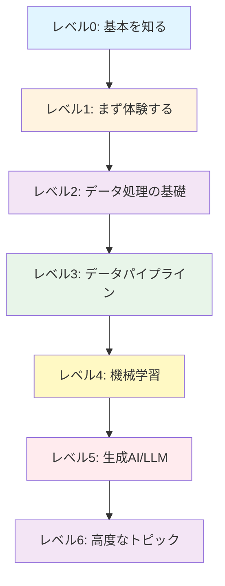

## 知っておくべき基本用語

この記事を読む前に、以下の基本用語を理解しておきましょう：

### データ基盤関連
- **[レイクハウス](https://docs.databricks.com/ja/lakehouse/index.html)**: データレイク（大量の生データを安価に保存）とデータウェアハウス（高速なクエリ実行）の良いところを組み合わせたアーキテクチャ
- **[Delta Lake](https://docs.databricks.com/ja/delta/index.html)**: データに「履歴管理」「トランザクション」機能を追加するストレージ技術。git のようにデータのバージョン管理ができる
- **[Apache Spark](https://docs.databricks.com/ja/getting-started/spark/index.html)**: 大規模データを複数のマシンで分散処理するエンジン。pandas の分散版のようなイメージ

### データ処理関連
- **[ETL](https://docs.databricks.com/ja/getting-started/etl-quick-start.html)**: Extract（抽出）→ Transform（変換）→ Load（読み込み）の頭文字。データを整形して別の場所に保存する処理
- **[Lakeflowジョブ](https://docs.databricks.com/ja/workflows/jobs/index.html)**: データ処理の自動化された流れ。「毎日深夜にデータを取得→整形→保存」のような一連の処理を自動実行
- **[ストリーミング](https://docs.databricks.com/ja/structured-streaming/index.html)**: リアルタイムで流れてくるデータ（ログ、センサーデータなど）を処理すること

### データガバナンス関連
- **[Unity Catalog](https://docs.databricks.com/ja/data-governance/unity-catalog/index.html)**: データへのアクセス権限を管理する仕組み。「誰が」「どのデータに」「何ができるか」を管理
- **[データガバナンス](https://docs.databricks.com/ja/data-governance/index.html)**: データの管理・統制。セキュリティ、権限管理、監査ログなどを含む

### AI/ML関連
- **[MLflow](https://docs.databricks.com/ja/mlflow/index.html)**: 機械学習の実験管理ツール。モデルのパラメータ、精度、バージョンなどを記録・管理
- **[RAG](https://docs.databricks.com/ja/generative-ai/retrieval-augmented-generation.html)** (Retrieval-Augmented Generation): 自社データを検索して、その結果をLLMに渡して回答を生成する手法
- **[Mosaic AI](https://docs.databricks.com/ja/machine-learning/index.html)**: Databricksの統合AI/MLプラットフォーム。機械学習から生成AIまでをカバー

## Databricksの主要な機能

Databricksは以下の機能を統合したプラットフォームです：

**使うツール**
- **[Notebooks](https://docs.databricks.com/ja/notebooks/index.html)**: データ分析やアプリ開発のための対話的な開発環境
- **[Databricks SQL](https://docs.databricks.com/ja/sql/index.html)**: データウェアハウス機能（SQL Warehouse、SQLエディタ）
- **[AI/BI](https://docs.databricks.com/ja/ai-bi/index.html)**: BIと分析の統合ツール
  - [ダッシュボード](https://docs.databricks.com/ja/dashboards/index.html): データの可視化とレポーティング
  - [Genie](https://docs.databricks.com/ja/genie/index.html): 自然言語でデータ分析
- **[Mosaic AI](https://docs.databricks.com/ja/machine-learning/index.html)**: 機械学習・生成AIモデルの開発・トレーニング・デプロイ
- **Lakeflow**: データエンジニアリングの統合ソリューション
  - [Lakeflow Connect](https://docs.databricks.com/ja/ingestion/index.html): データ取り込み用のマネージドコネクタ
  - [Spark宣言型パイプライン](https://docs.databricks.com/ja/getting-started/lakehouse-pipeline.html): データ変換パイプラインの宣言的定義
  - [Lakeflowジョブ](https://docs.databricks.com/ja/workflows/jobs/index.html): ワークフローの自動化とオーケストレーション

**AI支援**
- **[Databricks Assistant](https://docs.databricks.com/ja/notebooks/code-assistant.html)**: コード生成、デバッグ、最適化をサポート

**基盤技術**
- **[Apache Spark](https://docs.databricks.com/ja/getting-started/spark/index.html)**: 大規模データの分散処理エンジン
- **[Delta Lake](https://docs.databricks.com/ja/delta/index.html)**: ACIDトランザクションを実現するストレージレイヤー
- **[Unity Catalog](https://docs.databricks.com/ja/data-governance/unity-catalog/index.html)**: データガバナンス、アクセス制御、監査機能

---

# レベル0: 基本を知る

**このレベルで学ぶこと**: Databricksとは何か、どんなことができるのか
**所要時間**: 1-2時間
**完了後にできること**: Databricksの全体像を説明できる、Free Editionで環境構築できる

まずはDatabricksの基本概念を理解します。

## Databricksとは何か

📘 [Databricksの基本概念（公式）](https://docs.databricks.com/ja/introduction/)

Databricksの全体像、レイクハウスアーキテクチャ、主要なコンポーネントを理解します。

## Free Editionで始める

https://qiita.com/taka_yayoi/items/33e9cfa7ca9ca9febe72

無料で始められるDatabricks Free Editionの登録方法と使い方。実際に環境を準備します。

## レイクハウスアーキテクチャ

https://qiita.com/taka_yayoi/items/438f762126f57868aa35

Databricksの基盤となるレイクハウスの概念を理解します。データウェアハウスとデータレイクの良いところを組み合わせたアーキテクチャです。

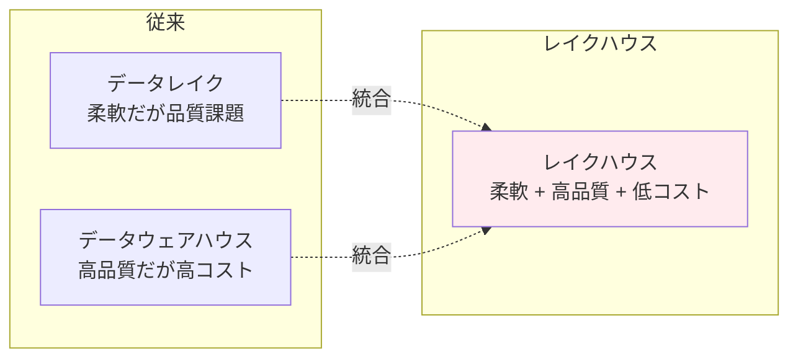

**図の説明**: 従来は「安いけど品質が低いデータレイク」か「高品質だけど高コストのデータウェアハウス」の二択でした。レイクハウスは両方の良いところを組み合わせ、安価で高品質なデータ基盤を実現します。

---

# レベル1: まず体験する

**このレベルで学ぶこと**: AI支援ツールの使い方、基本的なデータ操作
**所要時間**: 2-3時間
**完了後にできること**: Databricks AssistantでコードN生成、Genieで自然言語データ分析

概念を理解したら、まず手を動かしてDatabricksを体験します。**AI支援ツールを活用することで、プログラミング初心者でも効率的に学習できます。**

## クイックスタート

📘 [データをクエリーして可視化（公式）](https://docs.databricks.com/ja/getting-started/quick-start.html)

**最初に取り組むべきチュートリアル**。SQLやPythonでデータをクエリし、可視化する方法を学びます。

## Databricks Assistantで始める

### 基本的な使い方

📘 [Databricks Assistant（公式）](https://docs.databricks.com/ja/notebooks/code-assistant.html)

AI支援コーディングツールの基本的な使い方。`Cmd/Ctrl + I`で起動し、自然言語でコードを生成できます。

**主な機能：**
- `/explain` - コードの説明
- `/fix` - エラー修正
- `/optimize` - パフォーマンス改善
- `/findTables` - データ資産検索

### 実践例：EDA

https://qiita.com/taka_yayoi/items/07c49c2de588a101b719

:::note info
Databricks Assistantで探索的データ分析（EDA）を体験。AIの力を借りながらデータ分析の基礎を学びます。
:::

## Genieで自然言語分析

### 基本的な使い方

📘 [Genie（公式）](https://docs.databricks.com/ja/genie/index.html)

自然言語でデータ分析ができるツール。SQLを書かずに、日本語/英語の質問でデータを分析できます。

### 実践例：リサーチエージェント

https://qiita.com/taka_yayoi/items/1c472621a7a5f9cd99cb

:::note info
**最新機能（2025-11-20）**: Databricks Genieリサーチエージェント。複雑なビジネス課題を多段階推論で解決する新機能を体験します。
:::

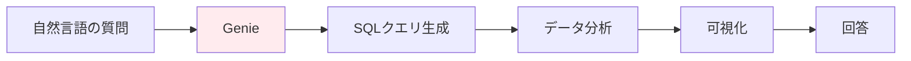

**図の説明**: Genieは日本語の質問を自動的にSQLに変換し、データ分析まで行ってくれます。「先月の売上トップ10は？」のような質問をするだけで、裏で適切なSQLを実行して結果を可視化してくれます。

---

# レベル2: データ処理の基礎

**このレベルで学ぶこと**: Spark、Delta Lake、SQLの基礎
**所要時間**: 5-7時間
**完了後にできること**: 大規模データの読み込み・変換・保存、基本的なSQLクエリ実行
**pandasとの対応**: DataFrameの操作がSparkでもできるようになる

AI支援ツールでの体験を通じて、データ処理の基本を学びます。

## データの取り込みと操作

### CSVデータをインポート

📘 [ノートブックからCSVデータをインポート（公式）](https://docs.databricks.com/ja/getting-started/csv-import.html)

実際のデータを取り込み、テーブルとして保存する方法を学びます。

### テーブルを作成

📘 [テーブルを作成（公式）](https://docs.databricks.com/ja/getting-started/tables.html)

Unity Catalogを使ったテーブル作成とアクセス権限管理の基礎。

## Apache Sparkの基礎

### 概念理解

https://qiita.com/taka_yayoi/items/31190da754106b2d284e

Apache Sparkとは何か（2025-08-13更新）。分散処理エンジンの基本概念を理解します。

### チュートリアル

https://qiita.com/taka_yayoi/items/c12a9ab6b6f75f95bc04

Sparkの基礎とデータフレーム操作を実際に体験します。

https://qiita.com/taka_yayoi/items/435275f6124184090259

[2024年版] データの読み込みと変換の最新チュートリアル。

## Delta Lakeの基礎

### 概念理解

https://qiita.com/taka_yayoi/items/07c9396809edbf2699b6

Delta Lakeとは何か（2025-05-28更新）。ACIDトランザクションを実現するストレージレイヤーの概念を理解します。

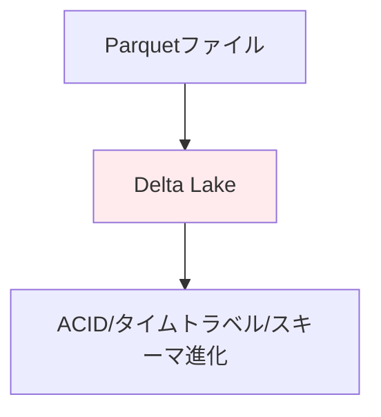

### チュートリアル

https://qiita.com/taka_yayoi/items/b888710c37d64cde4e45

Delta Lakeのクイックスタートガイド。実際にDeltaテーブルを作成し、データを取り込みます。

## Databricks SQLの基礎

### 概念理解

📘 [Databricks SQL概念（公式）](https://docs.databricks.com/ja/sql/)

Databricks SQLとデータウェアハウジングのコア概念を理解します。

### クエリーと可視化

📘 [クエリーとデータの視覚化（公式）](https://docs.databricks.com/ja/sql/user/queries-visualizations/index.html)

SQLクエリの作成と、データの可視化方法を学びます。

## ファイルシステムとデータベース

https://qiita.com/taka_yayoi/items/075c6b3aeafac54c8ac4

Databricksのファイルシステムをわかりやすく解説。

https://qiita.com/taka_yayoi/items/9d68dd5a3b070774d9a2

Databricksのデータベースをわかりやすく解説。

---

# レベル3: データパイプライン

**このレベルで学ぶこと**: 自動化されたデータ処理の構築
**所要時間**: 4-6時間
**完了後にできること**: スケジュール実行されるデータパイプラインの構築、イベント駆動の自動化
**実務での使い道**: 毎日深夜にデータを自動更新、エラーを検知して通知

データ処理の基礎を学んだら、本番環境で使えるデータパイプラインの構築方法を学びます。

## Lakeflow（最新のデータエンジニアリング）

LakeflowはConnect（データ取り込み）、Spark宣言型パイプライン（データ変換）、ジョブ（オーケストレーション）の3つから構成されるデータエンジニアリングの統合ソリューションです。

### 基本チュートリアル

📘 [Lakeflow Spark宣言型パイプライン（公式）](https://docs.databricks.com/ja/getting-started/lakehouse-pipeline.html)

**最新のパイプライン構築手法**。宣言的にデータパイプラインを定義し、データ変換を自動化します。

https://qiita.com/taka_yayoi/items/bb5ccb3fa1dae1b8915e

Lakeflow Spark宣言型パイプラインの詳細なチュートリアル（2025-10-28更新）。

### 最新UI

https://qiita.com/taka_yayoi/items/e238973c848b7115af61

Databricksの新たなLakeflowジョブUI（2025-07-08）。最新のUI操作方法を学びます。

### ワークフロー自動化

https://qiita.com/taka_yayoi/items/64fac4388fa173820591

テーブル更新をトリガーにジョブを自動実行（2025-10-19）。イベントドリブンなパイプライン構築を学びます。

## Apache Spark ETLパイプライン

📘 [Apache SparkでETLパイプライン構築（公式）](https://docs.databricks.com/ja/getting-started/data-pipeline-get-started.html)

Sparkを使った従来型のETLパイプライン構築。データオーケストレーションの基礎を学びます。

## データ取り込み

https://qiita.com/taka_yayoi/items/b424e1f321cfbbf5a0e7

COPY INTOコマンドでレイクハウスへのデータ取り込み。効率的なデータ取り込み手法を学びます。

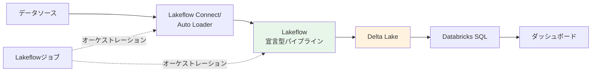

**図の説明**: データソースからダッシュボードまでの一連の流れを自動化します。
1. **Lakeflow Connect**: データを自動取り込み（pandas の `pd.read_csv()` の自動化版）
2. **宣言型パイプライン**: データを変換（pandasの`df.transform()`の自動化版）
3. **Lakeflowジョブ**: 全体を定期実行（cronのような役割）

---

# レベル4: 機械学習

**このレベルで学ぶこと**: MLflowを使った機械学習の実験管理
**所要時間**: 4-5時間
**完了後にできること**: モデルのトレーニング、評価、デプロイ、バージョン管理
**Jupyter Notebookとの違い**: 実験の履歴が自動記録され、モデルが本番デプロイできる

データパイプラインを構築できるようになったら、機械学習の基礎を学びます。

## MLモデルのトレーニングとデプロイ

📘 [MLモデルをトレーニングしてデプロイ（公式）](https://docs.databricks.com/ja/getting-started/ml-quick-start.html)

scikit-learnとMLflowを使った機械学習の基礎。モデルのトレーニングからデプロイまでを体験します。

## MLflowの基礎

### 概念理解

https://qiita.com/taka_yayoi/items/799b0320e4d8ae2e4234

MLflowとは何か。機械学習ライフサイクル管理プラットフォームの概念を理解します。

### 最新版クイックスタート

https://qiita.com/taka_yayoi/items/ce83575abb55526c52a7

MLflow 3.0のクイックスタート。最新のMLflow機能を学びます。

## 実践的な機械学習

https://qiita.com/taka_yayoi/items/cf5ce14552b2221465dd

XGBoostを使った機械学習。実務で使える機械学習ライブラリの使い方を学びます。

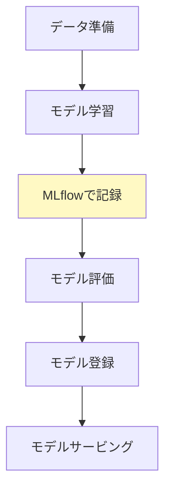

---

# レベル5: 生成AI/LLM（重点領域）

**このレベルで学ぶこと**: RAG、LLMの統合、AI関数の活用
**所要時間**: 5-7時間
**完了後にできること**: 自社データを使ったLLMシステム構築、SQLから直接LLM呼び出し
**重点領域の理由**: 2025年現在、最も需要が高く、ビジネス価値が高いスキル

**生成AI時代の最重要スキル**。機械学習の基礎を学んだら、生成AIとLLMの活用方法を学びます。

## ノーコードでLLMを体験

📘 [ノーコードでLLMをクエリしてAIエージェントをプロトタイプ化（公式）](https://docs.databricks.com/ja/getting-started/ai-quick-start.html)

AI Playgroundを使って、コードを書かずにLLMを体験。様々なLLMモデルを試せます。

## RAG（Retrieval-Augmented Generation）

https://qiita.com/taka_yayoi/items/45cb187666242fcb542f

Databricks生成AIクックブック：RAGの基礎を学びます。自社データを活用したLLMシステムの構築方法。

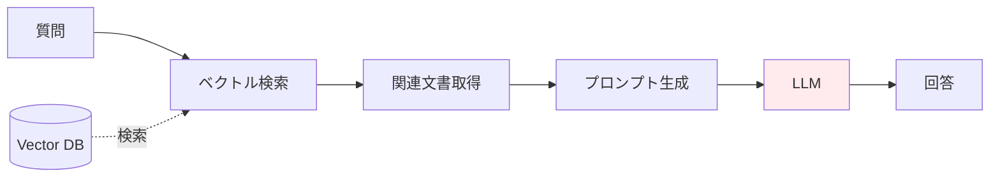

**図の説明**: RAGの仕組みを示しています。
1. ユーザーの質問に関連する文書をデータベースから検索
2. 見つかった文書をLLMに渡す
3. LLMが文書を参照しながら回答を生成

これにより、自社データを使った正確な回答が可能になります。LLMの「幻覚（hallucination）」を防げます。

## AI関数の活用

https://qiita.com/taka_yayoi/items/08d3dbf3f5202d708c03

ai_query関数の基礎から高度な使い方まで。SQLからLLMを直接呼び出す方法を学びます。

## MLflowとLLM

https://qiita.com/taka_yayoi/items/fd2f8b36aada402589d0

MLflowチュートリアル：ChatModelの使い方とRAGのリトリーバ評価。LLMシステムの評価とトラッキングを学びます。

https://qiita.com/taka_yayoi/items/2fd4c9fef0ffe8377f48

MLflow3とDatabricksで実現するLLMops（2025-10-26）。MLflow 3の最新機能でLLMの運用管理を学びます。

---

# レベル6: 高度なトピック

**このレベルで学ぶこと**: リアルタイム処理、データガバナンス、複合AIシステム
**所要時間**: 6-8時間
**完了後にできること**: ストリーミングデータ処理、Unity Catalogでの権限管理、本番運用
**本番環境への準備**: チーム開発とセキュアなデータ管理

基礎を固めたら、より高度なトピックに挑戦します。

## 複合AIシステム

https://qiita.com/taka_yayoi/items/da5e019190bed65e9e87

はじめての複合AIシステム構築。複数のAIコンポーネントを組み合わせた高度なシステムを構築します。

## ストリーミングデータ処理

https://qiita.com/taka_yayoi/items/ae258e2e160c41239435

Spark構造化ストリーミングのチュートリアル。リアルタイムデータ処理の基礎を学びます。

https://qiita.com/taka_yayoi/items/176be641064170826bc5

Auto LoaderによるDelta Lakeへの継続的データ取り込み。ストリーミングデータの自動取り込みを学びます。

## Unity Catalogによるガバナンス

### 概念理解

https://qiita.com/taka_yayoi/items/9095843d094637625e13

:::note info
Unity Catalogを理解する。データガバナンスとセキュリティの基本概念を学びます。本番環境でDatabricksを使う際には必須の知識です。
:::

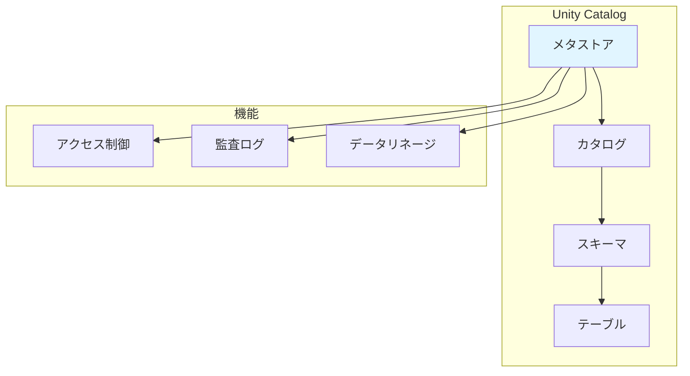

### 実践チュートリアル

https://qiita.com/taka_yayoi/items/dddad5c37efe55491abc

Unity Catalogメタストア管理者向けタスク。実際の運用方法を学びます。

https://qiita.com/taka_yayoi/items/c1d407c6ea45bbe39c02

OSS Unity Catalogチュートリアルとタグ活用入門。

### 実践的な構造化パターン

https://qiita.com/taka_yayoi/items/9e79f110ed2de517f15a

プロのようにUnity Catalogを構造化する方法（2025-09-10）。データチームにおける現実世界の階層パターンを学びます。

https://qiita.com/taka_yayoi/items/af0d9a6e399c2937d787

Unity Catalogのアクセスリクエスト機能で権限管理をスムーズに（2025-08-14）。実務での権限管理を学びます。

---

# 補足資料・今後の学習

## AI機能の全体像

https://qiita.com/taka_yayoi/items/ba79329ee86ca4f21701

Databricks AI機能の進化の歴史：2021年〜2025年（2025-11-21）。AI機能の全体像を俯瞰できます。

## プロンプトエンジニアリング

https://qiita.com/taka_yayoi/items/fc3833a73b841de8b205

Databricksで学ぶプロンプトエンジニアリングの基礎。Databricks Assistantの使い方を学ぶ中で自然に身につきます。

## エンドツーエンドパイプライン

https://qiita.com/taka_yayoi/items/4ea03bea8085cfa306f0

エンドツーエンドのレイクハウスアナリティクスパイプライン（2023年版）。全体像を俯瞰します。

## Databricks Apps

https://qiita.com/taka_yayoi/items/39ab8f9aacd42e638127

Databricks AppsのStreamlitチュートリアル。アプリケーション開発に進む際に参考にします。

## 書籍・学習リソース

### Databricksクイックスタートガイド

https://qiita.com/taka_yayoi/items/5133f590f30fee3c12da

電子書籍「データブリックス クイックスタートガイド」の紹介。

https://www.amazon.co.jp/dp/B09V1YXFVQ

### Apache Spark徹底入門

https://qiita.com/taka_yayoi/items/798767c8a585c64212f9

Apache Spark徹底入門（書籍紹介）。Sparkを深く学びたい方向け。

### dbdemos

https://qiita.com/taka_yayoi/items/d0f872d0d8d9c6b20beb

dbdemos: Databricksのデモを簡単に体験。様々なユースケースをワンコマンドでセットアップ。

### Free Edition実践チュートリアル

https://qiita.com/taka_yayoi/items/d45da4e3048b35152208

Databricks Free Editionの実践チュートリアル。Unity CatalogやPySparkの基礎を手を動かしながら学べます。

---

# 推奨学習パス

学習目的に応じて、以下の3つのパターンから選択できます。

## パターン1: データエンジニア志望

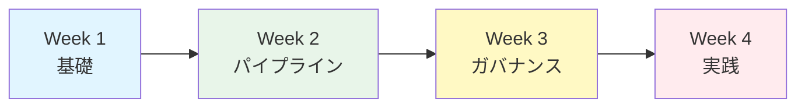

**Week 1**: レベル0-1（基本概念とAI支援ツール体験）
**Week 2**: レベル2-3（データ処理とパイプライン構築）
**Week 3**: レベル6（Unity Catalogとガバナンス）
**Week 4**: 実践プロジェクト

## パターン2: データサイエンティスト志望

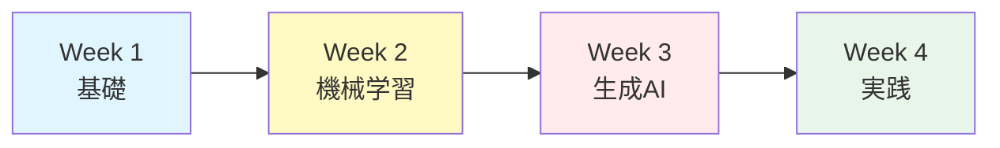

**Week 1**: レベル0-2（基本概念とデータ処理）
**Week 2**: レベル4（機械学習とMLflow）
**Week 3**: レベル5（生成AI/LLM）
**Week 4**: 実践プロジェクト

## パターン3: 生成AI/LLMエンジニア志望

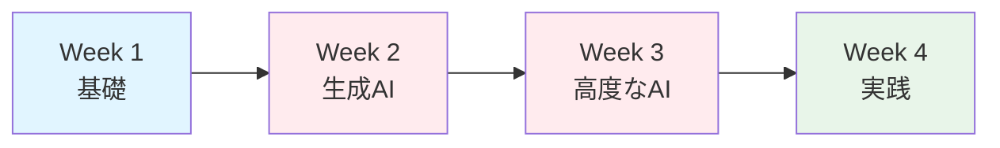

**Week 1**: レベル0-1（基本概念とAI支援ツール体験、Databricks基礎）
**Week 2**: レベル5（RAG、AI関数、MLflow+LLM）
**Week 3**: レベル6（複合AIシステム）+ レベル5（LLMops）
**Week 4**: 実践プロジェクト（AIエージェント開発等）

---

# Week 1の詳細学習プラン

初心者向けに、最初の1週間の学習計画を詳しく説明します。

## Day 1（2時間）：環境準備と概要理解

| 時間 | 内容 | 成果物 |
|------|------|--------|
| 30分 | 📘 Databricksの基本概念を読む | 全体像の理解 |
| 30分 | 📝 Free Edition登録 | 実行環境の準備 |
| 30分 | 📝 レイクハウスアーキテクチャを読む | 基本概念の理解 |
| 30分 | この学習ガイドを最後まで眺める | 学習ロードマップの把握 |

**チェックポイント**: Databricksにログインできる、Notebookを作成できる

## Day 2（2-3時間）：最初のハンズオン

| 時間 | 内容 | 成果物 |
|------|------|--------|
| 60分 | 📘 データをクエリーして可視化（公式） | 最初のクエリ実行 |
| 60分 | 📘 Databricks Assistant基本 | AI支援ツールの使い方 |
| 30-60分 | 📝 Databricks AssistantでEDA | 実データでの分析体験 |

**チェックポイント**: SQLでデータをクエリできる、Assistantでコード生成できる

## Day 3（2-3時間）：AI支援ツールをマスター

| 時間 | 内容 | 成果物 |
|------|------|--------|
| 30分 | 📘 Genie（公式） | Genieの基本理解 |
| 60分 | 📝 Genieリサーチエージェント | 自然言語でデータ分析 |
| 60-90分 | 自分のデータで試す | オリジナルの分析 |

**チェックポイント**: 日本語でデータ分析できる、自分のCSVデータをアップロードできる

## Day 4-5（各2-3時間）：データ処理の基礎

**Day 4**: Spark & Delta Lake
- 📝 Apache Sparkとは何か（30分）
- 📝 Sparkの基礎チュートリアル（90分）
- 📝 Delta Lakeとは何か（30分）
- 📝 Delta Lakeクイックスタート（60分）

**Day 5**: SQL & ファイルシステム
- 📘 Databricks SQL概念（30分）
- 📘 クエリーとデータの視覚化（60分）
- 📝 ファイルシステム解説（30分）
- 📝 データベース解説（30分）
- 実践演習（60分）

**チェックポイント**: DataFrameを作成・操作できる、Deltaテーブルを作成できる

## Day 6-7：復習と実践

**Day 6**: これまでの復習
- レベル0-2の記事を見直す（2時間）
- わからなかった部分をAssistantに質問（1時間）
- 簡単なデータ分析プロジェクトを企画（1時間）

**Day 7**: ミニプロジェクト
- 自分のデータで小さな分析プロジェクト（3-4時間）
  - CSVデータの読み込み
  - データクレンジング
  - 基本的な集計・可視化
  - ダッシュボード作成

**チェックポイント**: 一連のデータ分析フローを一人で実行できる

:::note info
**学習のコツ**:
- 完璧を目指さない：最初は動けばOK
- AI支援を活用：わからないことはAssistantに聞く
- 手を動かす：記事を読むだけでなく、必ずコードを実行
- 毎日少しずつ：2-3時間×7日の方が、週末に14時間よりも効果的
:::

---

# 学習のヒント

## 効果的な学習方法

1. **公式ドキュメントを優先**: 最新で正確な情報は公式から
2. **Qiita記事で補足**: 実践的な知見や日本語での詳細解説
3. **AI支援を活用**: Databricks AssistantとGenieを積極的に使う
4. **手を動かす**: 記事を読むだけでなく、必ず自分でコードを実行
5. **小さく始める**: 完璧を目指さず、まず動かしてみる
6. **コンセプト理解**: 技術の「なぜ」を理解してから「どうやって」に進む
7. **最新情報を追う**: 2024-2025年の記事を優先的に学習

## よくある質問

### Q: どのくらいの期間で基礎を習得できますか？

A: AI支援ツールを使えば、集中して学習すれば2-3週間で基本的な操作は習得できます。実務レベルには2-3ヶ月程度を目安にしてください。

### Q: プログラミング経験がなくても大丈夫ですか？

A: Databricks AssistantやGenieを使えば、プログラミング初心者でも始めやすくなっています。PythonやSQLの基礎知識があると理解が早まります。

### Q: 公式ドキュメントとQiita記事、どちらを優先すべきですか？

:::note warn
公式ドキュメントを優先してください。最新で正確な情報が得られます。Qiita記事は、より詳しい解説や実践的なユースケースを学ぶ際に活用してください。
:::

### Q: Free Editionと製品版の違いは？

A: 基本的な機能は同じですが、Free Editionには以下の制限があります：
- サーバレスコンピュートのみ（カスタムクラスター設定不可）
- R言語とScalaは使用不可（PythonとSQLは利用可能）
- モデルサービングやSQLウェアハウスに一部制限
- Unity Catalogは利用可能
- Databricks Assistant、Genie、LakeFlowなど主要なAI機能は使用可能

詳細は[こちら](https://qiita.com/taka_yayoi/items/33e9cfa7ca9ca9febe72)をご覧ください。

### Q: どの記事から読めばいいですか？

:::note warn
必ず以下の順序で進めてください：

1. **公式: Databricksの基本概念** - 全体像を理解
2. **Qiita: Free Edition登録** - 環境準備
3. **公式: データをクエリーして可視化** - 最初のハンズオン
4. **公式: Databricks Assistant** - AI支援ツールを体験
5. **Qiita: Genieリサーチエージェント** - 最新のAI支援を体験

その後は、興味のある分野の記事を選んで読み進めましょう。
:::

---

# まとめ

**生成AI時代のDatabricks学習は、公式ドキュメントとQiita記事を組み合わせ、AI支援ツールを活用することで効率的に進められます。**

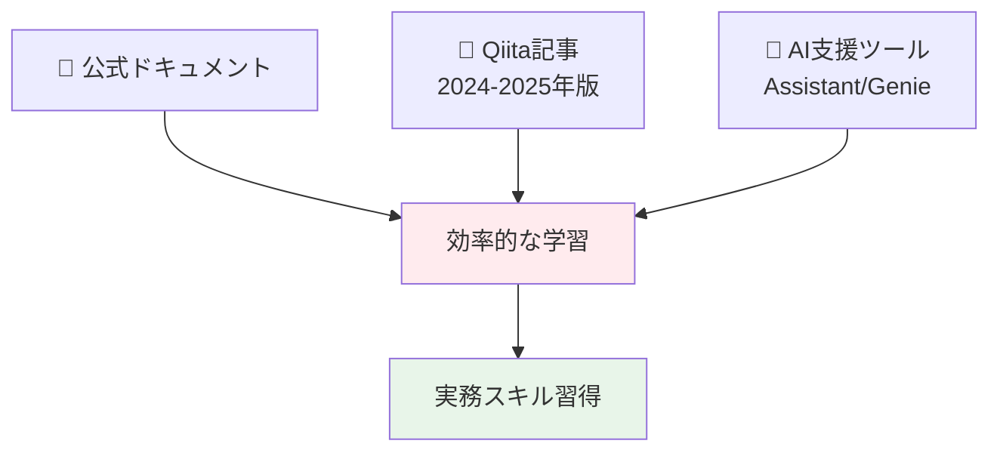

**重要なのは、AI支援を活用しながら、最新の機能を学び、まず始めることです。**

最初の一歩として公式ドキュメントの「Databricksの基本概念」を読み、Free Editionに登録し、クイックスタートを体験してみましょう！

## 次のステップ

1. 📘 [Databricksの基本概念（公式）](https://docs.databricks.com/ja/introduction/)を読む
2. 📝 [Databricks Free Edition](https://qiita.com/taka_yayoi/items/33e9cfa7ca9ca9febe72)に登録する
3. 📘 [データをクエリーして可視化（公式）](https://docs.databricks.com/ja/getting-started/quick-start.html)を体験する
4. 📘 [Databricks Assistant](https://docs.databricks.com/ja/notebooks/code-assistant.html)を使ってみる
5. 📝 [Genieリサーチエージェント](https://qiita.com/taka_yayoi/items/1c472621a7a5f9cd99cb)を体験する

# 参考リンク

- [Databricks公式ドキュメント（日本語）](https://docs.databricks.com/ja/index.html)
- [Databricks Japan Blog](https://www.databricks.com/jp/blog)
- [Databricks Community（英語）](https://community.databricks.com/)
- [Databricks Free Edition](https://qiita.com/taka_yayoi/items/33e9cfa7ca9ca9febe72)

---

**📝 記事数サマリー**
- 公式ドキュメント: 13リンク
- Qiita記事: 27記事（2024-2025年版を優先）
- 合計: 40リンク（目標達成！）
