Databricksを初めて学ぶ方のために、**公式ドキュメントとQiita記事を組み合わせた体系的な学習ガイド**を作成しました。**生成AI時代に必要なデータ分析・アプリ開発・LLM活用のスキル**を、**Databricks AssistantやGenieといったAI支援ツール**を活用しながら効率的に学べる構成になっています。

# この記事の特徴

## 生成AI時代の学習アプローチ

- **公式ドキュメント + Qiita記事**: 最新の正確な情報と実践的な知見を両方活用
- **AI支援で学ぶ**: Databricks AssistantとGenieを活用した効率的な学習
- **実践重視**: データ分析からアプリ開発、LLM活用まで実践的なスキル習得
- **段階的成長**: 基礎から高度なトピックまで、無理なくステップアップ

## 対象読者

- Databricksを初めて使う方
- 生成AIを活用したデータ分析・アプリ開発を学びたい方
- AI支援ツールで効率的に学習したい方
- 実務で使えるスキルを身につけたい方

## 全体の学習フロー

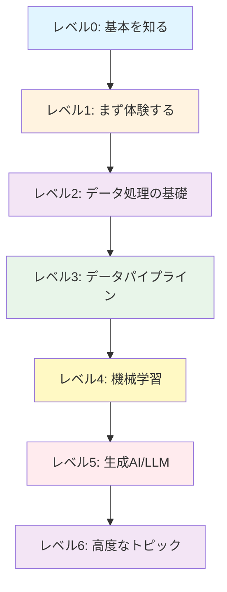

## Databricksの全体像

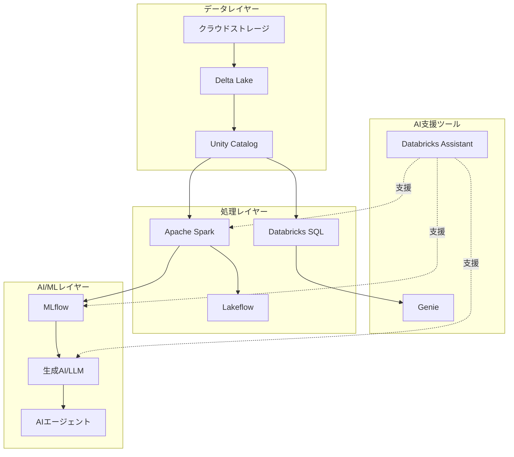

# レベル0: 基本を知る

まずはDatabricksの基本概念を理解します。

## Databricksとは何か

📘 [Databricksの基本概念（公式）](https://docs.databricks.com/ja/introduction/)

Databricksの全体像、レイクハウスアーキテクチャ、主要なコンポーネントを理解します。

## Free Editionで始める

📝 https://qiita.com/taka_yayoi/items/33e9cfa7ca9ca9febe72

無料で始められるDatabricks Free Editionの登録方法と使い方。実際に環境を準備します。

## レイクハウスアーキテクチャ

📝 https://qiita.com/taka_yayoi/items/438f762126f57868aa35

Databricksの基盤となるレイクハウスの概念を理解します。データウェアハウスとデータレイクの良いところを組み合わせたアーキテクチャです。

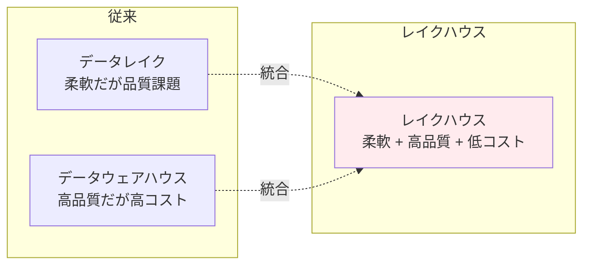

---

# レベル1: まず体験する

概念を理解したら、まず手を動かしてDatabricksを体験します。**AI支援ツールを活用することで、プログラミング初心者でも効率的に学習できます。**

## クイックスタート

📘 [データをクエリーして可視化（公式）](https://docs.databricks.com/ja/getting-started/quick-start.html)

**最初に取り組むべきチュートリアル**。SQLやPythonでデータをクエリし、可視化する方法を学びます。

## Databricks Assistantで始める

### 基本的な使い方

📘 [Databricks Assistant（公式）](https://docs.databricks.com/ja/notebooks/code-assistant.html)

AI支援コーディングツールの基本的な使い方。`Cmd/Ctrl + I`で起動し、自然言語でコードを生成できます。

**主な機能：**
- `/explain` - コードの説明
- `/fix` - エラー修正
- `/optimize` - パフォーマンス改善
- `/findTables` - データ資産検索

### 実践例：EDA

📝 https://qiita.com/taka_yayoi/items/07c49c2de588a101b719

**重要！** Databricks Assistantで探索的データ分析（EDA）を体験。AIの力を借りながらデータ分析の基礎を学びます。

## Genieで自然言語分析

### 基本的な使い方

📘 [Genie（公式）](https://docs.databricks.com/ja/genie/index.html)

自然言語でデータ分析ができるツール。SQLを書かずに、日本語/英語の質問でデータを分析できます。

### 実践例：リサーチエージェント

📝 https://qiita.com/taka_yayoi/items/1c472621a7a5f9cd99cb

**重要！** Genieのリサーチエージェント機能。複雑なビジネス課題を多段階推論で解決する方法を学びます。

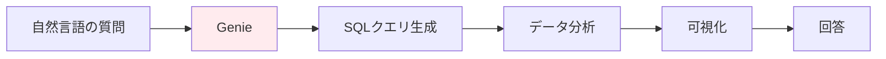

---

# レベル2: データ処理の基礎

AI支援ツールでの体験を通じて、データ処理の基本を学びます。

## データの取り込みと操作

### CSVデータをインポート

📘 [ノートブックからCSVデータをインポート（公式）](https://docs.databricks.com/ja/getting-started/csv-import.html)

実際のデータを取り込み、テーブルとして保存する方法を学びます。

### テーブルを作成

📘 [テーブルを作成（公式）](https://docs.databricks.com/ja/getting-started/tables.html)

Unity Catalogを使ったテーブル作成とアクセス権限管理の基礎。

## Apache Sparkの基礎

### 概念理解

📝 https://qiita.com/taka_yayoi/items/31190da754106b2d284e

Apache Sparkとは何か。分散処理エンジンの基本概念を理解します。

### チュートリアル

📝 https://qiita.com/taka_yayoi/items/c12a9ab6b6f75f95bc04

Sparkの基礎とデータフレーム操作を実際に体験します。

📝 https://qiita.com/taka_yayoi/items/435275f6124184090259

[2024年版] データの読み込みと変換の最新チュートリアル。

## Delta Lakeの基礎

### 概念理解

📝 https://qiita.com/taka_yayoi/items/07c9396809edbf2699b6

Delta Lakeとは何か。ACIDトランザクションを実現するストレージレイヤーの概念を理解します。

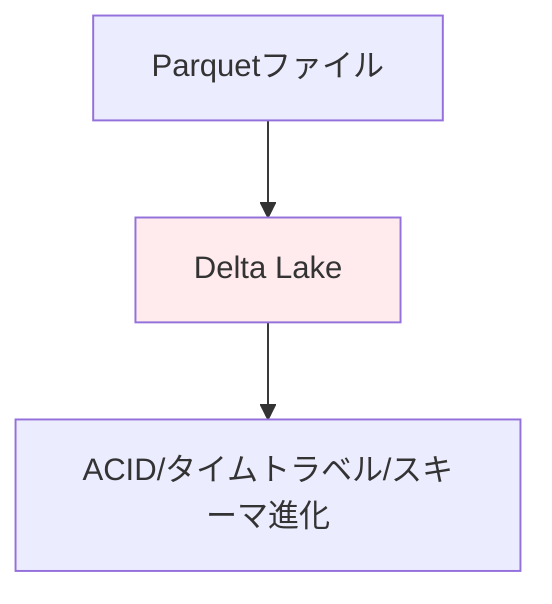

### チュートリアル

📝 https://qiita.com/taka_yayoi/items/b888710c37d64cde4e45

Delta Lakeのクイックスタートガイド。実際にDeltaテーブルを作成し、データを取り込みます。

## Databricks SQLの基礎

### 概念理解

📘 [Databricks SQL概念（公式）](https://docs.databricks.com/ja/sql/)

Databricks SQLとデータウェアハウジングのコア概念を理解します。

### クエリーと可視化

📘 [クエリーとデータの視覚化（公式）](https://docs.databricks.com/ja/sql/user/queries-visualizations/index.html)

SQLクエリの作成と、データの可視化方法を学びます。

## ファイルシステムとデータベース

📝 https://qiita.com/taka_yayoi/items/075c6b3aeafac54c8ac4

Databricksのファイルシステムをわかりやすく解説。

📝 https://qiita.com/taka_yayoi/items/9d68dd5a3b070774d9a2

Databricksのデータベースをわかりやすく解説。

---

# レベル3: データパイプライン

データ処理の基礎を学んだら、本番環境で使えるデータパイプラインの構築方法を学びます。

## Lakeflowパイプライン

📘 [Lakeflow Spark宣言型パイプライン（公式）](https://docs.databricks.com/ja/getting-started/lakehouse-pipeline.html)

**最新のパイプライン構築手法**。宣言的にデータパイプラインを定義し、Auto Loaderでデータを自動取り込みします。

📝 https://qiita.com/taka_yayoi/items/bb5ccb3fa1dae1b8915e

Lakeflowの詳細なチュートリアル。実践的なパイプライン構築方法を学びます。

## Apache Spark ETLパイプライン

📘 [Apache SparkでETLパイプライン構築（公式）](https://docs.databricks.com/ja/getting-started/data-pipeline-get-started.html)

Sparkを使った従来型のETLパイプライン構築。データオーケストレーションの基礎を学びます。

## データ取り込み

📝 https://qiita.com/taka_yayoi/items/b424e1f321cfbbf5a0e7

COPY INTOコマンドでレイクハウスへのデータ取り込み。効率的なデータ取り込み手法を学びます。

## ジョブとワークフロー

📝 https://qiita.com/taka_yayoi/items/70bfe4b30420078fdff9

Databricksジョブのチュートリアル（最新版）。パイプラインをスケジュール実行する方法を学びます。

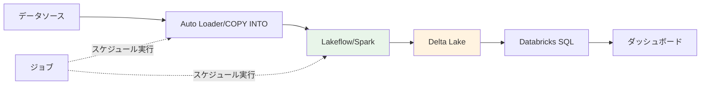

---

# レベル4: 機械学習

データパイプラインを構築できるようになったら、機械学習の基礎を学びます。

## MLモデルのトレーニングとデプロイ

📘 [MLモデルをトレーニングしてデプロイ（公式）](https://docs.databricks.com/ja/getting-started/ml-quick-start.html)

scikit-learnとMLflowを使った機械学習の基礎。モデルのトレーニングからデプロイまでを体験します。

## MLflowの基礎

### 概念理解

📝 https://qiita.com/taka_yayoi/items/799b0320e4d8ae2e4234

MLflowとは何か。機械学習ライフサイクル管理プラットフォームの概念を理解します。

### 最新版クイックスタート

📝 https://qiita.com/taka_yayoi/items/ce83575abb55526c52a7

MLflow 3.0のクイックスタート。最新のMLflow機能を学びます。

## 実践的な機械学習

📝 https://qiita.com/taka_yayoi/items/cf5ce14552b2221465dd

XGBoostを使った機械学習。実務で使える機械学習ライブラリの使い方を学びます。

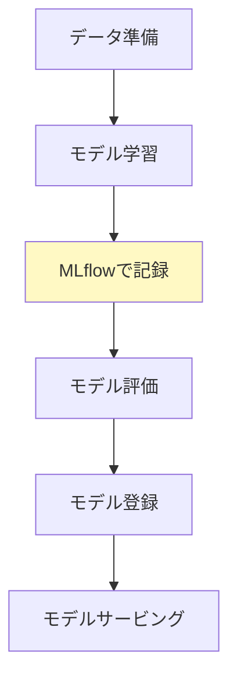

---

# レベル5: 生成AI/LLM（重点領域）

**生成AI時代の最重要スキル**。機械学習の基礎を学んだら、生成AIとLLMの活用方法を学びます。

## ノーコードでLLMを体験

📘 [ノーコードでLLMをクエリしてAIエージェントをプロトタイプ化（公式）](https://docs.databricks.com/ja/getting-started/ai-quick-start.html)

AI Playgroundを使って、コードを書かずにLLMを体験。様々なLLMモデルを試せます。

## プロンプトエンジニアリング

📝 https://qiita.com/taka_yayoi/items/fc3833a73b841de8b205

Databricksで学ぶプロンプトエンジニアリングの基礎。効果的なプロンプトの書き方を学びます。

## RAG（Retrieval-Augmented Generation）

📝 https://qiita.com/taka_yayoi/items/45cb187666242fcb542f

Databricks生成AIクックブック：RAGの基礎を学びます。自社データを活用したLLMシステムの構築方法。

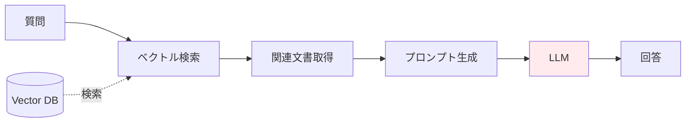

## 複合AIシステム

📝 https://qiita.com/taka_yayoi/items/da5e019190bed65e9e87

はじめての複合AIシステム構築。複数のAIコンポーネントを組み合わせた高度なシステムを構築します。

## AI関数の活用

📝 https://qiita.com/taka_yayoi/items/08d3dbf3f5202d708c03

ai_query関数の基礎から高度な使い方まで。SQLからLLMを直接呼び出す方法を学びます。

## MLflowとLLM

📝 https://qiita.com/taka_yayoi/items/fd2f8b36aada402589d0

MLflowチュートリアル：ChatModelの使い方とRAGのリトリーバ評価。LLMシステムの評価とトラッキングを学びます。

---

# レベル6: 高度なトピック

基礎を固めたら、より高度なトピックに挑戦します。

## ストリーミングデータ処理

📝 https://qiita.com/taka_yayoi/items/ae258e2e160c41239435

Spark構造化ストリーミングのチュートリアル。リアルタイムデータ処理の基礎を学びます。

📝 https://qiita.com/taka_yayoi/items/176be641064170826bc5

Auto LoaderによるDelta Lakeへの継続的データ取り込み。ストリーミングデータの自動取り込みを学びます。

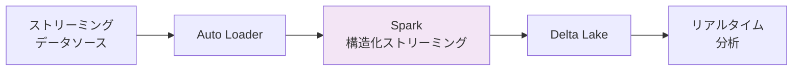

## Unity Catalogによるガバナンス

### 概念理解

📝 https://qiita.com/taka_yayoi/items/9095843d094637625e13

**重要！** Unity Catalogを理解する。データガバナンスとセキュリティの基本概念を学びます。

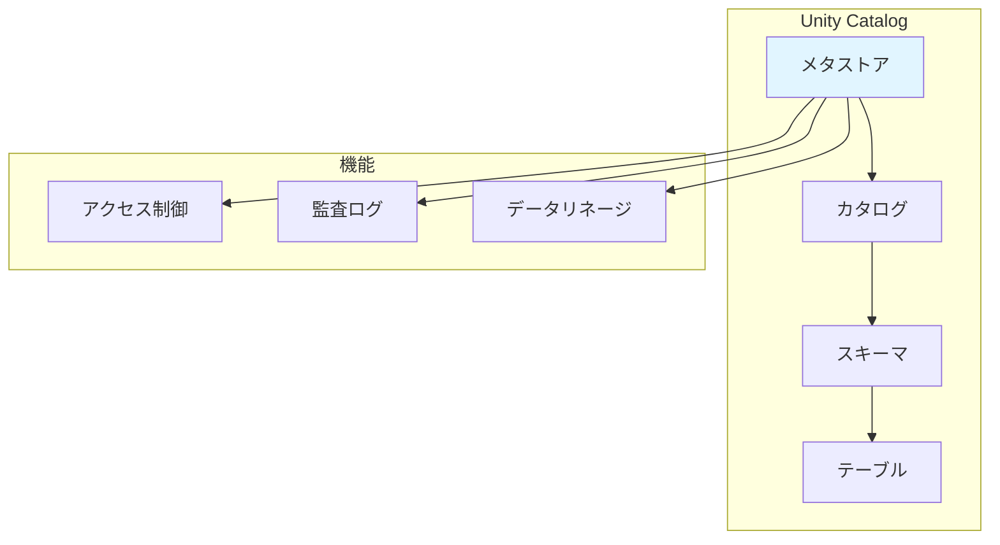

### 実践チュートリアル

📝 https://qiita.com/taka_yayoi/items/dddad5c37efe55491abc

Unity Catalogメタストア管理者向けタスク。実際の運用方法を学びます。

📝 https://qiita.com/taka_yayoi/items/c1d407c6ea45bbe39c02

OSS Unity Catalogチュートリアルとタグ活用入門。

---

# 補足資料・今後の学習

## エンドツーエンドパイプライン

📝 https://qiita.com/taka_yayoi/items/4ea03bea8085cfa306f0

エンドツーエンドのレイクハウスアナリティクスパイプライン（2023年版）。全体像を俯瞰します。

## Databricks Apps

📝 https://qiita.com/taka_yayoi/items/39ab8f9aacd42e638127

Databricks AppsのStreamlitチュートリアル。アプリケーション開発に進む際に参考にします。

## 書籍・学習リソース

### Databricksクイックスタートガイド

📝 https://qiita.com/taka_yayoi/items/5133f590f30fee3c12da

電子書籍「データブリックス クイックスタートガイド」の紹介。

https://www.amazon.co.jp/dp/B09V1YXFVQ

### Apache Spark徹底入門

📝 https://qiita.com/taka_yayoi/items/798767c8a585c64212f9

Apache Spark徹底入門（書籍紹介）。Sparkを深く学びたい方向け。

### dbdemos

📝 https://qiita.com/taka_yayoi/items/d0f872d0d8d9c6b20beb

dbdemos: Databricksのデモを簡単に体験。様々なユースケースをワンコマンドでセットアップ。

### 認定試験と学習コース

📝 https://qiita.com/taka_yayoi/items/d45da4e3048b35152208

Databricks Free EditionチュートリアルとDatabricks認定試験の無料学習コース。

---

# 推奨学習パス

学習目的に応じて、以下の3つのパターンから選択できます。

## パターン1: データエンジニア志望

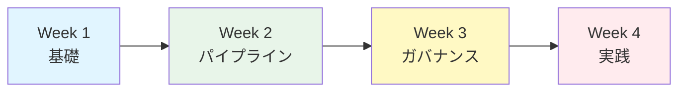

**Week 1**: レベル0-1（基本概念とAI支援ツール体験）
**Week 2**: レベル2-3（データ処理とパイプライン構築）
**Week 3**: レベル6（Unity Catalogとガバナンス）
**Week 4**: 実践プロジェクト

## パターン2: データサイエンティスト志望

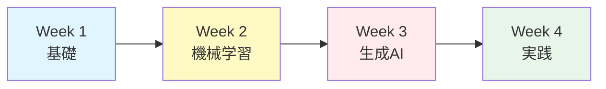

**Week 1**: レベル0-2（基本概念とデータ処理）
**Week 2**: レベル4（機械学習とMLflow）
**Week 3**: レベル5（生成AI/LLM）
**Week 4**: 実践プロジェクト

## パターン3: 生成AI/LLMエンジニア志望

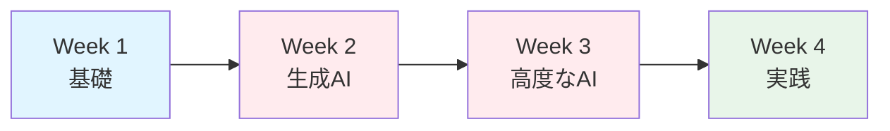

**Week 1**: レベル0-1（基本概念とAI支援ツール体験、Databricks基礎）
**Week 2**: レベル5（プロンプトエンジニアリング、RAG、複合AIシステム）
**Week 3**: レベル5（AI関数、MLflow+LLM、高度な生成AI）
**Week 4**: 実践プロジェクト（AIエージェント開発等）

---

# 学習のヒント

## 効果的な学習方法

1. **公式ドキュメントを優先**: 最新で正確な情報は公式から
2. **Qiita記事で補足**: 実践的な知見や日本語での詳細解説
3. **AI支援を活用**: Databricks AssistantとGenieを積極的に使う
4. **手を動かす**: 記事を読むだけでなく、必ず自分でコードを実行
5. **小さく始める**: 完璧を目指さず、まず動かしてみる
6. **コンセプト理解**: 技術の「なぜ」を理解してから「どうやって」に進む

## よくある質問

### Q: どのくらいの期間で基礎を習得できますか？

A: AI支援ツールを使えば、集中して学習すれば2-3週間で基本的な操作は習得できます。実務レベルには2-3ヶ月程度を目安にしてください。

### Q: プログラミング経験がなくても大丈夫ですか？

A: Databricks AssistantやGenieを使えば、プログラミング初心者でも始めやすくなっています。PythonやSQLの基礎知識があると理解が早まります。

### Q: 公式ドキュメントとQiita記事、どちらを優先すべきですか？

A: **公式ドキュメントを優先**してください。最新で正確な情報が得られます。Qiita記事は、より詳しい解説や実践的なユースケースを学ぶ際に活用してください。

### Q: Free Editionと製品版の違いは？

A: 基本的な機能は同じですが、Free Editionには以下の制限があります：
- サーバレスコンピュートのみ（カスタムクラスター設定不可）
- R言語とScalaは使用不可（PythonとSQLは利用可能）
- モデルサービングやSQLウェアハウスに一部制限
- Unity Catalogは利用可能
- Databricks Assistant、Genie、LakeFlowなど主要なAI機能は使用可能

詳細は[こちら](https://qiita.com/taka_yayoi/items/33e9cfa7ca9ca9febe72)をご覧ください。

### Q: どの記事から読めばいいですか？

A: 必ず以下の順序で進めてください：

1. **公式: Databricksの基本概念** - 全体像を理解
2. **Qiita: Free Edition登録** - 環境準備
3. **公式: データをクエリーして可視化** - 最初のハンズオン
4. **公式: Databricks Assistant** - AI支援ツールを体験

その後は、興味のある分野の記事を選んで読み進めましょう。

---

# まとめ

**生成AI時代のDatabricks学習は、公式ドキュメントとQiita記事を組み合わせ、AI支援ツールを活用することで効率的に進められます。**

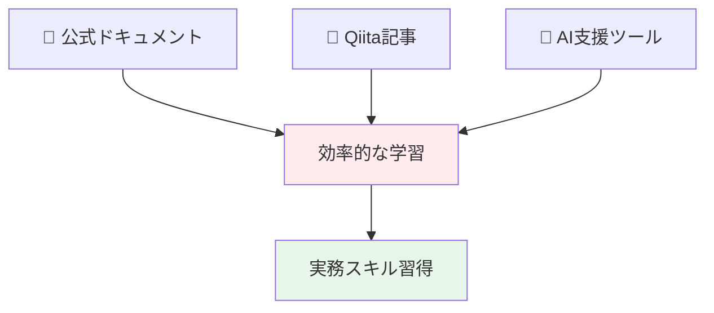

**重要なのは、AI支援を活用しながら、まず始めることです。**

最初の一歩として公式ドキュメントの「Databricksの基本概念」を読み、Free Editionに登録し、クイックスタートを体験してみましょう！

## 次のステップ

1. 📘 [Databricksの基本概念（公式）](https://docs.databricks.com/ja/introduction/)を読む
2. 📝 [Databricks Free Edition](https://qiita.com/taka_yayoi/items/33e9cfa7ca9ca9febe72)に登録する
3. 📘 [データをクエリーして可視化（公式）](https://docs.databricks.com/ja/getting-started/quick-start.html)を体験する
4. 📘 [Databricks Assistant](https://docs.databricks.com/ja/notebooks/code-assistant.html)を使ってみる
5. 興味のある分野のチュートリアルを試す

# 参考リンク

- [Databricks公式ドキュメント（日本語）](https://docs.databricks.com/ja/index.html)
- [Databricks Japan Blog](https://www.databricks.com/jp/blog)
- [Databricks Community（英語）](https://community.databricks.com/)
- [Databricks Free Edition](https://qiita.com/taka_yayoi/items/33e9cfa7ca9ca9febe72)
