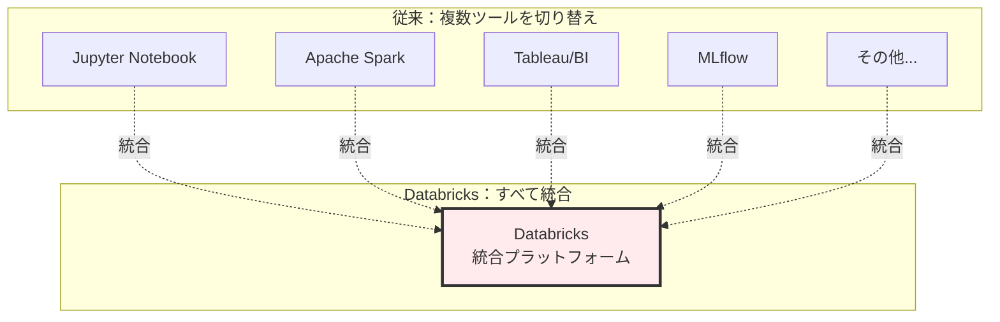
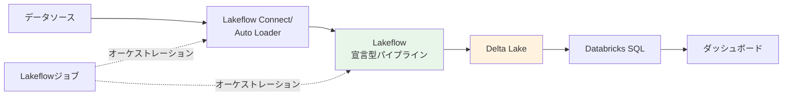
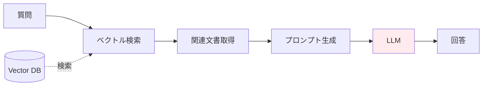
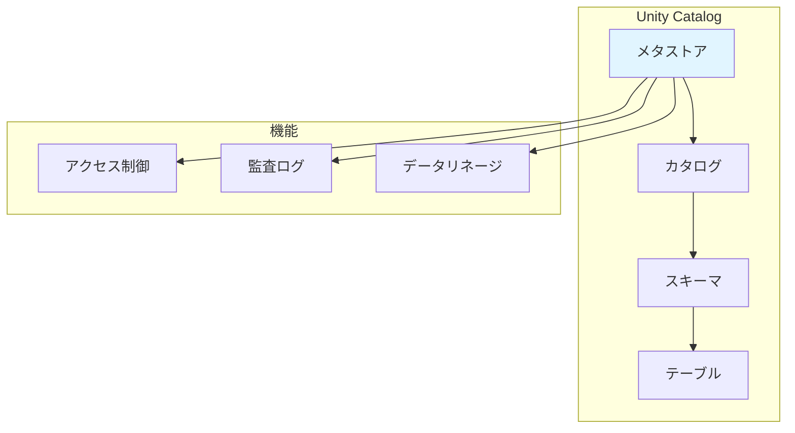
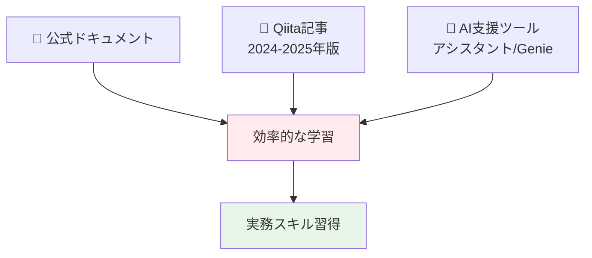

## Databricksとは？

**Databricks = データ分析・機械学習・生成AIのための統合クラウドプラットフォーム**

従来は「データ処理はSpark」「分析はJupyter」「BIはTableau」「MLはMLflow」と別々のツールを使っていましたが、Databricksはこれらを**1つに統合**。ノートブック、データパイプライン、ダッシュボード、AI/ML機能がすべて連携して使えます。

**イメージ**: Google Colabの超強化版 + データベース + 本番運用機能

## Databricksはこんな時に使います

- 📊 **データアナリスト**: 数百GBのログデータをSQLで分析→ダッシュボード化
- 🔧 **データエンジニア**: 毎日深夜に自動でデータ取り込み→整形→保存
- 🤖 **データサイエンティスト**: 機械学習モデルを開発→本番環境にデプロイ
- 💬 **LLMエンジニア**: 社内ドキュメントを使ったRAGチャットボット構築

**pandas経験者の方へ**: Jupyter Notebookで分析していたデータが大きくなりすぎた、チームで共有したい、本番運用したい...そんな時がDatabricksの出番です。

---

Databricksを初めて学ぶ方のために、**公式ドキュメントとQiita記事を組み合わせた体系的な学習ガイド**を作成しました。 **AI支援ツール（アシスタントやGenie）** を活用しながら効率的に学べる構成になっています。

# この記事の特徴

## 生成AI時代の学習アプローチ

従来は全てのコードを自分で書く必要がありましたが、**今はDatabricksアシスタントに日本語で「このデータを集計して」と指示するだけでコードが自動生成されます**。この変化を活用した学習方法を採用：

- **AI支援で学ぶ**: アシスタントとGenieを使えば、プログラミング初心者でも効率的に学習できる
- **公式ドキュメント + Qiita記事**: 最新の正確な情報と実践的な知見を両方活用
- **実践重視**: データ分析からアプリ開発、LLM活用まで実践的なスキル習得
- **段階的成長**: 基礎から高度なトピックまで、7つのレベルで無理なくステップアップ

## 対象読者

- Databricksを初めて使う方
- 生成AIを活用したデータ分析・アプリ開発を学びたい方
- AI支援ツールで効率的に学習したい方
- 実務で使えるスキルを身につけたい方
- **pandas経験者**: Jupyter NotebookやGoogle Colabでデータ分析をしてきた方

## pandas経験者のためのDatabricks入門

**pandasとDatabricksの違いは？**

| 観点 | pandas | Databricks |
|------|--------|------------|
| データサイズ | 数GB程度まで | TB〜PB級の大規模データ |
| 実行環境 | 単一マシン | 分散クラスター（複数マシン） |
| データ処理 | メモリ上で処理 | 分散処理（Apache Spark） |
| 本番運用 | 手動実行が多い | 自動化・スケジュール実行 |
| チーム開発 | 個人作業が多い | データガバナンス・権限管理 |
| AI/ML | scikit-learn等 | MLflow、生成AI統合 |

**Databricksで何ができるようになる？**
- 💾 大規模データ（数百GB〜TB）の処理
- 🔄 データパイプラインの自動化
- 👥 チームでのデータ共有・権限管理
- 🤖 生成AIを活用したデータ分析・アプリ開発
- 📊 本番環境での安定運用

## 全体の学習フロー

| レベル | 難易度 | 時間 | 学習内容 | 前提知識 |
|--------|--------|------|----------|----------|
| [レベル0](#レベル0-基本を知る) | ★☆☆☆☆ | 1-2h | 基本概念、環境構築 | なし |
| [レベル1](#レベル1-まず体験する) | ★★☆☆☆ | 2-3h | AI支援ツール体験 | レベル0 |
| [レベル2](#レベル2-データ処理の基礎) | ★★★☆☆ | 5-7h | Spark, Delta Lake, SQL | Python/SQL基礎 |
| [レベル3](#レベル3-データパイプライン) | ★★★☆☆ | 4-6h | Lakeflow、自動化 | レベル2 |
| [レベル4](#レベル4-機械学習) | ★★★★☆ | 4-5h | MLflow、モデル管理 | レベル2、機械学習基礎 |
| [レベル5](#レベル5-生成aillm重点領域) | ★★★★☆ | 5-7h | RAG、LLM統合 | レベル4 |
| [レベル6](#レベル6-高度なトピック) | ★★★★★ | 6-8h | ストリーミング、ガバナンス | レベル3+4 |

## 知っておくべき基本用語

この記事を読む前に、以下の基本用語を理解しておきましょう：

### データ基盤関連
- **[レイクハウス](https://docs.databricks.com/ja/lakehouse/index.html)**: データレイク（大量の生データを安価に保存）とデータウェアハウス（高速なクエリ実行）の良いところを組み合わせたアーキテクチャ
- **[Delta Lake](https://docs.databricks.com/ja/delta/index.html)**: データに「履歴管理」「トランザクション」機能を追加するストレージ技術。git のようにデータのバージョン管理ができる。 **ACID保証 (Atomicity, Consistency, Isolation, Durability)** により、複数人が同時にデータ更新しても整合性が保たれる
- **[Apache Spark](https://docs.databricks.com/ja/getting-started/spark/index.html)**: 大規模データを複数のマシンで分散処理するエンジン。pandas の分散版のようなイメージ。 **例**: pandasで10時間かかる処理が、10台のマシン（クラスター）で1時間で完了
- **クラスター**: 複数のマシンをまとめて1つの大きなコンピュータのように使う仕組み。データを分割して並列処理することで高速化
- **[サーバレスコンピュート](https://docs.databricks.com/ja/serverless-compute/index.html)**: サーバーの設定や管理が不要な実行環境。Databricksが自動的にリソースを割り当て・スケール。Jupyter NotebookをGoogle Colabで実行するのと似た感覚

### データ処理関連
- **[ETL](https://docs.databricks.com/ja/getting-started/etl-quick-start.html)**: Extract（抽出）→ Transform（変換）→ Load（読み込み）の頭文字。データを整形して別の場所に保存する処理
- **[Lakeflowジョブ](https://docs.databricks.com/ja/workflows/jobs/index.html)**: データ処理の自動化された流れ。「毎日深夜にデータを取得→整形→保存」のような一連の処理を自動実行
- **オーケストレーション**: 複数の処理を順番に実行すること。 **例**: ①データ取り込み完了→②データ変換開始→③失敗したらSlack通知、のように処理の流れを制御
- **[ストリーミング](https://docs.databricks.com/ja/structured-streaming/index.html)**: リアルタイムで流れてくるデータ（ログ、センサーデータなど）を処理すること

### データガバナンス関連
- **[Unity Catalog](https://docs.databricks.com/ja/data-governance/unity-catalog/index.html)**: データへのアクセス権限を管理する仕組み。 **例**: AさんにはマーケティングデータのSELECT権限のみ、Bさんには全テーブルの編集権限を付与、のようにチーム開発で権限を細かく制御
- **[データガバナンス](https://docs.databricks.com/ja/data-governance/index.html)**: データの管理・統制。セキュリティ、権限管理、監査ログなどを含む

### AI/ML関連
- **[MLflow](https://docs.databricks.com/ja/mlflow/index.html)**: 機械学習の実験管理ツール。 **なぜ必要？** 実験が100回を超えると、どの設定が良かったか分からなくなる問題を解決。パラメータ、精度、バージョンを自動記録して比較できる。 **例**: 学習率0.01と0.001、どちらが良かったかを後から簡単に比較
- **[RAG](https://docs.databricks.com/ja/generative-ai/retrieval-augmented-generation.html)** (Retrieval-Augmented Generation): 自社データを検索して、その結果をLLMに渡して回答を生成する手法。 **Vector DB** = 文章の意味の類似度で検索できるデータベース（普通のDBは完全一致検索、Vector DBは"似た意味"で検索）を使用
- **[Mosaic AI](https://docs.databricks.com/ja/machine-learning/index.html)**: Databricksの統合AI/MLプラットフォーム。機械学習から生成AIまでをカバー

## Databricksの主要機能（初心者向け）

### 📓 1. Notebooks（ノートブック）
Jupyter Notebookのような環境。Python/SQLでデータ分析ができます。
- **AI支援**: [Databricksアシスタント](https://docs.databricks.com/ja/notebooks/code-assistant.html)が日本語でコード生成
- **例**: 「売上データを月別に集計して」→ アシスタントが自動でコード生成

### 📊 2. AI/BI（分析・可視化）
- **[Genie](https://docs.databricks.com/ja/genie/index.html)**: 「先月の売上トップ10は？」と日本語で質問→自動でグラフ作成
- **[ダッシュボード](https://docs.databricks.com/ja/dashboards/index.html)**: 分析結果を可視化してチームで共有

### 🔄 3. Lakeflow（データ自動化）
毎日決まった時間にデータ取り込み→整形→保存を自動実行。pandasのスクリプトをcronで回すのと似ているが、もっと簡単。
- **[Connect](https://docs.databricks.com/ja/ingestion/index.html)**: MySQL、S3などから自動取り込み（ノーコード）
- **[ジョブ](https://docs.databricks.com/ja/workflows/jobs/index.html)**: 処理の自動実行・スケジュール管理

### 🤖 4. Mosaic AI（機械学習・生成AI）
- **[MLflow](https://docs.databricks.com/ja/mlflow/index.html)**: 機械学習の実験管理・モデルデプロイ
- **RAG**: 社内ドキュメントを使ったLLMチャットボット構築

### 💾 5. 基盤技術（裏で動いている）
- **[Apache Spark](https://docs.databricks.com/ja/getting-started/spark/index.html)**: 大規模データを複数マシンで高速処理（pandas の分散版）
- **[Delta Lake](https://docs.databricks.com/ja/delta/index.html)**: データのバージョン管理とトランザクション（gitのようなもの）
- **[Unity Catalog](https://docs.databricks.com/ja/data-governance/unity-catalog/index.html)**: チーム開発のための権限管理

---

# レベル0: 基本を知る

**このレベルで学ぶこと**: Databricksとは何か、どんなことができるのか
**所要時間**: 1-2時間
**完了後にできること**: Databricksの全体像を説明できる、Free Editionで環境構築できる

- [はじめてのDatabricks](https://qiita.com/taka_yayoi/items/8dc72d083edb879a5e5d) - Databricksとは何か、分かりやすく解説
- 📘 [Databricksの基本概念（公式）](https://docs.databricks.com/ja/introduction/) - 全体像とコンポーネント
- [Free Edition登録方法](https://qiita.com/taka_yayoi/items/33e9cfa7ca9ca9febe72) - 無料で環境構築
- [レイクハウスとは何か](https://qiita.com/taka_yayoi/items/438f762126f57868aa35) - データレイク + データウェアハウスの統合アーキテクチャ

---

# レベル1: まず体験する

**このレベルで学ぶこと**: AI支援ツールの使い方、基本的なデータ操作
**所要時間**: 2-3時間
**完了後にできること**: Databricksアシスタントでコード生成、Genieで自然言語データ分析

**AI支援ツールを活用することで、プログラミング初心者でも効率的に学習できます。**

### クイックスタート
- 📘 [データをクエリーして可視化（公式）](https://docs.databricks.com/ja/getting-started/quick-start.html) - 最初に取り組むべきチュートリアル

### Databricksアシスタント（AIコード生成）
- 📘 [基本的な使い方（公式）](https://docs.databricks.com/ja/notebooks/code-assistant.html) - `/explain` `/fix` `/optimize` `/findTables`
- [実践：EDA](https://qiita.com/taka_yayoi/items/07c49c2de588a101b719) - AI支援で探索的データ分析

### Genie（自然言語分析）
- 📘 [基本的な使い方（公式）](https://docs.databricks.com/ja/genie/index.html) - SQLを書かずに日本語で質問

https://qiita.com/taka_yayoi/items/1c472621a7a5f9cd99cb

:::note info
**最新機能（2025-11-20）**: Genieは日本語の質問を自動的にSQLに変換→データ分析→可視化まで実行。「先月の売上トップ10は？」と聞くだけで結果が得られます。
:::

---

# レベル2: データ処理の基礎

**このレベルで学ぶこと**: Spark、Delta Lake、SQLの基礎
**所要時間**: 5-7時間
**完了後にできること**: 大規模データの読み込み・変換・保存、基本的なSQLクエリ実行
**pandasとの対応**: DataFrameの操作がSparkでもできるようになる

AI支援ツールでの体験を通じて、データ処理の基本を学びます。

## データの取り込みと操作

### CSVデータをインポート

📘 [ノートブックからCSVデータをインポート（公式）](https://docs.databricks.com/ja/getting-started/csv-import.html)

実際のデータを取り込み、テーブルとして保存する方法を学びます。

### テーブルを作成

📘 [テーブルを作成（公式）](https://docs.databricks.com/ja/getting-started/tables.html)

Unity Catalogを使ったテーブル作成とアクセス権限管理の基礎。

## Apache Sparkの基礎

### 概念理解

https://qiita.com/taka_yayoi/items/31190da754106b2d284e

Apache Sparkとは何か（2025-08-13更新）。分散処理エンジンの基本概念を理解します。

### チュートリアル

https://qiita.com/taka_yayoi/items/c12a9ab6b6f75f95bc04

Sparkの基礎とデータフレーム操作を実際に体験します。

https://qiita.com/taka_yayoi/items/435275f6124184090259

[2024年版] データの読み込みと変換の最新チュートリアル。

## Delta Lakeの基礎

### 概念理解

https://qiita.com/taka_yayoi/items/07c9396809edbf2699b6

Delta Lakeとは何か（2025-05-28更新）。ParquetファイルにACID/タイムトラベル/スキーマ進化機能を追加するストレージレイヤー。

### チュートリアル

https://qiita.com/taka_yayoi/items/345f503d5f8177084f24

Delta Lakeのクイックスタートガイド。実際にDeltaテーブルを作成し、データを取り込みます。

## Databricks SQLの基礎

### 概念理解

📘 [Databricks SQL概念（公式）](https://docs.databricks.com/ja/sql/)

Databricks SQLとデータウェアハウジングのコア概念を理解します。

### クエリーと可視化

📘 [クエリーとデータの視覚化（公式）](https://docs.databricks.com/ja/sql/user/queries-visualizations/index.html)

SQLクエリの作成と、データの可視化方法を学びます。

## ファイルシステムとデータベース

https://qiita.com/taka_yayoi/items/075c6b3aeafac54c8ac4

Databricksのファイルシステムをわかりやすく解説。

https://qiita.com/taka_yayoi/items/9d68dd5a3b070774d9a2

Databricksのデータベースをわかりやすく解説。

---

# レベル3: データパイプライン

**このレベルで学ぶこと**: 自動化されたデータ処理の構築
**所要時間**: 4-6時間
**完了後にできること**: スケジュール実行されるデータパイプラインの構築、イベント駆動の自動化
**実務での使い道**: 毎日深夜にデータを自動更新、エラーを検知して通知

データ処理の基礎を学んだら、本番環境で使えるデータパイプラインの構築方法を学びます。

## Lakeflow（最新のデータエンジニアリング）

LakeflowはConnect（データ取り込み）、Spark宣言型パイプライン（データ変換）、ジョブ（オーケストレーション）の3つから構成されるデータエンジニアリングの統合ソリューションです。

### 基本チュートリアル

📘 [Lakeflow Spark宣言型パイプライン（公式）](https://docs.databricks.com/ja/getting-started/lakehouse-pipeline.html)

**最新のパイプライン構築手法**。宣言的にデータパイプラインを定義し、データ変換を自動化します。

https://qiita.com/taka_yayoi/items/bb5ccb3fa1dae1b8915e

Lakeflow Spark宣言型パイプラインの詳細なチュートリアル（2025-10-28更新）。

### 最新UI

https://qiita.com/taka_yayoi/items/e238973c848b7115af61

Databricksの新たなLakeflowジョブUI（2025-07-08）。最新のUI操作方法を学びます。

### ワークフロー自動化

https://qiita.com/taka_yayoi/items/64fac4388fa173820591

テーブル更新をトリガーにジョブを自動実行（2025-10-19）。イベントドリブンなパイプライン構築を学びます。

## Apache Spark ETLパイプライン

📘 [Apache SparkでETLパイプライン構築（公式）](https://docs.databricks.com/ja/getting-started/data-pipeline-get-started.html)

Sparkを使った従来型のETLパイプライン構築。データオーケストレーションの基礎を学びます。

## データ取り込み

https://qiita.com/taka_yayoi/items/b424e1f321cfbbf5a0e7

COPY INTOコマンドでレイクハウスへのデータ取り込み。効率的なデータ取り込み手法を学びます。

**図の説明**: データソースからダッシュボードまでの一連の流れを自動化します。
1. **Lakeflow Connect**: データを自動取り込み（pandas の `pd.read_csv()` の自動化版）
2. **宣言型パイプライン**: データを変換（pandasの`df.transform()`の自動化版）
3. **Lakeflowジョブ**: 全体を定期実行（cronのような役割）

---

# レベル4: 機械学習

**このレベルで学ぶこと**: MLflowを使った機械学習の実験管理
**所要時間**: 4-5時間
**完了後にできること**: モデルのトレーニング、評価、デプロイ、バージョン管理
**Jupyter Notebookとの違い**: 実験の履歴が自動記録され、モデルが本番デプロイできる

データパイプラインを構築できるようになったら、機械学習の基礎を学びます。

## MLモデルのトレーニングとデプロイ

📘 [MLモデルをトレーニングしてデプロイ（公式）](https://docs.databricks.com/ja/getting-started/ml-quick-start.html)

scikit-learnとMLflowを使った機械学習の基礎。モデルのトレーニングからデプロイまでを体験します。

## MLflowの基礎

### 概念理解

https://qiita.com/taka_yayoi/items/799b0320e4d8ae2e4234

MLflowとは何か。機械学習ライフサイクル管理プラットフォームの概念を理解します。

### 最新版クイックスタート

https://qiita.com/taka_yayoi/items/ce83575abb55526c52a7

MLflow 3.0のクイックスタート。最新のMLflow機能を学びます。

## 実践的な機械学習

https://qiita.com/taka_yayoi/items/cf5ce14552b2221465dd

XGBoostを使った機械学習。実務で使える機械学習ライブラリの使い方を学びます。

---

# レベル5: 生成AI/LLM（重点領域）

**このレベルで学ぶこと**: RAG、LLMの統合、AI関数の活用
**所要時間**: 5-7時間
**完了後にできること**: 自社データを使ったLLMシステム構築、SQLから直接LLM呼び出し
**重点領域の理由**: 2025年現在、最も需要が高く、ビジネス価値が高いスキル

**生成AI時代の最重要スキル**。機械学習の基礎を学んだら、生成AIとLLMの活用方法を学びます。

## ノーコードでLLMを体験

📘 [ノーコードでLLMをクエリしてAIエージェントをプロトタイプ化（公式）](https://docs.databricks.com/ja/getting-started/ai-quick-start.html)

AI Playgroundを使って、コードを書かずにLLMを体験。様々なLLMモデルを試せます。

## RAG（Retrieval-Augmented Generation）

https://qiita.com/taka_yayoi/items/45cb187666242fcb542f

Databricks生成AIクックブック：RAGの基礎を学びます。自社データを活用したLLMシステムの構築方法。

**図の説明**: RAGの仕組みを示しています。
1. ユーザーの質問に関連する文書をデータベースから検索
2. 見つかった文書をLLMに渡す
3. LLMが文書を参照しながら回答を生成

これにより、自社データを使った正確な回答が可能になります。LLMの「幻覚（hallucination）」を防げます。

## AI関数の活用

https://qiita.com/taka_yayoi/items/08d3dbf3f5202d708c03

ai_query関数の基礎から高度な使い方まで。SQLからLLMを直接呼び出す方法を学びます。

## MLflowとLLM

https://qiita.com/taka_yayoi/items/fd2f8b36aada402589d0

MLflowチュートリアル：ChatModelの使い方とRAGのリトリーバ評価。LLMシステムの評価とトラッキングを学びます。

https://qiita.com/taka_yayoi/items/2fd4c9fef0ffe8377f48

MLflow3とDatabricksで実現するLLMops（2025-10-26）。MLflow 3の最新機能でLLMの運用管理を学びます。

---

# レベル6: 高度なトピック

**このレベルで学ぶこと**: リアルタイム処理、データガバナンス、複合AIシステム
**所要時間**: 6-8時間
**完了後にできること**: ストリーミングデータ処理、Unity Catalogでの権限管理、本番運用
**本番環境への準備**: チーム開発とセキュアなデータ管理

基礎を固めたら、より高度なトピックに挑戦します。

## 複合AIシステム

https://qiita.com/taka_yayoi/items/da5e019190bed65e9e87

はじめての複合AIシステム構築。複数のAIコンポーネントを組み合わせた高度なシステムを構築します。

## ストリーミングデータ処理

https://qiita.com/taka_yayoi/items/ae258e2e160c41239435

Spark構造化ストリーミングのチュートリアル。リアルタイムデータ処理の基礎を学びます。

https://qiita.com/taka_yayoi/items/176be641064170826bc5

Auto LoaderによるDelta Lakeへの継続的データ取り込み。ストリーミングデータの自動取り込みを学びます。

## Unity Catalogによるガバナンス

### 概念理解

https://qiita.com/taka_yayoi/items/9095843d094637625e13

:::note info
Unity Catalogを理解する。データガバナンスとセキュリティの基本概念を学びます。本番環境でDatabricksを使う際には必須の知識です。
:::

### 実践チュートリアル

https://qiita.com/taka_yayoi/items/dddad5c37efe55491abc

Unity Catalogメタストア管理者向けタスク。実際の運用方法を学びます。

### 実践的な構造化パターン

https://qiita.com/taka_yayoi/items/9e79f110ed2de517f15a

プロのようにUnity Catalogを構造化する方法（2025-09-10）。データチームにおける現実世界の階層パターンを学びます。

https://qiita.com/taka_yayoi/items/af0d9a6e399c2937d787

Unity Catalogのアクセスリクエスト機能で権限管理をスムーズに（2025-08-14）。実務での権限管理を学びます。

---

# 補足資料・今後の学習

:::note info
以下はすべて**オプション**。基礎習得後に興味のあるトピックを深掘りする際に参考にしてください。
:::

## AI機能の全体像

https://qiita.com/taka_yayoi/items/ba79329ee86ca4f21701

Databricks AI機能の進化の歴史：2021年〜2025年（2025-11-21）。AI機能の全体像を俯瞰できます。

## プロンプトエンジニアリング

https://qiita.com/taka_yayoi/items/fc3833a73b841de8b205

Databricksで学ぶプロンプトエンジニアリングの基礎。Databricksアシスタントの使い方を学ぶ中で自然に身につきます。

## Databricks Apps

https://qiita.com/taka_yayoi/items/39ab8f9aacd42e638127

Databricks AppsのStreamlitチュートリアル。アプリケーション開発に進む際に参考にします。

## 書籍・学習リソース

### Databricksクイックスタートガイド

https://qiita.com/taka_yayoi/items/5133f590f30fee3c12da

電子書籍「データブリックス クイックスタートガイド」の紹介。

https://www.amazon.co.jp/dp/B09V1YXFVQ

### Apache Spark徹底入門

https://qiita.com/taka_yayoi/items/798767c8a585c64212f9

Apache Spark徹底入門（書籍紹介）。Sparkを深く学びたい方向け。

### dbdemos

https://qiita.com/taka_yayoi/items/d0f872d0d8d9c6b20beb

dbdemos: Databricksのデモを簡単に体験。様々なユースケースをワンコマンドでセットアップ。

### Free Edition実践チュートリアル

https://qiita.com/taka_yayoi/items/d45da4e3048b35152208

Databricks Free Editionの実践チュートリアル。Unity CatalogやPySparkの基礎を手を動かしながら学べます。

---

# 推奨学習パス

学習目的に応じて、以下の3つのパターンから選択できます。

| 志望 | Week 1 | Week 2 | Week 3 | Week 4 | 実践例 |
|------|--------|--------|--------|--------|--------|
| **データエンジニア** | [Lv0](#レベル0-基本を知る)-[1](#レベル1-まず体験する) 基礎・AI支援 | [Lv2](#レベル2-データ処理の基礎)-[3](#レベル3-データパイプライン) データ処理 パイプライン | [Lv6](#レベル6-高度なトピック) Unity Catalog ガバナンス | 実践プロジェクト | ログデータの自動集計パイプライン、定期レポート自動生成 |
| **データサイエンティスト** | [Lv0](#レベル0-基本を知る)-[2](#レベル2-データ処理の基礎) 基礎 データ処理 | [Lv4](#レベル4-機械学習) 機械学習 MLflow | [Lv5](#レベル5-生成aillm重点領域) 生成AI/LLM | 実践プロジェクト | Kaggleデータセットで予測モデル構築、分析ダッシュボード作成 |
| **生成AI/LLMエンジニア** | [Lv0](#レベル0-基本を知る)-[1](#レベル1-まず体験する) 基礎・AI支援 | [Lv5](#レベル5-生成aillm重点領域) RAG・AI関数 MLflow+LLM | [Lv6](#レベル6-高度なトピック)+[Lv5](#レベル5-生成aillm重点領域) 複合AIシステム LLMops | 実践プロジェクト | 社内ドキュメントRAGチャットボット、AIエージェント開発 |

---

# Week 1の詳細学習プラン

初心者向けに、最初の1週間の学習計画を詳しく説明します。

## Day 1（2時間）：環境準備と概要理解

| 時間 | 内容 | 成果物 |
|------|------|--------|
| 30分 | 📘 Databricksの基本概念を読む | 全体像の理解 |
| 30分 | 📝 Free Edition登録 | 実行環境の準備 |
| 30分 | 📝 レイクハウスアーキテクチャを読む | 基本概念の理解 |
| 30分 | この学習ガイドを最後まで眺める | 学習ロードマップの把握 |

**チェックポイント**: Databricksにログインできる、Notebookを作成できる

## Day 2（2-3時間）：最初のハンズオン

| 時間 | 内容 | 成果物 |
|------|------|--------|
| 60分 | 📘 データをクエリーして可視化（公式） | 最初のクエリ実行 |
| 60分 | 📘 Databricksアシスタント基本 | AI支援ツールの使い方 |
| 30-60分 | 📝 Databricksアシスタントで探索的データ分析 | 実データでの分析体験 |

**チェックポイント**: SQLでデータをクエリできる、アシスタントでコード生成できる

## Day 3（2-3時間）：AI支援ツールをマスター

| 時間 | 内容 | 成果物 |
|------|------|--------|
| 30分 | 📘 Genie（公式） | Genieの基本理解 |
| 60分 | 📝 Genieリサーチエージェント | 自然言語でデータ分析 |
| 60-90分 | 自分のデータで試す | オリジナルの分析 |

**チェックポイント**: 日本語でデータ分析できる、自分のCSVデータをアップロードできる

## Day 4-5（各2-3時間）：データ処理の基礎

**Day 4**: Spark & Delta Lake
- 📝 Apache Sparkとは何か（30分）
- 📝 Sparkの基礎チュートリアル（90分）
- 📝 Delta Lakeとは何か（30分）
- 📝 Delta Lakeクイックスタート（60分）

**Day 5**: SQL & ファイルシステム
- 📘 Databricks SQL概念（30分）
- 📘 クエリーとデータの視覚化（60分）
- 📝 ファイルシステム解説（30分）
- 📝 データベース解説（30分）
- 実践演習（60分）

**チェックポイント**: DataFrameを作成・操作できる、Deltaテーブルを作成できる

## Day 6-7：復習と実践

**Day 6**: これまでの復習
- レベル0-2の記事を見直す（2時間）
- わからなかった部分をアシスタントに質問（1時間）
- 簡単なデータ分析プロジェクトを企画（1時間）

**Day 7**: ミニプロジェクト
- 自分のデータで小さな分析プロジェクト（3-4時間）
  - CSVデータの読み込み
  - データクレンジング
  - 基本的な集計・可視化
  - ダッシュボード作成

**チェックポイント**: 一連のデータ分析フローを一人で実行できる

:::note info
**学習のコツ**:
- 完璧を目指さない：最初は動けばOK
- AI支援を活用：わからないことはアシスタントに聞く
- 手を動かす：記事を読むだけでなく、必ずコードを実行
- 毎日少しずつ：2-3時間×7日の方が、週末に14時間よりも効果的
:::

---

# 学習のヒント

## 効果的な学習方法

1. **公式ドキュメントを優先**: 最新で正確な情報は公式から
2. **Qiita記事で補足**: 実践的な知見や日本語での詳細解説
3. **AI支援を活用**: DatabricksアシスタントとGenieを積極的に使う
4. **手を動かす**: 記事を読むだけでなく、必ず自分でコードを実行
5. **小さく始める**: 完璧を目指さず、まず動かしてみる
6. **コンセプト理解**: 技術の「なぜ」を理解してから「どうやって」に進む
7. **最新情報を追う**: 2024-2025年の記事を優先的に学習

## よくある質問

**Q: 習得期間は？**
A: AI支援ツール活用で2-3週間で基本操作、実務レベルは2-3ヶ月

**Q: プログラミング経験不要？**
A: アシスタントとGenieがあれば初心者でもOK。Python/SQL基礎知識があると理解が早い

**Q: 公式ドキュメント vs Qiita記事？**
A: 公式優先（最新・正確）。Qiita記事は詳細解説・実践例で活用

**Q: Free Edition制限は？**
- サーバレスのみ（カスタムクラスター不可）、R/Scala不可、一部制限あり
- **学習には影響なし**：小〜中規模データ（数GB〜数十GB）で十分学習可能。詳細は[こちら](https://qiita.com/taka_yayoi/items/33e9cfa7ca9ca9febe72)

**Q: 推奨学習順序は？**
1. 公式：Databricksの基本概念
2. Qiita：Free Edition登録
3. 公式：データをクエリーして可視化
4. 公式：Databricksアシスタント
5. Qiita：Genieリサーチエージェント
→ その後は興味のある分野へ

---

# まとめ

**生成AI時代のDatabricks学習は、公式ドキュメントとQiita記事を組み合わせ、AI支援ツールを活用することで効率的に進められます。**

**重要なのは、AI支援を活用しながら、最新の機能を学び、まず始めることです。**

最初の一歩として公式ドキュメントの「Databricksの基本概念」を読み、Free Editionに登録し、クイックスタートを体験してみましょう！

## 次のステップ

1. 📘 [Databricksの基本概念（公式）](https://docs.databricks.com/ja/introduction/)を読む
2. 📝 [Databricks Free Edition](https://qiita.com/taka_yayoi/items/33e9cfa7ca9ca9febe72)に登録する
3. 📘 [データをクエリーして可視化（公式）](https://docs.databricks.com/ja/getting-started/quick-start.html)を体験する
4. 📘 [Databricksアシスタント](https://docs.databricks.com/ja/notebooks/code-assistant.html)を使ってみる
5. 📝 [Genieリサーチエージェント](https://qiita.com/taka_yayoi/items/1c472621a7a5f9cd99cb)を体験する

# 参考リンク

- [Databricks公式ドキュメント（日本語）](https://docs.databricks.com/ja/index.html)
- [Databricks Japan Blog](https://www.databricks.com/jp/blog)
- [Databricks Community（英語）](https://community.databricks.com/)
- [Databricks Free Edition](https://qiita.com/taka_yayoi/items/33e9cfa7ca9ca9febe72)

### はじめてのDatabricks

[はじめてのDatabricks](https://qiita.com/taka_yayoi/items/8dc72d083edb879a5e5d)

### Databricks無料トライアル

[Databricks無料トライアル](https://databricks.com/jp/try-databricks)
