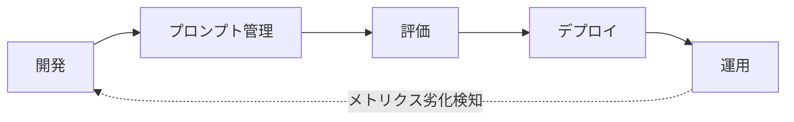

# はじめに

LLMアプリを「動くものを作る」だけで終わらせず、本番で継続的に運用するための営みが LLMOps です。プロンプト管理、評価、デプロイ、運用までのループを回すために、Databricks では MLflow 3、Foundation Model APIs、Unity Catalog、Lakeflow Jobs といった機能が用意されています。

本記事ではこのループを [**Databricks Free Edition**](https://www.databricks.com/jp/learn/free-edition) だけで1周します。Free Edition は無料・サインアップ即利用可能でありながら、LLMOps に必要な機能の多くがそのまま使えるため、学習用途として極めて優秀です。

題材には Free Edition のサンプルデータ `samples.bakehouse.media_customer_reviews` (架空のベーカリーチェーンへの顧客レビュー) を使い、レビューから構造化インサイトを抽出するエージェントの開発・評価・運用を1本のノートブックで通します。

# Free Edition における LLMOps 構成要素

最初に、Free Edition で使える機能と使えない機能を整理しておきます。

| 機能 | Free Edition |
|---|---|
| Foundation Model APIs (pay-per-token) | 利用可 |
| MLflow 3 (Tracing / Prompt Registry / evaluate / make_judge) | 利用可 |
| Unity Catalog | 利用可 |
| Vector Search | 利用可 |
| Lakeflow Jobs | 利用可 |
| Databricks Apps | 利用可 |
| Lakebase (Autoscaling) | 利用可 |
| GPU・カスタムModel Serving | 利用不可 |
| 外部インターネット送信 | 信頼ドメインのみ |

つまり「Foundation Models + MLflow + Unity Catalog」の三点で LLMOps のコアループは完結できます。外部の OpenAI/Anthropic API などを直接叩くことは Free Edition の信頼ドメイン制限により基本できないため、本記事では Foundation Models のみで完結する構成にしています。

詳細は[Databricks Free Editionの制限事項](https://docs.databricks.com/aws/ja/getting-started/free-edition-limitations)を参照してください。

# 利用するモデル

Free Edition で利用可能な Foundation Models のうち、本記事では `databricks-meta-llama-3-3-70b-instruct` をエージェント本体・評価ジャッジの両方で使います。70Bパラメータ規模で構造化JSON出力 (`response_format`) に対応しており、Chat Completions API 経由で扱いやすい (出力が文字列1発で返る) のが選定理由です。

なお Free Edition には `databricks-gpt-oss-120b` のような reasoning モデルも提供されていますが、`message.content` が複数の ContentItem を含むリストで返るため、そのまま `json.loads` できず追加処理が必要になります。本記事の範囲ではシンプルさを優先しています。

利用可能なモデル一覧はワークスペースの「Serving」画面から確認できます。

# タスクと出力スキーマ

`samples.bakehouse.media_customer_reviews` の各レビューに対して、以下のJSONを返すエージェントを構築します。

```json
{
  "sentiment": "positive | negative | neutral",
  "topics": ["product_quality", "service", "price", "atmosphere"],
  "actionable_feedback": {
    "has_feedback": true,
    "summary": "改善示唆の要約"
  }
}
```

このタスクは入出力が小さく、ゴールデンデータを15件作れば評価が回るスケール感です。Free Edition のクォータと相性が良い題材を選ぶのは LLMOps を学ぶ上で重要な観点になります。

# 全体像: LLMOpsのコアループ



5つのステップを順に見ていきます。

# Step 1: ベースライン開発 + MLflow Tracing

最初にやるべきは「動くものを作る」ことではなく「動くものに最初からトレースを仕込む」ことです。`@mlflow.trace` デコレータを最初から付けておけば、開発中の挙動も評価時のジャッジ判定も同じ仕組みで記録され続けます。

```python
import json
import mlflow
from databricks.sdk import WorkspaceClient

w = WorkspaceClient()
client = w.serving_endpoints.get_open_ai_client()
MODEL_ENDPOINT = "databricks-meta-llama-3-3-70b-instruct"

PROMPT_V1 = """あなたはベーカリーチェーンの顧客レビュー分析アシスタントです。
以下のレビューから感情、トピック、改善示唆を抽出してください。

出力は以下のJSONスキーマに厳密に従ってください:
(...省略...)

レビュー:
{{review}}
"""

@mlflow.trace
def extract_insights(review: str) -> dict:
    # MLflow Prompt Registry 規約に揃えて {{review}} を置換
    prompt = PROMPT_V1.replace("{{review}}", review)
    response = client.chat.completions.create(
        model=MODEL_ENDPOINT,
        messages=[{"role": "user", "content": prompt}],
        temperature=0.0,
        response_format={"type": "json_object"},
    )
    return json.loads(response.choices[0].message.content)
```

呼び出すたびに MLflow Experiment にトレースが蓄積され、入力プロンプト、出力、トークン数、レイテンシをUI上で確認できます。


# Step 2: プロンプトのバージョン管理

プロンプトをコードに直書きすると、改善するたびにコードを書き換えてデプロイし直す必要があります。MLflow Prompt Registry で Unity Catalog に登録すれば、プロンプトを「コードと独立した資産」として扱えます。

```python
PROMPT_NAME = f"{CATALOG}.{SCHEMA}.review_insight_extractor"

# v1: シンプル版を登録
prompt_v1 = mlflow.genai.register_prompt(
    name=PROMPT_NAME,
    template=PROMPT_V1,
    commit_message="v1: ベースライン (指示のみ)",
)

# v2: few-shot を追加した版を登録
prompt_v2 = mlflow.genai.register_prompt(
    name=PROMPT_NAME,
    template=PROMPT_V2,
    commit_message="v2: few-shot 2件を追加",
)

# alias でバージョンを管理
mlflow.genai.set_prompt_alias(
    name=PROMPT_NAME, alias="production", version=prompt_v1.version
)
mlflow.genai.set_prompt_alias(
    name=PROMPT_NAME, alias="staging", version=prompt_v2.version
)
```

呼び出し側は alias 経由で取得します。これにより「productionプロンプトを v1 から v2 に切り替える」がコード変更なしで実現できます。

```python
prompt_obj = mlflow.genai.load_prompt(f"prompts:/{PROMPT_NAME}@production")
prompt = prompt_obj.format(review=review)
```

詳細は[MLflow Prompt Registryのドキュメント](https://docs.databricks.com/aws/ja/mlflow3/genai/prompt-registry)を参照してください。

なお MLflow Prompt Registry のテンプレート変数は `{{review}}` のような **二重中括弧** が規約です。Python の `str.format` の `{review}` (単一中括弧) や、`{{}}` をリテラル中括弧のエスケープとして使う書き方とは別物なので、JSON サンプルをプロンプト内に書く場合はリテラル中括弧 `{` `}` をそのまま書く点に注意してください (筆者は最初これにハマって、LLM が出力に `{{}}` を含む奇妙な JSON を返してくるという現象に1時間ほど悩まされました)。


# Step 3: 評価ループ (make_judge + evaluate)

LLMOpsの心臓部です。ゴールデンデータを12件用意し、3つの観点でジャッジを構築します (本番運用では30件以上を推奨しますが、本記事では概念実演のため12件)。後半5件は「美味しいけど待ち時間が長い」「値段相応」のように複合感情・文脈依存の微妙なケースを意図的に入れています。判定が明白なレビューばかりだと v1 と v2 で出力が同じになり、プロンプトの差が見えないためです。

1. `sentiment_correctness`: 感情ラベルが期待値と一致するか
2. `schema_compliance`: 出力JSONがスキーマに準拠しているか
3. `topics_relevance`: トピックがレビュー内容に対して妥当か

なお Free Edition では Foundation Models のレート制限が厳しめなので、評価並列度を下げておくと推論呼び出しの失敗が大幅に減ります。

```python
import os
os.environ["MLFLOW_GENAI_EVAL_MAX_WORKERS"] = "1"
os.environ["MLFLOW_GENAI_EVAL_MAX_SCORER_WORKERS"] = "1"
```

`make_judge` で LLM をジャッジ役にする際、評価指示文の中で `{{ inputs }}` `{{ outputs }}` `{{ expectations }}` のテンプレート変数が使えます。

```python
from mlflow.genai.judges import make_judge
from typing import Literal

JUDGE_MODEL = f"databricks:/{MODEL_ENDPOINT}"

sentiment_judge = make_judge(
    name="sentiment_correctness",
    instructions=(
        "あなたは評価者です。{{ inputs }} のレビューに対するエージェントの {{ outputs }} と、"
        "{{ expectations }} に含まれる expected_sentiment を比較してください。"
        "outputs の sentiment フィールドが expected_sentiment と一致していれば 'pass'、"
        "そうでなければ 'fail' を返してください。"
    ),
    model=JUDGE_MODEL,
    feedback_value_type=Literal["pass", "fail"],
)
# schema_judge, topics_judge も同様に定義
```

`feedback_value_type` でジャッジの戻り値型を明示しておくと、ジャッジ LLM が指示を無視して異なる値を返したときに MLflow 側で型整合性が保たれます。MLflow 組み込みの Correctness や Guidelines は `"yes"` / `"no"` を使うのが慣例ですが、`make_judge` でカスタム判定する場合は意味が伝わりやすい用語 (例えば本記事のように `"pass"` / `"fail"`) を選んで明示するのが良いでしょう。

v1とv2の両方を `mlflow.genai.evaluate` で評価し、Plotly でジャッジ別のpass率を比較します。

```python
@mlflow.trace
def predict_v1(review): return extract_with_alias(review, alias="production")
@mlflow.trace
def predict_v2(review): return extract_with_alias(review, alias="staging")

with mlflow.start_run(run_name="eval_v1"):
    result_v1 = mlflow.genai.evaluate(
        data=eval_dataset, predict_fn=predict_v1,
        scorers=[sentiment_judge, schema_judge, topics_judge],
    )

with mlflow.start_run(run_name="eval_v2"):
    result_v2 = mlflow.genai.evaluate(
        data=eval_dataset, predict_fn=predict_v2,
        scorers=[sentiment_judge, schema_judge, topics_judge],
    )
```

`predict_fn` には必ず `@mlflow.trace` を付けてください。これがないとトレースのルートが内側の LLM 呼び出しになり、リクエストにプロンプト全文が記録されてしまいます。v1 と v2 でプロンプトが異なるため、レコード単位のリクエストハッシュが一致せず、後述の比較ビューでペアリングが効かなくなります。

評価が終わったら、MLflow UI の **Evaluation runs** で `eval_v1` と `eval_v2` の両方をチェックすると、同じレビュー入力に対する v1/v2 のレスポンスとジャッジ判定が並べて表示されます。


評価結果が出たら、v2の方が良ければ alias を付け替えるだけで「本番のプロンプト」が即座に切り替わります。

```python
# 本番運用で v2 への昇格判断ができたら実行する
# (デモ用のノートブックでは、再実行時に v1 vs v2 比較が壊れないようコメントアウトしておくのがおすすめ)
mlflow.genai.set_prompt_alias(
    name=PROMPT_NAME, alias="production", version=prompt_v2.version
)
```

これで「評価 → 昇格 → 本番反映」の最小ループが回ります。

なお、実際にこの評価を回してみると、few-shot を足した v2 が v1 より sentiment_correctness で悪化する、という結果になることがあります。プロンプトの「改善」が実は退化だったというケースで、これこそ評価ループがなければ気づけない事象です。本番に v2 を昇格させていたら、ユーザー体験が静かに劣化していました。LLMOps が「動くものを作って終わり」ではなく「継続的に評価し続ける営み」である理由が、この一回の比較で実感できます。

# Step 4: デプロイ (ai_queryによるバッチ推論)

Free Edition ではカスタム Model Serving エンドポイントが立てられないため、デプロイ手段としては SQL から Foundation Models を直接呼べる `ai_query()` を採用します。バッチ用途と相性が良く、Lakeflow Jobs でそのまま定期実行できる利点があります。

```sql
CREATE OR REPLACE TABLE workspace.llmops_demo.review_insights AS
SELECT
  new_id AS review_id,
  franchiseID,
  review_date,
  review,
  ai_query(
    'databricks-meta-llama-3-3-70b-instruct',
    CONCAT('プロンプト本文', review, 'プロンプト末尾')
  ) AS insight
FROM samples.bakehouse.media_customer_reviews
LIMIT 50
```

`responseFormat` で DDL スキーマを指定する選択肢もありますが、トップレベルが1フィールドという制約があり、今回のように `sentiment` / `topics` / `actionable_feedback` がフラットに並ぶ JSON だと噛み合わせが難しいため、ここではプロンプト側の指示に任せて生 JSON 文字列で受け取り、後段で `from_json` でパースする方針にしています。

詳細は[ai_query 関数のドキュメント](https://docs.databricks.com/aws/ja/sql/language-manual/functions/ai_query)を参照してください。

# Step 5: 運用と継続改善

最終ステップでは、ループを「閉じる」仕組みを作ります。

1. ノートブックを **Lakeflow Jobs** で日次スケジュール実行 → 新規レビューを継続処理
2. 結果テーブル `review_insights` を **AI/BI ダッシュボード** で可視化 (sentiment 比率、topic 分布、JSONエラー率)
3. メトリクス劣化を検知したら Step 3 に戻ってプロンプトを改善 → alias 切替で再デプロイ

例えば運用メトリクスとして sentiment 比率は次のSQLで集計できます。

```sql
WITH parsed AS (
  SELECT from_json(
    insight,
    'STRUCT<sentiment:STRING, topics:ARRAY<STRING>, actionable_feedback:STRUCT<has_feedback:BOOLEAN, summary:STRING>>'
  ) AS i
  FROM workspace.llmops_demo.review_insights
)
SELECT
  i.sentiment AS sentiment,
  COUNT(*) AS cnt,
  ROUND(COUNT(*) * 100.0 / SUM(COUNT(*)) OVER (), 1) AS pct
FROM parsed
GROUP BY i.sentiment
```

トピック分布も `LATERAL VIEW EXPLODE` で展開すれば1クエリで出ます。これらをダッシュボード化することで「LLMアプリの運用状態」が常時可視化されます。


# Free Edition の壁と次のステップ

Free Edition のクォータに到達した場合はその日の残り時間 (極端な場合は当月) コンピュートが停止しますが、データと設定は保持されます。本格的な運用に進む段階で考慮すべき差分は次の2点です。

- **専用 Model Serving**: ファインチューニング済みモデルやカスタムエージェントをオンライン提供したい場合
- **エンタープライズ機能**: SSO、ネットワーク分離、複数ワークスペースなど

逆に言えば、これら以外の LLMOps の考え方とツールチェーンは Free Edition でそのまま学べます。

# まとめ

Databricks Free Edition だけで、LLMOps のコアループを1周しました。

| ステップ | 使った機能 |
|---|---|
| 開発 | Foundation Model APIs + MLflow Tracing |
| プロンプト管理 | MLflow Prompt Registry (UC) |
| 評価 | mlflow.genai.evaluate + make_judge |
| デプロイ | ai_query バッチ推論 |
| 運用 | Lakeflow Jobs + AI/BI ダッシュボード |

GPU カスタムサービングなど一部の機能は Free Edition では使えませんが、LLMOps の考え方とツールチェーンは本番と全く同じものを学習・実践できます。「LLMアプリを作ったが運用できていない」というフェーズの方は、まず Free Edition でループを1周回してみることをお勧めします。

ノートブックは GitHub で公開しています。

https://github.com/takaaki-yayoi/llmops_databricks_free_edition

# 書籍のご紹介

本記事で扱った MLflow による LLMOps を体系的に学びたい方には、共著で執筆した『[MLflowで実践するLLMOps──生成AIアプリケーションの実験管理と品質保証](https://www.amazon.co.jp/dp/4297155737)』(技術評論社・エンジニア選書、2026年4月発売) をお勧めします。

MLflow 3 の4つのコアコンポーネント (Tracing / Evaluate & Monitor / Prompt Registry / AI Gateway) を軸に、シンプルなチャットボットから RAG システム、マルチエージェントまで、「作って終わり」ではなく「運用し続けられる」 LLMアプリケーションの構築方法を一冊にまとめています。日本語では初となる MLflow LLMOps 専門書です。

本記事の内容を「Free Edition での1周体験」だとすれば、書籍ではより踏み込んだ実践と運用のための知識を体系的に得られます。

### はじめてのDatabricks

[はじめてのDatabricks](https://qiita.com/taka_yayoi/items/8dc72d083edb879a5e5d)

### Databricks無料トライアル

[Databricks無料トライアル](https://databricks.com/jp/try-databricks)
