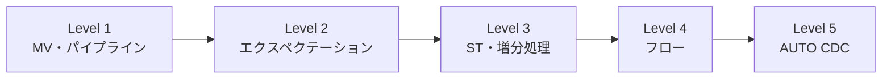

# はじめに

データエンジニアリングの現場では、「データの取り込み」「品質チェック」「増分処理」「複数ソースの統合」「マスターデータの同期」といった課題に日々直面します。これらを個別に解決しようとすると、複雑なコードと運用負荷が積み重なっていきます。

[**Lakeflow Spark宣言型パイプライン(SDP)**](https://www.databricks.com/jp/blog/introducing-databricks-lakeflow)は、これらの課題をSQLとPythonの宣言的な記述だけで解決するフレームワークです。

本シリーズ「**Lakeflow SDP入門：基礎から実践まで**」では、SDPの基本概念から実践的なパターンまでを5つのレベルに分けて段階的に学びます。各記事は独立したハンズオンを含み、実際に手を動かしながら理解を深められる構成になっています。

**本シリーズのすべてのハンズオンは、無料の[Databricks Free Edition](https://docs.databricks.com/aws/ja/getting-started/free-edition)で実行できます。** クレジットカード不要で、今すぐ始められます。

# 学習パス一覧



| Level | タイトル | 所要時間 | 学ぶ概念 |
|-------|---------|---------|--------|
| 1 | [SQLだけで始めるLakeflow SDP](https://qiita.com/taka_yayoi/items/e6368446040c9e979d0f) | 30分 | マテリアライズドビュー、パイプライン |
| 2 | [Lakeflow SDPでデータ品質を守るエクスペクテーション](https://qiita.com/taka_yayoi/items/0b525cb05a095ad0bbe1) | 30分 | エクスペクテーション、データ品質 |
| 3 | [Lakeflow SDPの増分処理とストリーミングテーブル](https://qiita.com/taka_yayoi/items/c38069b6ddd93fbaacab) | 45分 | ストリーミングテーブル、増分処理 |
| 4 | [Lakeflow SDPのフローを理解する](https://qiita.com/taka_yayoi/items/3e966dee494d0800ec0c) | 45分 | フロー、append_flow、ONCE |
| 5 | [Lakeflow SDPのAUTO CDCでマスターデータ同期](https://qiita.com/taka_yayoi/items/b1ee8cb73f9723ab1fed) | 60分 | AUTO CDC、SCD Type 1/2 |

# 各レベルの概要

## Level 1: SQLだけで始めるLakeflow SDP

**学ぶこと:** マテリアライズドビュー(MV)とパイプラインの基本

SDPの最初の一歩として、SQLだけでデータパイプラインを構築します。マテリアライズドビューを使って、ソーステーブルから集計結果を自動的に更新する仕組みを学びます。

```sql
CREATE MATERIALIZED VIEW daily_sales AS
SELECT date, SUM(amount) as total
FROM sales
GROUP BY date;
```

**こんな方におすすめ:** SQLは書けるが、SDPは初めての方

## Level 2: エクスペクテーションでデータ品質を守る

**学ぶこと:** データ品質チェックの宣言的な記述方法

本番環境では「NULLが混入した」「想定外の値が入った」といった問題が発生します。エクスペクテーションを使えば、品質ルールを宣言的に定義し、違反時の挙動(警告/除外/停止)を制御できます。

```sql
CREATE MATERIALIZED VIEW clean_orders (
  CONSTRAINT valid_amount EXPECT (amount > 0) ON VIOLATION DROP ROW
) AS SELECT * FROM raw_orders;
```

**こんな方におすすめ:** データ品質管理の仕組みを導入したい方

## Level 3: 増分処理とストリーミングテーブル

**学ぶこと:** 効率的な増分処理の仕組み

毎回全データを再処理するのは非効率です。ストリーミングテーブル(ST)とAuto Loaderを使えば、新しく追加されたデータだけを処理できます。

```sql
CREATE STREAMING TABLE orders_bronze;

CREATE FLOW ingest_orders AS
INSERT INTO orders_bronze BY NAME
SELECT * FROM STREAM read_files('/path/to/files/', format => 'csv');
```

**こんな方におすすめ:** 大量データの効率的な処理方法を学びたい方

## Level 4: フローを理解する

**学ぶこと:** 複数ソースの統合とバックフィル

STでは「テーブル定義」と「データ挿入(フロー)」が分離されています。これにより、複数のソースから1つのテーブルにデータを統合したり、過去データを1回だけバックフィルしたりできます。

```sql
CREATE STREAMING TABLE all_orders;

CREATE FLOW online_orders AS INSERT INTO all_orders ...;
CREATE FLOW store_orders AS INSERT INTO all_orders ...;
CREATE FLOW backfill_2023 AS INSERT INTO ONCE all_orders ...;
```

**こんな方におすすめ:** 複数データソースの統合パターンを学びたい方

## Level 5: AUTO CDCでマスターデータ同期

**学ぶこと:** 変更データキャプチャ(CDC)の処理

マスターデータ(顧客情報など)は追記だけでなく、更新や削除も発生します。AUTO CDCを使えば、複雑なMERGE文を書かずにCDCイベントを処理できます。

```sql
CREATE STREAMING TABLE customers;

CREATE FLOW sync_customers AS
AUTO CDC INTO customers
FROM STREAM cdc_source
KEYS (id)
SEQUENCE BY event_time
STORED AS SCD TYPE 2;
```

**こんな方におすすめ:** マスターデータの同期や履歴管理を実装したい方

# SDPの主要概念マップ


# 前提条件

本シリーズを始めるには以下が必要です:

- **Databricksワークスペースへのアクセス** - [Free Edition](https://docs.databricks.com/aws/ja/getting-started/free-edition)で無料で利用可能
- **Unity Catalogが有効化されていること** - Free Editionではデフォルトで有効
- **SQLの基本的な知識**

# 推奨する学習順序

**初めてSDPを学ぶ方:** Level 1 → 2 → 3 → 4 → 5の順番で進めてください。各レベルは前のレベルの知識を前提としています。

**特定のトピックを学びたい方:**
- データ品質管理だけ知りたい → Level 1 → Level 2
- 増分処理を理解したい → Level 1 → Level 3
- CDCを実装したい → Level 1 → Level 3 → Level 5

# 参考リンク

- [Lakeflow Spark宣言型パイプライン公式ドキュメント](https://docs.databricks.com/aws/ja/ldp/)
- [Auto Loaderとは](https://docs.databricks.com/aws/ja/ingestion/cloud-object-storage/auto-loader/)
- [チュートリアル: Lakeflow宣言型パイプラインを使用してETLパイプラインを構築する](https://docs.databricks.com/aws/ja/getting-started/data-pipeline-get-started)

### はじめてのDatabricks

[はじめてのDatabricks](https://qiita.com/taka_yayoi/items/8dc72d083edb879a5e5d)

### Databricks無料トライアル

[Databricks無料トライアル](https://databricks.com/jp/try-databricks)
