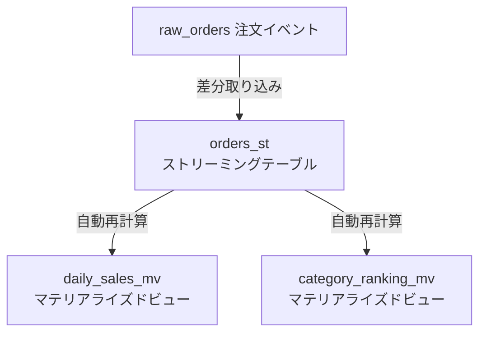
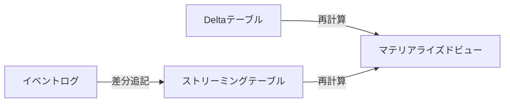
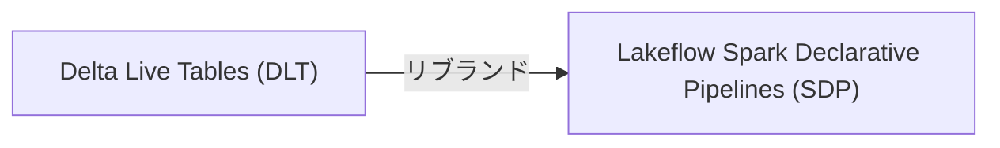

DatabricksのETLパイプライン機能は「Delta Live Tables (DLT)」として登場し、現在は **Lakeflow Spark Declarative Pipelines (SDP)** という名前になっています。名前の変遷もあって「結局何なの？」と感じている方も多いかと思います。

https://docs.databricks.com/aws/ja/ldp/

この記事では概念の説明より先に **SQLだけで動くパイプラインを作ること** を優先します。動いたものを見てから概念を整理する、という順番で進めます。

# まず動かしてみよう

## 何を作るか

ECサイトの注文データを例に、3テーブルのシンプルなパイプラインを作ります。



## ステップ1: ソースデータの準備

まずパイプラインが読み込む元テーブルを作成し、サンプルデータを投入します。

```sql
CREATE TABLE takaakiyayoi_catalog.sdp_demo.raw_orders (
    order_id    STRING,
    customer_id STRING,
    product_id  STRING,
    category    STRING,
    amount      DOUBLE,
    status      STRING,
    ordered_at  TIMESTAMP
)
USING DELTA
TBLPROPERTIES ('delta.enableChangeDataFeed' = 'true');

INSERT INTO takaakiyayoi_catalog.sdp_demo.raw_orders VALUES
  ('ORD-001', 'C001', 'P010', '家電',     58000, 'completed',  '2024-01-05 10:00:00'),
  ('ORD-002', 'C002', 'P020', 'アパレル',  12000, 'completed',  '2024-01-05 11:30:00'),
  ('ORD-003', 'C003', 'P030', '食品',       3500, 'cancelled',  '2024-01-05 12:00:00'),
  ...
```

`status = 'cancelled'` のレコードも含めて投入します。パイプライン側でフィルタリングします。

## ステップ2: パイプラインのSQLを書く

パイプラインの定義はSQLノートブックに書きます。`CREATE STREAMING TABLE` と `CREATE MATERIALIZED VIEW` の2つの構文だけ覚えれば始められます。

**Streaming Table（差分取り込み）:**

```sql
CREATE OR REFRESH STREAMING TABLE takaakiyayoi_catalog.sdp_demo.orders_st
COMMENT '注文データのStreaming Table（完了分のみ）'
AS SELECT
    order_id,
    customer_id,
    category,
    amount,
    CAST(ordered_at AS DATE) AS order_date
FROM STREAM(takaakiyayoi_catalog.sdp_demo.raw_orders)
WHERE status = 'completed';
```

ポイントは `STREAM()` でソーステーブルをラップするだけで差分取り込みになる点です。`WHERE status = 'completed'` でキャンセル分を除外しています。

**Materialized View（集計）:**

```sql
CREATE OR REFRESH MATERIALIZED VIEW takaakiyayoi_catalog.sdp_demo.daily_sales_mv
COMMENT '日別・カテゴリ別売上集計'
AS SELECT
    order_date,
    category,
    COUNT(*)    AS order_count,
    SUM(amount) AS total_sales,
    AVG(amount) AS avg_order_value
FROM takaakiyayoi_catalog.sdp_demo.orders_st
GROUP BY order_date, category;
```

普通のSELECT文に `CREATE OR REFRESH MATERIALIZED VIEW` を付けるだけです。

## ステップ3: パイプラインを作成・実行

1. Databricksサイドバーから **新規** → **ETLパイプライン**
2. ソースとして上記のSQLノートブックを指定
3. **パイプラインを実行** をクリック


実行するとUIに依存関係グラフが表示されます。どのテーブルがどのテーブルに依存しているかが一目でわかります。


## ステップ4: 結果を確認する（実行結果）

パイプラインが完了したら普通のSQLでクエリできます。

```sql
SELECT * FROM takaakiyayoi_catalog.sdp_demo.orders_st;
```

**結果: 8件**（10件中 `cancelled` の2件が除外されています）

```sql
SELECT order_date, category, order_count, total_sales
FROM takaakiyayoi_catalog.sdp_demo.daily_sales_mv
ORDER BY order_date, category;
```

| order_date | category | order_count | total_sales |
|------------|----------|-------------|-------------|
| 2024-01-05 | アパレル  | 1           | 12000.0     |
| 2024-01-05 | 家電      | 1           | 58000.0     |
| 2024-01-06 | アパレル  | 1           | 8000.0      |
| 2024-01-06 | 家電      | 1           | 120000.0    |
| 2024-01-07 | 書籍      | 1           | 2800.0      |
| 2024-01-07 | 食品      | 1           | 5200.0      |
| 2024-01-08 | アパレル  | 1           | 22000.0     |
| 2024-01-08 | 家電      | 1           | 35000.0     |

```sql
SELECT category, total_orders, total_sales
FROM takaakiyayoi_catalog.sdp_demo.category_ranking_mv;
```

| category | total_orders | total_sales |
|----------|-------------|-------------|
| 家電      | 3           | 213000.0    |
| アパレル  | 3           | 42000.0     |
| 食品      | 1           | 5200.0      |
| 書籍      | 1           | 2800.0      |

SQLを書いただけで、差分取り込み・集計・ランキングが自動で動いています。

# 何が嬉しかったのか

動かしてみると、普通のINSERT/SELECTと比べて以下の点が違います。

## 差分処理が自動

`raw_orders` に新しいレコードを追加してパイプラインを再実行すると、`orders_st` は**新しいレコードだけ**を取り込みます。全件再処理はしません。

```sql
-- 新しい注文を追加
INSERT INTO takaakiyayoi_catalog.sdp_demo.raw_orders VALUES
  ('ORD-011', 'C008', 'P013', '家電', 89000, 'completed', '2024-01-10 10:00:00');

-- パイプラインを再実行 → ORD-011だけが処理される
-- daily_sales_mv も自動的に再計算される
```

## 依存関係が自動解決

`daily_sales_mv` は `orders_st` に依存しています。SDPはこの依存関係を自動で認識し、正しい順序で処理します。実行順序を手動で管理する必要はありません。

## キャンセル分が自動除外

ソースに `cancelled` のレコードが混在していても、`WHERE status = 'completed'` の定義が常に適用されます。集計結果に誤ったデータが混入しません。

# ここで用語を整理する

動いたものを見た後なので、概念が理解しやすいはずです。

## ストリーミングテーブル (ST) と マテリアライズドビュー (MV) の違い

| | ストリーミングテーブル | マテリアライズドビュー |
|---|---|---|
| **処理方式** | ストリーミング（差分追記） | バッチ（全体または差分再計算） |
| **用途** | ログ・イベントの取り込み | 集計・変換結果の保持 |
| **ソース** | ストリーミングソース | テーブル・他のST/MV |
| **データの扱い** | 追記型 | 再計算型 |



## 名前の変遷について

混乱のもとになっているのでここで整理します。



*Lakeflow Spark Declarative Pipelines: Lakeflow Spark宣言型パイプライン*

製品コンセプトは変わっていません。「SQLやPythonで宣言的にETLパイプラインを定義する」という軸は一貫しています。`dlt.table()` などの旧APIは現在も動作しますが、新しいプロジェクトでは新APIが推奨されます。

# MVとSTの使い分け

迷ったときの判断基準です。

**ストリーミングテーブルを使う場面:**
- Kafkaやファイルなどのストリーミングソースから取り込む
- ログ・イベントデータを追記していく
- Auto CDCでソーステーブルの変更を追跡する

**マテリアライズドビューを使う場面:**
- 集計・JOIN・変換の結果を保持したい
- 上流データの変更を自動的に反映させたい
- Genieやダッシュボードから参照するビジネス指標を定義する

**迷ったらMVから始める**: 初めてSDPを使う場合、まずMVで集計処理を定義するのが簡単です。ストリーミングが必要になったタイミングでSTを検討してください。

# 注意: Metrics ViewのMVと混同しないこと

DatabricksにはもうひとつのMVがあります。

| 用語 | 正式名称 | 目的 |
|------|----------|------|
| **MV** (この記事) | Materialized View (SDP) | ETLパイプライン内の変換・集計 |
| [**Metrics View**](https://docs.databricks.com/gcp/ja/metric-views/) | Unity Catalog Metrics View | ビジネス指標のセマンティック定義 |

Metrics ViewはGenieのセマンティックレイヤーとして機能するもので、SDPのMaterialized Viewとは別の概念です。両方ともDatabricksの重要な機能ですが、役割が異なります。詳しくは「[DatabricksのメトリクスビューをGenieのセマンティックレイヤーとして使う](https://qiita.com/taka_yayoi/items/73e2588bf5a96c47e626)」を参照してください。

# まとめ

- `CREATE STREAMING TABLE` → **差分取り込み**（追記型）
- `CREATE MATERIALIZED VIEW` → **集計・変換**（再計算型）
- 依存関係と実行順序はSDPが自動管理
- 名前は変わったが、概念は「SQLで宣言的にETLを書く」で一貫している

SDPはジョブスケジューラとETLコードを分離して考えられる点が特徴です。「いつ動かすか」はパイプラインの設定に任せ、「何を処理するか」だけをSQLで書く、という考え方です。

# 参考リソース

- [Lakeflow Declarative Pipelines とは - Databricks ドキュメント](https://docs.databricks.com/ja/delta-live-tables/index.html)
- [Streaming Table の作成 - Databricks ドキュメント](https://docs.databricks.com/ja/delta-live-tables/streaming-tables.html)
- [Materialized View の作成 - Databricks ドキュメント](https://docs.databricks.com/ja/delta-live-tables/materialized-views.html)
- [DatabricksのメトリクスビューをGenieのセマンティックレイヤーとして使う](https://qiita.com/taka_yayoi/items/73e2588bf5a96c47e626)

### はじめてのDatabricks

[はじめてのDatabricks](https://qiita.com/taka_yayoi/items/8dc72d083edb879a5e5d)

### Databricks無料トライアル

[Databricks無料トライアル](https://databricks.com/jp/try-databricks)
