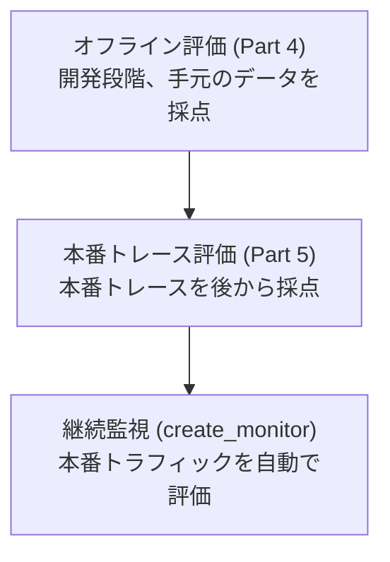

# この記事で検証すること

MLflow 3 で GenAI アプリの品質を評価するとき、中心となる API は `mlflow.genai.evaluate()` です。この関数は「テストデータ」「スコアラー」「(必要なら) アプリ本体」を受け取り、評価を実行して結果を MLflow UI に記録してくれます。

GenAI アプリの評価は、開発段階で終わるものではありません。開発時に手元のデータで採点し、本番に出した後は溜まっていくトレースを採点し、最終的には本番トラフィックを継続的に監視する、という流れでつながっています。この記事では、その流れの前半2段階を `mlflow.genai.evaluate()` でどう実装するかを、手を動かしながら確認します。

| 段階 | ノートブック | `data` に渡すもの | トレースの扱い |
|---|---|---|---|
| オフライン評価 | Part 4 | 辞書のリスト (inputs + outputs + expectations) | 新規トレースが作成される |
| 本番トレース評価 | Part 5 | `mlflow.search_traces()` で取得した既存トレース | 既存トレースにアセスメントが付与される |

どちらも `predict_fn` を指定しない使い方 (アプリを再呼び出しせず、すでにある入出力をそのまま採点するモード) ですが、`data` に何を渡すかによって挙動が大きく変わります。ここを混同すると「評価結果が想定したトレースに付かない」というハマり方をするので、Part 4 と Part 5 を順に動かして違いを見ていきます。あわせて、ドキュメントだけでは気づきにくい仕様変更や落とし穴も整理します。

検証環境は Databricks 上のマネージド MLflow 3 (`mlflow>=3.11`)、トレースの保存先は Unity Catalog です。

# 評価の3つの段階と、この記事の位置づけ

本題に入る前に、用語と全体像を整理しておきます。ここを曖昧にしたまま進めると説明がぶれるためです。

## 評価の3つの段階

GenAI アプリの評価は、ライフサイクルに沿って次の3段階で考えると見通しがよくなります。

| 段階 | 中心 API | 評価対象 | 実行のしかた |
|---|---|---|---|
| オフライン評価 | `mlflow.genai.evaluate()` | 手元の評価データセット・辞書のリスト | 開発時に手動実行 |
| 本番トレース評価 | `mlflow.genai.evaluate()` | 本番で記録済みのトレース | 手動でバッチ実行 |
| オンライン評価 (本番運用モニタリング) | `mlflow.genai.create_monitor()` | 本番のライブトラフィック | スコアラーが継続的・自動実行 |

この記事の Part 4 が1段目のオフライン評価、Part 5 が2段目の本番トレース評価にあたります。3段目のオンライン評価は範囲外です。

本番トレース評価は、オフライン評価とオンライン評価の「あいだ」に位置する点に注意が必要です。実行のしかたは「人が `evaluate()` を一度叩くバッチ処理」なので、MLflow の用語上はオフライン評価ハーネスの範囲です。一方で、対象が本番トレースであり、目的 (本番に出した後の品質を測る) もスコアラーもオンライン評価と地続きです。言い換えると、本番トレース評価は**オンライン評価への入り口**であり、ここで使ったスコアラーはそのまま `create_monitor()` による継続監視に再利用できます。MLflow が「開発で使う評価ロジックを本番運用でも実行できる」ことを設計思想として掲げているのは、この地続きさのことです。

3段目の継続監視 (`create_monitor()`) については [本番運用で GenAI を監視する](https://docs.databricks.com/aws/ja/mlflow3/genai/eval-monitor/production-monitoring) を参照してください。

## predict_fn の有無による2つのモード

`mlflow.genai.evaluate()` は、`predict_fn` 引数の有無で2つのモードに分かれます。

| モード | アプリの実行 | 出力の出どころ | 向いた用途 |
|---|---|---|---|
| `predict_fn` あり | 評価時にアプリを呼び出す | その場で生成される | コード変更後の回帰テスト |
| `predict_fn` なし (答案採点モード) | 呼び出さない | あらかじめ用意したものを使う | 既存の出力・トレースの採点 |

`predict_fn` なしのモードを、この記事では「答案採点モード」と呼びます。生徒に問題を解かせる (アプリを実行する) のではなく、提出済みの答案を採点する、というイメージです。Part 4 も Part 5 も、どちらもこのモードです。

答案採点モードでは出力をどこかから用意する必要があり、その用意のしかたが Part 4 と Part 5 の違いになります。Part 4 は `data` の辞書に `outputs` を直接書き、Part 5 は既存トレースに記録済みの出力を使います。

この記事が Part 4・Part 5 とも `predict_fn` なしを使うのには理由があります。とくに Part 5 は本番で記録済みのトレースを評価する段階ですが、ここで `predict_fn` を渡してアプリを呼び直すと、採点対象が「いまのコードの出力」に置き換わり、「本番でその時に実際に出した出力」ではなくなってしまいます。本番時点の挙動をそのまま評価したいので、記録済みの出力を使う `predict_fn` なしを選びます。

この記事ではこの後、トレース・評価ラン・アセスメント・LoggedModel といった複数のオブジェクトが登場します。Part に入る前に、それらがどう関係するのかを1枚の図にまとめておきます。


中心にあるのはトレースです。評価ランがトレースを束ね、トレースにはアセスメント (評価結果) と Expectation (ground truth) が紐付き、LoggedModel が `model_id` でそれらと結びつきます。この記事の Part 2 以降は、この図のどこかを操作している、と考えながら読み進めると全体の中での位置を見失いません。

評価の基本概念は [評価の概念](https://docs.databricks.com/aws/ja/mlflow3/genai/eval-monitor/concepts)、評価ハーネスの詳細は [評価用ハーネス](https://docs.databricks.com/aws/ja/mlflow3/genai/eval-monitor/concepts/eval-harness) にまとまっています。

# Part 1: 環境のセットアップ

まず MLflow をインストールし、トラッキング先と Experiment を設定します。

```python
%pip install "mlflow>=3.11"
dbutils.library.restartPython()
```

`dbutils.library.restartPython()` でカーネルが再起動します。ノートブックを「Run All」で流すとここでいったん止まることがあるため、再起動後は次のセルから手動で実行していくと確実です。

```python
import os
import mlflow
from mlflow.genai.scorers import Correctness
from mlflow.entities.trace_location import UnityCatalog

mlflow.set_tracking_uri("databricks")

# === 環境に合わせて変更してください ===
CATALOG_NAME = "your_catalog"
SCHEMA_NAME = "mlflow_llmops"
TABLE_PREFIX_NAME = "eval"
EXPERIMENT_NAME = "/Users/<your-email>/llm_eval"
os.environ["MLFLOW_TRACING_SQL_WAREHOUSE_ID"] = "<your-warehouse-id>"
# =======================================

mlflow.set_experiment(
    experiment_name=EXPERIMENT_NAME,
    trace_location=UnityCatalog(
        catalog_name=CATALOG_NAME,
        schema_name=SCHEMA_NAME,
        table_prefix=TABLE_PREFIX_NAME,
    ),
)

EXPERIMENT_ID = mlflow.get_experiment_by_name(EXPERIMENT_NAME).experiment_id

# SQLクエリで使うテーブル名のベース (catalog.schema.table_prefix)
TABLE_BASE = f"{CATALOG_NAME}.{SCHEMA_NAME}.{TABLE_PREFIX_NAME}"

print(f"Experiment: {EXPERIMENT_NAME}")
print(f"Experiment ID: {EXPERIMENT_ID}")
print(f"テーブル名ベース: {TABLE_BASE}")
```

ここでのポイントは2つあります。

1つ目は、`trace_location` に `UnityCatalog(...)` を指定して、トレースを Unity Catalog のテーブルに保存している点です。指定した `catalog.schema.table_prefix` をベースに、`_otel_spans` などの基盤テーブルが作られます。

2つ目は、環境変数 `MLFLOW_TRACING_SQL_WAREHOUSE_ID` です。トレースを Unity Catalog に保存している場合、`mlflow.search_traces()` はその裏で SQL ウェアハウス経由でテーブルを参照します。これを設定しておかないと、Part 5 の既存トレース検索でつまずきます。

繰り返し検証する場合は、古いデータが混ざらないよう、基盤テーブルを事前にクリアしておくと挙動が読みやすくなります。2回目以降に Part 3 から流し直すときは、このクリーンアップを必ず通してください。通さないと前回のトレースが残り、UI でトレース件数が積み上がって混乱します。

```python
# 前回実行分のデータをクリア (初回はテーブルが無いためスキップされる)
for suffix in ["_otel_spans", "_otel_logs", "_otel_annotations", "_otel_metrics"]:
    table = f"{TABLE_BASE}{suffix}"
    try:
        spark.sql(f"DELETE FROM {table}")
        print(f"クリア完了: {table}")
    except Exception as e:
        print(f"スキップ: {table} ({e.__class__.__name__})")
```

# Part 2: LoggedModel の登録

評価を実行する前に、LoggedModel を登録しておきます。

LoggedModel は MLflow 3 の中心的な概念で、アプリやエージェントの「あるバージョン」を表すオブジェクトです。トレースやメトリクスを特定のバージョンに紐付けて追跡できます。詳しくは [MLflow 3 をインストールする](https://docs.databricks.com/aws/ja/mlflow/mlflow-3-install) を参照してください。

```python
model = mlflow.set_active_model(name="qa-agent-v1")
MODEL_ID = model.model_id
print(f"LoggedModel ID: {MODEL_ID}")
```

ここで取得した `MODEL_ID` を、後で `mlflow.genai.evaluate()` の `model_id` パラメータに渡します。こうすると「どのバージョンのモデルに対する評価結果なのか」が記録され、Unity Catalog のモデルバージョンページから評価結果をたどれるようになります。バージョン間で品質を比較したいときに効いてくる設定です。

# Part 3: 評価対象のサンプルトレースを作る

評価の対象となるトレースを用意します。本番環境では、すでに記録済みのトレースを使うことになりますが、ここでは検証の再現性のために、デモ用のシンプルなトレースを生成します。

`@mlflow.trace` デコレータを付けた関数を呼び出すと、その実行がトレースとして記録されます。

```python
@mlflow.trace(name="qa_agent", span_type="AGENT")
def qa_agent(query: str) -> str:
    """Q&Aエージェントのシミュレーション"""
    responses = {
        "Databricksのセキュリティ機能は？": "Unity Catalog、行レベルセキュリティ、カラムマスクなどがあります。",
        "Delta Lakeのメリットは？": "ACIDトランザクション、タイムトラベル、スキーマ進化をサポートします。",
        "MLflowとは？": "機械学習のライフサイクルを管理するオープンソースプラットフォームです。",
    }
    return responses.get(query, "回答が見つかりません。")


queries = [
    "Databricksのセキュリティ機能は？",
    "Delta Lakeのメリットは？",
    "MLflowとは？",
]

trace_ids = []
for query in queries:
    qa_agent(query)
    tid = mlflow.get_last_active_trace_id()
    trace_ids.append(tid)
    print(f"Query: {query} -> Trace ID: {tid}")

print(f"\n{len(trace_ids)} 件のトレースを作成しました")
```

`mlflow.get_last_active_trace_id()` で、直前に記録されたトレースの ID を取得しています。この `trace_ids` を Part 5 で使います。

ここまでで、評価対象となる3件のトレースが Experiment に記録されました。

# Part 4: 辞書のリストを渡すオフライン評価（新規トレースが作られる）

1段階目のオフライン評価です。入出力と正解 (expectations) を辞書のリストとして定義し、`mlflow.genai.evaluate()` に渡します。`predict_fn` は指定しないため、アプリの呼び出しは行われません (答案採点モード)。

```python
# 入出力 + 正解 (ground truth) を辞書のリストで定義
data = [
    {
        "inputs": {"query": "Databricksのセキュリティ機能は？"},
        "outputs": {"response": "Unity Catalog、行レベルセキュリティ、カラムマスクなどがあります。"},
        "expectations": {
            "expected_facts": ["Unity Catalog", "行レベルセキュリティ", "カラムマスク"],
        },
    },
    {
        "inputs": {"query": "Delta Lakeのメリットは？"},
        "outputs": {"response": "ACIDトランザクション、タイムトラベル、スキーマ進化をサポートします。"},
        "expectations": {
            "expected_facts": ["ACIDトランザクション", "タイムトラベル", "スキーマ進化"],
        },
    },
    {
        "inputs": {"query": "MLflowとは？"},
        "outputs": {"response": "機械学習のライフサイクルを管理するオープンソースプラットフォームです。"},
        "expectations": {
            "expected_facts": ["オープンソース", "実験管理", "モデル管理"],
        },
    },
]

result = mlflow.genai.evaluate(
    data=data,
    model_id=MODEL_ID,
    scorers=[Correctness()],
)

print(f"評価完了 (run_id: {result.run_id})")

# 評価結果をトレースとして取得
eval_traces = mlflow.search_traces(run_id=result.run_id)
display(eval_traces)
```

## Part 4 の最重要ポイント

辞書のリストを渡すと、**MLflow は渡された inputs / outputs から新規のトレースを作成します**。Part 3 で作った3件のトレースに評価結果が追記されるわけではありません。

つまり、Experiment 上には次のようにトレースが並びます。

- Part 3 で記録した3件
- Part 4 の評価で新たに作られた3件

「既存のトレースに評価を付けたい」つもりで辞書のリストを渡すと、別物のトレースが増えて混乱します。既存トレースに付けたい場合は Part 5 のやり方を使います。

辞書のリストによる評価は、正式な評価データセットを作らずに素早く試したいときに向いた方法です。開発の早い段階で、手元の入出力をまとめて採点するのがこの段階の役割です。詳しくは [評価用ハーネス](https://docs.databricks.com/aws/ja/mlflow3/genai/eval-monitor/concepts/eval-harness) を参照してください。

## ハマりどころ

Part 4 で踏みやすい落とし穴を3つ挙げます。

**評価結果の取り出し方**: 評価結果を行単位で見たいとき、`result.tables["per_row"]` のような属性は存在しません。`mlflow.search_traces(run_id=result.run_id)` のように、評価ランの `run_id` を指定してトレースを検索します。

**Correctness スコアラーの正解の渡し方**: 組み込みの `Correctness` スコアラーは、正解として `expected_facts` (含まれているべき事実のリスト) または `expected_response` (期待される回答文字列) の **どちらか一方のみ** を受け取ります。両方を同時に `expectations` に入れるとエラーになります。この記事では `expected_facts` のみを使っています。

**outputs の指定**: 答案採点モードでは、採点対象の回答を `outputs` として明示的に渡す必要があります。`predict_fn` がない以上、MLflow は回答を生成できないためです。

## MLflow UI で結果を確認する

Part 4 を実行したら、MLflow UI の Experiment ページを開いて結果を確認します。

Experiment に評価ランが作成され、その配下に新規トレースが3件できています。各トレースの Assessments パネルに `Correctness` の評価結果 (Pass / Fail と rationale) が表示されます。Part 3 で記録した3件とは別物である点を、トレースの作成時刻や run との紐付きで確認できます。


# Part 5: 既存トレースを渡す本番トレース評価（オンライン評価への入り口）

2段階目の本番トレース評価です。Part 3 で記録済みのトレースに対して、後から正解を紐付け、評価します。

Part 4 との違いは入力データの渡し方だけですが、結果は大きく異なります。辞書のリストではなく、`mlflow.search_traces()` で取得したトレースオブジェクトを渡すと、**新規トレースは作られず、既存トレースにアセスメントが付与されます**。

ここで Part 5 の位置づけを思い出してください。やっていることは「人が `evaluate()` を一度叩くバッチ処理」なのでオフライン評価ハーネスの範囲ですが、対象は (この記事ではデモ用ですが本来は) 本番で溜まったトレースです。本番に出した後の品質を、後から実データで測る作業であり、ここで使ったスコアラーはそのまま `create_monitor()` による継続監視に持っていけます。Part 5 はオンライン評価への入り口、と捉えてください。

Part 5 の処理は、1つのトレースに情報を段階的に積み上げていく流れになります。サブセクションに入る前に、全体像を示します。


手順1でトレースを記録し (これは Part 3 で実施済みです)、手順2で `log_expectation()` を使って正解を後から付与し、手順3で `mlflow.genai.evaluate()` がアセスメントを付与します。以降のサブセクションでは、この手順2と手順3を順に実装していきます。

## 既存トレースに正解を紐付ける

まず、記録済みのトレースに対して `mlflow.log_expectation()` で正解 (ground truth) を後付けします。

```python
expectations_data = [
    {"expected_facts": ["Unity Catalog", "行レベルセキュリティ", "カラムマスク"]},
    {"expected_facts": ["ACIDトランザクション", "タイムトラベル", "スキーマ進化"]},
    {"expected_facts": ["オープンソース", "実験管理", "モデル管理"]},
]

for tid, exp in zip(trace_ids, expectations_data):
    mlflow.log_expectation(
        trace_id=tid,
        name="expected_facts",
        value=exp["expected_facts"],
    )
    print(f"Trace {tid}: expectation を紐付けました")
```

本番のトレースは、記録された時点では正解が分かりません。`log_expectation()` を使うと、あとからドメイン専門家のレビュー結果などを正解として追加できます。「まずトレースを溜め、後から正解を付けて採点する」という本番トレース評価の流れは、この API があって初めて成立します。

## 既存トレースを検索して評価する

正解を紐付けたら、`mlflow.search_traces()` でトレースを検索し、その結果をそのまま `evaluate()` に渡します。

```python
# 既存トレースを検索
traces = mlflow.search_traces(
    filter_string="trace.status = 'OK'",
    locations=[EXPERIMENT_ID],
)

# Part 3 のトレースのみに絞り込む (Part 4 で作られた評価用トレースを除外)
traces = traces[traces["trace_id"].isin(trace_ids)]

print(f"{len(traces)} 件のトレースを取得")
display(traces[["trace_id", "request", "response"]])
```

```python
# predict_fn なしで評価 (既存トレースをそのまま渡す)
# 既存トレースにアセスメントが付与され、新規トレースは作られない
result = mlflow.genai.evaluate(
    data=traces,
    model_id=MODEL_ID,
    scorers=[Correctness()],
)

print(f"評価完了 (run_id: {result.run_id})")
```

## ハマりどころ

**トレース検索の引数名**: `mlflow.search_traces()` で検索範囲を指定する引数は `locations` です。以前使われていた `experiment_ids` は非推奨になっています。`locations` には Experiment ID のリストを渡します。

**評価用トレースの混入**: 同じ Experiment に Part 4 で作られた評価用トレースも残っているため、`search_traces()` の結果には評価対象外のトレースも含まれます。上のコードでは `trace_id` で絞り込み、Part 3 のトレース3件だけを評価対象にしています。

なお、評価データセット作成 API では `create_dataset(uc_table_name=...)` が非推奨となり、`create_dataset(name=...)` に変わっています。この記事では評価データセットを明示的には作っていませんが、データセットを併用する場合は引数名に注意してください。

## MLflow UI で結果を確認する

Part 5 を実行したら、同じく Experiment ページで結果を確認します。

新規トレースは増えず、Part 3 で記録した3件のトレースそのものに `Correctness` の評価結果が **追記** されています。トレースリストの Assessment カラムに Pass / Fail が表示され、`log_expectation()` で付けた正解も Assessments パネルに表示されます。


なお、Part 4 と Part 5 のどちらも `model_id` を渡しているため、評価結果は LoggedModel `qa-agent-v1` に紐付きます。モデルバージョンページから、そのバージョンに対する評価結果をたどれます。


# まとめ: オフライン評価から継続監視へ

最後に、Part 4 と Part 5 の違いを表で整理します。

| | Part 4: オフライン評価 | Part 5: 本番トレース評価 |
|---|---|---|
| `data` に渡すもの | 辞書のリスト (inputs + outputs + expectations) | `mlflow.search_traces()` で取得したトレース |
| トレースの扱い | 新規トレースが作成される | 既存トレースにアセスメントが付与される |
| 正解 (ground truth) | 辞書の `expectations` に含める | `mlflow.log_expectation()` で後付け |
| `predict_fn` | 不要 (答案採点モード) | 不要 (答案採点モード) |
| `model_id` | `mlflow.genai.evaluate(model_id=...)` で指定 | 同左 |
| UI 表示 | 新規トレースの Assessments パネルに反映 | 既存トレースの Assessments パネルに反映 |

表の「トレースの扱い」の行が、両者のいちばん大きな違いです。これを、`evaluate()` 実行後に Experiment 内のトレースがどう変化するかで見ると、より直感的につかめます。


同じ `mlflow.genai.evaluate()` でも、`data` に何を渡したかでこれだけ結果が変わります。

使い分けの目安はシンプルです。手元の入出力データを新しく採点し、評価ランを独立した記録として残したいときは Part 4 のやり方を使います。すでに記録済みのトレース (本番で収集したトレースなど) を後から評価し、トレース自体に評価結果を残したいときは Part 5 のやり方を使います。

そして、この2つは GenAI アプリの評価ライフサイクルの中で地続きにつながっています。



開発段階では Part 4 で手元のデータを採点し、本番に出した後は Part 5 で溜まったトレースを評価し、最終的には `mlflow.genai.create_monitor()` でスコアラーを常時走らせる継続監視に移行します。Part 4 で定義した `Correctness` のようなスコアラーは、Part 5 でも継続監視でもそのまま再利用できます。Part 5 は、その意味でオフライン評価と本番モニタリングをつなぐ実践的なステップです。

「既存トレースに評価を付けたいのに辞書のリストを渡してしまい、別のトレースが増えて混乱する」というのは、`mlflow.genai.evaluate()` を触り始めた人が踏みやすい落とし穴です。`data` に何を渡すかでトレースの扱いが変わる、という1点を押さえておくと、評価ワークフローの設計がスムーズになります。

継続監視の実装については、次のステップとして [本番運用で GenAI を監視する](https://docs.databricks.com/aws/ja/mlflow3/genai/eval-monitor/production-monitoring) を参照してください。

### はじめてのDatabricks

[はじめてのDatabricks](https://qiita.com/taka_yayoi/items/8dc72d083edb879a5e5d)

### Databricks無料トライアル

[Databricks無料トライアル](https://databricks.com/jp/try-databricks)
