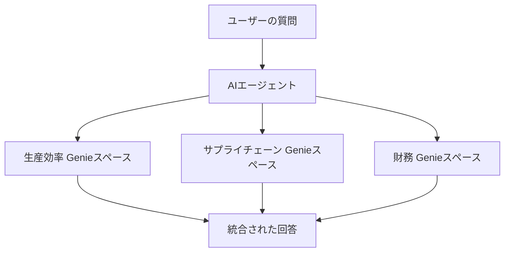
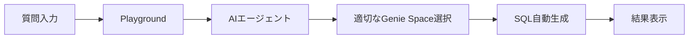
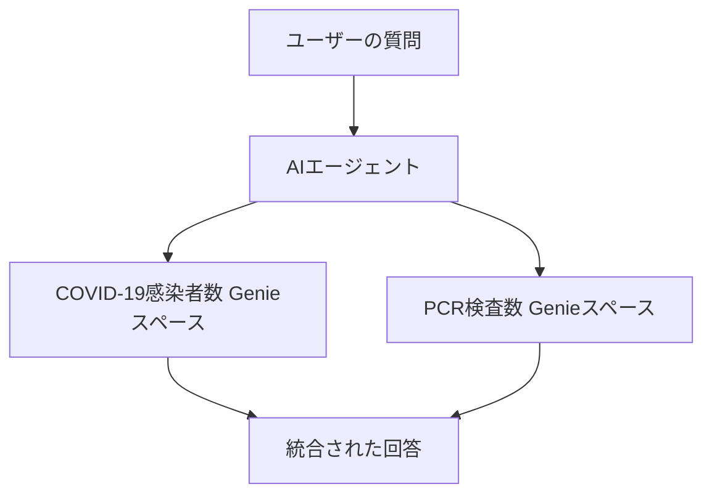

こちらを補完する記事です。元記事はエージェントのソースコードが一部のみ記載されていたので、動作するようにしています。

https://qiita.com/taka_yayoi/items/a9f84b58b8abc6307cfc

# 元記事「エージェントを用いたアプリでの複数Genieスペースのパワーの活用」の説明

## 記事概要
DatabricksのGenieスペースとAgent Frameworkを組み合わせることで、部門横断的な複雑なビジネス質問にも自然言語で答えられる革新的な分析システムを構築できます。

## 機能概要

### Genieスペースとは？

**Genieスペース**は、自然言語（日本語での質問）を自動的にSQLクエリに変換してくれる、まさに「データ分析の翻訳機」です。

| 従来の方法 | Genie Space |
|------------|-------------|
| SQLを書く必要がある | 「先月の売上はいくら？」と普通に質問 |
| 技術者に依頼が必要 | ビジネス部門が直接データ分析 |
| 時間がかかる | リアルタイムで回答 |

### 複数Genieスペースの連携システム



**システム構成の特徴：**
- **専門特化**：各Genieスペースは特定の業務領域に特化
- **統合回答**：AIエージェントが複数のスペースから情報を収集
- **自動判断**：質問内容に応じて適切なスペースを自動選択

## メリットや嬉しさ

### ビジネス部門にとってのメリット

| メリット | 具体例 |
|----------|--------|
| **技術知識不要** | 「サプライチェーンの遅延が生産性に与える影響は？」と自然に質問 |
| **即座に回答** | 従来数日かかった分析が数分で完了 |
| **部門横断分析** | 生産・物流・財務データを一度に分析可能 |

### IT部門にとってのメリット

- Unity Catalogによる自動ガバナンス
- セキュリティ設定の一元管理
- データアクセス権限の自動適用
- 監査ログの自動記録

### 経営陣にとってのメリット

- **意思決定の高速化**：リアルタイムでの経営指標確認
- **コスト削減**：分析作業の自動化により人的コスト削減
- **データドリブン経営**：全社員がデータに基づく判断が可能

## 使い方の流れ

### ステップ1：Genieスペース関数の作成

```sql
-- 基本的なGenie API呼び出し関数
CREATE OR REPLACE FUNCTION _genie_query(
    databricks_host STRING,
    databricks_token STRING,
    space_id STRING,
    question STRING,
    contextual_history STRING
)
RETURNS STRING
LANGUAGE PYTHON
COMMENT 'Genieとの会話を可能にするエージェント関数'
```

### ステップ2：専用ラッパー関数の作成

```sql
-- 生産効率専用の関数例
CREATE OR REPLACE FUNCTION chat_with_production_efficiency(
    question STRING COMMENT "生産効率に関する質問",
    contextual_history STRING COMMENT "関連する過去の会話履歴"
)
RETURNS STRING
LANGUAGE SQL
COMMENT '生産効率データに関する質問応答エージェント'
```

### ステップ3：Databricks Playgroundでプロトタイプ作成



### ステップ4：本番環境への展開

1. **Playgroundでテスト**
   - 各種質問パターンの動作確認
   - レスポンス品質の評価

2. **ノートブックエクスポート**
   - プロトタイプから本格的なコード生成
   - カスタマイズ可能な状態で出力

3. **Databricks Appsでの公開**
   - エンドユーザー向けの直感的なUI
   - 社内での簡単なアクセス環境

# 実装における注意点

## 各エージェントの責任範囲

このアーキテクチャの嬉しさを体感するには、最初に**各Genieスペースがどの粒度の情報を管理するのか**を明確にすることをお勧めします。上の例のように、ある程度の専門領域をカバーするGenieスペースにすべきです。私は当初テーブルごとにGenieスペースを作っていましたが、結果としてテーブルのjoinができないという壁に直面しました。言い換えると、**各エージェントの責任範囲**です。

ここでは、以下の2つのGenieスペースを作成しています。

1. 日本におけるCOVID-19の感染者数のデータを持つGenieスペース
1. 日本におけるPCR検査数のデータを持つGenieスペース

通常であれば、これらのテーブルも一つのGenieスペースに含める選択肢もあると思いますが、今回はマルチエージェントの挙動を学習するのが目的なので分割しています。

## アーキテクチャ

[こちら](https://langchain-ai.github.io/langgraph/concepts/multi_agent/)にあるように、マルチエージェントシステムのアーキテクチャは多岐に渡ります。どのようなやりとりを経て、どのように最終回答を生成するのかを念頭においてアーキテクチャを選択する必要があります。

今回は以下のようにシンプルな構成ですが、[こちら](https://qiita.com/taka_yayoi/items/b7f8b4ede01899d57852)にあるように要件に応じたアーキテクチャを選択する必要性も出てくると思います。



# 実装

## パーソナルアクセストークンの取得

[こちらの手順](https://docs.databricks.com/aws/ja/dev-tools/auth/pat)でパーソナルアクセストークンを取得しておきます。

## Genieスペースの準備

いずれのスペースも、[こちら](https://www.mhlw.go.jp/stf/covid-19/open-data.html)のデータから作成したテーブルを参照しています。GenieスペースのIDが必要になりますので、[こちら](https://docs.databricks.com/aws/ja/genie/conversation-api#-%E3%82%B9%E3%83%86%E3%83%83%E3%83%97-3-%E8%A9%B3%E7%B4%B0%E3%82%92%E5%8F%8E%E9%9B%86%E3%81%99%E3%82%8B)を参考にコピーしておきます。


## Unity Catalog関数の定義

ここが今回の肝です。[GenieのAPI](https://docs.databricks.com/api/workspace/genie)コールを行うPython関数を用いてUnity Catalog関数を定義します。

```sql
%sql
-- 生成されたクエリを実行し結果を返す追加関数
CREATE OR REPLACE FUNCTION takaakiyayoi_catalog.genie._genie_query_and_execute(databricks_host STRING,
                 databricks_token STRING,
                 space_id STRING,
                 question STRING,
                 contextual_history STRING)
RETURNS STRING
LANGUAGE PYTHON
COMMENT 'これは、質問に対して対話できるエージェントです。簡単な質問を提供し、以前の会話があった場合は履歴を提供してください。'
AS
$$
import requests
import json
import time

def main(databricks_host, databricks_token, space_id, question, contextual_history):
    try:
        # APIのベースURL
        base_url = f"https://{databricks_host}"
        
        # 認証用ヘッダー
        headers = {
            "Authorization": f"Bearer {databricks_token}",
            "Content-Type": "application/json"
        }
        
        # 会話内容の準備
        if contextual_history and contextual_history.strip():
            content = f"コンテキスト: {contextual_history}\n\n質問: {question}"
        else:
            content = question
        
        # 新しい会話を開始
        start_conversation_url = f"{base_url}/api/2.0/genie/spaces/{space_id}/start-conversation"
        conversation_payload = {
            "content": content
        }
        
        response = requests.post(
            start_conversation_url,
            headers=headers,
            json=conversation_payload,
            timeout=30
        )
        
        if response.status_code != 200:
            return f"会話開始エラー: {response.status_code} - {response.text}"
        
        conversation_data = response.json()
        conversation_id = conversation_data.get("conversation_id")
        message_id = conversation_data.get("message_id")
        
        if not conversation_id or not message_id:
            return "エラー: 会話IDまたはメッセージIDが取得できません"
        
        # 完了までポーリング
        max_attempts = 60
        poll_interval = 5
        
        for attempt in range(max_attempts):
            # メッセージの状態を確認
            message_url = f"{base_url}/api/2.0/genie/spaces/{space_id}/conversations/{conversation_id}/messages/{message_id}"
            
            message_response = requests.get(message_url, headers=headers, timeout=30)
            
            if message_response.status_code != 200:
                return f"メッセージ状態確認エラー: {message_response.status_code}"
            
            message_data = message_response.json()
            status = message_data.get("status", "")

            if status == "COMPLETED":
                # クエリアタッチメントを探して実行
                attachments = message_data.get("attachments", [])
                
                for attachment in attachments:
                    attachment_id = attachment.get("attachment_id")
                    if attachment_id:
                        
                        # クエリ結果を取得
                        result_url = f"{base_url}/api/2.0/genie/spaces/{space_id}/conversations/{conversation_id}/messages/{message_id}/attachments/{attachment_id}/query-result"
                        
                        result_response = requests.get(result_url, headers=headers, timeout=30)
                        
                        if result_response.status_code == 200:
                            result_data = result_response.json()
                            return json.dumps(result_data, ensure_ascii=False)
            
            elif status == "FAILED":
                error_msg = message_data.get("error", "不明なエラー")
                return f"クエリ失敗: {error_msg}"
            
            time.sleep(poll_interval)
        
        return "クエリのタイムアウト"
        
    except Exception as e:
        return f"エラー: {str(e)}"

return main(databricks_host, databricks_token, space_id, question, contextual_history)
$$;
```

この時点で動作確認します。ホスト名には`https://`は含めないでください。

```sql
%sql
SELECT
            takaakiyayoi_catalog.genie._genie_query_and_execute(
                "<Databricksホスト名>",
                "<パーソナルアクセストークン>",
                "<GenieスペースID>",
                "東京の感染者数の変化", ""
            )
```


上記関数をラッピングして、異なるGenieスペースを呼び出すUC関数も定義します。

```sql
%sql
CREATE OR REPLACE FUNCTION takaakiyayoi_catalog.genie.chat_with_covid_data(
        question STRING COMMENT "COVIDに関する質問",
        contextual_history STRING COMMENT "この質問に答えるために関連する履歴を提供してください。関連する履歴がない場合は「関連する履歴なし」と記入してください。"
    )
    RETURNS STRING
    LANGUAGE SQL
    COMMENT 'これは、COVIDに関する質問に対して対話できるエージェントです。簡単な質問を提供し、以前の会話があった場合は履歴を提供してください。'
    RETURN
        SELECT
            takaakiyayoi_catalog.genie._genie_query_and_execute(
                "<Databricksホスト名>",
                "<パーソナルアクセストークン>",
                "<GenieスペースID_1>",
                question, -- 関数から取得
                contextual_history -- 関数から取得
            );
```

```sql
%sql
CREATE OR REPLACE FUNCTION takaakiyayoi_catalog.genie.chat_with_pcr_data(
        question STRING COMMENT "PCR検査数に関する質問",
        contextual_history STRING COMMENT "この質問に答えるために関連する履歴を提供してください。関連する履歴がない場合は「関連する履歴なし」と記入してください。"
    )
    RETURNS STRING
    LANGUAGE SQL
    COMMENT 'これは、PCR検査数に関する質問に対して対話できるエージェントです。簡単な質問を提供し、以前の会話があった場合は履歴を提供してください。'
    RETURN
        SELECT
            takaakiyayoi_catalog.genie._genie_query_and_execute(
                "<Databricksホスト名>",
                "<パーソナルアクセストークン>",
                "<GenieスペースID_2>",
                question, -- 関数から取得
                contextual_history -- 関数から取得
            );
```

これで、3つのUC関数を作成しました。


## Playgroundでの動作確認

### シングルエージェントでの動作確認

はじめに、`chat_with_covid_data`のみを追加して問い合わせを行います。


適切にツールが呼び出されて結果を得ることができました。なお、デバッグの際は対象のGenieスペースの履歴を見ると助けになると思います。


次に翌月のデータを聞いてみます。`簡単な質問を提供し、以前の会話があった場合は履歴を提供してください。`という指示の通り、生成AIモデルが過去のやりとりを入力に追加してくれています。


### マルチエージェントでの動作確認

ここまでは、シングルエージェントなので`chat_with_pcr_data`を追加して、マルチエージェントにします。


意図的に複数のエージェントを呼び出すような質問を行います。

```
2023年1月における感染者数とPCR検査数の関係
```

すると、複数のエージェントを呼び出して、それぞれのエージェントの回答を統合してくれます。


```
2023年における月別の感染者数とPCR検査数の関係
```


# まとめ

こちらを実装してみて実感できたポイントは以下の通りです:

- 個々のエージェントの所掌(どのテーブルを管理し、どのような質問に回答するのか)を明確に定義することからスタートすべき。
- 個々のエージェントの定義と並行して、マルチエージェントシステムとユーザーのインタラクションも設計すべき。各エージェントのレスポンスをどのように統合して最終アウトプットをまとめるのかのイメージした上で、フロー図やシーケンス図に落とし込んで実装を具体化していくことになる。
- 今回の実装は、ルーティングはLLMとエージェントの説明文に依存しているが、明示的なルーティングが必要な場合には、[LangGraph](https://qiita.com/taka_yayoi/items/b7f8b4ede01899d57852)や[OpenAI Agents SDK](https://qiita.com/taka_yayoi/items/c2686b7bc95beba4a8d1)を用いた方が良さそう。

しかし、こういうプログラミング体験は初めてのことばかりで面白いですね。


### はじめてのDatabricks

[はじめてのDatabricks](https://qiita.com/taka_yayoi/items/8dc72d083edb879a5e5d)

### Databricks無料トライアル

[Databricks無料トライアル](https://databricks.com/jp/try-databricks)
