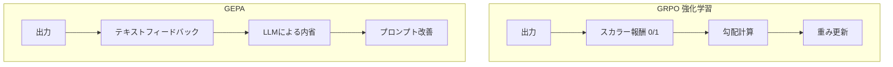
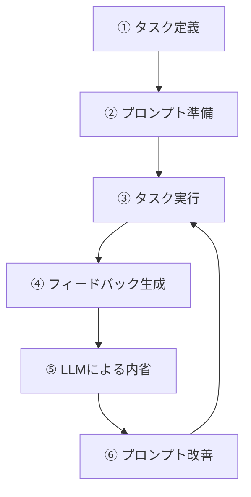
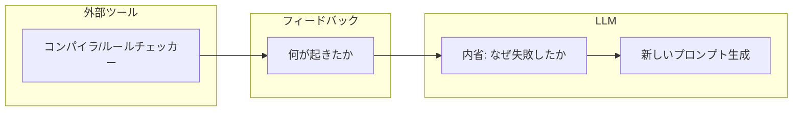

:::note info
こちらは、GEPAの論文をベースにしたClaudeとのやりとりを通じて記述しました。
:::

# はじめに

LLMのプロンプト最適化において、強化学習(GRPO)に代わる新しいアプローチ「GEPA(Genetic-Pareto)」が提案されました。本記事では、GEPAの核心的なアイデアを対話形式で解説します。

論文: [Reflective Prompt Evolution for Compound AI System Optimization](https://arxiv.org/abs/2507.19457)

# GEPAの全体像


## 3つのコア原則

GEPAは以下の3つの原則に基づいて設計されています。

```
1. 遺伝的プロンプト進化(Genetic Prompt Evolution)
   → プロンプトを「突然変異」と「交叉」で改善
   → 候補プールを維持し、系譜を追跡

2. 自然言語リフレクション(Reflective Mutation)
   → 実行トレースとフィードバックをLLMで分析
   → 問題を診断し、改善案を提案

3. パレート最適化(Pareto-based Selection)
   → 複数の「勝ち戦略」を維持
   → 局所最適を回避
```

## アルゴリズムの流れ

```
入力:
  - システム Φ(複数のLLMモジュール)
  - 訓練データ D_train
  - 評価関数 μ
  - フィードバック関数 μ_f
  - 予算 B

処理:
  D_trainを2つに分割:
    - D_feedback: 学習用
    - D_pareto: 検証用

  各イテレーション:
    ① SelectCandidate: 候補プールから親を選択
    ② SelectModule: 改善対象のモジュールを選択
    ③ ミニバッチでロールアウト実行、フィードバック収集
    ④ UpdatePrompt: LLMがフィードバックを基にプロンプトを改善
    ⑤ D_paretoで評価、パレートフロンティアを更新

出力: 最適化されたプロンプト集合
```

## パレート選択とは

常に「現時点で最高スコアの候補」だけを選ぶと、局所最適に陥る危険があります。

```
【問題の例】
タスク1: 候補Aが最高(90点)、候補Bは80点
タスク2: 候補Aは60点、候補Bが最高(95点)
タスク3: 候補Aは70点、候補Bは65点

平均: A=73.3点、B=80点

→ 平均で選ぶとBだけを残す
→ しかしAはタスク1で最強の戦略を持っている
→ Aを捨てると、その戦略が失われる


【パレート選択の解決策】
各タスクで「1位」を取った候補をすべて保持

タスク1: A ✓(1位)
タスク2: B ✓(1位)
タスク3: B ✓(1位)

→ AもBもパレートフロンティアとして保持
→ 異なる「勝ち戦略」を維持できる
```

これにより、多様な候補から進化を続けることができます。

# 強化学習とGEPAの違い



## 強化学習(GRPO)のアプローチ

強化学習では、LLMの出力に対して**スカラー報酬**(単一の数値)で評価し、勾配更新でモデルの重みを調整します。

```
入力: "東京タワーの高さは？"
LLM出力: "333メートルです"
報酬: 1.0(正解)

入力: "東京タワーの高さは？"  
LLM出力: "634メートルです"
報酬: 0.0(不正解)
```

### GRPOの問題点: 情報の損失

マルチホップQAタスクでの例を見てみましょう。

```
質問: "トム・ハンクスが主演した映画の監督で、
      スピルバーグと同じ大学を卒業したのは誰？"

【LLMシステムの実行トレース】
├─ ホップ1: "トム・ハンクス 主演映画" を検索 ✓
├─ ホップ2: "フォレスト・ガンプ 監督" を検索 ✓
├─ ホップ3: "スピルバーグ 大学" を検索 ✓
├─ ホップ4: "ロバート・ゼメキス 大学" を検索 ✗(失敗)
└─ 最終回答: "不明"

【GRPOが受け取る情報】
報酬 = 0.0(不正解)

→ どのホップで失敗したか不明
→ なぜ失敗したか不明
→ どう改善すべきか不明
```

豊富な実行情報が「0」という1つの数字に圧縮されてしまいます。

## GEPAのアプローチ

GEPAでは、**テキストフィードバック**を活用し、LLM自身に**内省**させてプロンプトを改善します。

```
【同じタスクでGEPAが受け取る情報】

フィードバックテキスト:
"ホップ1-3は成功。ホップ4で失敗。
 
 失敗の原因分析:
 - クエリ「ロバート・ゼメキス 大学」は曖昧
 - 「どの大学を卒業したか」という意図が不明確
 - 「学歴」「卒業」などのキーワードが欠如"
```

# GEPAの処理フロー

## 全体の流れ



```
① タスクがある
   例: マルチホップQA、プライバシー保護変換など

② そのタスクをLLMにやらせるためのプロンプトがある
   「こういう手順で、こういう点に注意して処理せよ」

③ 実際にタスクを実行する
   入力 → LLM(プロンプトに従う) → 出力

④ 出力を評価し、フィードバックを生成
   「ここが失敗」「この情報が欠落」など

⑤ フィードバックを基にLLMが内省
   「なぜ失敗したか」「どう改善すべきか」

⑥ より良いプロンプトを生成
   改善点を反映した新しい動作指針

③〜⑥を繰り返す
```

## この文脈での「プロンプト」とは

GEPAの文脈では、プロンプトは**LLMへの動作指針・命令書**を意味します。

```
【一般的な使い方】
プロンプト = ユーザーがLLMに送る質問や依頼
例: 「東京タワーの高さを教えて」

【GEPAの文脈】
プロンプト = LLMへの動作指針
例: 「あなたは検索クエリ生成モジュールです。
     以下のルールに従ってクエリを生成してください...」
```

# フィードバックと内省

## フィードバックの生成方法

フィードバックは**必ずしもLLMが生成するわけではありません**。主に以下の方法で生成されます。

| タスク | フィードバック生成方法 |
|--------|------------------------|
| IFBench(制約付き生成) | ルールベースで制約違反をチェック |
| コード生成 | コンパイラのエラーメッセージをそのまま利用 |
| マルチホップQA | 実行ログを整形 |

**IFBenchの例:**
```python
# 制約: 「500文字以内」「"however"を含む」
# LLMの出力: 620文字、"however"なし

# フィードバック生成(プログラム的に)
if len(output) > 500:
    feedback += "文字数超過: 620/500"
if "however" not in output:
    feedback += "必須キーワード欠落: however"
```

## 内省(Reflection)でLLMを使う

フィードバック自体はルールベースや外部ツールで生成しますが、**そのフィードバックを読んで「なぜ失敗したか」「どう直すべきか」を考える内省フェーズでLLMを使います**。



```
【役割分担】

【フィードバック】
  生成者: コンパイラ、検索エンジン、ルールチェッカー等
  内容:  「何が起きたか」の事実
          ↓
【内省(Reflection)】
  実行者: LLM
  内容:  「なぜ失敗したか」「どう直すべきか」の分析
          ↓
【新しいプロンプト】
  生成者: LLM
  内容:   改善された動作指針
```

## 内省用のメタプロンプト

内省には**メタプロンプト**(固定)が使われます。

```
私はアシスタントに以下の指示を与えてタスクを実行させました:

'''
[現在のプロンプト]
'''

以下は入力、出力、フィードバックの例です:

'''
[ミニバッチのサンプル]
'''

あなたの課題は新しい指示を書くことです。
- 入力形式とタスクの詳細を推測してください
- フィードバックからドメイン知識を抽出してください
- 成功パターンを一般化して指示に含めてください
```

階層構造としては以下のようになります。

```
【レベル1: タスク実行】
  プロンプト → LLM → 出力

【レベル2: 内省・改善】
  メタプロンプト(固定) → LLM → 新しいプロンプト
       ↑
  「現在のプロンプト + フィードバック」を入力として含む
```

# なぜLLMに「言葉で教える」のか

## 2つの学習方法の比喩

```
【方法A: 試行錯誤(強化学習)】
先生: 「弾いてみて」
子供: ♪(演奏)
先生: 「違う」(それだけ)
子供: ♪(別の弾き方)
先生: 「違う」
...
→ 何千回も繰り返して「体で覚える」

【方法B: 言語的説明(GEPA)】
先生: 「弾いてみて」
子供: ♪(演奏)
先生: 「3小節目のシャープを忘れてるよ。
       この曲は短調だから必ずシャープが必要」
子供: 「なるほど、調号を確認すればいいんだ」
→ 数回の説明で「原理を理解」
```

## GEPAの核心的アイデア

LLMはもともと「言葉を理解する」能力を持っています。GEPAはこの能力を**自分自身の改善にも使おう**という発想です。

```
【従来】
LLMの言語理解能力 → ユーザーの質問に答える

【GEPA】
LLMの言語理解能力 → ユーザーの質問に答える
                  → 自分の失敗を分析する ← 新しい
                  → 改善方法を提案する  ← 新しい
```

> 「LLMに数字(0/1)で教えるのではなく、言葉で教える。
> LLMは言葉を理解できるのだから、言葉で教えた方が効率的。」

# 学習効率の違い

## 1回のロールアウトで得られる情報量

```
【GRPO】
報酬: 0.0
→ 1ビット程度の情報
→ 「失敗した」という事実のみ

【GEPA】
- どのステップで失敗したか
- なぜ失敗したか(原因分析)
- 何が足りなかったか(欠落情報)
- どう改善すべきか(具体的提案)
→ 数百〜数千トークンの情報
→ 直接的な改善指針を含む
```

## 実験結果

論文の実験では、GEPAは**GRPOに比べて平均10%高い性能**を、**最大35分の1のロールアウト数**で達成しました。

| タスク | GRPO | GEPA | 効率化 |
|--------|------|------|--------|
| HotpotQA | 43.33 | 62.33 | 60倍 |
| IFBench | 35.88 | 38.61 | 73倍 |
| HoVer | 38.67 | 52.33 | 20倍 |
| PUPA | 86.66 | 91.85 | 78倍 |

# プロンプト進化の具体例

論文のPUPAタスク(プライバシー保護クエリ変換)での進化を見てみましょう。

```
【候補0: 初期プロンプト】スコア: 82.26
"プライベートなユーザークエリを、外部LLM用の
 プライバシー保護リクエストに変換せよ。"

    ↓ 反省: PIIの特定方法が不明確

【候補2: 1回目の改善】スコア: 90.99
"+ PIIの特定と一般化に関する詳細なガイダンス
 + クエリ意図の分析と変換理由の説明を追加"

    ↓ 反省: 出力形式が不統一

【候補4: 2回目の改善】スコア: 94.44
"+ 出力を「推論」と「リクエスト」に分離
 + 名前/コードの明示的禁止
 + 抽象化の具体例を追加"

    ↓ 反省: 透明性が不足

【候補11: 最終形】スコア: 97.60
"+ 厳格なステップバイステップのPII抽象化
 + 部分的な墨消しの禁止
 + 監査可能なプライバシー保護の徹底"
```

各改善ステップで、**なぜその変更が必要か**が自然言語で記録されています。

# まとめ

| 観点 | GRPO(強化学習) | GEPA |
|------|----------------|------|
| 学習信号 | スカラー報酬(0/1) | テキストフィードバック |
| 改善の単位 | モデルの重み | プロンプト(テキスト) |
| 改善の可読性 | 不可読 | 可読(自然言語) |
| 必要サンプル数 | 数万〜数十万 | 数百〜数千 |
| 計算資源 | GPU必須 | API呼び出しのみ |
| 局所最適回避 | なし | パレート選択 |

GEPAは「LLMの言語理解能力を学習にも活用する」という発想で、効率的なプロンプト最適化を実現しています。

## GEPAの3つのポイント

1. **フィードバック**: 外部ツール(コンパイラ、ルールチェッカー等)が「何が起きたか」を記録
2. **内省**: LLMがフィードバックを読み、「なぜ失敗したか」「どう直すべきか」を分析
3. **パレート選択**: 複数の「勝ち戦略」を維持し、局所最適を回避
