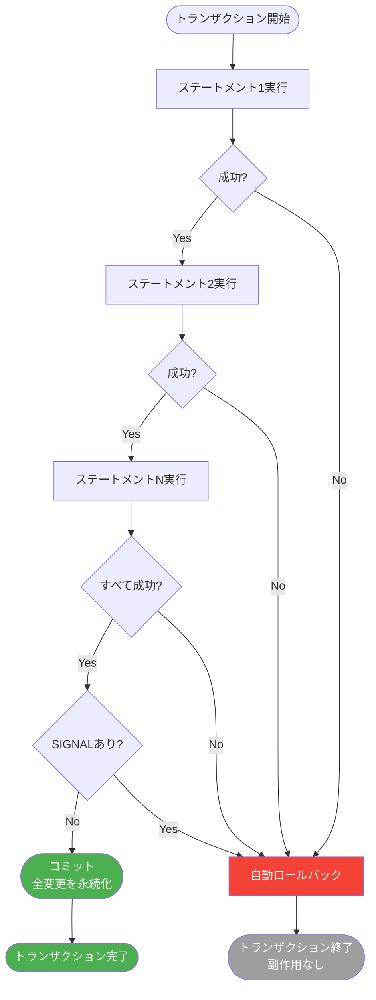

こちらのアップデートです。待ちに待った機能。

> **マルチテーブルトランザクションがパブリックプレビューで利用可能になりました**
> `BEGIN ATOMIC ... END;`構文を使用して、複数のテーブルにまたがる複数のSQLステートメントを単一のアトミックトランザクションにまとめることができるようになりました。すべての変更は一緒に成功するか、一緒にロールバックされるため、操作全体でデータの一貫性が確保されます。マルチテーブルトランザクションを使用するには、参加するテーブルで[カタログ管理コミット](https://docs.databricks.com/aws/ja/delta/catalog-managed-commits)を有効にする必要があり、Unity Catalogマネージドのテーブルでサポートされています。
>
> 詳細は[トランザクション](https://docs.databricks.com/aws/ja/transactions/)を参照してください。

https://docs.databricks.com/aws/ja/release-notes/product/2026/march#multi-table-transactions-are-now-in-public-preview

# Databricksのマルチテーブルトランザクションとは

待望のマルチテーブルトランザクション機能が、Databricksでパブリックプレビューとして利用可能になりました。これまでDeltaテーブルでは単一ステートメントのACID保証はありましたが、複数テーブルにまたがるトランザクション処理は実現できていませんでした。今回の機能追加により、ミッションクリティカルなウェアハウスワークロードをDatabricks上で構築できるようになります。

本記事では、公式ドキュメントの概要とチュートリアルをもとに、実際に試した結果を交えながら解説します。

:::note info
**プレビューステータス**
- Unity Catalog管理のDeltaテーブルへの書き込みトランザクション: **パブリックプレビュー**
- Unity Catalog管理のIcebergテーブルへの書き込みトランザクション: **プライベートプレビュー**
:::

# トランザクションとは

[Databricksのトランザクション](https://docs.databricks.com/aws/ja/transactions/)を使うと、複数のSQLステートメントとテーブル間で操作を調整できます。すべての変更は同時に成功するか、同時にロールバックされるため、操作とテーブル全体でデータの一貫性が確保されます。

トランザクションはACID保証 (原子性・一貫性・独立性・永続性) を提供します。

```sql
BEGIN ATOMIC
  UPDATE accounts SET balance = balance - 100 WHERE id = 1;
  UPDATE accounts SET balance = balance + 100 WHERE id = 2;
  INSERT INTO audit_log VALUES (1, 2, 100, current_timestamp());
END;
```

この3つのステートメントはすべて一緒にコミットされます。いずれかが失敗した場合、すべての変更がロールバックされます。




# 要件

複数のステートメントまたは複数のテーブルにまたがるトランザクションを実行するには:

- 書き込まれるすべてのテーブルが以下の条件を満たす必要があります
  - Unity Catalogマネージドテーブル (DeltaまたはIceberg)
  - [カタログ管理コミット](https://docs.databricks.com/aws/ja/delta/catalog-managed-commits)を有効化
- サポートされているコンピュートを使用する
  - **非対話型トランザクション**: SQL、サーバレスコンピュート、またはDatabricks Runtime 18.0以降のクラスター
  - **対話型トランザクション**: 任意のSQLウェアハウス

# トランザクションモード

Databricksは2つのトランザクションモードをサポートしています。

| モード | 構文 | コミット | ロールバック | 用途 |
|--------|------|----------|------------|------|
| 非対話型 | `BEGIN ATOMIC ... END;` | 成功時に自動 | エラー時に自動 | 固定シーケンス、スケジュールジョブ |
| 対話型 | `BEGIN TRANSACTION` / `COMMIT` | 手動 | 手動 | 条件付きロジック、検証とデバッグ、JDBC/ODBC |

# サポートされている操作

トランザクション内では以下の操作を使用できます。

| 操作 | 説明 |
|------|------|
| `SELECT` | データのクエリと結果の検証 |
| `VALUES句` | テストデータまたは定数値を生成 |
| `INSERT` (すべてのバリアント) | 新しい行を追加 |
| `UPDATE` | 既存の行を変更 |
| `COPY INTO` | ファイルからDeltaテーブルにデータをロード |
| `DELETE FROM` | 行を削除 |
| `MERGE INTO` | 挿入・更新・削除を組み合わせたアップサートパターン |

# トランザクション分離

トランザクションは、すべてのステートメントにわたって繰り返し可能な読み取り (Repeatable Read) を提供します。最初のアクセス時にテーブルの一貫したスナップショットをキャプチャし、他のユーザーが同時に変更を加えても読み取りの一貫性が維持されます。

## 競合検出と同時実行

Databricksは楽観的同時実行制御を採用しています。トランザクションはロックなしで進行し、競合はコミット時に検出されます。

- **非対話型トランザクション**: 行レベルの同時実行性をサポート
- **対話型トランザクション**: テーブルレベルの同時実行性をサポート

## 競合シナリオ

| シナリオ | 説明 |
|---------|------|
| 書き込み競合 | 2つのトランザクションが同じ行を更新または削除 |
| 書き込みと読み取りの競合 | 別のトランザクションが読み取った行を変更 (シリアライザブル分離のみ) |
| ファントムリード競合 | 別のトランザクションが読み取り述語に一致する新しい行を追加 |
| メタデータの競合 | 別のトランザクションによってテーブルスキーマやプロパティが変更 |

# Deltaでのトランザクションの表示

成功した各トランザクションは、内部のステートメント数に関係なく、テーブルのDeltaログに**1つのエントリ**として表示されます。これにより明確な監査証跡が提供され、ロールバック操作が簡素化されます。

# エラー処理とロールバック

| シナリオ | 非対話型の動作 | 対話型の動作 |
|---------|-------------|------------|
| ステートメントの失敗 | 即時自動ロールバック | 明示的な`ROLLBACK`が必要 |
| 検証ロジックの失敗 | `SIGNAL`で自動ロールバック | 明示的な`ROLLBACK`が必要 |
| セッション切断 | 自動ロールバック | 自動ロールバック |
| アイドルタイムアウト | 48時間で自動ロールバック | 10分の無操作または48時間で自動ロールバック |

# チュートリアル: テーブル間のトランザクションを調整する

以下は[公式チュートリアル](https://docs.databricks.com/aws/ja/transactions/tutorial)をもとに実際に試した結果です。

## サンプルテーブルのセットアップ

SQLエディターまたはノートブックで2つのサンプルテーブルを作成します。

```sql
-- アカウントデータ用テーブルを作成
CREATE TABLE IF NOT EXISTS sample_accounts (
  id INT,
  account_name STRING,
  balance DECIMAL(10,2)
) USING DELTA
TBLPROPERTIES (
  'delta.feature.catalogManaged' = 'supported'
);

-- トランザクション記録用テーブルを作成
CREATE TABLE IF NOT EXISTS sample_transactions (
  id INT,
  account_id INT,
  transaction_type STRING,
  amount DECIMAL(10,2)
) USING DELTA
TBLPROPERTIES (
  'delta.feature.catalogManaged' = 'supported'
);

-- サンプルデータを挿入
INSERT INTO sample_accounts VALUES
  (1, 'Alice', 1000.00),
  (2, 'Bob', 500.00);

INSERT INTO sample_transactions VALUES
  (1, 1, 'deposit', 100.00);
```

セットアップを確認します。

```sql
SELECT * FROM sample_accounts;
SELECT * FROM sample_transactions;
```

実行結果:


```
sample_accounts:
id  account_name  balance
1   Alice         1000.00
2   Bob            500.00

sample_transactions:
id  account_id  transaction_type  amount
1   1           deposit           100.00
```

# 非対話型トランザクション

`BEGIN ATOMIC ... END;`構文を使用します。すべてのステートメントが成功すると自動コミット、いずれかが失敗すると自動ロールバックされます。

## 成功したトランザクションの実行

両方のテーブルをアトミックに更新します。

```sql
BEGIN ATOMIC
  -- Aliceのアカウント残高を更新
  UPDATE sample_accounts
  SET balance = balance + 100.00
  WHERE id = 1;

  -- 入金トランザクションを記録
  INSERT INTO sample_transactions
  VALUES (2, 1, 'deposit', 100.00);
END;
```

両方の操作が成功したことを確認します。

```sql
-- Aliceの残高は1100.00になっているはず
SELECT * FROM sample_accounts WHERE id = 1;

-- トランザクション記録が2件になっているはず
SELECT * FROM sample_transactions;
```

実行結果:


```
sample_accounts (id=1):
id  account_name  balance
1   Alice         1100.00

sample_transactions:
id  account_id  transaction_type  amount
1   1           deposit           100.00
2   1           deposit           100.00
```

どちらかのステートメントが失敗した場合、どちらの変更もコミットされません。

## SIGNALを使った条件付きトランザクション失敗

`BEGIN ATOMIC ... END;`ブロック内で`SIGNAL`を使うと、ユーザー定義の条件が満たされない場合にトランザクションを失敗させることができます。

```sql
BEGIN ATOMIC
  -- 新しいアカウントを挿入
  INSERT INTO sample_accounts VALUES (3, 'Charlie', -50.00);

  -- 残高がマイナスの場合にトランザクションを失敗させる
  IF (SELECT balance FROM sample_accounts WHERE id = 3) < 0 THEN
    SIGNAL SQLSTATE '45000' SET MESSAGE_TEXT = 'Account balance cannot be negative';
  END IF;
END;
```

`SIGNAL`がエラーを発生させ、トランザクション全体が自動ロールバックされます。

```sql
-- 0行返るはず (SIGNALによりロールバック済み)
SELECT * FROM sample_accounts WHERE id = 3;
```

実行結果:


```
0行返却 (ロールバック確認)
```

## 失敗時の自動ロールバック確認

無効なステートメントを含むトランザクションを実行します。

```sql
BEGIN ATOMIC
  -- このステートメントは有効
  INSERT INTO sample_accounts VALUES (4, 'David', 300.00);

  -- このステートメントは失敗する (テーブルが存在しない)
  INSERT INTO non_existent_table VALUES (1, 2, 3);
END;
```

```sql
-- 0行返るはず (トランザクションがロールバックされた)
SELECT * FROM sample_accounts WHERE id = 4;
```

実行結果:


```
0行返却 (ロールバック確認)
```

最初の`INSERT`ステートメントは有効でしたが、2番目が失敗したためロールバックされました。これがトランザクションの「すべてか無か」の保証です。

# 対話型トランザクション

`BEGIN TRANSACTION`でトランザクションを開始し、`COMMIT`で変更を保存するか`ROLLBACK`で破棄するかを明示的に制御します。

## 変更をコミットする

トランザクションを開始します。

```sql
BEGIN TRANSACTION;
```

変更を加えます (まだコミットされていません)。

```sql
INSERT INTO sample_accounts VALUES (5, 'Eve', 850.00);
UPDATE sample_accounts SET balance = balance + 50.00 WHERE id = 2;
```

変更を永続化します。

```sql
COMMIT;
```

変更を確認します。

```sql
-- Eveのアカウントが見えるはず
SELECT * FROM sample_accounts WHERE id = 5;

-- Bobの残高は550.00 (500 + 50) になっているはず
SELECT * FROM sample_accounts WHERE id = 2;
```

実行結果:


```
sample_accounts (id=5):
id  account_name  balance
5   Eve           850.00

sample_accounts (id=2):
id  account_name  balance
2   Bob           550.00
```

## 変更をロールバックする

新しいトランザクションを開始します。

```sql
BEGIN TRANSACTION;
```

変更を加えます。

```sql
INSERT INTO sample_accounts VALUES (6, 'Frank', 600.00);
```

セッション内で変更が見えることを確認します。

```sql
-- Frankのアカウントが見えるはず (自分のセッション内のみ)
SELECT * FROM sample_accounts WHERE id = 6;
```

実行結果 (ROLLBACK前):


```
id  account_name  balance
6   Frank         600.00
```

変更を破棄します。

```sql
ROLLBACK;
```

変更が破棄されたことを確認します。

```sql
-- 0行返るはず (挿入がロールバックされた)
SELECT * FROM sample_accounts WHERE id = 6;
```

実行結果 (ROLLBACK後):


```
0行返却 (ロールバック確認)
```

# ストアドプロシージャとSQLスクリプトでの活用

トランザクションと[ストアドプロシージャ](https://docs.databricks.com/aws/ja/sql/language-manual/sql-ref-syntax-ddl-create-procedure)を組み合わせることで、再利用可能なトランザクションロジックを実装できます。

## テーブルの作成

```sql
CREATE TABLE orders (order_id STRING, item_sku STRING, quantity_ordered INT)
  TBLPROPERTIES ('delta.feature.catalogManaged' = 'supported');

CREATE TABLE inventory (item_sku STRING, quantity_in_stock INT)
  TBLPROPERTIES ('delta.feature.catalogManaged' = 'supported');
```

## ストアドプロシージャの定義

```sql
CREATE OR REPLACE PROCEDURE main.retail.apply_order(
    IN  p_order_id      STRING,
    IN  p_customer_id   STRING,
    IN  p_order_amount  DECIMAL(18,2)
)
LANGUAGE SQL
SQL SECURITY INVOKER
MODIFIES SQL DATA
AS
BEGIN
    -- 注文を挿入
    INSERT INTO main.retail.orders (order_id, customer_id, amount)
    VALUES (p_order_id, p_customer_id, p_order_amount);

    -- 顧客ごとの売上合計を更新
    MERGE INTO main.retail.total_sales AS t
    USING (
        SELECT
          p_customer_id  AS customer_id,
          p_order_amount AS order_amount
    ) s
      ON t.customer_id = s.customer_id
    WHEN MATCHED THEN
      UPDATE SET t.total_amount = t.total_amount + s.order_amount
    WHEN NOT MATCHED THEN
      INSERT (customer_id, total_amount)
      VALUES (s.customer_id, s.order_amount);
END;
```

## トランザクションの定義

```sql
BEGIN ATOMIC
    -- このトランザクションのステージングバッチID
    DECLARE new_order_id STRING DEFAULT uuid();
    DECLARE v_batch_id STRING DEFAULT uuid();

    -- 1) 顧客と注文行をステージングに挿入
    INSERT INTO main.retail.orders_staging (order_id, customer_id, amount, batch_id)
    VALUES (new_order_id, 'CUST_123', 249.99, v_batch_id);

    -- 2) ストアドプロシージャ経由でステージングから本番へ書き込み
    FOR o AS
      SELECT
        order_id,
        customer_id,
        amount
      FROM main.retail.orders_staging
      WHERE batch_id = v_batch_id
    DO
        CALL main.retail.apply_order(
          o.order_id,
          o.customer_id,
          o.amount
        );
    END FOR;

    -- 3) 処理済みのステージング行をクリーンアップ
    DELETE FROM main.retail.orders_staging
    WHERE batch_id = v_batch_id;
END; -- 4) トランザクションをコミット
```

トランザクションの一部が失敗した場合、Databricksはすべての変更を自動的にロールバックします。

# 制限事項

複数テーブルにまたがるトランザクションには以下の制限があります。

| 制限 | 内容 |
|------|------|
| 対話型トランザクションの競合 | テーブルレベルで競合が発生する可能性。行レベルの競合検出が重要な場合は非対話型を推奨 |
| 書き込みターゲット | `catalogManaged`テーブル機能が有効なUnity Catalog管理テーブルのみ |
| DML操作のみ | DDL (`CREATE TABLE`、`ALTER TABLE`など) はトランザクション外で実行 |
| `COPY INTO`の同時実行 | 同じテーブルへの並行`COPY INTO`が先にコミットされると失敗 |
| ストリーミング書き込み非対応 | ストリーミングテーブルへのトランザクション書き込みは不可 |
| RLS/CLMテーブル非対応 | 行フィルターや列マスクを持つテーブルはトランザクションに参加不可 |
| テーブル・ビュー上限 | 最大100テーブルへの読み書き、最大100ビューからの読み取り |
| タイムトラベル非対応 | トランザクション内でのタイムトラベル使用不可 |
| アイドルタイムアウト | 対話型: 10分の無操作でロールバック |
| 最大期間 | 全トランザクション: 48時間でロールバック |

# ベストプラクティス

競合を減らしパフォーマンスを最適化するためのポイントです。

- **トランザクションを短く保つ**: 実行時間が長いと競合の可能性が高まる
- **早期検証**: トランザクション開始時に前提条件をチェックして早期失敗させる
- **非対話型トランザクションを優先**: Databricksはほとんどのユースケースで非対話型を推奨 (行レベルの同時実行性が利用可能)
- **競合時に再試行**: 競合が発生した場合、新しいデータを使ってトランザクションを再試行する

# まとめ

Databricksのマルチテーブルトランザクション機能により、複数テーブルにまたがる操作のACID保証が実現できます。主な特徴をまとめます。

- **非対話型** (`BEGIN ATOMIC`): スケジュールジョブや固定シーケンスに最適。自動コミット・自動ロールバック
- **対話型** (`BEGIN TRANSACTION`): JDBC/ODBCアプリや条件付きロジックに最適。手動でコミット/ロールバックを制御
- **楽観的同時実行制御**: ロックなしで進行し、コミット時に競合を検出
- **Deltaログへの統合**: トランザクション全体が1つのエントリとして記録され、監査証跡がシンプル

Unity CatalogのカタログマネージドコミットとDatabricks Runtime 18.0以降が必要ですが、既存テーブルへの有効化は`ALTER TABLE`で対応できます。ミッションクリティカルなデータパイプラインの信頼性向上にぜひ活用してみてください。

# 参考リンク

- [トランザクション (Databricks公式ドキュメント)](https://docs.databricks.com/aws/ja/transactions/)
- [チュートリアル: テーブル間のトランザクションを調整する](https://docs.databricks.com/aws/ja/transactions/tutorial)
- [トランザクションモード](https://docs.databricks.com/aws/ja/transactions/transaction-modes)
- [カタログ管理コミット](https://docs.databricks.com/aws/ja/delta/catalog-managed-commits)
- [分離レベルと書き込み競合](https://docs.databricks.com/aws/ja/optimizations/isolation/)

### はじめてのDatabricks

[はじめてのDatabricks](https://qiita.com/taka_yayoi/items/8dc72d083edb879a5e5d)

### Databricks無料トライアル

[Databricks無料トライアル](https://databricks.com/jp/try-databricks)
