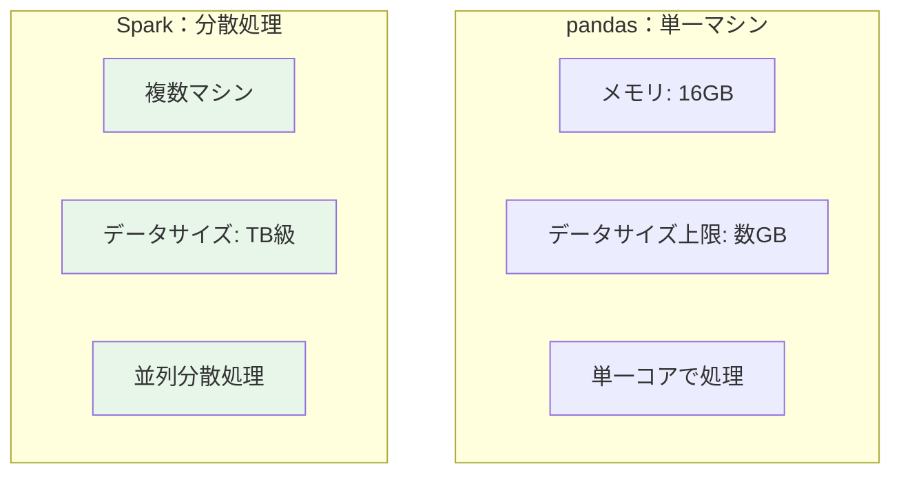
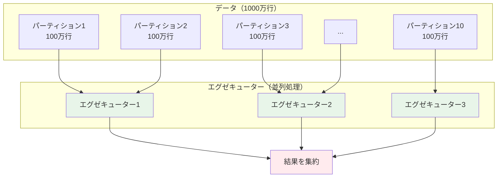
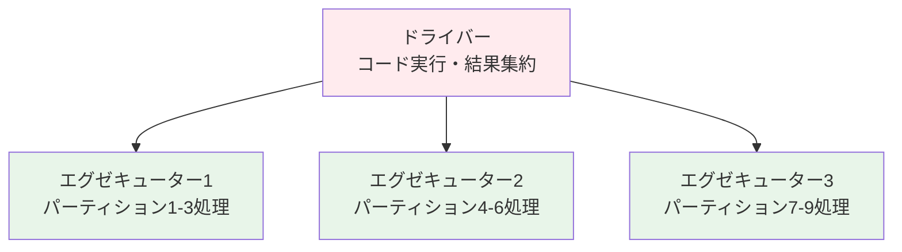
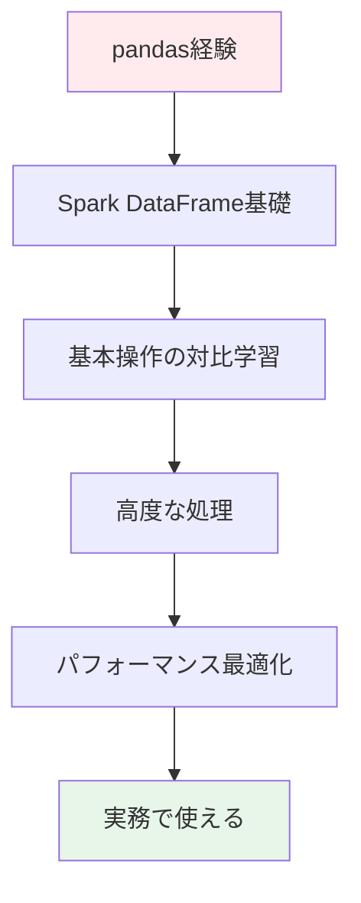

## Apache Sparkとは？

**Apache Spark = 大規模データを高速に分散処理するフレームワーク**

pandasは1台のマシンのメモリ内でデータを処理しますが、Sparkは**複数のマシン（クラスター）でデータを分散処理**します。これにより、pandasでは扱えない数百GB〜TB級のデータを高速に処理できます。



**イメージ**: pandasの処理を複数マシンで並列実行し、大規模データを扱えるようにしたもの

## Sparkはこんな時に使います

- 📊 **データアナリスト**: 数百GBのログデータを集計・分析
- 🔧 **データエンジニア**: 大規模ETLパイプラインの構築
- 🤖 **データサイエンティスト**: 大規模データセットでの機械学習
- 💬 **MLエンジニア**: リアルタイムストリーミングデータ処理

**pandas経験者の方へ**: pandasで扱っていたデータが大きくなりすぎてメモリエラーが出る、処理に何時間もかかる...そんな時がSparkの出番です。

---

この記事では、**pandas経験者がApache Sparkを段階的にマスターできる学習ガイド**を提供します。pandas の知識を活かしながら、Sparkの分散処理を理解し、実務で使えるスキルを習得できます。

# この記事の特徴

## pandas経験を活かした学習アプローチ

従来のSpark学習は分散システムの難しい概念から始まりがちでしたが、**この記事ではpandasとの対比から始めて、既存の知識を活かしながら段階的に学べます**：

- **pandasの知識を活かす**: 「pandasのこの操作はSparkではこう書く」という形で学習
- **段階的成長**: 基礎から高度なトピックまで、7つのレベルで無理なくステップアップ
- **実践重視**: サンプルコードと実際のユースケースで即実践できる
- **ベストプラクティス**: よくあるエラーと解決方法、パフォーマンス最適化を含む

## 対象読者

- pandasでデータ分析をしてきた方
- データサイズの制約でpandasに限界を感じている方
- Apache Sparkを初めて学ぶ方
- 分散処理の基礎を理解したい方
- 実務で大規模データを扱う必要がある方

## pandasとSparkの違い

**pandas経験者が最初に理解すべき5つの違い**

| 観点 | pandas | Spark |
|------|--------|-------|
| **データサイズ** | 数GB程度まで（メモリ制限） | TB〜PB級（分散処理） |
| **実行環境** | 単一マシン | 分散クラスター（複数マシン） |
| **処理方式** | Eager（即時実行） | Lazy（遅延評価）→最適化 |
| **メモリ使用** | 全データをメモリに展開 | パーティション単位で処理 |
| **API** | pandas API | Spark SQL API（似ているが異なる） |
| **型** | DataFrame | DataFrame / RDD / Dataset |
| **並列化** | 基本的に単一コア | 自動的に並列分散処理 |

**Sparkで何ができるようになる？**
- 💾 TB級データの処理（pandasではメモリ不足でエラー）
- 🔄 複雑なデータパイプラインの構築
- ⚡ 分散処理による高速化
- 📊 リアルタイムストリーミング分析
- 🤖 大規模機械学習（MLlib）

## 全体の学習フロー

| レベル | 難易度 | 時間 | 学習内容 | 前提知識 |
|--------|--------|------|----------|----------|
| [レベル0](#レベル0-基本を知る) | ★☆☆☆☆ | 2-3h | Sparkの基本概念、環境構築 | pandas基礎 |
| [レベル1](#レベル1-dataframeの基礎) | ★★☆☆☆ | 3-4h | Spark DataFrameの基本操作 | レベル0 |
| [レベル2](#レベル2-データ処理の基本操作) | ★★★☆☆ | 5-7h | フィルタ、集計、結合 | レベル1 |
| [レベル3](#レベル3-高度なデータ処理) | ★★★☆☆ | 5-7h | Window関数、UDF、複雑な変換 | レベル2 |
| [レベル4](#レベル4-パフォーマンス最適化) | ★★★★☆ | 4-6h | パーティション、キャッシュ、最適化 | レベル3 |
| [レベル5](#レベル5-ストリーミング処理) | ★★★★☆ | 5-7h | Structured Streaming | レベル2 |
| [レベル6](#レベル6-本番運用) | ★★★★★ | 6-8h | エラー処理、モニタリング、デバッグ | レベル4+5 |

## 知っておくべき基本用語

### 分散処理関連
- **クラスター**: 複数のマシン（ノード）をまとめて1つの大きなコンピュータのように使う仕組み
- **ドライバー**: Sparkアプリケーションを実行する中心的なプロセス（pandasでいうJupyter Notebook）
- **エグゼキューター**: 実際にデータ処理を実行するワーカープロセス（複数並列で動く）
- **パーティション**: データを分割した単位。各エグゼキューターが並列処理する

**分散処理の仕組み（図解）**



**ポイント**: 1000万行のデータを10個のパーティションに分割し、3台のエグゼキューターで並列処理。pandasなら1台で順次処理するところを、Sparkは並列実行して高速化します。



### Sparkのコア概念
- **RDD (Resilient Distributed Dataset)**: Sparkの低レベルAPI。分散された不変のデータコレクション
- **DataFrame**: 表形式データ（pandasと似ているが分散版）。高レベルAPI
- **Dataset**: DataFrameに型安全性を追加したもの（Scala/Java用）
- **Lazy Evaluation（遅延評価）**: 処理を即座に実行せず、action実行時にまとめて最適化実行
- **Transformations**: データを変換する操作（`select`, `filter`, `groupBy`など）。遅延評価
- **Actions**: 結果を返す操作（`show`, `count`, `collect`など）。即座に実行

**pandas vs Spark の処理フロー**

```python
# pandas: Eager（即時実行）
df = pd.read_csv("data.csv")  # すぐに全データ読み込み
df2 = df[df["age"] > 30]       # すぐにフィルタ実行
result = df2.groupby("city").sum()  # すぐに集計実行

# Spark: Lazy（遅延評価）
df = spark.read.csv("data.csv")    # まだ読み込まない（計画だけ）
df2 = df.filter(col("age") > 30)   # まだ実行しない（計画に追加）
result = df2.groupBy("city").sum() # まだ実行しない（計画に追加）
result.show()  # ← ここで初めて最適化して一気に実行（Action）
```

**なぜLazy Evaluationが重要？**
- 不要な処理をスキップして最適化
- メモリ効率的（全データを保持しない）
- 複数の処理をまとめて実行可能

### データ操作関連
- **Spark SQL**: SQLクエリでデータ操作（pandas の query 相当）
- **Column**: カラム（列）オブジェクト（pandas の Series 相当）
- **Row**: 行オブジェクト
- **Schema**: データの型定義（pandas の dtypes 相当だが明示的）

---

# レベル0: 基本を知る

**このレベルで学ぶこと**: Sparkとは何か、環境構築、基本概念
**所要時間**: 2-3時間
**完了後にできること**: Sparkの全体像を説明できる、ローカル環境でSparkを実行できる

## Sparkの基本概念

### 公式ドキュメント
- 📘 [Apache Spark公式ガイド](https://spark.apache.org/docs/latest/)
- 📘 [Spark SQL、DataFrames、Datasets](https://spark.apache.org/docs/latest/sql-programming-guide.html)

### 関連記事（基礎理解）
- ⭐ [Apache Sparkとは何か](https://qiita.com/taka_yayoi/items/31190da754106b2d284e)（55,770閲覧）
- ⭐ [PySparkことはじめ](https://qiita.com/taka_yayoi/items/a7ee6287031374efa88a)（44,373閲覧）

### 環境構築

**ローカルでの環境構築（最も簡単）**

```bash
# pipでインストール
pip install pyspark

# 確認
python -c "import pyspark; print(pyspark.__version__)"
```

**Databricks Free Editionを使う（推奨）**

環境構築不要でブラウザ上でSparkを試せます：
- [Databricks Free Edition](https://qiita.com/taka_yayoi/items/33e9cfa7ca9ca9febe72)に登録
- ノートブックを作成してすぐに使える
- サーバレスコンピュートで自動起動（クラスター管理不要）

:::note warn
**Free Editionの制約**
- サーバレスコンピュートのみ（クラシッククラスターは使用不可）
- パーティション数の調整やキャッシュ戦略など、一部の最適化テクニックは制限あり
- 本格的な最適化を学ぶには、クラシッククラスターが必要
- 学習には十分ですが、本番運用レベルの最適化は環境が異なる点に注意
:::

---

# レベル1: DataFrameの基礎

**このレベルで学ぶこと**: Spark DataFrameの作成、基本操作、pandas対比
**所要時間**: 3-4時間
**完了後にできること**: Spark DataFrameを作成・表示・基本操作できる

### 関連記事（pandas比較）
- ⭐ [サンプルを通じたPandasとPySparkデータフレームの比較](https://qiita.com/taka_yayoi/items/5f1ab08c6a97ba96bb1f)（16,654閲覧）
- ⭐ [Pandas API on SparkでpandasとSparkの良いところ取り](https://qiita.com/taka_yayoi/items/43bd3935f77828c4e33e)（11,439閲覧）

## pandas vs Spark DataFrame 対比表

| 操作 | pandas | Spark |
|------|--------|-------|
| **作成** | `pd.DataFrame(data)` | `spark.createDataFrame(data)` |
| **CSV読込** | `pd.read_csv("file.csv")` | `spark.read.csv("file.csv", header=True)` |
| **表示** | `df.head()` | `df.show()` |
| **列選択** | `df["col"]` | `df.select("col")` または `df["col"]` |
| **フィルタ** | `df[df["age"] > 30]` | `df.filter(col("age") > 30)` |
| **件数** | `len(df)` | `df.count()` |
| **スキーマ** | `df.dtypes` | `df.printSchema()` |

## 基本操作サンプル

```python
from pyspark.sql import SparkSession
from pyspark.sql.functions import col

# SparkSessionの作成
spark = SparkSession.builder \
    .appName("PandasToSpark") \
    .getOrCreate()

# DataFrame作成（pandasと同じデータ構造）
data = [
    ("Alice", 25, "Tokyo"),
    ("Bob", 30, "Osaka"),
    ("Charlie", 35, "Tokyo")
]
columns = ["name", "age", "city"]

# Spark DataFrame作成
df = spark.createDataFrame(data, columns)

# 表示（pandasのhead()相当）
df.show()
# +-------+---+-----+
# |   name|age| city|
# +-------+---+-----+
# |  Alice| 25|Tokyo|
# |    Bob| 30|Osaka|
# |Charlie| 35|Tokyo|
# +-------+---+-----+

# スキーマ確認
df.printSchema()
# root
#  |-- name: string (nullable = true)
#  |-- age: long (nullable = true)
#  |-- city: string (nullable = true)

# 列選択（pandasのdf["name"]相当）
df.select("name", "age").show()

# フィルタ（pandasのdf[df["age"] > 30]相当）
df.filter(col("age") > 30).show()

# 件数（pandasのlen(df)相当）
print(df.count())  # 3
```

## 重要な違い

**1. 遅延評価（Lazy Evaluation）**
```python
# pandas: すぐに実行
df_pandas = df[df["age"] > 30]  # この時点で処理完了

# Spark: show()まで実行されない
df_spark = df.filter(col("age") > 30)  # まだ実行されていない（計画だけ）
df_spark.show()  # ← ここで初めて実行
```

**2. collect()でpandasに変換**
```python
# Spark DataFrame → pandas DataFrame
pandas_df = df.toPandas()

# 小さなデータのみに使うべき！
# 大きなデータをcollect()すると、ドライバーメモリ不足でクラッシュ
```

## Databricks環境での実践（ハンズオン）

:::note info
**Databricks Free Editionで実行できる例**
以下のコードはDatabricks環境で確実に動作します。サンプルデータセットを使用しているため、データ準備は不要です。
:::

```python
# Databricksのサンプルデータを使った実践
# diamonds データセット（約54,000行）を読み込み
diamonds = spark.read.format("csv") \
    .option("header", "true") \
    .option("inferSchema", "true") \
    .load("/databricks-datasets/Rdatasets/data-001/csv/ggplot2/diamonds.csv")

# データ確認
print(f"データ件数: {diamonds.count()}行")
diamonds.printSchema()  # スキーマ確認

# 最初の5行を表示
diamonds.show(5)

# 基本的な操作（pandasと対比）
from pyspark.sql.functions import col, avg, max, min

# 1. フィルタ: カラット数が1以上のダイヤモンド
large_diamonds = diamonds.filter(col("carat") >= 1.0)
print(f"カラット1以上: {large_diamonds.count()}個")

# 2. 集計: カット（cut）ごとの平均価格
avg_price_by_cut = diamonds.groupBy("cut").agg(
    avg("price").alias("avg_price"),
    max("price").alias("max_price"),
    min("price").alias("min_price")
).orderBy(col("avg_price").desc())

avg_price_by_cut.show()

# 3. 列の追加: 価格帯の分類
from pyspark.sql.functions import when

diamonds_with_category = diamonds.withColumn(
    "price_category",
    when(col("price") < 1000, "低価格")
    .when(col("price") < 5000, "中価格")
    .otherwise("高価格")
)

# 価格帯別の件数
diamonds_with_category.groupBy("price_category").count().show()

# 小さなデータセットに絞った場合のみpandasに変換
small_df = diamonds.limit(100).toPandas()
print(type(small_df))  # <class 'pandas.core.frame.DataFrame'>
```

---

# レベル2: データ処理の基本操作

**このレベルで学ぶこと**: フィルタ、集計、結合、並び替え
**所要時間**: 5-7時間
**完了後にできること**: 基本的なデータ処理をSparkで実行できる

## pandas vs Spark 操作対比

### フィルタ

```python
# pandas
df[df["age"] > 30]
df[(df["age"] > 30) & (df["city"] == "Tokyo")]

# Spark
df.filter(col("age") > 30)
df.filter((col("age") > 30) & (col("city") == "Tokyo"))
# または
df.where(col("age") > 30)
```

### 列の追加・計算

```python
# pandas
df["age_next_year"] = df["age"] + 1

# Spark
df.withColumn("age_next_year", col("age") + 1)
```

### グループ集計

```python
# pandas
df.groupby("city")["age"].mean()
df.groupby("city").agg({"age": ["mean", "max"]})

# Spark
df.groupBy("city").avg("age")
df.groupBy("city").agg(
    avg("age").alias("avg_age"),
    max("age").alias("max_age")
)
```

### 並び替え

```python
# pandas
df.sort_values("age", ascending=False)

# Spark
df.orderBy(col("age").desc())
# または
df.sort(col("age").desc())
```

### 結合

```python
# pandas
pd.merge(df1, df2, on="id", how="inner")

# Spark
df1.join(df2, on="id", how="inner")
# または
df1.join(df2, df1["id"] == df2["id"], "inner")
```

## 実践例：ログデータ分析

```python
# CSVファイル読み込み
logs = spark.read.csv("server_logs.csv", header=True, inferSchema=True)

# 日付別のエラー件数を集計
from pyspark.sql.functions import count, when

error_summary = logs.filter(col("status") >= 400) \
    .groupBy("date") \
    .agg(
        count("*").alias("error_count"),
        count(when(col("status") == 404, 1)).alias("not_found_count"),
        count(when(col("status") == 500, 1)).alias("server_error_count")
    ) \
    .orderBy(col("date").desc())

error_summary.show(10)
```

---

# レベル3: 高度なデータ処理

**このレベルで学ぶこと**: Window関数、UDF、複雑な変換、SQL
**所要時間**: 5-7時間
**完了後にできること**: 複雑なデータ処理、ユーザー定義関数の作成

### 関連記事（高度な処理）
- ⭐ [実践を通じて学ぶSpark SQL](https://qiita.com/taka_yayoi/items/06e06731a88af9debebc)（9,473閲覧）

## Window関数（pandasのrolling相当）

```python
from pyspark.sql.window import Window
from pyspark.sql.functions import row_number, rank, lag, lead

# 各都市での年齢ランキング
window_spec = Window.partitionBy("city").orderBy(col("age").desc())

df.withColumn("age_rank", rank().over(window_spec)).show()

# 前の行の値を取得（pandasのshift相当）
window_spec2 = Window.partitionBy("city").orderBy("date")
df.withColumn("prev_value", lag("value", 1).over(window_spec2))
```

## UDF（ユーザー定義関数）

```python
from pyspark.sql.functions import udf
from pyspark.sql.types import StringType

# pandas: apply()で関数適用
def categorize_age_pandas(age):
    if age < 20: return "young"
    elif age < 60: return "adult"
    else: return "senior"

df_pandas["category"] = df_pandas["age"].apply(categorize_age_pandas)

# Spark: UDFで関数適用
categorize_age_udf = udf(categorize_age_pandas, StringType())
df.withColumn("category", categorize_age_udf(col("age")))

# パフォーマンス注意：UDFは遅い！可能な限りSpark組み込み関数を使う
```

## Spark SQLの使用

```python
# DataFrameをテーブルとして登録
df.createOrReplaceTempView("people")

# SQLクエリ実行（pandasのquery()より強力）
result = spark.sql("""
    SELECT city, AVG(age) as avg_age, COUNT(*) as count
    FROM people
    WHERE age >= 20
    GROUP BY city
    HAVING count > 5
    ORDER BY avg_age DESC
""")

result.show()
```

---

# レベル4: パフォーマンス最適化

**このレベルで学ぶこと**: パーティション、キャッシュ、最適化テクニック
**所要時間**: 4-6時間
**完了後にできること**: Sparkアプリケーションの高速化、リソース効率化

:::note warn
**Free Editionでの学習制約**
このレベルの一部の最適化テクニック（パーティション数の細かい調整、リソース割り当てなど）は、Free Editionのサーバレスコンピュートでは制限があります。概念理解と基本的な最適化手法の学習には十分ですが、本格的なチューニングにはクラシッククラスターが必要です。
:::

### 関連記事（パフォーマンス最適化）
- ⭐ [[翻訳] Sparkのパーティション](https://qiita.com/taka_yayoi/items/bb32d5b7abafd600af98)（14,291閲覧）
- ⭐ [Sparkにおけるパフォーマンスとパーティショニング戦略](https://qiita.com/taka_yayoi/items/8d964a4949f41e2bf6bd)（8,511閲覧）

## パーティション最適化

```python
# データのパーティション数確認
print(df.rdd.getNumPartitions())

# リパーティション（パーティション数変更）
df_repartitioned = df.repartition(10)  # 10パーティションに再分割

# coalesce（パーティション数削減、シャッフル最小化）
df_coalesced = df.coalesce(5)  # 5パーティションに削減
```

## キャッシング

```python
# 何度も使うDataFrameはキャッシュ
df_filtered = df.filter(col("age") > 30)
df_filtered.cache()  # メモリにキャッシュ

# 使用
df_filtered.count()
df_filtered.groupBy("city").count().show()

# 不要になったらアンキャッシュ
df_filtered.unpersist()
```

## よくあるパフォーマンス問題と解決

**問題1: データスキュー（特定パーティションにデータ集中）**
```python
# 悪い例：都市でグループ化（東京に90%のデータ）
df.groupBy("city").count()  # 東京パーティションだけ遅い

# 解決：ソルトキーを追加
from pyspark.sql.functions import rand, concat
df_with_salt = df.withColumn("salt", (rand() * 10).cast("int"))
df_with_salt.groupBy("city", "salt").count() \
    .groupBy("city").sum("count")
```

**問題2: 小さなファイル多数（Small Files Problem）**
```python
# 悪い例：パーティションごとに小さなファイル大量生成
df.write.partitionBy("date").parquet("output")  # 日付数×パーティション数のファイル

# 解決：coalesceで統合
df.repartition(1).write.partitionBy("date").parquet("output")
```

**問題3: 不要なシャッフル**
```python
# 悪い例：複数回のシャッフル
df.groupBy("city").count() \
  .join(df.groupBy("city").avg("age"), "city")  # 2回シャッフル

# 良い例：1回のaggで実行
df.groupBy("city").agg(
    count("*").alias("count"),
    avg("age").alias("avg_age")
)  # 1回のシャッフル
```

---

# レベル5: ストリーミング処理

**このレベルで学ぶこと**: Structured Streaming、リアルタイムデータ処理
**所要時間**: 5-7時間
**完了後にできること**: リアルタイムデータストリームの処理

## Structured Streamingの基礎

```python
# ストリーミングDataFrame作成
streaming_df = spark.readStream \
    .format("csv") \
    .option("header", "true") \
    .schema(schema) \
    .load("input_dir/")

# 処理（通常のDataFrameと同じAPI）
result = streaming_df.filter(col("age") > 30) \
    .groupBy("city").count()

# 出力（ストリーミングクエリ開始）
query = result.writeStream \
    .format("console") \
    .outputMode("complete") \
    .start()

query.awaitTermination()
```

## リアルタイム集計

```python
from pyspark.sql.functions import window, current_timestamp

# 時間ウィンドウでの集計（過去5分間）
windowed_counts = streaming_df \
    .withWatermark("timestamp", "10 minutes") \
    .groupBy(
        window("timestamp", "5 minutes"),
        "city"
    ).count()
```

---

# レベル6: 本番運用とトラブルシューティング

**このレベルで学ぶこと**: エラー処理、モニタリング、デバッグ
**所要時間**: 6-8時間
**完了後にできること**: 本番環境でのSpark運用、問題解決

### 関連記事（デバッグ・モニタリング）
- ⭐ [Spark Web UI - Sparkの処理を理解する](https://qiita.com/taka_yayoi/items/069c627b2be2a92d2ccc)（9,983閲覧）

## よくあるエラーと解決方法

### 1. OutOfMemoryError
**原因**: collect()で大量データをドライバーメモリに集約
```python
# 悪い例
result = large_df.collect()  # 全データをドライバーに集約→クラッシュ

# 良い例
large_df.write.parquet("output")  # ファイルに書き出し
large_df.show(20)  # 一部だけ表示
```

### 2. TaskNotSerializableException
**原因**: シリアライズできないオブジェクトをUDFで使用
```python
# 悪い例
class MyClass:
    def process(self, x):
        return x * 2

obj = MyClass()
df.rdd.map(lambda x: obj.process(x))  # エラー

# 良い例
def process(x):
    return x * 2

df.rdd.map(process)  # OK
```

### 3. Data Skew（データ偏り）
**症状**: 1つのタスクだけ異常に遅い
```python
# 問題確認
df.groupBy("key").count().orderBy(col("count").desc()).show()

# 解決：ソルトキーで分散
from pyspark.sql.functions import concat, lit
df_salted = df.withColumn("salted_key", concat(col("key"), lit("_"), (rand() * 10).cast("int")))
```

## デバッグテクニック

```python
# 実行計画の確認
df.explain()  # 物理プラン
df.explain(True)  # 詳細プラン

# 中間結果の確認
df.filter(col("age") > 30).show(5)  # 5件だけ表示
df.filter(col("age") > 30).count()  # 件数確認
```

---

# Week 1 学習プラン

## Day 1（2-3時間）：Sparkの基礎理解

| 時間 | 内容 | 成果物 |
|------|------|--------|
| 60分 | pandasとの違いを理解 | 対比表の理解 |
| 60分 | 環境構築（Databricks推奨） | Sparkセッション起動 |
| 30-60分 | 初めてのSpark DataFrame | 簡単なコード実行 |

**チェックポイント**: Spark DataFrameを作成・表示できる

## Day 2-3（各3-4時間）：基本操作マスター

**Day 2**: フィルタ、選択、集計
- pandas操作をSparkで書き換える練習
- CSV読み込み、基本的なデータ操作

**Day 3**: 結合、並び替え
- 複数DataFrameの結合
- 実データで練習

**チェックポイント**: pandasと同等の操作をSparkで実行できる

## Day 4-5（各3-4時間）：実践的なデータ処理

**Day 4**: Window関数、UDF
- ランキング、移動平均
- カスタム関数の作成

**Day 5**: パフォーマンス基礎
- キャッシング
- パーティション確認

**チェックポイント**: 複雑なデータ処理を記述できる

## Day 6-7：復習と実践

**Day 6**: これまでの復習
- レベル0-3の記事を見直す（2-3時間）
- 理解できなかった部分を再学習（1-2時間）

**Day 7**: ミニプロジェクト
- 自分のデータで分析プロジェクト（4-5時間）
  - CSV読み込み
  - フィルタ・集計
  - 結果を可視化（pandasに変換）

**チェックポイント**: 一連のデータ処理をSparkで実行できる

:::note info
**学習のコツ**:
- pandasの知識を活かす：「pandasならこう書く」から始める
- 小さく始める：ローカルモードで練習
- 遅延評価を意識：いつ実行されるかを理解
- エラーを恐れない：Spark UIでエラー原因を確認
- 毎日少しずつ：2-3時間×7日の方が効果的
:::

---

# 学習のヒント

## pandas経験者が陥りやすい罠

**1. collect()の乱用**
```python
# 悪い例：大量データをcollect()
df_pandas = df.collect()  # メモリ不足でクラッシュ

# 良い例：Sparkで処理してから小さく
result = df.groupBy("city").count().toPandas()  # 集計後なら安全
```

**2. Pythonループの使用**
```python
# 悪い例：Pythonループ
for row in df.collect():  # 全データ転送→遅い
    process(row)

# 良い例：Spark操作
df.select(process_udf(col("value")))  # 分散処理
```

**3. 型の不一致**
```python
# pandasは自動型変換するが、Sparkは厳格
df.withColumn("age", col("age_str"))  # 型エラー

# 明示的にキャスト
df.withColumn("age", col("age_str").cast("int"))
```

## よくある質問

**Q: pandasからSparkへの移行期間は？**
A: pandas経験者なら1-2週間で基本操作、1-2ヶ月で実務レベル

**Q: いつSparkを使うべき？**
A: データが10GB以上、またはpandasで処理に1時間以上かかる場合

**Q: ローカルPCでもSparkは使える？**
A: 使えます。ただし小〜中規模データ（数GB程度）まで。大規模データはクラスター必須

**Q: pandas併用は可能？**
A: 可能。Sparkで大規模処理→結果をpandasで可視化、が一般的パターン

**Q: Spark SQLとDataFrame APIどちらを使うべき？**
A: DataFrame APIを推奨。型安全で最適化されやすい。ただしSQLに慣れている場合はSQL OK

---

# 推奨学習パス（志望別）

| 志望 | Week 1 | Week 2 | Week 3 | Week 4 | 実践例 |
|------|--------|--------|--------|--------|--------|
| **データエンジニア** | Lv0-2<br/>基礎・基本操作 | Lv3-4<br/>高度処理<br/>最適化 | Lv6<br/>本番運用<br/>トラブル対応 | 実践プロジェクト | 大規模ETLパイプライン、バッチ処理自動化 |
| **データサイエンティスト** | Lv0-2<br/>基礎・基本操作 | Lv3<br/>高度処理<br/>UDF | Lv4<br/>パフォーマンス | 実践プロジェクト | 大規模データでの特徴量エンジニアリング、分析 |
| **MLエンジニア** | Lv0-2<br/>基礎・基本操作 | Lv3-4<br/>高度処理<br/>最適化 | Lv5<br/>ストリーミング | 実践プロジェクト | リアルタイム推論パイプライン、MLOps |

---

# まとめ

**pandas経験者がSparkを学ぶ最短ルート**



**重要なのは、pandasの知識を活かしながら、分散処理の考え方を理解し、実践することです。**

最初の一歩として、Databricks Free Editionに登録し、このガイドのサンプルコードを実行してみましょう！

## 次のステップ

1. [Databricks Free Edition](https://qiita.com/taka_yayoi/items/33e9cfa7ca9ca9febe72)に登録
2. サンプルコードを実行（レベル1から開始）
3. 自分のCSVデータでSparkを試す
4. Week 1プランに沿って学習
5. 実践プロジェクトで定着

## 参考リンク

### 公式ドキュメント

- [Apache Spark公式ドキュメント](https://spark.apache.org/docs/latest/)
- [PySpark API](https://spark.apache.org/docs/latest/api/python/)
- [Databricks公式ガイド](https://docs.databricks.com/spark/latest/index.html)

### 関連記事

**Spark DataFrame基礎**
- [Databricks Apache Sparkデータフレームチュートリアル](https://qiita.com/taka_yayoi/items/2a7e9bb792eba316de4b)
- [チュートリアル：DatabricksでPySparkデータフレームを操作する](https://qiita.com/taka_yayoi/items/6cf24cd4ad921aa61356)

**pandas連携・変換**
- [DatabricksにおけるPySpark、pandasデータフレームの変換の最適化](https://qiita.com/taka_yayoi/items/063c2360670f59b38471)

**パフォーマンス最適化**
- [Apache Sparkにおけるパフォーマンスチューニング](https://qiita.com/taka_yayoi/items/7112883f3792340d4898)
- [Sparkにおけるパフォーマンスとパーティショニング戦略](https://qiita.com/taka_yayoi/items/8d964a4949f41e2bf6bd)

---

**お役に立ちましたら、いいね・ストックをお願いします！質問・フィードバックもお待ちしています。**

### はじめてのDatabricks

[はじめてのDatabricks](https://qiita.com/taka_yayoi/items/8dc72d083edb879a5e5d)

### Databricks無料トライアル

[Databricks無料トライアル](https://databricks.com/jp/try-databricks)
