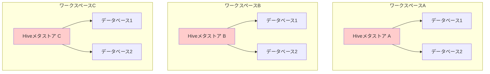
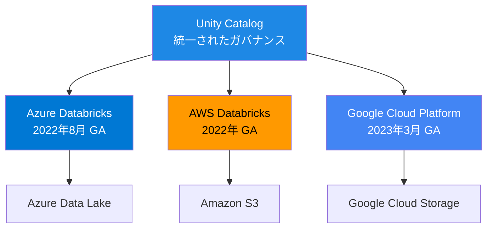
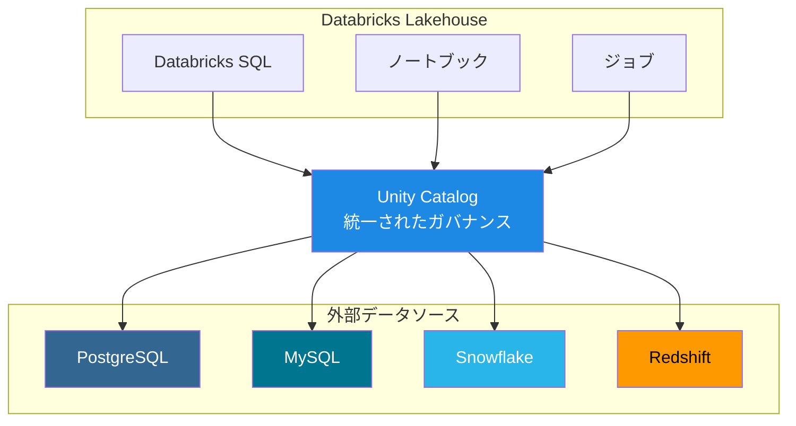
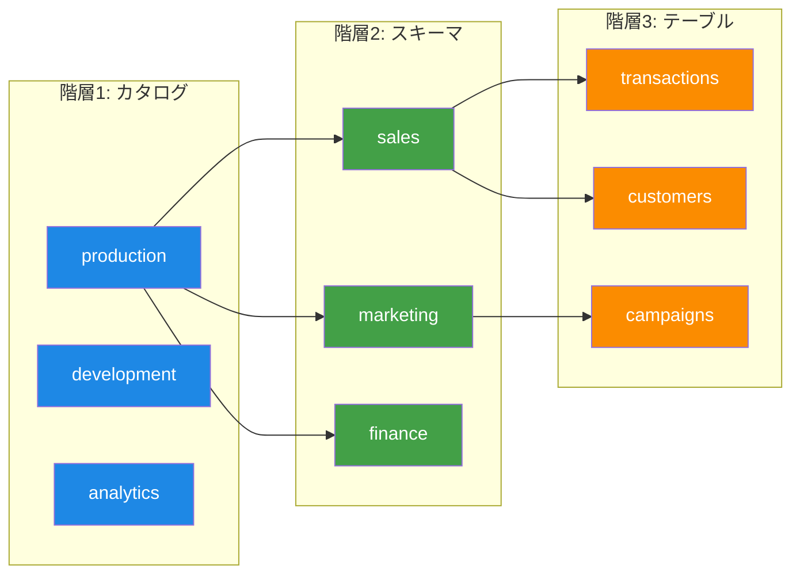
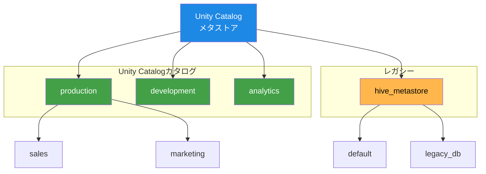
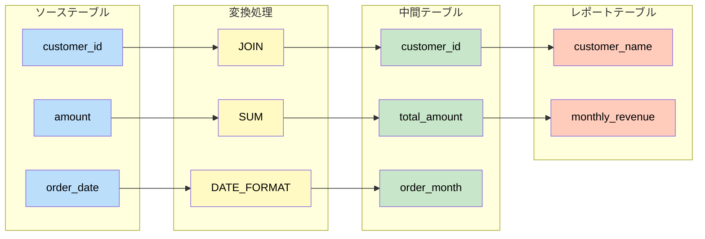

Databricksのメタデータ管理は、Hiveメタストア時代からUnity Catalogへと大きく進化してきました。本記事では、その歴史を時系列で振り返り、それぞれの時代の特徴と変化を解説します。

# Hiveメタストア時代（~2021年）

## Hiveメタストアとは

Hiveメタストアは、Apache Hiveプロジェクトから生まれたメタデータ管理システムです。Databricksでは、当初からこのHiveメタストアを採用していました。

**Hiveメタストアの特徴**：
- **ワークスペースレベルのメタデータ管理**：各ワークスペースに独立したメタストアが存在
- **2階層の名前空間**：スキーマ → テーブルの構造
- **基本的なアクセス制御**：テーブル単位での権限管理が可能

## Hiveメタストアの課題

企業がDatabricksを大規模に利用するにつれて、以下のような課題が顕在化してきました：

```
課題1: ワークスペース間のデータ共有が困難
  ├─ 各ワークスペースが独立したメタストアを持つ
  └─ データを共有するには複雑な設定が必要

課題2: 一元的なガバナンスの欠如
  ├─ ワークスペースごとに権限を設定
  └─ 組織全体での統一的な管理が困難

課題3: 監査とコンプライアンスの限界
  ├─ 詳細な監査ログが不足
  └─ データリネージの追跡が不十分
```



# Unity Catalog誕生（2021年）

## 2021年5月：Data and AI Summit 2021での発表

Databricksは、2021年5月26日のData and AI Summit 2021で **Unity Catalog** を発表しました。これは、Lakehouse向けの統一されたガバナンスソリューションとして開発されました。


**発表時の主要コンセプト**：
- **きめ細かいアクセス権**: ファイルレベルではなく、行、列、ビューレベルでアクセス制御
- **ANSI SQL標準**: データプロフェッショナルに馴染みのあるSQL文法（GRANT/REVOKE）
- **属性ベースアクセス管理（ABAC）**: タグによる一括ポリシー適用
- **集中管理**: 複数のワークスペース、リージョン、クラウドをまたぐ統一管理
- **Delta Sharing統合**: オープンプロトコルによる企業間データ共有

> **関連記事**:
> - [Databricks Unity Catalogのご紹介：レイクハウスにおけるデータとAIに対するきめ細かいガバナンス](https://qiita.com/taka_yayoi/items/1ededa3458cfffb2f83b)
> - [Unity Catalogの概要（公式ドキュメント）](https://docs.databricks.com/ja/data-governance/unity-catalog/index.html)

## Hiveメタストアとの比較

| 項目 | Hiveメタストア | Unity Catalog |
|------|--------------|---------------|
| **スコープ** | ワークスペースレベル | アカウントレベル |
| **名前空間** | 2階層（スキーマ→テーブル） | 3階層（カタログ→スキーマ→テーブル） |
| **データ共有** | 困難 | 容易 |
| **監査ログ** | 限定的 | 詳細な自動記録 |
| **リネージ** | なし | 組み込み対応 |
| **権限管理** | テーブル単位 | カタログ、スキーマ、テーブル単位 |

# パブリックプレビュー期（2022年）

## 2022年4月：ゲーテッドパブリックプレビュー開始

Unity CatalogがAWSとAzure向けにゲーテッドパブリックプレビューとして公開されました。

## 2022年8月：Azure DatabricksでGA

Unity CatalogがAzure Databricks上で **一般提供（GA: General Availability）** に到達しました。


これにより、Azure Databricksのユーザーは本番環境でUnity Catalogを利用できるようになりました。

**GA時の主要機能**：
- Databricksランタイム11.1以降のサポート
- E2アーキテクチャのワークスペースで利用可能
- SQLウェアハウスではデフォルトで対応
- 複数のワークスペースからの統一アクセス

> **関連記事**:
> - [DatabricksのUnity Catalogとは？](https://qiita.com/taka_yayoi/items/15aede468bdca58ec6a3)
> - [Databricks SQLのセキュリティモデルとデータアクセスの概要](https://qiita.com/taka_yayoi/items/90a464bcbebf9cf1eb6f)

## 2022年12月：データリネージがGA

データリネージ機能が **一般提供（GA）** となり、AWSとAzureで利用可能になりました。

**データリネージの主な機能**：
- テーブル間の依存関係の自動追跡
- カラムレベルのリネージ
- ノートブックとジョブの追跡
- ビジュアルなリネージグラフ

> **関連記事**: [データリネージの詳細（公式ドキュメント）](https://docs.databricks.com/ja/data-governance/unity-catalog/data-lineage.html)

# 全クラウドGA期（2023年）

## 2023年3月：Google Cloud PlatformでGA

Unity CatalogがGoogle Cloud Platform（GCP）上でも **一般提供（GA）** となり、主要な3つのクラウドプラットフォームすべてで利用可能になりました。

```
Unity Catalog GAタイムライン:
2022年8月  → Azure Databricks
2022年     → AWS Databricks
2023年3月  → Google Cloud Platform
```



これにより、マルチクラウド環境でも統一されたデータガバナンスが実現可能になりました。

# 機能拡張期（2023年〜2024年）

## 2023年：主要機能の追加

GA以降、Unity Catalogは急速に機能を拡充していきました：

**2023年の主な追加機能**：
- AI生成ドキュメント（パブリックプレビュー）
- Request for Access機能（アクセス要求ワークフロー）
- Lakehouse Federationの強化

## 2024年：さらなる進化

**Unity Catalog Volumes GA（2024年前半）**：
- 非構造化データ（画像、動画、ドキュメントなど）の管理
- MLモデルのアーティファクト保存
- ファイルレベルのアクセス制御


> **関連記事**: [Unity Catalog Volumesの詳細（公式ドキュメント）](https://docs.databricks.com/en/connect/unity-catalog/volumes.html)

**Hive MetastoreとAWS Glue Federation GA**：
- 既存のHiveメタストアとの統合
- AWS Glueカタログとの連携
- 段階的な移行パスの提供

**Lakehouse Federation GA（2024年）**：
- AWS、Azure、GCPすべてで利用可能
- 外部データソース（PostgreSQL、MySQL、Snowflakeなど）への統合アクセス
- Unity Catalog経由での一元的な権限管理



> **関連記事**: [Lakehouse Federationの詳細（公式ドキュメント）](https://docs.databricks.com/en/query-federation/index.html)

# オープンソース化（2024年6月）

## LF AI & Data Foundationへの寄贈

2024年6月、Databricksは Unity Catalogを **オープンソース化** し、Linux FoundationのAI & Data Foundationに寄贈しました。


**オープンソース化の意義**：
```
✅ 業界標準としてのデータカタログの確立
✅ マルチベンダー環境での相互運用性
✅ コミュニティ駆動の機能開発
✅ エンタープライズでの採用促進
```

これにより、Unity Catalogは「業界で唯一のユニバーサルカタログ」として位置づけられるようになりました。

> **関連リンク**:
> - [Unity Catalogオープンソースプロジェクト](https://www.unitycatalog.io/)
> - [Unity Catalog GitHub リポジトリ](https://github.com/unitycatalog/unitycatalog)

# Unity Catalogの現在（2025年）

## 3階層名前空間の活用

現在のUnity Catalogは、以下の3階層構造でメタデータを管理しています：

```sql
-- 3階層の名前空間
SELECT * FROM <catalog>.<schema>.<table>

-- 例
SELECT * FROM production.sales.transactions
```

**3階層構造の利点**：
- **カタログレベルでの分離**：環境（dev/staging/prod）やビジネスユニット単位での分離
- **柔軟なデータ組織化**：プロジェクトやチームごとのデータ管理
- **きめ細かな権限制御**：各階層での独立した権限設定



## hive_metastoreカタログとの共存

Unity Catalogは、レガシーなHiveメタストアと共存できるように設計されています：

```
Unity Catalog環境:
├─ カタログ1（production）
├─ カタログ2（development）
└─ hive_metastore（レガシー）← Hiveメタストアがカタログとして表示
```



これにより、既存のHiveメタストアを使用しているワークロードを段階的に移行できます。

> **関連記事**: [Hiveメタストアからの移行ガイド](https://docs.databricks.com/ja/data-governance/unity-catalog/migrate.html)

## 移行パス

Hiveメタストアからの移行には、以下のような選択肢があります：

**1. 完全移行**：
```
手順:
1. Unity Catalogメタストアの作成
2. 新しいカタログとスキーマの作成
3. Hiveメタストアのテーブルをクローンまたは移行
4. 権限の再設定
5. ワークロードの切り替え
```

**2. 段階的移行（推奨）**：
```
手順:
1. Unity Catalogメタストアの作成
2. hive_metastoreカタログとして既存データにアクセス継続
3. 新しいワークロードをUnity Catalogで作成
4. 既存ワークロードを徐々に移行
5. 最終的にhive_metastoreを非推奨化
```

# Unity Catalogの主要機能（現在）

## 1. 一元化されたアクセス制御

Unity CatalogはANSI SQL標準のGRANT/REVOKEステートメントを使用します：

```sql
-- カタログレベルの権限付与
GRANT USE CATALOG production TO `data_engineers`;

-- スキーマレベルの権限付与
GRANT SELECT ON SCHEMA production.sales TO `analysts`;

-- テーブルレベルの権限付与
GRANT SELECT ON TABLE production.sales.transactions TO `reporting_team`;

-- カラムレベルの権限付与
GRANT SELECT(date, country) ON iot_events TO `marketing`;
```

**属性ベースアクセス管理（ABAC）の例**：
```sql
-- PIIタグを列に付与
ALTER TABLE iot_events ADD ATTRIBUTE pii ON email;
ALTER TABLE users ADD ATTRIBUTE pii ON phone;

-- PIIタグが付いていない列のみにアクセス権を付与
GRANT SELECT ON DATABASE iot_data
  HAVING ATTRIBUTE NOT IN (pii)
  TO product_managers;
```

**標準SQL構文**：
- ANSI SQLベースの権限管理
- 使い慣れた構文で直感的な操作
- GRANTとREVOKEによるシンプルな制御
- タグによる一括ポリシー適用


*Unity Catalog UIを活用することで、データステュワードはコンプライアンスやプライバシー要件に応えるために、レイクハウスのデータアクセスを直接管理できます*

## 2. 自動監査ログ

Unity Catalogは、すべてのデータアクセスを自動的に記録します：

**記録される情報**：
- 誰が（ユーザー）
- いつ（タイムスタンプ）
- 何を（テーブル、カラム）
- どのように（SELECT、INSERT、UPDATE、DELETE）
- どこから（ワークスペース、ノートブック、ジョブ）

これらの監査ログは、システムテーブルとして直接クエリ可能です。

## 3. データリネージ

**カラムレベルのリネージ**：
```
ソーステーブル
  ├─ カラムA → 変換処理 → 中間テーブル.カラムX
  └─ カラムB → 集計処理 → レポートテーブル.カラムY
```



**リネージが追跡するもの**：
- テーブル間の依存関係
- カラムレベルの変換
- ノートブックとジョブの実行履歴
- データの流れの可視化


## 4. データディスカバリー

**検索とタグ付け**：
- フルテキスト検索
- メタデータによるフィルタリング
- カスタムタグの付与
- AI生成ドキュメント（ベータ）


## 5. Unity Catalog Volumes

非構造化データの管理：

```sql
-- Volumeの作成
CREATE VOLUME production.ml_models.artifacts;

-- ファイルのアクセス
COPY INTO '/Volumes/production/ml_models/artifacts/model.pkl';
```

**対応ファイル形式**：
- 画像（PNG、JPEG）
- 動画（MP4、AVIなど）
- ドキュメント（PDF、Wordなど）
- MLモデル（Pickle、ONNX）
- 任意のバイナリファイル

# Hiveメタストアからの移行理由

## なぜUnity Catalogに移行すべきか

**1. セキュリティとコンプライアンス**：
```
Hiveメタストア:
  ❌ ワークスペースごとの権限管理
  ❌ 監査ログの不足
  ❌ リネージの欠如

Unity Catalog:
  ✅ アカウント全体での統一権限管理
  ✅ 詳細な自動監査ログ
  ✅ 完全なデータリネージ
```

**2. データ共有の簡素化**：
```
Hiveメタストア:
  ❌ ワークスペース間の共有が複雑
  ❌ 外部パーティとの共有が困難

Unity Catalog:
  ✅ カタログレベルでの簡単な共有
  ✅ Delta Sharingによる外部共有
```

**3. 管理の効率化**：
```
Hiveメタストア:
  ❌ ワークスペースごとの個別設定
  ❌ 一貫性の維持が困難

Unity Catalog:
  ✅ 1か所での集中管理
  ✅ 自動的な一貫性保証
```

# Unity Catalogの未来

## オープンソースエコシステムの拡大

オープンソース化により、以下のような発展が期待されています：

**コミュニティ貢献**：
- 新しいコネクタの開発
- 追加機能の実装
- バグ修正とパフォーマンス改善

**マルチベンダー対応**：
- 複数のデータプラットフォームでの採用
- クロスプラットフォームのメタデータ管理
- 業界標準としての地位確立

## AI時代のデータガバナンス

**AI/MLワークロードの統合管理**：
- モデルレジストリとの統合
- 特徴量ストアの管理
- AIガバナンスの強化

# まとめ

## Databricksメタデータ管理の進化

```
2013年頃  → Hiveメタストア採用
   ↓        （ワークスペースレベルの管理）
2021年5月 → Unity Catalog発表
   ↓        （アカウントレベルの統一管理）
2022年4月 → パブリックプレビュー
   ↓
2022年8月 → Azure GA
2022年12月→ データリネージ GA
   ↓
2023年3月 → GCP GA（全クラウド対応完了）
   ↓
2024年    → Volumes GA、Lakehouse Federation GA
2024年6月 → オープンソース化
   ↓
2025年    → 業界標準のユニバーサルカタログへ
```

## Unity Catalogがもたらしたもの

**技術的な進化**：
- 2階層 → 3階層名前空間
- ワークスペース → アカウントレベル管理
- 基本的な権限 → きめ細かなアクセス制御
- 監査ログなし → 自動的な詳細ログ
- リネージなし → カラムレベルのリネージ

**ビジネス価値**：
- セキュリティとコンプライアンスの強化
- データ共有の簡素化
- 管理コストの削減
- データディスカバリーの向上
- AI/MLワークロードの統合管理

## 次のステップ

Unity Catalogへの移行を検討している場合：

**1. 現状の把握**：
- 現在のHiveメタストア使用状況の確認
- 管理しているテーブル数とデータ量の把握
- アクセス権限の棚卸し

**2. 移行計画の策定**：
- 段階的移行パスの設計
- テスト環境での検証
- ユーザートレーニングの計画

**3. 実行**：
- Unity Catalogメタストアの作成
- テストワークロードでの検証
- 本番ワークロードの段階的移行

## 参考リンク

- [Unity Catalog公式ドキュメント](https://docs.databricks.com/ja/data-governance/unity-catalog/index.html)
- [Hiveメタストアからの移行ガイド](https://docs.databricks.com/ja/data-governance/unity-catalog/migrate.html)
- [Unity Catalogオープンソースプロジェクト](https://www.unitycatalog.io/)

## Databricks無料トライアル

[Databricks無料トライアル](https://databricks.com/jp/try-databricks) - Unity Catalogを実際に体験してみましょう
